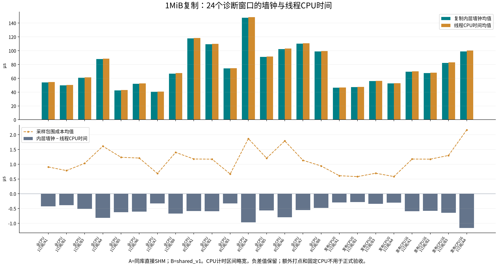

# 复制CPU时间与位置诊断

本批为O20～O21定位实验，使用4fc0a5c生产库与独立编译的诊断基准。同库直接SHM为A，shared_v1为B；**A不是正式f066a82基线**。原54窗口24/27通过、3组失败的结论保留在20261005-residual/，本实验不能改判正式验收。

## O20 工装与验证

仅修改test/shared_net/下的基准和脚本，不改生产库。新增--publish-cpu-trace显式开关，自动开启已有发布分段；仅在复制两端读取线程CPU时钟与CPU编号。原内层墙钟包住复制，外层墙钟再包住两次CPU时钟读取，保留包围差值作为观测成本。

线程CPU区间比内层复制略宽，因此CPU耗时可能稍大于复制墙钟。汇总保留有符号差值，不补零；CPU时间不等于指令/周期数，墙钟−CPU也不能直接称作纯调度等待。起止CPU相同不能排除中途迁出再迁回。

- 汇总器10项检查通过，包括既有性能/分段检查及新增的包围成本、负差值保留、乱序/缺失拒绝和同批慢消息归因。
- 三个2秒冒烟窗口：shared_v1关闭CPU诊断、shared_v1开启、同库直接SHM开启；各200次发布/接收全部正常。关闭时发布CSV保持5列，开启时19列，无缺失/乱序。
- 两个开启窗口的采样包围成本p99为3.906µs与3.536µs，证据在validation/；不把额外计时当作零成本，不将短冒烟的时间差用于性能验收。
- 编译命令、日志、SHA256、实际加载路径和原始CSV均保留。独立诊断基准位于/tmp/dzipc-copy-cpu/bin/shared_net_benchmark；O18原基准、网关和生产库没有重建。

## O21 完整诊断结果

工装46176f57完成预定24窗口：1/1MiB和8/1MiB各ABBA+BAAB，全部CPU；另1/1MiB固定发布CPU0、CPU16各ABBA，订阅CPU4、网关CPU2。每窗预热2秒、正式10秒、100Hz、开启发布和复制CPU诊断，关闭接收分段。24000次正式发布全部接受，80000次接收无丢失/错误/重复。逐窗指纹相同，实际库、全部线程亲和性、固定窗口的逐消息CPU编号及原始序号集合均核对。全部命令、窗口和CSV在diagnostic/。

**本批慢复制主要耗在线程运行期间，长时间被调度出去不是主导解释；尚不能在频率、缓存/内存访问与核心位置之间指定单一原因。** 线程CPU时间包含执行时的内存访问停顿，不能理解为纯指令计算时间。这项结论来自新增诊断，不能反向伪装成O18失败窗口已有逐消息CPU证据。

### 墙钟增长与CPU时间增长同步



24个窗口中，内层复制墙钟均值40.448～147.641µs，对应CPU均值40.780～148.612µs。CPU时钟区间覆盖了一部分测量调用，原始CPU值比内层墙钟略大，图中保留了这个事实。

每窗分别选取**同一批复制最慢10%的100条消息**，计算：

```text
保守CPU占比 = Σ(线程CPU耗时 − 完整采样包围成本) / Σ(复制内层墙钟)
采样包围成本 = 外层墙钟 − 内层复制墙钟
```

24窗的该占比为**98.858%～99.568%**。把全部包围成本都扣掉后，慢复制的墙钟仍几乎由线程CPU时间解释，支持优先检查执行成本，而不是继续把主要时间归为被抢占/等待。完整有符号差值、成本与同批样本统计见diagnostic/copy-cpu-summary.json和audit.json；不把该估计当作硬件指令或缓存计数。

这也与旧失败窗的粗粒度证据一致：1/1MiB有411次发布超过150µs，而发布主线程只有3次非自愿切换；8/1MiB为1107次与5次，两个窗口均没有超过1ms的发布调用。逐窗计数只能约束解释，不能把每次上下文切换定位到某条消息，见prior-window-check.json。

### 固定CPU仍存在变化

下表为各窗口**复制均值**范围，单位µs；固定组每种入口各2窗，全CPU组每种入口各4窗。

| 场景 | 同库直接SHM | shared_v1 |
|---|---:|---:|
| 1订阅者，全部CPU | 40.448～87.732 | 42.416～66.768 |
| 8订阅者，全部CPU | 102.349～147.641 | 74.415～109.410 |
| 1订阅者，发布CPU0 | 46.347～52.615 | 47.246～55.991 |
| 1订阅者，发布CPU16 | 69.418～98.993 | 67.426～82.307 |

固定组8000条消息的起止CPU均与指定CPU一致；位置固定后，两入口仍有跨窗口变化。CPU16组本批比CPU0组慢，但两组在不同时段执行，不能将差值全部归为P/E核心性能，更不能用绑定CPU改判O18正式门槛。

本机CPU0/4为双线程核心、L2为2MiB；CPU16为单线程核心、与16～19共享4MiB L2。驱动为intel_pstate、governor为powersave；这表示存在动态调节策略，不能据此断言测量期间固定低频。原始拓扑在cpu-topology.json，未测得逐消息实际频率或缓存未命中。

### “落到E核就一定慢”也不符合全部数据

全CPU窗口的16000条样本中，34条复制起止CPU不同，相邻消息起始CPU改变共495次；这两种计数不能互相替代，也不能由起止相同断言中途从未迁移。另8000条固定CPU样本均与指定CPU一致。

将全CPU窗口中起止CPU相同的样本按实际CPU分组：8订阅者shared_v1在CPU0～15的复制p50为79.490µs，在CPU16～31为113.997µs；但1订阅者shared_v1却是57.062µs与39.001µs，方向相反。这是运行后的相关分组，窗口时段、缓存历史等因素未受控，不能从中估计核心类型的纯因果效应。全部八组及样本数量见diagnostic/cpu-location-summary.json。

因此，核心位置值得记录，但单纯把波动归咎于E核或迁移仍不充分。

## 对后续优化的含义

1. 两类1MiB失败应优先沿复制执行侧继续定位。减小MPMC提交或getter交接成本不会直接消除复制区间中的内存搬运；本轮已有等待修复继续保留，不据此再次替换队列架构。
2. 下一项有价值的证据是实际借样块的复用/地址和复制时的频率、缓存/内存访问状态。仅用另一段memcpy微基准或瞬时频率快照都不足以代表真实SHM借样访问模式。现有perf权限限制仍在，不声称取得硬件计数。
3. 如果业务允许直接在借样区构造报文，可另评估消除预构造段复制的调用方式；这改变了prebuilt输入方式，不能用它的成绩替代当前“一次完整复制”的验收，也不在本轮扩展公共API。
4. 1订阅者/4KiB的接收侧分布变化尚未被本批1MiB实验解释。后续仍需逐订阅者的接收/交接与调度关联证据，不能把大消息结论套到小消息。

本轮未修改生产库，没有重新执行正式54窗口；正式状态仍为24/27通过、3组失败。O21完成的是根因范围收窄，并非剩余延迟修复或整体架构验收通过。

## 复现

在仓库根目录重新汇总与绘图：

```bash
python3 test/shared_net/summarize_copy_cpu.py docs/shared_network_endpoint_evidence/20261005-copy-cpu/diagnostic
python3 docs/shared_network_endpoint_evidence/20261005-copy-cpu/audit.py
python3 docs/shared_network_endpoint_evidence/20261005-copy-cpu/plot.py
```

audit.py还核对当前环境中的原二进制指纹，因此需要manifest记录的原路径仍存在。采样命令在diagnostic/manifest.json；重新采样必须使用新目录，不覆盖本批结果。验证日志在validation/，新增成本扣除公式也通过独立合成样本检查。
