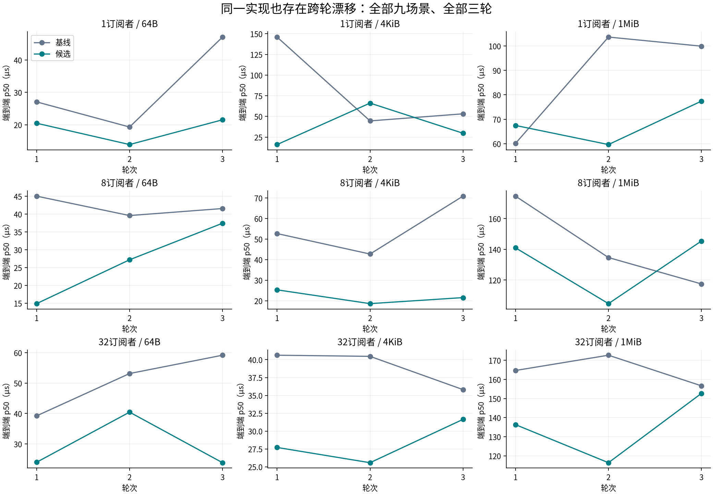
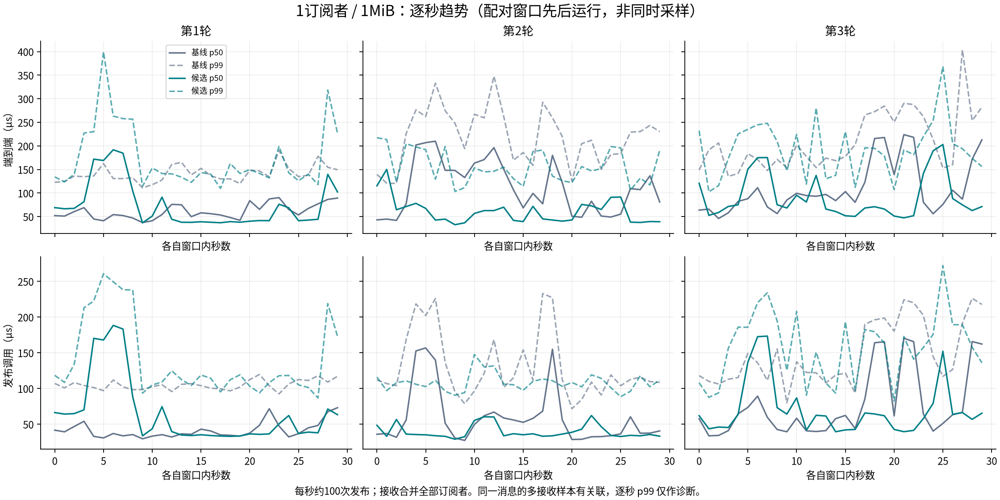
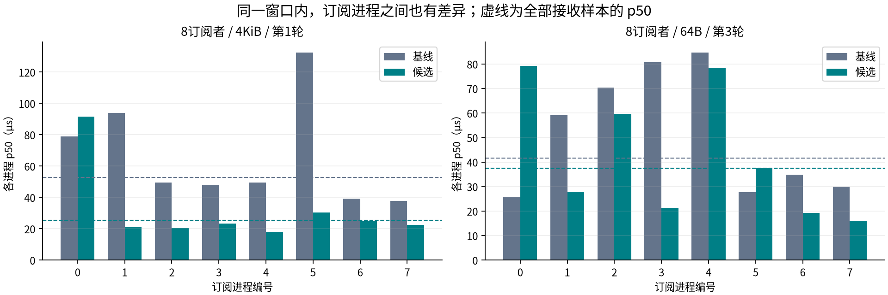
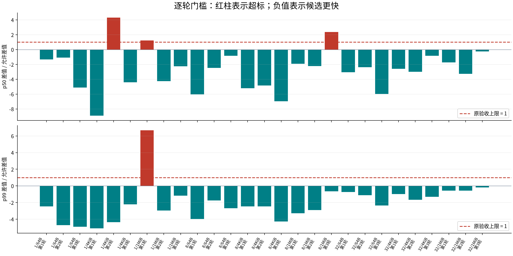

# 本机延迟波动分析

本报告使用候选4fc0a5c与正式基线f066a82的完整矩阵。原始数据位于performance/；图表由test/shared_net/analyze_latency_variation.py生成，不重新采样，也不挑选有利窗口。

**结论：当前波动同时包含跨轮漂移、持续数秒的发布侧变慢，以及同窗不同订阅进程的差异。不能统一解释为MPMC运算或内核调度慢。** 完整矩阵24/27逐轮通过、3组失败，9/9三轮中位数通过；接收2214000次无丢失、错误、重复。[完整复测](results.md)已按O18归档为00257c9，本机验收仍开放。

## 三个观察层次

### 同一实现的跨轮变化

1订阅者/4KiB候选p50三轮为15.974、66.125、29.666µs，最大/最小达到4.14倍；基线为146.020、44.588、53.147µs，也达到3.27倍。相同候选在不同轮次变化，基线同样变化，说明一次基线/候选差值不足以隔离代码成本。混合核心、CPU频率、缓存和调度是可检验假设，尚非已证实原因。



图中每格纵轴独立，适合比较同场景跨轮变化；跨场景绝对值应读坐标。矢量版见[SVG](variation/round-variation.svg)。

### 窗口内存在持续数秒的变慢

- 1订阅者/1MiB第1轮候选：第4～7秒的发布p50为170.208、167.884、188.344、183.185µs，端到端p50为171.839、168.958、191.656、184.519µs。第13～22秒发布p50又回到32.962～36.384µs。每秒有99～101次发布，因此这段变化涉及成批消息，不能只用孤立异常点解释。
- 8订阅者/1MiB第3轮候选：前6秒发布p50为77.858～79.500µs，从第6秒起进入更慢的区间，后续各秒为101.700～196.017µs。这一失败轮次的发布p50为81.708→128.759µs，而发布返回后p50为20.772→3.335µs，优先定位发布侧更有依据。
- 1订阅者/4KiB第2轮候选：端到端各秒p50为17.890～137.568µs；整轮p50变差44.588→66.125µs，但均值74.042→59.183µs、p99为273.562→154.410µs。分布中段与尾部的变化方向不同，不能用“整体都变慢”概括，也不能改判通过。



另外四组逐秒图：[1订阅者/4KiB](variation/timeline-sub1-bytes4096.png)、[8订阅者/1MiB](variation/timeline-sub8-bytes1048576.png)、[8订阅者/4KiB](variation/timeline-sub8-bytes4096.png)、[32订阅者/4KiB](variation/timeline-sub32-bytes4096.png)。每张都保留基线/候选全部三轮，并提供同名SVG。

### 同一窗口内，订阅进程也不均匀

8订阅者/4KiB第1轮候选中，sub0的p50为91.614µs，其余七个进程为18.020～30.354µs，全量合并p50为25.297µs。8订阅者/64B第3轮候选各进程p50为15.956～79.281µs，全量为37.434µs。这两轮按既定全量门槛均通过，但个别进程较慢的现象仍需保留。



因此，首个接收进程不足以代表全量；全量分位数也不能证明每个订阅者都同样快。上述差异仍没有逐线程CPU位置/运行队列等待证据，不能直接归因于某个进程落到E核。后续诊断应保留进程身份，而不能只看总体直方图。

## 原门槛与三组失败



纵轴=(候选−基线)/max(基线×10%,5µs)，超过1才不满足该分位数门槛。三个失败配对分别为1/4KiB第2轮、1/1MiB第1轮、8/1MiB第3轮。其中后两项1MiB的返回后区间均改善，1/4KiB的尾延迟改善；这些改善都不能替代失败的p50或p99。

当前证据支持继续细分发布执行和接收等待，不支持再次凭微基准更换memcpy，也不支持直接推翻MPMC架构。正式验收继续要求27/27通过。

## 统计与计时边界

- 每轮先合并全部订阅进程的原始样本，再计算最近秩p50/p99；同条消息的多个接收样本相关，不能当作独立重复实验。独立重复只有三轮。
- 跨轮最大/最小值只描述本批实测极差，不是置信区间或未来运行上界。基线/候选窗口先后运行，顺序为第一轮基线先、第二轮候选先、第三轮基线先；交替顺序仍无法完全消除主机状态随时间变化的影响。
- 逐秒图按各自窗口首个发布起点分桶，保留全部桶及样本数。每秒约100次发布，逐秒p99易受极少量样本影响，只用于观察趋势，不替代整轮验收。
- 发布起点在sleep_until返回之后，因此发布线程等待发送时刻的超时唤醒延迟没有直接计入端到端。唤醒后的CPU/缓存状态仍可能影响后续处理，需独立验证。
- 接收终点在get返回后、全载荷校验和CSV写入前。本条消息的校验/写盘没有直接计入延迟，但它们可能影响下一次get、缓存、借样释放和线程状态。当前工装不能代表没有这些工作的纯空回调业务。
- 返回前区间=min(发布调用耗时,端到端耗时)，返回后=端到端−返回前。接收可以早于发布返回；两段不是纯复制和纯内核调度，不能把各段独立p99相加。

## 已证实与仍待验证

| 判断 | 当前证据与边界 |
|---|---|
| 大消息发布侧存在实质波动 | O16直接打点的1MiB复制均值在候选为46.300～66.960µs，同库直接SHM也为41.597～95.822µs。复制区间是墙钟耗时，包含线程可能被暂停的时间。 |
| 大规模通知具有成本 | O16的32订阅者/4KiB真实通知均值28.379～34.568µs，提交前半段仅0.720～1.409µs，不能把整个提交称作MPMC原子运算慢。 |
| 迁移不是足够的单一解释 | 上一轮固定映射诊断仍有波动；固定CPU只能排除该线程迁移，不能排除抢占、核心频率、空闲状态或缓存影响。 |
| 混合核心与电源状态值得验证 | 本机i9-14900KF有P/E核心，正式窗口允许0～31全部CPU，governor为powersave；这些是环境事实，不证明慢消息实际运行在某类核、某频率或某空闲状态。 |
| 系统平均负载不能解释微秒长尾 | loadavg只保留窗口结束时快照，线程上下文切换只有窗口前后累计值，没有与逐消息延迟对齐，不能从低负载推导没有调度干扰。 |
| perf证据本轮未取得 | 实际运行`perf stat -e task-clock,context-switches,cpu-migrations,page-faults -- true`返回255；权限配置perf_event_paranoid=4拒绝访问，原输出在validation/perf-access.log。未修改全局权限或电源设置。 |
| 自定义复制暂无采用依据 | 非临时写入在真实SHM中退化，缓存AVX2未稳定胜过libc；微基准改善不能替代实际借样路径结果，最终候选保持memcpy。 |

## 后续定位顺序

1. 对发布复制增加显式诊断开关下的线程CPU时间与起止CPU编号，同时保留墙钟。墙钟增加而CPU时间不增加支持检查抢占/等待；两者同时增加支持继续检查CPU执行速度、缓存和内存访问。起止CPU相同不能排除中途迁出再迁回，仍需调度事件佐证。
2. 对小消息把接收缝与系统调度事件关联，区分SHM通知、线程变为可运行、实际运行、取得消费锁及getter/worker交接。不能用发布返回后区间直接冒充其中任一步。
3. 做同库直接SHM/shared_v1的ABBA与BAAB诊断，保持负载、业务处理与样本校验一致；另做固定P核/固定E核的分组诊断。对照必须串行，不与正式矩阵并行，也不通过更换门槛或绑定CPU改判正式失败。
4. 只有分段和配对重复同时支持具体实现成本时才修改生产代码；然后重新冻结并跑原54窗口。控制实验不覆盖本批不利结果，不以反复重跑直到通过作为验收方式。

上述复制CPU诊断已在后续O20/O21实施，见[24窗口CPU诊断](../20261005-copy-cpu/results.md)。各窗口最慢10%复制扣除完整采样包围成本后，CPU/墙钟比仍为98.858%～99.568%，进一步支持定位复制执行成本；固定CPU仍有变化，尚不能指定频率、缓存或核心类型的单一原因。该新增诊断不覆盖本页O18无打点正式结果；小消息接收侧的调度关联仍未完成。

## 复现与校验

在仓库根目录执行；绘图依赖matplotlib与中文字体，不应与正式采样并行：

```bash
python3 test/shared_net/summarize_performance.py docs/shared_network_endpoint_evidence/20261005-residual/performance
python3 test/shared_net/summarize_local_stages.py docs/shared_network_endpoint_evidence/20261005-residual/performance
python3 test/shared_net/analyze_latency_variation.py docs/shared_network_endpoint_evidence/20261005-residual/performance --output docs/shared_network_endpoint_evidence/20261005-residual/variation
```

分析器校验完整54窗口、每个订阅者的完整序号集合、逐消息时间戳和交付数量，并与独立汇总器的全量分位数及27组门槛交叉核对。variation/variation.json保存全部54窗的逐秒统计、各进程p50、均值分解、跨轮极差及源数据摘要的SHA256。16份PNG/SVG均保留，已检查中文显示与图表布局；验证输出在validation/variation-analysis.log。
