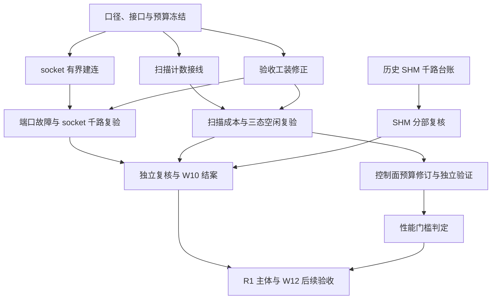

# W10 失败分析与重新实施方案

> 日期：2026-09-29。状态：**重做方案，尚未实施、复跑或签认**。
> 对象：t11 / W10 失败任务及其补救链。本文使用 `W10-R0` 等本地工作包编号，不代表已创建团队任务。
> 依据：[失败报告](W10_任务失败报告.md)、[W10 交付](W10_交付.md)、[总方案](../../团队改造方案_性能证据闭环与SHM规模化.md)、[基线与门槛](../基线与门槛.md)、[接口责任表](../接口责任表.md)、当前工作区源码和 r25 原始证据。

## 1. 分析结论

保留 t11 的 `failed` 历史终态，另建补救工作包。原报告定位的两项失败成立：socket 建连无界重试；SHM 接收池没有接入 §10.2 扫描观测。原报告建议的“修 socket → 重跑”还不足以完成验收，原因是：

1. **有界重试只能解决挂起，不能消除端口占用。** 必须分别证明冲突时有界失败、正常资源条件下千路真实收发，并明确端口可用性的适用范围。
2. **工装自身存在影响结论的问题。** 端口预检列解析错误、socket 假握手、恢复延迟计算错误、批跑失败不向上汇总，必须先修。
3. **计数器接线不等于性能达标。** 扫描成本、控制面唤醒、上下文切换和 CPU 要分别度量；测出 O(route) 后不能直接关闭空闲性能门槛。
4. **还有资源预算、门槛范围及写入责任需要对齐。** 这些事项应在正式复验前处理，避免收到 1000 路消息后再次因验收口径不清而失败。

本次只重新制定方案，不修改产品代码、历史证据、t11 状态或既有门槛。

## 2. 已核验事实与证据边界

### 2.1 原报告中的两项失败

| 项目 | 本次核对结果 | 重新实施时的含义 |
|---|---|---|
| socket 挂起 | `socket_sub_ipc::InitChannel()`、`socket_pub_ipc::InitChannel()` 均有 `while (!connect())` + 1 秒休眠，没有期限；订阅端成功后才注册接收路径 | 修复须覆盖建连结果、清理和调用方可见性，不能只增加循环次数 |
| 端口碰撞 | POSIX `UDPNode::connect()` 的接收节点绑定组地址；SendOnly 不显式绑定源端口。r25 的 `port-conflict/ab_counterfactual.log` 记录占用时 `EADDRINUSE`、释放后成功 | 既有占用和运行中新出现的临时源端口占用都要考虑；预检不构成端口预留 |
| 扫描未接线 | 当前 `src/` 下无 `ScanRoundScope` 调用；`RecvWorker::Impl::collect_pending()` 持锁遍历 `routes` | 按真实扫描边界接入，保留现有避免漏就绪的逻辑 |
| 等待计数 | SHM/socket worker 内部已有 `wait_timeouts` 等统计，但 W03 注册表中的对应字段未形成完整导出链 | 复用已有统计并规定唯一写入来源，避免接线后重复累加 |

“50.9–52.0%”表示话题端口落入临时端口区间的比例，**不是实际碰撞概率或千路失败率**。worker 空闲退出日志本身也不能单独证明所有 route 从未注册；连接阶段定位需结合建连日志、端口实验与调用顺序。

### 2.2 可以保留的成果

本次只读复算 `artifacts/perf/20260929-r25-W10/shm-ind-1000/ledger.csv`：

- 行数 1000，唯一 route 数 1000。
- `registered=1`、`rx=planned`、`dup=out_of_order=corrupt=timeout=0`：**1000/1000**。
- 该运行清单明确为同进程 1000 pub + 1000 sub，worker 路径 1000、存活期池 route 1000、创建后线程 34。

因此可以保留 **SHM 千路逐 route 收发证据**。其他拓扑、F1–F5、t22 复测等继续保留为历史报告结论，由独立评审按证据索引复核；本次没有重新运行这些实验。不能把上述台账扩大为跨进程、长期稳定性、全部生命周期或性能门槛均已通过。

### 2.3 本次补充发现：必须加入重做范围

以下源码结论针对本次读取的工作区，不倒推为旧运行二进制的精确行为；有原始产物佐证的项目单独注明。

| 编号 | 证据位置与问题 | 对验收的影响 | 必须采取的措施 |
|---|---|---|---|
| H1 | `w10_matrix.cpp::w10_pick_socket_topics()` 只读取 `/proc/net/udp` 每行第一列；该列是 `sl`，第二列才是 `local_address` | 所谓“避开已占 UDP 端口”未按正确字段实现；修正后仍有预检与实际绑定之间的竞争 | 按列解析并验证 IPv4/IPv6、通配绑定；保存端口表和实际建连结果 |
| H2 | `Harness::wait_handshake()` 在 socket 分支每 route 休眠 400 ms 后直接返回 `true` | 不证明注册或通信；1000 路顺序执行光休眠就约 400 秒，挤占旧脚本 420 秒上限 | 改为有界批量检查真实 route 状态与逐 route 确认帧 |
| H3 | 恢复阶段只重置 `first_publish_us`，未重置首次接收状态，且把 `first_packet_us` 绝对时间直接作为延迟输出 | r25 SHM 千路 `manifest.json` 的 `recover_first_packet_us=9.52005e+10` 无法作延迟判据；收到恢复消息仍有独立台账支持 | 分离初次/恢复时间戳，计算同一时钟上的差值，重新采集恢复延迟 |
| H4 | `concurrent-close-rebuild` 阶段实际只并发析构后半数订阅；本阶段没有重建代码 | 阶段名不足以证明重建时限和旧 generation 隔离 | 明确引用独立故障证据，或补上真正的重建阶段 |
| H5 | `w10_run_matrix.sh` 不累计子进程失败；最后输出完成标志。`write_artifacts()` 拒绝写入时仅返回，未强制令总结果失败 | 批跑完成/退出成功可能与某运行失败、证据缺失并存 | 子运行退出码、判定、必需文件三者共同决定批次退出码；落盘失败也是失败 |
| H6 | 当前工装记录重复/乱序，但总判定没有直接据此判失败；生命周期与资源条件也未全部机械判定 | 人工台账审计与 `PASS` 可能不一致 | 为 §13.2 六项逐条建立断言，不能用日志提示代替失败状态 |
| H7 | W10 交付 §1.5 记录 socket 100 对 pub/sub 为 468 fd；W00 仍要求千路 ≤3500 fd、硬上限 4096 | 数据/ACK 四类端点可能使单进程千对接近 4000 fd，再加固定开销。仅修端口后仍可能资源不通过 | 按 pub/sub、数据/ACK、固定池开销分账；冻结分母与范围，超限须整改或走正式修订 |

另有两处文档对齐事项：

- **G2 范围不一致**：总方案 §7 定义 G2 为“SHM 规模闭环”，socket 独立线进入 G4；失败报告把 socket 未通过绑定到“G2 完整关闭”。建议保留 `SHM 规模`、`socket 规模`、`§10.2 证据` 三个独立状态，架构负责人追加解释 t11/R1/G2/G4 的映射。此前不擅自升级任何门槛，t11 整体仍为失败。
- **接线责任不等于直接写入权**：W03 §8.1 将接收侧接线责任交 W06，但接口责任表将 `recv_worker.{h,cc}` 的单一写入权交共享层负责人。W06 负责补齐需求与结果，共享层负责人串行集成；测量头文件仍由 W03 负责人维护。

## 3. 重新拆分工作包与依赖

| 工作包 | 优先级 | 承接/集成责任 | 前置条件 | 独立完成条件 |
|---|---|---|---|---|
| W10-R0：口径与接口冻结 | P0 | 架构负责人，验证与性能负责人参与 | 本分析 | 完成建连失败接口、截止时间、fd 范围、G2/G4 映射、计数语义和文件写入安排 |
| W10-R1：socket 有界建连 | P0 | socket 与数据面负责人 | R0 的接口与期限部分 | 永久冲突、短暂冲突、其他错误、失败后重试均有明确结果；无半初始化对象或泄漏 |
| W10-R2：扫描观测闭环 | P0 | W06 负责，共享层集成，W03 维护字段 | R0 的计数部分 | 真实接收池事件→计数→导出→独立复算完整；诊断开关有效 |
| W10-R3：验收工装修正 | P0 | 验证与性能负责人；构建登记归架构 | R0；可先制作 H1–H6 最小反例 | 逐 route 确认、正确恢复计时、端口准入、六项判定与批次失败传播都经反例验证 |
| W10-R4：端口故障与 socket 规模复验 | P0 | 验证与性能负责人 | R1 + R3 + 资源口径冻结 | 故障行为与成功规模分列，千路逐 route 台账、线程/资源/生命周期均满足 |
| W10-R5：§10.2 与三态空闲复验 | P0 | 验证与性能负责人，W03 协助复算 | R2 + R3 | 1/100/500/1000 路诊断矩阵、观测开销和真实恢复数据完整 |
| W10-R6：控制面预算修订与性能判定 | P0（性能结案前） | 架构负责人，测量/验证提供输入 | 可先做校准设计；最终依赖 R5 | 基准校准和独立验证分离，按 W00 追加修订，CPU 与 ctx 分别判定 |
| W10-R7：独立复核与结案 | P0 | 非实现者独立评审，架构负责人汇总 | R4 + R5；性能声明另依赖 R6 | 证据可重算、状态分列、必要回归通过，形成新的 W10 结案记录 |



共享层、测量字段、工装各由一个写入者集成。性能采集串行执行，避免多个工作包争用共享池和 CPU。历史 SHM 分部复核可立即开始，但恢复延迟、重建和完整资源回收须补证后才能给出对应结论。

## 4. W10-R1：socket 建连失败必须到达调用方

### 4.1 实施范围与失败契约

主要落点为 `src/dzIPC/socket_pub_sub_ipc.cc`、对应头文件，以及 `src/libipc/platform/posix/udp.h` 的错误保存。若需调整公开 UDP 包装接口，要同步评估头文件、包装实现和其他平台编译。

1. 在失败系统调用处立即保存错误码和阶段，再清理 fd；区分 `socket`、地址解析、`bind`、入组等失败，避免清理后读取被覆盖的 `errno`。无系统错误码的参数错误给出明确分类。
2. 用单调时钟截止时间约束重试，尝试次数和等待都受同一期限限制。`EADDRINUSE` 可有限重试；无效地址/参数直接失败；fd 耗尽等按资源类别返回。保留逐次结果并限流打印重复错误。
3. 默认建连期限按 W00 的握手上限 **5 秒**设计；R0 明确它与对象构造、批次注册期限的计时边界。不能通过拉长外层 `timeout` 解决内部无界等待。
4. 当前 `InitChannel()` 返回 `void`，且内部 `catch` 只打印错误。推荐在失败清理后向调用方传播带错误信息的异常，保持函数签名；**异常行为变化属于 R0 必须冻结的接口语义**。检查工装、builder 和自动路径选择调用链，防止上层吞错并返回可用对象。若最终采用状态接口，必须让所有这些调用方检查状态。
5. 失败时不得注册接收 route、启动兼容收包线程或留下发现条目；已经取得的对象按现有生命周期协议释放。再次调用初始化只保留一代有效状态。
6. 初版以同步调用有界返回作为最小契约，不增加每 route 重连线程。现有 API 要求初始化与停止串行；不能把另一个线程并发析构对象当作取消机制。若引入取消令牌，由有效所有者发出并另行冻结其生命周期。
7. 数据通道失败不得用兼容线程掩盖。ACK 通道保留既有 BestEffort/可靠语义边界，但必须导出其可用性；ACK 不可用时不能宣布可靠传输通过。

建议诊断记录包含：`run_id`（工装关联）、topic、domain、端点角色、组地址、端口、失败阶段、错误码、重试次数、耗时、期限、最终结果。`registration_rejected` 等原有分类保留，详细端口原因作为附加原因，不混入 `wait_set_full`。

### 4.2 必测反例

| 条件 | 预期 |
|---|---|
| 独立辅助进程不启用复用，持续占住目标端口 | 在冻结期限内返回明确 `EADDRINUSE` 结果；外部 watchdog 不触发；无 route/兼容线程/信息池残留 |
| 占用者在期限内释放 | 原地址、原端口有限重试成功，逐 route 收到确认数据 |
| 参数非法或资源不足 | 分类正确；永久错误不等待完整重试窗口；fd 耗尽不能误报为端口冲突 |
| 初始化失败后释放资源、重新初始化 | 同一对象在允许的串行调用协议下恢复；无重复注册、旧 generation 投递 |
| 发布端、订阅端、ACK 接收端分别失败 | 必需通道与可选通道结果可区分；可靠发送失败可见，不能伪造成功 |

以上故障实验的辅助进程和套接字都由本运行创建并释放。高 fd/端口边界及受影响 ser/cli 回归随底层 UDP 修改一起执行。

## 5. W10-R3/R4：端口准入与千路复验分开验收

### 5.1 三种运行，三种结论

| 运行 | 话题与环境 | 可以证明什么 |
|---|---|---|
| 冲突故障运行 | 固定话题，辅助进程确定性占端口 | 挂起缺陷已消除、诊断和回收正确；该运行按预期错误判故障用例通过，不计为千路规模通过 |
| 原始配置回归 | 保存原 domain、实际 topic 清单、端口映射及占用快照 | 原失败配置在当前环境的结果；仍冲突时保留为有界失败，不重选话题抹掉记录 |
| 受控千路容量运行 | 固定 1000 个真实独立话题，明确端口可用前提 | 此前提下的千路有效收发和资源规模；不能外推为任意端口占用下仍可连接 |

受控成功不能单独消除“原话题集合不可用”的限制。R7 结案必须具有原配置在资源可用条件下的通过证据，或架构负责人明确签认产品允许“端口冲突时有界失败”的运行边界；不得仅靠换名字的成功结果关闭原问题。

### 5.2 不改端口公式的具体准入办法

1. 修复 `/proc/net/udp` 列解析，覆盖 `/proc/net/udp6` 中影响 IPv4 绑定的情况；保存原始表、解析结果和错误。读取失败不能按“无占用”处理。
2. 使用原 `udp_discovery_port_calculate()` 计算候选话题，校验整个 `[base, base+4]` 窗口合法、窗口之间不重叠。清单记录 topic、domain、group、数据/ACK 端口和 worker 归属。
3. 受控容量运行优先选择**整个端口窗口位于本机临时端口区间之外**的候选，避免本工程后续 SendOnly 数据/ACK 发送自动占用尚未绑定的接收端口。保存当时 `ip_local_port_range` 与保留端口配置；不修改主机 sysctl。
4. 对已占端口和解析不确定项拒绝准入；不足 1000 路时输出明确失败，不能像现有工装一样警告后继续补回未经筛选的话题。
5. 预检通过后，产品仍必须通过 R1 的真实绑定与有界失败路径。另设“预检后再占用”的反例，证明竞争窗口不会重新导致挂起。
6. 测试清单在正式运行前冻结，同一组重复运行使用相同清单。所有失败运行保留，不循环搜索到通过后只报告成功。若确需源端口治理/自动地址协商，另建协议兼容设计任务，不纳入本轮暗改端口公式。

### 5.3 工装必须先成为可靠的裁判

- 注册状态与通信状态分开：检查实际 route 归属，发送带 `run_id/route/generation/seq` 的确认帧并逐条验证；socket 不再固定等待后返回成功。
- 对所有端点批量轮询，各端点使用自己的截止时间，同时设批次总期限；不得对 1000 个已经就绪的对象逐个睡眠。批次总期限及 watchdog 宽限由 R0 在冒烟后、正式采集前冻结。
- 将准备、注册、握手、预热、发送、静默、恢复、重建、回收分阶段记录。注册遇到失败立即留存进度、清理本批对象并判失败，不累积 1000 次最长重试才返回。
- 首次接收与恢复接收使用独立状态。`恢复延迟 = 恢复首个有效帧接收时刻 - 对应恢复发送时刻`；使用同一单调时钟，并校验非负、未超过实际恢复阶段耗时。只接受新恢复序号，不能拿旧帧填补。
- 恢复阶段覆盖全部有效 route；逐 route 记录首包、丢失和是否重新注册。真实重建记录 `begin_rebuild` 至新 generation 首包，旧帧计数独立。
- `registered_count`、`valid_rx_count` 从逐 route 台账重算；重复、乱序、损坏、超时、非预期丢失都进入总判定。发送计划独立于接收结果，按阶段分列尝试数与成功数。
- 在建对象前独占创建输出目录并拒绝覆盖；超时也保留阶段进度。证据写入失败、文件缺失、run_id 不一致必须非零退出。
- 批跑每个子运行保存退出码；区分“预期故障已正确处理”和“规模运行失败”。任一必需项失败/缺证据，批次非零退出；最后一条 `echo` 不能决定总结果。
- 批跑脚本参数化构建路径、run_id 和话题清单，删除旧 r25 硬编码；为串行/并行调度分别保留真实结果。

### 5.4 socket 成功规模的硬条件

先过 1/100 路，再运行 1000 独立话题；每 route 的正式数据计划至少沿用原工装 3 条非固定载荷，并另记确认帧和恢复帧。小样本只作功能验收，不能用于 p99.9 性能结论。

正式千路结果必须同时满足总方案 §13.2 六条；特别补齐：

- `registered_count = valid_rx_count = 1000`，每条 route 的 payload/seq 校验通过，`fallback=0`，四类资源/回退计数分别可查。
- 每 worker route/token 数、最大偏斜满足冻结容量；线程按 socket 自身控制、接收、编排角色分列，不能套用 SHM 的 34 线程，也不能新增 per-route 接收线程。
- 握手 ≤5 秒、关闭 ≤2 秒、generation 重建至新首包 ≤1 秒，按 W00 冻结计时边界执行；旧 generation 无投递。
- 基线、存活峰值、并发关闭后、全量回收后分别测 route/token/fd/队列/chunk。route/token 归零；常驻池缓存可保留，但须逐项解释，不能只用 route 归零代替全部资源回收。
- fd 按“1000 对 pub/sub、单进程”的原始口径比较 W00 预算，发布端和 ACK 成本不可漏算，也不能临时改成除以 2000 个端点。实际超出仍生效的预算即失败。

若确认为 W07 单数据通道口径与 W10 双端完整拓扑不一致，R0 输出角色分账及候选预算，架构负责人按 W00 §11.3/§11.4 追加原值、新值、依据、签认人与生效 run_id。未经该记录，不把“口径不同”当作自动豁免。

## 6. W10-R2/R5：扫描计数从事件到结论闭环

### 6.1 计数语义先冻结

| 字段 | 写入/计算规则 | 校验方式 |
|---|---|---|
| `scan_rounds` | 一次实际 `collect_pending()` 调用计一轮，包括 0 route；不等同主循环次数 | 受控调用次数对账，必须区分 loop 与 wait 返回后的调用 |
| `scanned_routes_total` | 累加实际遍历条目数；计数取持锁时的真实扫描集合 | 已知 route 集合的受控场景精确核对；不能用全池 N 填入每个 worker |
| `scan_time_ns_total` | 只计定义明确的扫描区间，建议从取得锁后至遍历结束；不含阻塞等待和业务回调 | 如需锁等待成本另记，不能混在扫描耗时中；不为计数复制 route 容器 |
| `ready_observed` | 每轮最多加 1。建议表示本轮发现至少一个有效 route 的 sequence 变化，包括已在 deferred 的候选 | 对应比值是“发现就绪的扫描轮占比”，不是就绪 route 占比或成功消息比例；W03 同步修正文档语义 |
| `wait_timeout_count` | 只统计真正阻塞等待的超时，与现有 `wait_timeouts` 一一对应 | 后端错误、取消、socket `wait(0)` 没事件不当作阻塞超时；已有 API 不可区分时显式登记限制 |
| `deferred_depth_last/max` | 明确采样时点；建议采集本 worker 扫描后深度，峰值还覆盖 requeue/drain 引起的变化 | 不能将全局 `last` 的最后写入者值冒充全池总深度；按 worker 导出并由采样器汇总 |

现有 `ScanRoundScope` 在构造时固定 route 数和 deferred 深度，在析构时写全局 gauge；直接包住函数不能得到扫描后的队列深度，也不能表达多 worker 同时存在的队列总量。若沿用它，须由 W03 提供明确的结束值接口/分 worker 观测方式，保留既有字段兼容性并登记新增语义。

其他现有统计如 `budget_yields`、`deferred_drains`、`idle_exits`、`thread_restarts` 选定一种导出方式：事件增量写入，或同窗口池快照差值导入。禁止同时采用两种方式造成双计数。先确认注册表在动态库和工装之间确实共享，不能只在测试进程自增一个计数器证明接线。

socket 的 `collect_pending()` 当前是 `wait(0)` + 就绪 token 映射，与 SHM 全量 sequence 扫描不同。若采集 socket，对实际候选 token/映射工作量独立命名和分表；不能按 socket 在册 route 总数虚构全量扫描次数。

### 6.2 诊断开关与最小验收

低开销常驻统计和详细诊断分开；诊断关闭时不读扫描时钟、不分配内存、不逐 route 打日志。诊断关闭的原始 0 值在报告中标为“未采集”，不能解释为零成本。

最小验证包含：无 route、固定 route 无消息、一次已知就绪、预算耗尽重入 deferred、断开/注销、假就绪、后端错误和诊断开关前后对照。断言范围、单调性和池统计一致性；普通并发运行不要求调度相关计数精确等于某个常数。

运行时门禁至少检查：有 route 的有效采样窗口内 `scan_rounds>0`、`scanned_routes_total>0`、扫描时间有效；`0≤ready_observed≤scan_rounds`；队列深度非负且与实际容量一致；超时计数与同窗口现有统计相符。仅 `rg` 找到调用点或 schema 中出现字段不算完成。

### 6.3 复验矩阵与派生值

正式主配置固定 32 worker；使用新的独立进程，避免池首次初始化配置影响后续实验。1/100/500/1000 route 分别采三态空闲及有效消息负载，空闲窗口 ≥60 秒；诊断开/关以相同配置交替采集，主要对照至少 5 轮，保留全部结果。worker 数对照作为单独实验，只选择满足每 worker 容量的配置。

使用同一窗口的差值计算：

```text
平均每轮扫描条目 = Δscanned_routes_total / Δscan_rounds
平均每轮扫描耗时 = Δscan_time_ns_total / Δscan_rounds
平均每条目扫描耗时 = Δscan_time_ns_total / Δscanned_routes_total
发现就绪的轮次占比 = Δready_observed / Δscan_rounds
每秒等待超时 = Δwait_timeout_count / window_seconds
```

分母为零输出 `null` 和原因。全池平均每轮条目数受 worker 分片及各 worker 调用频率影响，不要求它等于全池 route 数。`scan_time_ns_total` 是墙钟区间累计，**不能直接换算为 CPU core 使用量**；CPU 使用独立进程/逐 TID 采样，并说明观测器开销。

三态均记录应用对象、控制项、worker route 数。状态 3 先让每个 route 收到确认消息，再静默超过 keep-alive，恢复时不重新注册；分别记录 route 数、线程退出数和全部恢复首包。

本轮先补证据，不删除全扫、不延长等待、不改变唤醒协议。若扫描被证实为主要瓶颈，W11 另做减少冗余扫描的方案，重新验证消息、断开、注销和恢复语义。

## 7. W10-R6：重新冻结控制面预算，避免用结果设门槛

R-1 把每个控制项的周期频率相加，只能作为到期工作量上界；调度器可在一次唤醒中处理多个项。**tick 次数、系统调用返回次数、线程被唤醒次数、上下文切换次数不是同一指标**，不能直接用旧报告的 4.6 k/s 替换公式中的一项就宣布通过。

重新实施步骤：

1. 分别采控制面单独运行、接收池单独运行、两者合并运行。保持 heartbeat/等待期限不变，覆盖同步创建与分批错相创建；记录 pub/sub 数及各自周期。
2. 记录控制项回调执行数、调度批次数/每批到期项数、控制线程逐 TID ctx、CPU；SHM worker 与测量线程单列。同窗口进行跨来源核对，无法解释的合并运行残差保留为问题。
3. 把校准运行与验收运行分开。用至少 5 个校准窗口建立候选上界及噪声范围，冻结配置、计算方法、安全系数与适用规模，再用新 run_id 独立验证。不得拿待判定运行自己的唤醒上界给自己设门槛。
4. 若保留结构公式，只能将**同一 ctx 口径**的控制面基准项与接收等待项组合，并对合并残差做事先规定的处理；公式和数值由架构负责人追加到 W00 §11.3/§11.4，§6.2 原值保留。
5. CPU 单独判定。报告的状态 3 `0.583 core` 高于 W00 原 `0.20 core`；现有 R-1/R-2 并未自动豁免 CPU。保持“待校准/未达标”的真实状态，若需修订必须说明业务预算依据，不能因实测高就抬阈值。

R6 可与代码修复同时开展实验设计，但它是**性能门槛结案**的前置，不再描述为对最终性能签认“完全不阻塞”。W10 功能/规模与性能结论分列。

## 8. 证据交付、复核与停止条件

### 8.1 新证据包

每个工作包交付变更清单、最小复现命令、验收结果和剩余限制；每次运行使用唯一目录，例如 `artifacts/perf/<新日期与批次>-W10-retry/<独立运行>/`，不复用 r25。

| 产物 | 内容 |
|---|---|
| `manifest.json` | 源码/库/工装指纹、实际加载库、配置哈希、进程模型、诊断开关、端口策略、输入清单哈希、期限与判据版本 |
| `topics.csv`、端口快照、`connect_events.jsonl` | topic→地址/端口/worker 映射；真实绑定结果、错误分类、尝试次数和耗时 |
| `ledger.csv`、`samples.jsonl` | 逐 route、generation、阶段、计划/尝试/成功/接收数及内容校验 |
| `phases.csv`、资源快照 | 各阶段期限、实际耗时及 route/token/fd/队列/chunk/线程分账 |
| `counters.json`、窗口采样 | 统一失败分类、首个失败资源、扫描/等待/deferred 计数、同窗口差值与有效性 |
| `verdict.md`、批次汇总 | 六项规模条件逐项判定；端口故障、规模、观测、性能分别给结论；所有子退出码和缺失证据 |

正式复跑前重新配置/构建，记录工作区差异、未跟踪源码清单及哈希、库与工装哈希、`ldd`/RUNPATH。当前工作区存在大量未提交及未跟踪内容，**单独记录 HEAD 不足以复现**。

工装默认不写仓库证据；新 CTest 项先证明安全默认、输出目录独占和失败传播，由架构负责人登记。底层 UDP 修改须执行既有热路径闸；接收池修改执行相关生命周期、唤醒和预算回归。集成后执行一次完整必需回归；有新改动或未解决的不稳定问题时才扩大重复测试。

### 8.2 独立评审的逐项结论

| 评审项 | 可结案条件 | 仍失败/待验收的情况 |
|---|---|---|
| socket 挂起缺陷 | 确定性冲突在内部期限内结束，诊断及回收正确，释放后可恢复 | 仍靠外部 rc=124 结束、吞错返回半初始化对象 |
| socket 千路规模 | 固定范围内 1000/1000、无回退、线程/资源/生命周期六项全过 | 跳过失败 route、仅首路有效、换配置未登记、超 fd 预算 |
| §10.2 观测 | 实际路径产生且可复算的分窗口计数、开关与开销对照完整 | 只有字段定义、恒零值或 CPU 曲线旁证 |
| SHM 分部复核 | 原台账可复算；恢复计时、重建及资源条件补齐或有独立有效证据 | 将历史错误延迟值或阶段名称当作生命周期证明 |
| 空闲性能 | 修订判据已冻结并经独立新运行验证，CPU 与 ctx 均有结论 | 自校准自验收、用线程少替代 CPU 达标 |
| W10 新结案 | 补救工作包逐项闭合并有新评审记录，原 t11 失败历史保留 | 任一必需条件缺失；“未复现”替代偶发崩溃结案 |

若 socket 千路成功但扫描成本超预算，可关闭对应功能缺陷并保留性能未达标；若扫描接线通过但 socket 仍资源失败，观测任务可完成，W10 整体不得通过。若必须改地址协议、资源预算或生命周期契约，回到相应设计/签认步骤，保留当轮失败证据。

### 8.3 建议执行顺序

1. 先由架构、socket、共享层、W06、W03、验证负责人完成 R0 的短评审，输出具体接口与判据表；同时独立复核历史 SHM 台账。
2. R1/R2/R3 分文件推进。先跑反例和 1/100 路冒烟，任何核心问题未修完都不启动正式千路采集。
3. 在统一集成指纹下串行执行 R4/R5；R6 用独立校准/验证运行完成性能判定。
4. R7 逐文件重算证据，追加新 W10 结案与门槛状态，再进入 R1 主体/W12 的其余工作。跨进程规模、长期稳态和性能对照仍按 W11/W12 原合同完成，不能由本次同进程补跑代替。

## 9. 本次分析的复核记录

- 未重新执行产品运行或性能实验；完成的是文档/源码核对和历史 SHM CSV 的只读机械复算。
- 检查时 HEAD：`e800ccc496ac710b711c9346709e86a148c41241`，工作区非干净。
- 检查时 `test/perf/w10/w10_matrix.cpp` SHA-256：`218cccd9e7ba4d22f8bc1901fba5e851dd2db73fa2c9f28c550dfca10aa6e503`。
- r25 SHM 千路 `manifest.json` SHA-256：`d6a25d28601020b567ce974b06bab9ebb71587bb18a4a0d75e9419e98541fecb`。
- 这些指纹只标识本分析使用的材料，不替代后续正式运行指纹。H1–H7 的行号可能随团队工作漂移，优先按文中函数名定位。
- 团队回报内容：已完成失败分析与重做方案；新增本文；核心交付为 R0–R7、H1–H7、双分支验收及独立性能门槛。本会话未提供 `member_read_shared`、`member_send_message`、`member_report_result` 工具，Python 环境也未安装 `mult_agent_mcp`；未冒用成员身份或声称已派单/回报。此段供工具恢复后提交；未执行 `/compact`。
