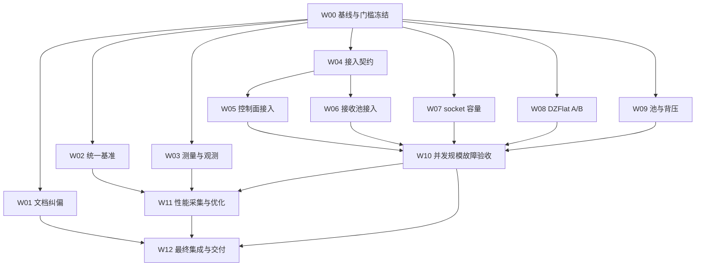
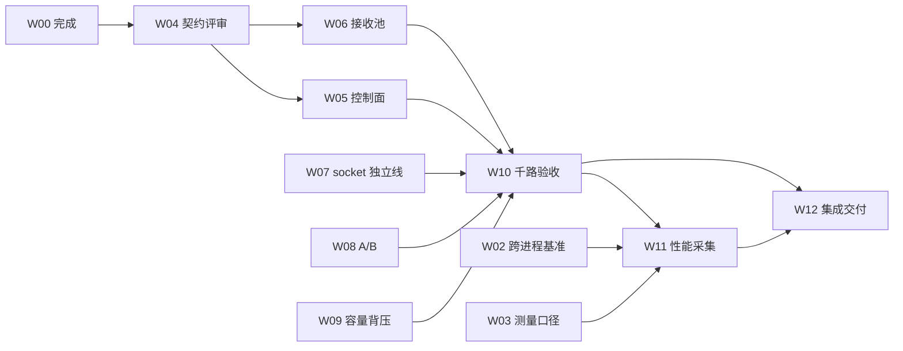

# 依赖图（W00 交付物）

> 工作包：W00；负责人：架构负责人；基线：`e800ccc496ac710b711c9346709e86a148c41241`
> 来源：方案 §5（流程图）、§4（工作包定义）、§7（G0–G4 门槛）。本文件把方案图落到**本队的实际任务号与责任人**上，供调度与解除依赖使用。

---

## 1. 工作包依赖（方案 §5，本基线确认无变化）

---

## 2. 任务号 → 工作包 → 责任人映射（本队共享任务列表）

| 任务 | 工作包 | 负责人 | 独立评审者 | 依赖 | 当前等级（本基线） |
|---|---|---|---|---|---|
| t1 | **W00** 基线与门槛冻结 | 架构负责人 | 验证与性能负责人 | — | **本文件完成后 S4（待共同签认）** |
| t2 | W01 文档纠偏与证据归档 | 文档负责人 | 架构负责人（**并入 R1/t14 执行**，见 §6） | t1 | **S3**（已归档：`W01/证据索引.md` N-xx/E-xx、`未决事实清单.md` UF-01…UF-18、`纠正说明_初版对照.md` C-01…C-14；快照 sha256 `a8e3d8b3…`）；**独立验收未做** |
| t3 | W02 统一跨进程基准 | 基准负责人 | 验证与性能负责人 | t1 | S1 |
| t4 | W03 测量口径与路径观测 | 测量统计负责人 | 架构负责人 | t1 | **S3**（口径侧已交付并验证：`W03/W03_测量口径与路径观测.md`、`test_w03_measurement` 19 用例 ctest 通过、3 条 `artifacts/perf/20260928-r0{1,2,3}-W03*`）；产品数据路径未接线（`基线与门槛.md` §3.12 接入级 S1） |
| t5 | W04 SHM 接入契约复审 | 共享层负责人 | 架构负责人 | t1 | S1（组件级 S3） |
| t6 | W05 控制面调度器接入 | SHM接入负责人 | 共享层负责人 | t5 | **S1（产品零接入点，W01 `E-06`）** |
| t7 | W06 接收池接入 | SHM接入负责人 | 共享层负责人 | t6 | **S1（产品零接入点，W01 `E-04`/`E-05`）** |
| t8 | W07 socket 容量与高 fd | socket与数据面负责人 | 架构负责人 | ~~t1~~（D-7 清空） | **S3**（修复+验证已落地：`test_socket_high_fd` 3/3、`test_ipc_info_pool_layout` 3/3、`test_ipc_info_pool_version` 2/2，均由架构负责人登记进 CTest（D-10），全量 **23/23 Passed，exit 0**）；判据见 `基线与门槛.md` §4.4 W07 补登记与 W01 `E-11`/`N-47`/`N-48`。⚠️ **口径**：千路用例是**单 topic × 1000 订阅**且只排空首条 route ⇒ 只支撑「千路有效注册 + 高 fd 往返」，**逐 route 收发归 W10**（`基线与门槛.md` §3.8）；**独立验收（S4）未做** |
| t9 | W08 DZFlat A 推广与 B 验证 | socket与数据面负责人 | 架构负责人 | ~~t1~~（D-7 清空） | **S3**（跨进程 A/B/三路径逐样本证据：`test_w08_dzflat_ab` 3/3 已登记 CTest #23（W00 D-11）；计数可分 + 载荷全量校验 + 贷款失败回退）；**注意**：交付文档 §2.5 的中位数表与磁盘 samples.csv 已因登记前裸跑发生漂移（见 `基线与门槛.md` §4.4 W08 留痕），**性能数字须以重跑的新 `run_id` 为准**；S4 未做，归 W10/R1 |
| t10 | W09 chunk 容量与背压 | 共享层负责人 | 架构负责人 | ~~t1~~（D-7 清空） | S1（容量口径待 W01 `UF-05` 闭环） |
| t11 | W10 并发/规模/故障验收 | 验证与性能负责人 | 架构负责人 | t7,t8,t9,t10 | S0 |
| t12 | W11 性能采集与优化 | 验证与性能负责人 | 架构负责人 | t3,t4,t11 | S0 |
| t13 | W12 集成与交付 | 文档负责人 | 架构负责人 + 验证与性能负责人 | t2,t11,t12 | S0 |
| t14 | R1 独立评审（契约冻结 + SHM 规模闭环证据 + **独立复核 W01 交付**） | 架构负责人 | — | t11 | 未开始（W01 部分可提前启动，见 §6） |

> ⚠️ 任务间依赖与方案 §5 图**完全一致**，无新增、无删减。注意 t6（W05）在任务列表中的依赖写作 t5，t7（W06）写作 t6 —— 与方案「W05/W06 可在接口冻结后**并行**开发」不矛盾：代码可并行，但**共享文件由单一集成负责人串行落地**（见 `接口责任表.md` §1），且「先完成控制面独立验证，再启用接收池组合」（方案 §5）。

> **队长裁决 D-7（2026-09-28）**：t8（W07）、t9（W08）、t10（W09）的 `t1` 依赖已清空 —— 依据是 `基线与门槛.md` 已实质冻结落盘、§6 门槛表七行无空项，t1 仅剩 P-1/P-2/P-3 三项**待验收尾巴**，不构成实现前置。**t6（W05）与 t7（W06）不放行**（它们依赖 t5 的契约评审，与本裁决无关）。表内 t8/t9/t10 的「依赖」列据此更新。

---

## 3. 第一批可并行派单（方案 §5）

**W01、W02、W03、W04、W07、W08、W09** 在 W00 冻结后可立即并行。W00 冻结各自必须依赖的基线与字段：

| WP | 从 W00 冻结中取用 | 具体字段/约束 |
|---|---|---|
| W01 | 基线提交、构建/工具链、A/B 路径判定 | §3.9/§3.10：A 是「loan+dzflat_write」、B 是「应用原地构造」；`tmp/iox_probe` 只能作历史背景 |
| W02 | 逐样本字段、规模拓扑、尺寸/速率矩阵 | §5、§6.4；CycloneDDS 不可链接（`基线与门槛.md` §1.5） |
| W03 | 指标定义与统计范围 | §6.1（尤其「空闲 CPU/上下文切换必须是全线程组」）、§6.2 第 3 行 |
| W04 | 冻结契约清单 | `接口责任表.md` §2（13 项） |
| W07 | fd 容量与失败语义 | §6.2 第 6 行（≤3.5 fd/route）、§7.2（`FD_SETSIZE` 缺陷） |
| W08 | 路径标记与门槛 7 | §6.2 第 7 行（禁止按 ≥64 KiB 自动切 B）、§3.10 |
| W09 | 容量模型与失败语义 | §5.2（chunk 40/档、view=10）、§7.2、§7.3 |

---

## 4. 关键路径与 G 门槛

| 门槛 | 解除条件 | 当前阻塞 |
|---|---|---|
| **G0 可测量** | 基线 + 接口责任 + 指标定义 + 数值门槛 + 测量工具验证 | 前四项由本文件交付；**「测量工具验证」已由 W03 完成（S3）**（`include/dzIPC/measure/` 7 头 + `tools/measure/` 采集器与校准负载 + `test/test_w03_measurement.cpp`，ctest #15；队长独立核实 `ctest -j4` = 18/18 Passed；W07+W08 补登记后为 **23/23 Passed**、`hotpath_gate` 过闸 exit 0）⇒ **G0 唯一剩余障碍 = P-1 共同签认**（详见 `基线与门槛.md` §10 G0 行、§11.3 P-2/P-3 与 §11.4 D-8/D-9） |
| G1 可安全接入 | W04 评审 + 竞态测试 | 依赖 t5 |
| **G2 SHM 规模闭环** | W05 + W06 共同通过千路有效收发与故障矩阵 | **关键路径**：SHM pub/sub 现为 `RecvWorker/ShmControlScheduler` 零接入（`基线与门槛.md` §3.7） |
| G3 数据面策略成立 | W08 + W09 + W11 | 受控组受 governor 权限限制（`基线与门槛.md` §4.1） |
| G4 完整交付 | W07 + 保护性回归 + 长期测试 + 报告 + 回滚演练 | 依赖 t8/t11/t12 |

---

## 5. 解除依赖的判据（不得提前解除）

| 依赖边 | 解除判据（可核验） |
|---|---|
| W00 → 其它 | 本文件 + `基线与门槛.md` + `接口责任表.md` 落库，且**架构负责人与验证与性能负责人共同签认**（P-1 的处置规则见裁决 **D-9**：带期限请求 → 回复则按其原话追加；仍不回复则「单方签认 + 队长复核」替代，且必须显式标注缺失的独立性维度；未闭合期间 **G0 只记「条件通过」**，§14.3 四行签认中「功能与规模等级」**不得填 S4/S5**） |
| W04 → W05/W06 | `接口与生命周期.md` 交付 + 独立评审通过（verdict=pass） |
| W05 → W10 | 千路发布/订阅组合下线程数固定，重连/死亡检测/注销无回调泄漏 |
| W06 → W10 | W05+W06 集成后千路收发与固定线程目标**同时**满足；回退可被判据检出 |
| W02/W03 → W11 | 跨进程身份可核验、计时边界一致；路径证据不足的实验已标「未确认」 |
| W10 → W11/W12 | 无未解释失败、死锁、悬挂引用和资源泄漏；规模轮次按 §13.2 六条判定 |
| W11 → W12 | 全部性能表来自可比配置；未测项保留明确空白 |

**禁止**：以「代码已写」解除依赖；以单次 `ctest` 全绿代替规模/长期/关闭重建；以兼容回退可用代替固定线程目标满足（方案 §11 末段）。

---

## 6. R1（t14）新增职责：独立复核 W01 交付（队长裁决 D-3，2026-09-28）

队长已将「**独立复核 W01 交付**」并入 R1 独立评审职责（W01 执行者为文档负责人，**不得自审**）。R1 由架构负责人执行。

| 项 | 内容 |
|---|---|
| 复核对象 | `团队改造交付/W01/`：`性能对照报告_纠偏版.md`（主报告归档副本，**现行** sha256 `c0f7a1e3…`；复核时点版本为 `3a72979e…`，见下）、`证据索引.md`（N-01…N-54 / E-01…E-42）、`未决事实清单.md`（UF-01…UF-18）、`纠正说明_初版对照.md`（C-01…C-14）、`本机复现/`、`外部来源存证/`、`历史版本/…快照.md`（初版 sha256 `a8e3d8b3…`） |
| ⏱ **版本沿革（t54/UF-17 收口后补注）** | 主报告与同源副本：初版 `a8e3d8b3…`（291 行）→ 复核时点版 `3a72979e53ad36f2864daf8add6f054517487747871c8a00b161ea21389be147`（369 行）→ **现行 `c0f7a1e36a720ceb2fd9f97a370a85b93ea4534f917759842f829eec97e63c20`（379 行，含 UF-17 行号收口）**。⛔ **本表 R1 复核结论对应 `3a72979e…` 时点**；收口只改 `udp.h` 行号与锚注（C-01…C-14 结论链、数值、机制判断**均未变**）⇒ 复核结论不因该修订失效，但引用时须写明时点。两份前版均在 `W01/历史版本/` 留快照，⛔ 不覆盖 |
| 与 R1 主职责的关系 | R1 原职责为「契约冻结与 SHM 规模闭环证据」（依赖 t11）；**W01 的复核部分不依赖 t11，可提前启动**，但 W01 的 verdict 与 R1 主体一并出具 |
| 复核要点（对应 W01 自述的 §3 核对顺序） | ① 快照与纠偏版对读，逐条验证 C-01…C-14；② 抽查 E-A 级 5–8 条按路径核对字段；③ 抽查 E-C 级 2–3 条核对固定版本/commit 与行号；④ 独立复跑 `本机复现/csw_cpu_scope_probe.c`；⑤ 确认 UF-01…UF-18 **无一**进入胜负表/摘要结论；⑥ 反证四项「有效订阅是否真存在、预期路径是否真执行、故障是否真触发、统计是否真覆盖整个系统」 |
| 禁止 | 不得由 W01 执行者（文档负责人）出具 W01 的通过结论；R1 不得以「文档齐全」代替「内容可回溯」 |
| 与 W00 开放项的关系 | W00 的 P-1…P-7（`基线与门槛.md` §11.3）与 W01 的 UF 清单**合并进入 R1 复核清单** |

---

## 7. R1 / 独立复核 **实际出具**清单（t13/W12 收口登记，2026-09-30；⛔ 新增，不改上文）

> ⚠️ **R1 主体 verdict 未出**（依赖 t11，而 t11 为 `failed` 历史终态保留）。本表为 W12 增量结案对 R1 产物的**只读登记**，⛔ **不代表** R1 结束，也**不是**任何 WP 的 S4 升格依据。

| 文件 | 覆盖对象 | 结论 | 性质 |
|---|---|---|---|
| `R1/R1分部复核_W01.md` | W01 | **PASS**（findings 3 项全 low，均已闭环） | 分部复核 |
| `R1/R1分部复核_W02.md` | W02 | **PASS**（2 medium + 1 low） | 分部复核 |
| `R1/R1增量verdict_W02收口.md` | W02 收口（t47 后） | **t14 的 needs_revision 项已闭合** | **增量**（首行标明「非 R1 主体重开」） |
| `R1/R1分部复核_W10-SHM千路.md` | W10（SHM 千路） | 分部复核已出 | 分部复核 |
| `R1/R1独立评审主体_t14.md`、`R1/R1主体_t14任务失败分析报告.md` | R1 主体 | ⛔ **未出** | 主体（依赖 t11） |
| `R1/t32_R1控制面项修订与复算纪要.md` | 控制面项修订 | 纪要 | 支撑件 |

**W12（`W12/W12_集成与增量结案.md`）对 R1 产物的使用边界**：
- ✅ 可引用**分部/增量** verdict 作为「该项已被非实现者复核」的证据；
- ⛔ **不得**据本表声称「R1 已完成」或「W04/W05/W06/W07/W08/W09/W11 已通过独立验收」（其 **S4 仍未做**，见该文件 §8 签认表）；
- ⛔ **不得**把 W02 的 S4（该文件 §8.1）外推到其他 WP；
- ⛔ **不得**以「文档齐全」代替「内容可回溯」（§6「禁止」条同义）。
