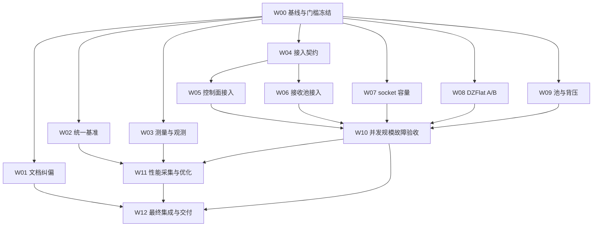

# 基线与门槛（W00 交付物）

> 工作包：W00 基线与决策冻结（P0）
> 负责人：架构负责人（attempt `94b459e6-4011-4a71-a284-71c64c2bef26`）
> 独立签认人：验证与性能负责人（W10/W11 负责人）
> 上游依据：`docs/消息接收架构改造/团队改造方案_性能证据闭环与SHM规模化.md`（下称「方案」，§4 W00、§6、§11、§12、§13）
> 性质：**冻结文档**。本文件冻结后，任何数值修改必须走「追加签认」段（§11），不得就地改写已有门槛。
> 采集时间：2026-09-28 19:15–19:35 CST（本机，工作目录 `/home/zwc/cpp_ipc_dds`）。

---

## 0. 一分钟结论

| 项 | 冻结值 |
|---|---|
| 起始提交 | `e800ccc496ac710b711c9346709e86a148c41241`（2026-09-28 15:15:04 +0800，分支 `dev`） |
| 工作区 | **历史口径**：采集窗口（19:20）`src/`/`include/`/`test/` 相对 HEAD 无差异；收口复核（19:41）W07 已改 `src/libipc/platform/posix/udp.h` ⇒ 指纹降级为「采集窗口指纹」。**现状态（t17 收口）**：`src/` 已有 W07（3 文件）与 W05/W06 目标文件（`shm_pub_sub_ipc.{cc,h}`、`nodelet_config.{h,cc}`）的改动 —— **任何正式运行都必须重配重编 + 重取指纹 + 新建 `run_id`**（§1.2.1、§4.4、附录 B-9） |
| 构建 | `build/`，`CMAKE_BUILD_TYPE=Release`，Unix Makefiles，CMake 3.22.1，`/usr/bin/c++` = g++ 11.4.0，C++17 |
| 库指纹（采集窗口） | `libipc.so.1.3.0` sha256 `97504a74138ada6d818b268d5bb64506bc671de6af8800dda3382879d5f4c537`（**W00 采集窗口指纹**；W07 已改 `udp.h`，见 §1.2.1，正式运行须重取） |
| 测试机 | i9-14900KF，32 线程（8 P 核 ×2SMT + 16 E 核），单 NUMA，SMT on，governor=`powersave`，`/dev/shm` 32 GiB |
| ctest | 采集窗口 **14/14** → D-6 后 **18/18** → W07 4 项（D-10）后 **22/22** → W08 1 项（D-11）后 **23/23** → 期间他人登记 #23/#25 + D-13 共享段串行化 + `test_dzflat_rx` 后 **现行 27 项**（19 项 RUN_SERIAL）。⚠️ 单轮 `-j4` 典型全绿，但**连续 6 轮实测 3/6 失败**（共享池残留，见 §4.4 D-13 + ③b 反例声明，根治 t22） |
| 目标规模 | 1000 个**独立**话题，`N_worker=32`（SHM 池与 socket 池分别计），`fallback_count=0` |
| 门槛表 | §6 已逐项填数，**无空项**；开放项（P-1…P-7）逐条标注「待验收」于 §11.3，**门槛数值本身未因测量结果调整** |
| 已识别的规模闭环缺口 | SHM pub/sub **零接入**控制面调度器与接收池（§3.7）；现有 1000 路探针 `sent=0 / received_sub0=0`（§3.6）。**socket 侧的高 fd 与注册表容量缺口已由 W07 修复并验证（§3.8，S3，未做 S4）** |

**一句话**：基线已固化到可复现的提交与二进制指纹；方案 §1 列出的三项「原有判断」在本基线上**全部复现为成立**——DZFlat 基准走的是 A 路径（W01 `E-01`/`E-02`）、千订阅证据从未证明有效收发（W01 `N-33`/`N-34`/`N-35`/`E-17`）、SHM 接收池尚未接入（W01 `E-04`/`E-05`/`E-06`）。W05/W06 是本轮 SHM 规模闭环的**唯一主线缺口**。**所有可回溯数值与机制判断的编号索引见 `团队改造交付/W01/证据索引.md`（N-xx / E-xx）；本文件一律引用编号，不另复述数值。**

---

## 1. 基线固定（要求的第 1 项）

### 1.1 提交

```
$ git rev-parse HEAD
e800ccc496ac710b711c9346709e86a148c41241
$ git log -1 --format='%H %ci %s'
e800ccc496ac710b711c9346709e86a148c41241 2026-09-28 15:15:04 +0800 fix(hreadpool):完成对socket线程池的重构, ...
$ git rev-parse --abbrev-ref HEAD
dev
```

该提交含阶段 5 共享层与三模块移植（`git ls-tree -r HEAD` 可见 `src/dzIPC/threepools/{recv_worker,socket_recv_worker,socket_wait_set,shm_control_scheduler}.cc`、`include/dzIPC/threepools/*.h`、`test/test_recv_worker.cpp`、`test/test_socket_recv_worker.cpp`）。上一轮收尾报告登记的阻断项 **B-1「被验证修订从未进入任何提交」在本基线上已解除**。

### 1.2 工作区差异（原文）

```
$ git status --short                     # W00 采集时（19:20 CST）
 M .gitignore
?? "docs/消息接收架构改造/事件驱动线程池_vs_iceoryx_性能对比.md"
?? "docs/消息接收架构改造/团队改造交付/"
?? "docs/消息接收架构改造/团队改造方案_性能证据闭环与SHM规模化.md"
?? include/dzIPC/measure/

$ git status --short                     # 19:40 复取（W03 继续产出 tools/measure/、W02 建 artifacts/）
 M .gitignore
?? artifacts/
?? docs/…（同上 3 项）
?? include/dzIPC/measure/
?? tools/measure/
```

逐项判定：

| 差异 | 内容 | 是否影响验收 |
|---|---|---|
| ` M .gitignore` | 新增一行 `.research/**` 忽略（`git diff .gitignore`：`-` 空行 → `+.research/**`） | 否。不改变任何构建输入 |
| `?? docs/.../团队改造交付/` | W00（本文件 3 份）+ W01 归档产出（性能对照报告纠偏版、证据索引、未决事实清单、纠正说明、本机复现、外部来源存证、历史版本快照） | 否。文档类，不进构建 |
| `?? docs/.../事件驱动线程池_vs_iceoryx_性能对比.md`、`?? docs/.../团队改造方案_性能证据闭环与SHM规模化.md` | W01 修订后的主报告（原位）与方案本体 | 否（文档） |
| `?? include/dzIPC/measure/` | **W03 产出**（`counters.h`/`monotonic_clock.h`/`proc_sampler.h`/`idle_observer.h`/`path_evidence.h`/`field_schema.h`/`platform_info.h`/`measurement.h`，2759 行，未跟踪） | **是（口径层面）**。文件仅头文件、未被任何 `src/` 包含（`grep -rn 'dzIPC/measure/' src` 命中 **0**），故不改变本基线二进制。**历史口径（19:20 采集时刻）**：当时 W03 尚未交付；**现状态（W03 已交付 S3）见 §3.12 与 §11.4 D-8**——接入级仍为 S1（产品数据路径未接线），但**「未交付」已不成立** |
| `?? tools/measure/`（19:40 新增） | W03 的工具链产出（**历史口径：当时并行进行中**；现已交付，见 §3.12/§11.4 D-8；未跟踪、不进构建） | 否（不改变基线二进制）。**历史要求「W03 交付时需自证命令与结果」已满足**：`test_w03_measurement` 19 用例 + 3 条 `artifacts/perf/20260928-r0{1,2,3}-W03*` |
| `?? artifacts/`（19:40 新增） | W02/W03/W07 按方案 §12 建立的一次运行一目录证据目录（并行进行中） | 否（证据目录，非构建输入） |

**结论**：`src/`、`include/`（除 `measure/` 新增头文件）、`test/` 相对 HEAD **零差异**。因此 §1.4 的二进制指纹与 `e800ccc` 一一对应，满足方案 §10.6「被验证的修订 == 某个 commit」的要求。

### 1.2.1 ⚠️ 基线采集后工作区发生的变化（**已复核，必须登记**）

W00 收口复核（2026-09-28 19:41）发现：**`src/` 相对 HEAD 已出现第一处差异**，由并行工作包引入。

```
$ git status --short            # 19:41 复核
 M .gitignore
 M "docs/…/文档回写记录.md"        # W01-FU（t15，纯文档）
 M "docs/…/集成测试与性能基准报告.md"  # W01-FU（t15，纯文档）
 M src/libipc/platform/posix/udp.h   # ← W07（t8）改动（当时"在飞"；现该改动已落地并验证为 S3，见 §3.8）
 M test/CMakeLists.txt               # ← W00 的 D-6 补登记（架构负责人）
?? artifacts/  ?? include/dzIPC/measure/  ?? tools/measure/  ?? test/test_{w03_measurement,lifecycle_contract,socket_high_fd}.cpp …
```

| 差异 | 引入者 | 性质 | 对基线判定的影响 |
|---|---|---|---|
| ` M src/libipc/platform/posix/udp.h`（`select`+`FD_SET` → `poll`，含 `INT_MAX` 截断与 EINTR 重试；最终 +24/−9） | W07 / socket与数据面负责人 | **产品代码改动**（`接口责任表.md` §1 证明其对本文件有写入权）。**收口复核（t17）时该改动已落地并验证为 W07 S3**（`test_socket_high_fd` 3/3、全量 ctest 22/22），见 §3.8 与 §4.4 W07 补登记 | **基线提交仍是 `e800ccc`；但工作区已不再是纯净树** ⇒ §1.4 记录的二进制指纹**只对本文件的采集窗口有效**，任何正式运行必须按 §12 重配重编 + 重取指纹 + 新建 `run_id` |
| ` M test/CMakeLists.txt`（W03 的 `add_test` + W00 的 D-6 补登记 + W07 的 D-10 补登记；最终 +62 行） | W03 负责人 + W04 负责人 + 架构负责人 | 构建/闸门配置 | 同上；各次登记分别记入 §4.4 与 §11.4 D-6/D-10、`接口责任表.md` §1.2 EX-2 |
| ` M` 两个 docs 文件 | W01-FU（t15） | 纯文档（UF-17 同步纠偏） | 无 |
| `?? test/test_socket_high_fd.cpp`（未跟踪、未进构建、`build/bin` 无对应二进制） | W07 | W07 的新用例，尚在开发 | 无（未进构建） |

> **纪律（据此更新 §1.4 的用途）**：本文件的指纹段从「基线指纹」**降级为「W00 采集窗口指纹」**——它证明的是「在 `e800ccc` + 采集窗口构建下，库与源自洽、加载路径正确」，**不再**声称「当前工作区二进制 == `e800ccc`」。这不是缺陷，而是本轮「W00 与 W01–W09 并行」的必然结果；方案 §12 已规定「代码/编译器/共享库/配置变化 ⇒ 必须新建 `run_id`」，故正式性能运行的对照指纹由 W02/W11 在自己的 `run_id` 内重取。**禁止**任何人引用本文件的 `97504a…` 指纹去核对 W07 改动后的库。

> ⚠️ 运行纪律（继承上一轮 B-1 教训）：正式采集前必须重新执行 `cmake -S . -B build && cmake --build build -j32` 并重取指纹；若 `git status --short` 出现 `src/`、`include/`、`test/` 的新差异或指纹变化，必须新建 `run_id`（方案 §12）。当时并行工作包（W02/W03）只在 `artifacts/`、`tools/`、`include/dzIPC/measure/` 下新增未跟踪文件，**均不进构建**，故不使本基线失效。**但 W07 已改动 `src/libipc/platform/posix/udp.h`（产品代码），见 §1.2.1 —— 该差异使本文件的指纹仅对采集窗口有效，不再代表当前工作区。**（t17 收口时 W07 改动已落地并验证为 S3；`src/` 另有 W05/W06 目标的改动，见本表上方与 §3.7。）

### 1.3 构建配置与工具链

| 项 | 值 | 取证 |
|---|---|---|
| 构建目录 | `/home/zwc/cpp_ipc_dds/build` | `build/CMakeCache.txt` `CMAKE_HOME_DIRECTORY:INTERNAL=/home/zwc/cpp_ipc_dds` |
| 生成器 | Unix Makefiles | `CMAKE_GENERATOR:INTERNAL=Unix Makefiles` |
| 构建类型 | `Release` | `CMAKE_BUILD_TYPE:STRING=Release` |
| CMake | 3.22.1 | `cmake --version` |
| C/C++ 编译器 | `/usr/bin/cc`、`/usr/bin/c++` = gcc/g++ **11.4.0** (Ubuntu 11.4.0-1ubuntu1~22.04.3) | `CMAKE_CXX_COMPILER:FILEPATH=/usr/bin/c++`；`g++ --version` |
| 语言标准 | C++17 | `CMakeLists.txt:52` `set(CMAKE_CXX_STANDARD 17)` |
| 有效编译选项（库） | `-O3 -DNDEBUG -fPIC` | `build/src/CMakeFiles/ipc.dir/flags.make` |
| 有效编译选项（测试/基准） | `-O2 -DNDEBUG -fPIE` | `build/test/CMakeFiles/ipc_benchmark.dir/flags.make` |
| 选项（构建期） | `LIBIPC_BUILD_SHARED_LIBS=ON`、`LIBIPC_BUILD_TESTS=ON`、`LIBIPC_BUILD_PYTHON=**OFF**`、`ROSBUILD=OFF`、`LIBIPC_BUILD_DEMOS=OFF`、`ENABLE_DEBUG_INFO=OFF`、`OPEN_DEBUG_MODE=OFF`、`UPDATA_MSG_SRV_GENERATOR=ON` | `build/CMakeCache.txt` |
| 产物 | `build/lib/libipc.so.3 → libipc.so.1.3.0`（SONAME `libipc.so.3`）、`build/bin/` 共 79 个二进制（72 个 `test_*`） | `ls build/lib`、`ls build/bin` |

> 注：库与基准的 `-O2`/`-O3` 混用来自顶层 `CMAKE_CXX_FLAGS_RELEASE` 与 target 级追加，属既有配置，**本轮不改**（改则改变基线可比性）。

### 1.4 二进制指纹与**实际加载库路径**

```
$ sha256sum build/lib/libipc.so.1.3.0 build/bin/ipc_benchmark
97504a74138ada6d818b268d5bb64506bc671de6af8800dda3382879d5f4c537  build/lib/libipc.so.1.3.0
896d3c7ad0b0ff14e5adb88f6a2f873c540c8ca677e8c169e8e98716f90ad36b  build/bin/ipc_benchmark

$ ldd build/bin/ipc_benchmark
  libipc.so.3 => /home/zwc/cpp_ipc_dds/build/lib/libipc.so.3   ← 实际加载的是本仓 build/lib
  libstdc++.so.6 => /lib/x86_64-linux-gnu/libstdc++.so.6
  libgcc_s.so.1  => /lib/x86_64-linux-gnu/libgcc_s.so.1
  libc.so.6      => /lib/x86_64-linux-gnu/libc.so.6
  libm.so.6      => /lib/x86_64-linux-gnu/libm.so.6
```

`readelf -d build/bin/ipc_benchmark` 给出 `RUNPATH: /home/zwc/cpp_ipc_dds/build/lib`。**注意**：环境里存在继承的 `LD_LIBRARY_PATH=/opt/openrobots/lib:`，它**不含**本仓路径，故不会改写解析结果；但正式运行仍须按方案 §10.6 显式记录/清理。`libipc.so` 自身 `NEEDED` 仅 `libstdc++/libgcc_s/libc/ld-linux` —— **无外部 DDS / iceoryx 依赖**。

> 🔴 **基线漂移注记（D-15 f，2026-09-28）**：本节冻结的 `97504a74…` 在 **20:32 已不可获得**——当前 `build/lib/libipc.so.1.3.0` = `65608d9255e7318a65dead3eab36eb961f47d94ae29c3db1cb35dc0e84a111e2`（W04/W07/W08/W09 并发改动所致）。**P-1 共同签认的对象 = 提交 `e800ccc` + 指纹 `97504a74…`**。**W10/W11 每次正式运行必须按方案 §12 新取指纹与新 `run_id`，⛔ 不得把 `65608d92…` 上的读数写进以 `97504a74…` 为基线的对照表。**

**构建时效性核对（防「陈旧 build 假通过」，方案 §10.6）**：

```
$ stat -c '%y %n' build/lib/libipc.so.1.3.0 src/dzIPC/shm_pub_sub_ipc.cc
2026-09-28 10:40:26  build/lib/libipc.so.1.3.0      # 库
2026-09-25 15:44:46  src/dzIPC/shm_pub_sub_ipc.cc   # 该源文件
$ find src include -name '*.cc' -o -name '*.h' | xargs stat -c '%Y %n' | sort -rn | head -3
include/dzIPC/measure/monotonic_clock.h   # 唯一「比库新」的文件组
include/dzIPC/measure/proc_sampler.h      #   = W03 未跟踪头文件
$ grep -rn 'dzIPC/measure/' src/ | wc -l
0
```

结论：所有**被编译的**源文件（`src/**`、`include/**`，均为 2026-09-28 10:40 之前）都比 `libipc.so` 旧，且唯一更新的文件是未被任何编译单元包含的 `include/dzIPC/measure/*.h` ⇒ **在 `e800ccc` 上库与源自洽，不存在陈旧构建**。⚠️ 与此前一次正式验收不同，本次**未重新执行 `cmake -S . -B build`**（重配会改动他人的 `include/dzIPC/measure/` 生成/构建状态）。正式采集前仍必须按方案 §10.6 重配+重编并重取指纹；该动作记为 `W00-R1`，不改变本文件的基线结论。

### 1.5 关键依赖版本

| 依赖 | 版本 / 位置 | 是否进入本基线链接 | 依据 |
|---|---|---|---|
| GoogleTest | **1.10.0**（源码内置） | 是（`build/lib/libgtest.a`） | `CMakeLists.txt:131` `set(GOOGLETEST_VERSION 1.10.0)`；`3rdparty/gtest/` |
| gperftools (tcmalloc_minimal) | **4.5.3**（`libtcmalloc_minimal.so.4.5.3`） | 否（默认不 `LD_PRELOAD`） | `3rdparty/gperftools/` |
| capo | 头文件（`spin_lock.hpp` 等） | 头文件编译期 | `3rdparty/capo/` |
| Python | 3.12.13（pyenv shim） | 否（`LIBIPC_BUILD_PYTHON=OFF`） | `python3 --version`；Cache |
| iceoryx | **2.0.5**，`/home/zwc/branch/lejulab_platform/devel/lib/libiceoryx_posh.so` 等（**本仓之外**，不在任何 RUNPATH） | 否 | `iceoryx_poshConfigVersion.cmake` `PACKAGE_VERSION "2.0.5"` |
| RouDi 配置 | `/etc/iceoryx/roudi_config.toml`（mempool 128B×10000 / 1KB×5000 / 16KB×1000 / 128KB×200 / 1MB×50） | 否（仅对照线） | 本机读取；RouDi 探针日志 `tmp/iox_probe/roudi.log` |
| CycloneDDS | **0.10.2**（源码在 `/home/zwc/branch/lejulab_platform/src/lejusdk/3rd_party/cyclonedds-0.10.2`，静态库 `devel/lib/libcyclone_dds.a`）；**系统无 `libddsc.so`** | 否 | `find` 结果；`ldconfig -p` 无 `ddsc`/`cyclone` |
| 外部对照探针（CycloneDDS+iceoryx） | 第三方 `latency_su/latency_pu`，2026-09-28 15:30 运行于 `tmp/iox_probe/` | 否 | `tmp/iox_probe/{pub_l1m,sub_l1m,pub_l64,sub_l64,roudi}.log` |

> ⚠️ **对 W02 的约束（已确认，非猜测）**：本机**没有**可被本仓链接的 CycloneDDS 动态库，只有 `lejulab_platform` 下的静态库与源码。因此「CycloneDDS + iceoryx」配置组合在本仓内**无法直接链接**；W02 必须二选一并在结果中写明：(a) 以外部进程路径复用 `lejulab_platform` 的构建产物并记录其 commit/版本；(b) 标注该组合「未纳入本机统一基准」为**待验收项**。**不得**用 `/tmp/iox_probe` 的历史日志充当本机统一基准结果（方案 §1、§11）。

### 1.6 与 W01 的交叉引用（**只引编号，不另复述数值**）

W01（文档负责人，2026-09-28 已归档于 `团队改造交付/W01/`）已为所有可回溯数值与机制判断建立编号索引。本文件及下游**一律通过编号引用**，不得重新抄录其数值，避免两套数字漂移：

| 本文件用到的事实 | 引用 W01 编号（勿复述数值） |
|---|---|
| DZFlat `--compare` 走 A 路径、内部 `loan→dzflat_write→publish_loan` | `E-01`、`E-02`、`E-03` |
| SHM 订阅侧仍建握手线程 + 订阅线程（= 本文件 §3.7） | `E-04`、`E-05`；未决 `UF-02`、`UF-15`、`UF-18` |
| `ShmControlScheduler` 全仓零产品接入点（= 本文件 §3.1） | `E-06` |
| 每 worker wait token 上限 127、超限显式回退（= 本文件 §5.2、§7.2） | `E-07`、`E-08` |
| chunk 池容量 40 与注释 32 不一致（= 本文件 §5.2） | `E-09`；未决 `UF-05` |
| socket 数据面超 `FD_SETSIZE` 的 abort 点与调用栈（= 本文件 §3.8、§7.2） | `E-11`、`N-47`、`N-48` |
| 1000 路注册失败与零收发、同 topic 探针缺陷（= 本文件 §3.6、§5.2） | `N-33`、`N-34`、`N-35`、`E-17` |
| 旧版本空闲 CPU/ctx 读数与口径缺陷（= 本文件 §6.2 第 3 行） | `N-37`…`N-46`；未决 `UF-03`、`UF-06` |
| 跨进程 64 B / 1 MiB 延迟读数（**仅作背景，不作判据**） | `N-01`…`N-08`、`N-11`…`N-14`；未决 `UF-12`、`UF-13` |
| `--compare` 的“14.3×”不可回溯（本文件 §6.3 不再复述） | `N-50`…`N-53`（**E-X**，禁止进入任何通过判据）；未决 `UF-01`、`UF-04`、`UF-16` |
| B 路径无任何性能证据（= 本文件 §3.10） | `UF-04`；未决 `N-53` |
| 受控环境/尾延迟未测（= 本文件 §4.1、§6.2 第 4 行） | `UF-10`、`UF-07`、`UF-08`、`UF-09`、`UF-11`、`UF-13` |
| 纠偏条目（引用其结论时写 `C-xx`） | `C-01`…`C-14` |
| 修订前快照（回滚锚点） | `历史版本/…_W01修订前快照.md`，sha256 `a8e3d8b30ac6d7e4c88a222a2951f9e17cbc6c317552c44dd194f5bbd711cb95` |

> **R1（t14）职责**：队长已把「独立复核 W01 交付」并入 R1 独立评审（W01 执行者为文档负责人，不得自审）。R1 由架构负责人执行；本文件 §11.3 的 P-1…P-7 与 W01 的 `UF-01…UF-18` 一并进入 R1 复核清单。

---

## 2. 接口责任表（要求的第 5 项 + 方案 §3 规则 3）

单一写入责任人：**同一文件同一时段只有一个写入负责人**；其他人只提交接口说明或独立补丁。

### 2.1 高冲突文件（串行落地）

| 文件 | 单一写入责任人 | 说明 | 其他工作包的正确做法 |
|---|---|---|---|
| `src/dzIPC/shm_pub_sub_ipc.cc`、`include/dzIPC/shm_pub_sub_ipc.h` | **SHM接入负责人**（W05/W06） | 方案 §4 W05/W06/W08 在此文件交集；§10.9 明确要求串行落地 | W08 提交**接口需求或分离补丁**（`loaned_message.h` / 新适配器文件）由 SHM接入负责人集成 |
| `include/dzIPC/common/loaned_message.h` | **socket与数据面负责人**（W08） | 冻结契约：`LoanedMessage` 的三条契约（`loaned_message.h:16-28`）不得在字段/语义上静默变更 | 改语义须先提「契约变更说明」由架构负责人裁决，再改 |
| `include/dzIPC/threepools/recv_worker.h`、`src/dzIPC/threepools/recv_worker.cc` | **共享层负责人**（W04/W09） | §10.4/§10.5：容量、预算、初始化一次性的归属地 | 模块侧只写适配器；不得复制 worker 或自造等待原语 |
| `include/dzIPC/threepools/{socket_recv_worker,socket_wait_set}.{h,cc}`、`shm_control_scheduler.{h,cc}` | **共享层负责人** | 同上；socket 侧适配由 socket与数据面负责人提交补丁 | socket模块补丁交共享层集成 |
| `include/libipc/ipc.h`、`src/libipc/**`（含 `platform/posix/udp.h`） | **socket与数据面负责人**（W07） | 高 fd / `select(FD_SET)` 修复点：`platform/posix/udp.h:347,353` | 改热路径须先过 `docs/hotpath_gate.sh` |
| `test/ipc_benchmark.cpp` + W02 新增跨进程基准源文件 | **基准负责人**（W02） | 现有 `ipc_benchmark` 是同进程基准（§3.5），W02 负责新建跨进程版 | 其他工作包不得改基线语义 |
| `include/dzIPC/measure/**` | **测量统计负责人**（W03） | 字段定义唯一事实来源 `measure/field_schema.h` | 用字段名引用，不自造并列字段 |
| `src/dzIPC/ipc_info_pool.{h,cc}`、`src/dzIPC/ipc_info_pool.cc` 的 `kMaxEntries`（512） | **共享层负责人** | 注册表容量与失败语义（§7） | 容量改动须附共享布局/版本兼容说明 |
| `CMakeLists.txt`、`test/CMakeLists.txt`、`src/CMakeLists.txt` | **架构负责人** | 构建配置与 CTest 登记是团队级闸门；CTest 当前 14 项 | 需要新 target/登记时提「需求 + 命令」，由架构负责人落地 |
| `docs/消息接收架构改造/团队改造交付/`（**分列**，见队长裁决 D-1） | 根级 W00 四类文档（基线/门槛/接口/依赖）= **架构负责人**；根级索引与最终交付文档集 = **文档负责人**（W01/W12）；各 WP 其余产物 = 该 WP 负责人 | W00 / W01 / W12 | 下游文档按根级路径引用 W00 文档，移动会断链 ⇒ **保持现状** | 各工作包写自己的子目录（如 `W00/`、`W01/`）与本 WP 交付物；根级新增 `.md` 需在 `接口责任表.md` §1.1 登记 |

### 2.2 冻结接口清单（本基线为准，代码为唯一事实来源）

| 接口 | 位置 | 冻结语义 | 本轮可变性 |
|---|---|---|---|
| `ShmControlScheduler::{register_subscriber,register_publisher,unregister,instance,stats}` | `include/dzIPC/threepools/shm_control_scheduler.h:180-221`；符号已入 `libipc.so.3` | `ControlTiming{sub=10ms, pub=50ms, peer_dead=2s}`；`kInvalidEntry=0` 且 id 不复用；`unregister` 同步且幂等；**回调内不得 `unregister`/`stop`** | 签名冻结；W05 只加调用点 |
| `RecvBudget{max_messages=32, max_bytes=1 MiB, max_processing_time=200 µs}` | `include/dzIPC/threepools/recv_worker.h:240-245` | 预算在**完整 `recv_once()` 返回后**检查（§10.3） | 数值可在启动配置改，默认值冻结 |
| `RecvWorkerPool::worker_for(name, domain, N)` = `FNV1a64(route_name‖domain) % N` | `recv_worker.h:352-357` | 相同输入恒定输出；`N==0 ⇒ hardware_concurrency()，上限 128`（`recv_worker.cc:64`） | 冻结 |
| `RouteSession::{acquire_receive,release_receive,begin_rebuild,wait_quiescent,stop_and_wake,current_route}` | `include/dzIPC/shm_route_session.h` | `recv` 与 `release` 不并发；重建顺序：禁新 lease → 唤醒 → 等静默 → 换 generation | 冻结 |
| `LoanedMessage`（loan/finalize/release/discard、move-only） | `include/dzIPC/common/loaned_message.h` | 容量上界由调用方给；失败即无效；析构归还 | 语义冻结；W08 只加使用面与基准 |
| `ipc::route::{loan, publish_loan, discard_loan}`、`read_wait_token()` | `include/libipc/ipc.h` | A 级 = 对象→chunk **一次拷贝**；B 级 = 应用就地构造 | 冻结 |
| 全局开关默认值 | `src/dzIPC/common/nodelet_config.cc:10-11` | `g_nodelet_enabled=false`、`g_dzflat_enabled=false`、`view_queue_pin=true` | 本轮**不改默认**（§6 第 7 行） |

---

## 3. 组件实施等级登记（要求的第 2 项，按方案 §11 S0–S5）

规则：等级只能逐级提升；**不能用高等级描述覆盖缺失的前置证据**。同一组件可同时有「组件级」与「产品接入」两个等级，分别登记。

| # | 组件 | 组件级等级 | 产品接入等级 | 文件 / 符号证据 | 运行证据 |
|---|---|---|---|---|---|
| 3.1 | 阶段1 `ShmControlScheduler` | **S3** | **S1（产品零接入）** | `include/dzIPC/threepools/shm_control_scheduler.h`、`src/dzIPC/threepools/shm_control_scheduler.cc`；符号 `ShmControlScheduler::instance/register_subscriber/register_publisher/unregister/stats` 已入 `libipc.so.3`（`nm -DC` 命中 36 处） | `test_shm_control_scheduler`（20 用例）ctest **Passed 3.56s**。**`grep -rn "register_subscriber\|register_publisher" src` 仅命中 `LocalPubSubRegistry`，`ShmControlScheduler::register_*` 在产品侧调用点 = 0** |
| 3.2 | 阶段2 `RouteSession` | **S3** | **S2** | `include/dzIPC/shm_route_session.h`、`src/dzIPC/shm_route_session.cc`；调用点 `shm_pub_sub_ipc.cc:682,795,810-812,893-895,955,973,983` | `test_shm_route_session`（15 用例）Passed 1.52s |
| 3.3 | 阶段3 `SubState` + `process_received_buffer`（唤醒伪影门） | **S3** | **S2** | `include/dzIPC/shm_pub_sub_ipc.h:30-42`、`src/dzIPC/shm_pub_sub_ipc.cc:61-174` | `test_wakeup_artifact`（10 用例）Passed 4.85s；`test_shm_i5_pop_buffer`（3）Passed 4.31s |
| 3.4 | 阶段4 `recv_wait_set`（`kMaxRoutes=127`）+ `route::read_wait_token()` | **S3** | **S2**（经 worker 适配器） | `include/libipc/recv_wait_set.h`、`src/libipc/recv_wait_set.cpp:23`（linux `127` = futex_waitv 128 槽留 1）；`include/libipc/ipc.h:246` | `test_recv_wait_set`（9 用例）Passed 0.14s |
| 3.5 | 阶段5 `RecvWorker` / `RecvWorkerPool`（SHM 收包池） | **S3** | **S2（仅 shm_ser_cli）** | `include/dzIPC/threepools/recv_worker.h`、`src/dzIPC/threepools/recv_worker.cc`；`shm_ser_cli_ipc.cc:952,963,970,980,1000` | `test_recv_worker`（16 用例）Passed 3.24s；**路径标识**：`./build/bin/test_dzipc_shm` 打印 `[request_response_test_SerInfo] request receive on shared SHM worker 20 (generation 1, workers 32)` |
| 3.6 | 阶段5 `SocketRecvWorker` / `SocketWaitSet`（epoll） | **S3** | **S2（socket_pub_sub + socket_ser_cli）** | `include/dzIPC/threepools/socket_recv_worker.h`、`socket_wait_set.h`；`socket_pub_sub_ipc.cc:1135,1151,1158`、`socket_ser_cli_ipc.cc:148,1061-1063`；`socket_wait_set.cc:12,45`（`epoll_create1`/`epoll_wait`） | `test_socket_recv_worker`（7）Passed 0.97s、`test_socket_wait_set`（9）Passed 0.69s；**路径标识**：`test_dzipc_socket` 打印 `request receive on shared socket worker 12` 与 `[TestMsg2SubInfo] subscribe receive on shared socket worker 25` |
| 3.7 | **SHM pub/sub 接收侧接入（W05/W06 的目标态）** | — | **S1（未接入）** | `src/dzIPC/shm_pub_sub_ipc.cc`、`include/dzIPC/shm_pub_sub_ipc.h`；`grep -c "RecvWorker\|ShmControlScheduler"` = **0/0**；仍创建 `publish_thread_`（`:237`）、`sub_handshake_thread_`（`:940`）、`subscribe_thread_`（`:941`）；头文件成员 `publish_thread_`/`sub_handshake_thread_`/`subscribe_thread_`（`shm_pub_sub_ipc.h:140,200,201`） | 无（这正是方案 §1「SHM 已实现固定线程接收」结论被否掉的原因） |
| 3.8 | socket 容量与高 fd（W07） | **S3**（修复 + 单项验证通过；**独立验收 S4 未做**，归 W10/R1） | **S3** | **修复后**：`src/libipc/platform/posix/udp.h:360,368`（`pollfd` + `::poll`，取代 `FD_SET`+`::select`）；`include/dzIPC/ipc_info_pool.h:52` `kMaxEntries=4096` + 段名/布局版本。**修复前（HEAD）**：`udp.h:347,353`（`FD_SET`+`::select`）、`kMaxEntries=512` | **修复前复现**：`test/perf/out/20260927_t6_probes/` 的 `fdprobe 511`（maxfd 1089）**abort rc=134**、`scale=1000`（2067 fd）**abort**。**修复后**：`test_socket_high_fd` 3/3——`[W07 worker-path] maxfd=1125 sent=10 received=10`、`[W07 compat-path] maxfd=1061 sent=10 received=10`、`[W07 1000-lane] scale=1000 registered=1000 maxfd=2070 openfds=2071 sent=20 received=20`。⚠️ **口径限定（W07 交付方与队长共同确认）**：该「1000-lane」是**单一 topic × 1000 个订阅对象**（`test_socket_high_fd.cpp:277-279`），且 `received` **只从 `subs[0]` 一条 route 累计**（同文件 `:330-334`）⇒ 它证明的是「**千路有效注册**（`registered=1000`）+ 该 topic 组播链路可通 + 首条 route 能收到 + 高 fd 不崩」，**不等于「1000 个独立话题逐 route 有效收发」**；后者按方案 §13.2 第 2 条（`valid_rx_count == expected_count` 且逐 route 序号+载荷校验）**由 W10 补台账**。`test_ipc_info_pool_layout` 3/3、`test_ipc_info_pool_version` 2/2；全量 ctest **22/22 Passed, exit 0**。改动面指纹与反事实见 `团队改造交付/W07/socket容量与高fd修复_交付.md` |
| 3.9 | DZFlat **A** 路径 | **S3** | **S2** | `src/dzIPC/shm_pub_sub_ipc.cc:462-490` `try_publish_dzflat()`：`loan → msg->dzflat_write(lo.data,…) → publish_loan` —— **内部借样 + 容器→chunk 一次拷贝，属 A 路径**；发送类 = `src/dzIPC/dzflat_tx_benchmark.cpp`（W01 交叉证据 `E-01`/`E-02`/`E-03`） | `test_dzflat_transport`（9）/`test_dzflat_rx`（8）/`test_dzflat_sercli`（4）经 `hotpath_gate` 全绿；计数口 `DzFlatPublishCount()/DzFlatFallbackCount()`（`nodelet_config.h:43-45`） |
| 3.10 | DZFlat **B** 路径（`loan → 应用原地构造 → publish_loaned`） | **S3** | **S1（应用面未接入；基准未覆盖）** | `include/dzIPC/shm_pub_sub_ipc.h:78,94`（`loan<Flat>` / `publish_loaned`）、`include/dzIPC/common/loaned_message.h` | `test_dzflat_builder`（9 用例）本机重跑 **9/9 PASSED**（含 `InPlaceConstructionRoundTrips`、`ExceedingBudgetFailsCleanly`、`LoanFailsWithoutSubscriber`）；`test/dzflat_tx_benchmark.cpp:102,116` 有 B 档开关。**但 `test/ipc_benchmark.cpp --compare` 无 B 档**（方案 §1 第 1 行结论复现） |
| 3.11 | `ipc_benchmark`（现有基准） | **S2** | S2 | `test/ipc_benchmark.cpp:196` `bench_shm()`：订阅线程在**同一进程**内创建（`:220`），发布走本调用线程（`:291/:322`）；`--compare` 在同进程内交替两档（`:442-443`） | 可复现基线：`perf_results/t1_baseline_r1,r2`（32 用例 ×2 轮） |
| 3.12 | W03 测量件 | **S3**（W03 已于 2026-09-28 交付，自述 S3、不主张 S4/S5） | **S1（库内可用、产品数据路径未接线）** | `include/dzIPC/measure/*.h`（7 头，2759 行，仍未跟踪）+ `tools/measure/w03_collector.cpp` + `test/test_w03_measurement.cpp`（19 用例） | **有**：`test_w03_measurement` 已登记 ctest #15 并通过；三条证据目录 `artifacts/perf/20260928-r0{1,2,3}-W03*`（含 `manifest.json`/`idle.json`/`verdict.md`）。**接线点仍归各模块 owner**（W03 交付说明 §3 末「集成点」）⇒ 不得在接线完成前把其字段当「已生效产品口径」 |
| 3.13 | nodelet 快路径 | **S3** | **S2（默认关）** | 默认 `g_nodelet_enabled=false`（`nodelet_config.cc:10`）；开关 `ENABLENODELET`（`dzipc.h:28-29`） | `test_shm_nodelet`、`test_shm_ser_cli_nodelet`、`test_socket_nodelet`、`test_nodelet_switch` 在 `build/bin` 内可跑（未登记进 CTest，见 §4.4） |

### 3.1 三项「必须分别登记、不得互相推导」的事实（方案 §11 要求）

| 事实 | 本基线证据 | 结论 |
|---|---|---|
| 构建目标含新源文件 ≠ 运行进程加载了该库 | `ldd build/bin/ipc_benchmark` → `/home/zwc/cpp_ipc_dds/build/lib/libipc.so.3`；`nm -DC build/lib/libipc.so.3 \| grep -cE "RecvWorker\|ShmControlScheduler"` = **161**（其中 `ShmControlScheduler` 36 处） | ✅ 已加载，且关键符号在库内 |
| 日志出现 worker 编号 ≠ 所有预期 route 成功注册 | `test_dzipc_shm` 只打印 1 条 worker 归属；1000 路探针 `worker_1000.log` **无任何注册成功/收发行**，且 `sent=0 received_sub0=0` | ❌ **不可推导**。W10 必须逐 route 记录注册与首包 |
| 注册成功 ≠ route 收到并交付有效序号 | `worker_100_pub.log`：`sent=20 / received_sub0=0`（只在 `subs[0]` 上排空，仍未收到） | ❌ **不可推导**。这是当前规模证据的核心缺口 |
| 使用 `loan` ≠ 应用完成 B 路径原地构造 | `try_publish_dzflat` 内部 `loan` + `dzflat_write` | ❌ 属 A 路径（§3.9） |
| 单次 ctest 全绿 ≠ 规模/长期/关闭重建通过 | ctest 14/14 但 14 项均为模块级，最长 4.86 s，**无 1000 路用例** | ❌ 不可推导 |
| 兼容回退可用 ≠ 固定线程目标满足 | compat 臂线程数随规模线性（`test/perf/out/20260927_t6_scale/compat_1000.log` 在 1000 路 **buffer overflow abort**） | ❌ 不可推导 |

---

## 4. 测试机环境与资源限额（要求的第 3 项）

### 4.1 CPU 拓扑

| 项 | 值 | 取证 |
|---|---|---|
| 型号 | Intel(R) Core(TM) i9-14900KF，family 6 model 183 stepping 1 | `/proc/cpuinfo`、`lscpu` |
| 逻辑 CPU | **32**（online `0-31`） | `/proc/cpuinfo` `grep -c ^processor` |
| 物理核 / SMT | 24 物理核，`每个核的线程数=2` ⇒ **8 P 核 × 2 + 16 E 核** | `lscpu`；`thread_siblings_list`：`cpu0-15` 两两成对（`0-1,2-3,…,14-15`），`cpu16-31` 各自独立 |
| P/E 分界（按 `cpuinfo_max_freq`） | **P 核 = CPU 0–15**（5.7–6.0 GHz）；**E 核 = CPU 16–31**（4.4 GHz） | `/sys/devices/system/cpu/cpuN/cpufreq/cpuinfo_max_freq` |
| 频率 | 当前 5691 MHz（cpuinfo 首核）；min 800 MHz / max 5700 MHz | `/proc/cpuinfo`、`scaling_min/max_freq` |
| SMT | **on**（`smt/active=1`，`control=on`） | `/sys/devices/system/cpu/smt/*` |
| NUMA | **单节点**（`NUMA 节点=1`，`节点0 CPU: 0-31`） | `lscpu` |
| 缓存 | L1d 896 KiB / L1i 1.3 MiB / L2 32 MiB / L3 36 MiB | `lscpu` |
| 关键 flags | `avx2`（**无 avx512**）、`constant_tsc`、`nonstop_tsc`、`rdtscp`、`smt`、`ht` | `/proc/cpuinfo` |
| governor | **`powersave`**（32/32 核），driver `intel_pstate`，`status=active`，`no_turbo=0` | `/sys/devices/system/cpu/cpu*/cpufreq/scaling_governor` 等 |
| 内核 cmdline | `… ro quiet splash vt.handoff=7` —— **无 `isolcpus`、无 `nohz_full`、无 `intel_pstate=disable`** | `/proc/cmdline` |
| 软中断平衡 | `irqbalance` **未运行** | `pgrep -a irqbalance` |

> ⚠️ **受控性能组的前置条件（必须写进 W11 报告）**：本机 governor 为 `powersave`、SMT 开启、P/E 混合。方案 §6.2 要求受控组记录 governor/P、E 核类型/SMT/亲和性/NUMA 与温度频率条件。**当前会话无 root，无法把 32 核 governor 切到 `performance`**。因此：
> 1. 本基线所有读数一律标注 `governor=powersave, SMT=on, no isolcpus, loadavg≈1.9`；
> 2. W11 若要做「受控性能组」，须由队长提供 root 窗口或明确接受「受控组不可得 ⇒ 只出普通环境组结论，受控结论标『待验收』」；
> 3. 绑核基线建议：P 核 `cpu5,cpu6`（既有 hotpath gate 口径）或 `cpu0`/`cpu1`；**禁止**把发布/订阅放在同一物理核的兄弟线程上（既有注释已记录实测 `recv=0`）。

### 4.2 内存 / 共享内存 / 限额

| 项 | 值 | 取证 |
|---|---|---|
| 内存 | total 62 GiB，available 38 GiB，swap 65 GiB（已用 1.0 MiB） | `free -h` |
| `/dev/shm` | **tmpfs 32 GiB**，当前 **0 个对象**（干净） | `df -h /dev/shm`、`ls /dev/shm \| wc -l` |
| THP | `always [madvise] never` ⇒ **madvise**；HugePages 静态池 = 0 | `/sys/kernel/mm/transparent_hugepage/enabled`、`/proc/meminfo` |
| `ulimit -n`（fd 上限） | **1048576** | `ulimit -a` |
| `ulimit -l`（locked memory） | **unlimited** | `ulimit -a` |
| `ulimit -s` | 8192 KiB | `ulimit -a` |
| `RT priority` | `-r 60`（`SCHED_FIFO` 可用上界） | `ulimit -a` |
| `threads-max` | 511105 | `/proc/sys/kernel/threads-max` |
| `pid_max` | 4194304 | `/proc/sys/kernel/pid_max` |
| `vm.max_map_count` | 65530 | `/proc/sys/vm/max_map_count` |
| `shmmax` / `shmall` / `shmmni` | 均极大 / 极大 / 4096（POSIX `shm_open` 走 tmpfs，**不受 shmmni 限制**） | `/proc/sys/kernel/*` |
| overcommit | 0（启发式） | `/proc/sys/vm/overcommit_memory` |
| net（loopback/SHM 对照用） | `rmem_max=wmem_max=536870912`；`netdev_max_backlog=1000`；`tcp_rmem=[4096,131072,6291456]` | `/proc/sys/net/**` |
| cgroup | `cpu.max`/`memory.max` **未设限**（cgroup v2 `user@1000.service/…scope`，无限值文件） | `/sys/fs/cgroup/*`，`cat /proc/self/cgroup` |
| 亲和性 | 当前 shell 亲和 = `0-31`（未钉核） | `taskset -cp $$` |
| 磁盘 | `/home/zwc/cpp_ipc_dds` 1.2 TiB 可用（35% 已用） | `df -h` |

### 4.3 可用工具

| 工具 | 状态 | 用途 |
|---|---|---|
| `taskset`、`chrt` | ✅ | 绑核 / `SCHED_FIFO`（独立实验变量，方案 §6.2） |
| `perf`、`strace`、`gdb` | ✅ | 路径/系统调用证据 |
| `numactl` | ❌ **缺失** | NUMA 实验不可做（本机单节点，影响小）；报告中标注 |
| `python3` | ✅ 3.12.13 | 结果汇总 |
| `irqbalance` | ❌ 未运行 | 无需处理中断均衡 |

### 4.4 CTest 现状与 W00 构建闸门补登记

**队友接单基线（本文件初稿采集时）**：14 项，100% Passed，8.43 s：

```
$ ctest --test-dir build -j4          # W00 初稿采集（19:20 CST）
100% tests passed, 0 tests failed out of 14      Total Test time (real) = 8.43 sec   exit 0
```

14 项与其覆盖见下表；登记位置 `build/test/CTestTestfile.cmake`（源 `test/CMakeLists.txt`）。

| # | 测试 | 初稿时长 | 覆盖 |
|---|---|---|---|
| 1 | `test_udp_port_boundary` | 4.03 s | 端口/fd 边界（8 用例） |
| 2 | `test_shm_control_scheduler` | 3.56 s | 控制面并发注销 I1–I4（20） |
| 3 | `test_shm_route_session` | 1.52 s | 生命周期/lease/generation（15） |
| 4 | `test_wakeup_artifact` | 4.85 s | 唤醒伪影门（10） |
| 5 | `test_shm_i5_pop_buffer` | 4.31 s | 队列/缓冲（3） |
| 6 | `test_shm_sub_dtor_gate` | 0.96 s | 析构闸（2） |
| 7 | `test_shm_ready_transition` | 4.86 s | 就绪迁移与 stop/restart（3） |
| 8 | `test_recv_wait_set` | 0.14 s | 等待层（9） |
| 9 | `test_recv_worker` | 3.24 s | SHM 收包池（16） |
| 10 | `test_socket_wait_set` | 0.69 s | socket 等待层（9） |
| 11 | `test_socket_recv_worker` | 0.97 s | socket 收包池（7） |
| 12 | `test_socket_readable` | 0.06 s | 可读判据（5） |
| 13 | `test_socket_ser_concurrency` | 0.34 s | 并发（3） |
| 14 | `test_shm_ser_backpressure` | 0.51 s | 背压（2） |

**缺口（本文件初稿记录）**：`build/bin` 内有 72 个 `test_*`，**仅 14 项登记进 CTest**（`test/CMakeLists.txt` 注释自述「其余 target 仍未登记，不在本次射程」）。**收口时已补至 23 项**（W00 D-6 补 2 项 + W07 D-10 补 4 项 + W08 D-11 补 1 项 + W03/W04 各 1 项）。方案 §10.6 明确「单次 ctest 全绿 ≠ 规模/长期/关闭重建通过」。

**W00 补登记（本轮由架构负责人落地，2 项）**：

| # | 测试 | 登记来源 | 覆盖 | 为什么必须进 CTest |
|---|---|---|---|---|
| 16 | `test_dzflat_transport` | 本文件 §11.4 D-5（W08/t9 请求，架构负责人落地） | 9 用例，含 `CrossProcessRoundTripProvesPositionIndependence`（fork 子进程发布 + 退出码回报） | **跨进程 B 路径正确性此前从未被任何自动回归覆盖** |
| 17 | `test_dzflat_builder` | 同上 | 9 用例，含 chunk 内指针区间断言、就地构造回环、超预算失败、未发布借样归还、无订阅时 loan 失败 | B 路径的**功能**证据此前只在手工 `build/bin` 里跑 |

另 1 项（**#15 `test_w03_measurement`**）由 W03 负责人于并行窗口内先行落地（`test/CMakeLists.txt` 内已有其 `add_test` 与注释块），本文件予以确认并纳入同一闸门记录。

**补登记后实测（2026-09-28 19:5x → 20:0x，本机，两轮）**：

```
$ cmake -S . -B build          # 重配（rc=0），ctest 清单刷新
$ ctest --test-dir build -N
  Test #15: test_w03_measurement
  Test #16: test_dzflat_transport
  Test #17: test_dzflat_builder
  Test #18: test_lifecycle_contract      ← W04 随后追加
Total Tests: 18

$ ctest --test-dir build --output-on-failure -j4
100% tests passed, 0 tests failed out of 18     Total Test time (real) = 14.40 sec   exit 0
```

单测时长：`test_w03_measurement` 已入列并通过；`test_dzflat_transport` 3.92 s、`test_dzflat_builder` 3.01 s、`test_lifecycle_contract` 5.45 s（均含共享内存建段/fork），故 `TIMEOUT` 分别给 300 s / 120 s（仅为死锁时报超时而非挂住构建机，**不是性能判据**）。登记写法与命名规范与前 14 项一致（`add_test(NAME <target> COMMAND <target>)`，target 由 `file(GLOB)` 生成，不另起别名）。

**登记执行者核对（队长要求：如实登记实际执行者）**：

| # | 测试 | 提出者 | **实际执行者** | 是否与 §1 写入权限一致 |
|---|---|---|---|---|
| 15 | `test_w03_measurement` | W03 负责人 | **W03 负责人本人**（`test/CMakeLists.txt` 内以其名义加注释块 + `add_test`，见其交付说明 §2「已登记为 ctest」） | ⚠️ 与 `接口责任表.md` §1「CMakeLists/CTest 登记 = 架构负责人」**不一致**（越权窗口内自登记）。**处理**：事后追认有效——该行仅追加 1 条 `add_test`，未改任何既有行，且在途中未造成冲突；但**记为口径偏差**，已在 `接口责任表.md` §1.2 登记为 EX-2 |
| 16/17 | `test_dzflat_transport` / `test_dzflat_builder` | socket与数据面负责人（W08/t9） | **架构负责人本人**（W00，本文件 §11.4 D-6） | ✅ 一致（`git diff test/CMakeLists.txt` 中该注释块署名「由架构负责人(W00)落地」） |
| 18 | `test_lifecycle_contract` | W04 负责人 | **W04 负责人本人**（同上，其注释块署名 W04） | ⚠️ 同 #15：**口径偏差**，登记为 EX-2 |

> 结论：**16/17 由架构负责人按 §1 落地**；15/18 由其 WP 负责人自登记（越权但无害，已追认并登记为 EX-2）。为避免复发，本文件与 `接口责任表.md` §1.2 同时写明：**后续新增 `add_test` 一律先提需求给架构负责人**，紧急窗口内的自登记必须在 24 h 内补登记到 §1.2。

**D-13 共享段用例 `RUN_SERIAL` 补登记（2026-09-28，13 项）**——队长裁决、架构负责人落地（`test/CMakeLists.txt` 属架构负责人写入范围）。判据、反例声明与理由写在 `test/CMakeLists.txt` 的对应注释块与 §4.4 闸门纪律 ③b，此处只登记结果与实测：

| 项 | 内容 |
|---|---|
| 新增串行化 | `test_socket_recv_worker`、`test_lifecycle_contract`、`test_socket_high_fd`、`test_shm_sub_dtor_gate`、`test_wakeup_artifact`、`test_shm_ser_backpressure`、`test_shm_i5_pop_buffer`、`test_shm_ready_transition`、`test_shm_route_session`、`test_recv_worker`、`test_udp_port_boundary`、`test_w03_measurement`、`test_dzflat_fallback_semantics`（#26，新增用例，在其登记处单独设置——CMake 要求 `add_test` 先于 `set_tests_properties`） |
| 串行化合计 | **19 / 26 项**（另 7 项：`shm_control_scheduler`/`recv_wait_set`/`socket_wait_set`/`socket_readable`/`socket_ser_concurrency` 机械判据计数为 0；`ipc_info_pool_layout` 纯布局校验；`chunk_capacity_backpressure` 用**独立 prefix** 自有池） |
| `ctest -N` | **26 项**（含期间他人登记的 `test_w02_xproc_benchmark` #23、`test_chunk_capacity_backpressure` #25、`test_dzflat_fallback_semantics` #26） |
| 实测（写进验收，不得美化） | `-j32` × 15 轮：**失败 14/15（93%）**，`test_dzflat_builder`（**自身已 RUN_SERIAL**）12/15、`test_w08_dzflat_ab`（同）11/15；`-j4` × 6 轮：**失败 3/6（50%）**，轮 1–3 全绿、轮 4–6 起失败 |
| **准确措辞（队长强制）** | ✅「**降低**共享池用例的并发串扰概率」；⛔ **不得**写「解决 ctest 并发偶发失败」或「消除失败」（11/15、3/6 是反例） |
| 因果定向（指向 t22，**已按 D-13 复核更正**） | 受控实验（同一 shell，`leak_exp/`）：`leaker` 借满 40 块未发布 → 外部 `SIGKILL` → 残留 `CHUNK_INFO__132096` 段 → **单跑** builder **rc=8**（`published=false`）→ 仅删该段 → **单跑 rc=0**。准确表述 = **与并发邻居无直接关系、但与并发窗口内产生的异常退出段强相关**；证得**段状态驻留共享段**（`SIGKILL` 跳过 `shm_unlink`，`shm_posix.cpp:232`）且未发布借样不被回收（`reclaim_dead_chunks` 跳过 `published==0`） |

**W08 补登记（2026-09-28，1 项，W00 收口后）**——socket与数据面负责人提出、**架构负责人按 `接口责任表.md` §1 落地**（属"先提需求后落地"，**不属 EX-2 偏差**）：

| # | 测试 | 覆盖 | 登记要点 |
|---|---|---|---|
| 23 | `test_w08_dzflat_ab` | 3 用例：三路径（TLV/A/B）计数可分、**跨进程 + 逐样本落盘 + 载荷全量校验**、贷款失败后应用回退仍投递 | 用 **`ENVIRONMENT` 把自带落盘重定向到 `build/test-scratch/w08`**（原因见下），并加 `RUN_SERIAL TRUE`、`TIMEOUT 600` |
| 16/17 | `test_dzflat_transport` / `test_dzflat_builder`（D-6 已登记） | 见 D-6 | **本轮追加 `RUN_SERIAL TRUE`**（原仅 `TIMEOUT 300`）：二者同样吃**全机共享** chunk 池，且 W08 的验收含 `dzflat_fallback == 0`；邻居把池吃干会造**假红/假绿**。按 ③b 团队判据用 `RUN_SERIAL` 而非 `RESOURCE_LOCK`。代价：全量 `-j4` 由 13.7 s 增至 **25.4 s**（+11.7 s），换取得确定性 |

> ⚠️ **登记时发现并修复的一个「证据自毁」缺陷（团队级，必须留痕）**：该用例的 `run_id` 是**硬编码**的六个（`20260928-r05..r10-W08-*`），`repo_root()` 由 `/proc/self/exe` 推回仓库根，落盘一律 `fopen(..., "wb")` **截断** ⇒ **每跑一次 ctest 就静默覆盖仓库内的 W08 原始证据**，直接违反方案 §12「结果目录只采用只追加策略；重跑生成新目录，不能覆盖旧日志」。
> - **实测取证**：`ctest -R w08_dzflat_ab` 跑两次后，`r05/r06/r08` 的 `samples.csv` 磁盘复算中位与交付文档记载**不再一致**（例：r06 transport 中位 磁盘 `10.2/17.6/185.6 µs` vs 文档 `6.3/17.1/179.8 µs`）；目录创建时间 19:56、`samples.csv` mtime 20:00+，可定位为登记前的裸跑所致。
> - **处置**：登记时用 `ENVIRONMENT "W08_ARTIFACT_ROOT=…/build/test-scratch/w08"` 把落点重定向到**已被 `.gitignore` 忽略**的 `build/` 下（该环境变量是该测试自带的官方覆盖点，`test_w08_dzflat_ab.cpp:223`）。闸门里该用例的职责是**正确性**（三路径可分/全量校验/回退），**不是**性能证据；性能证据仍须按 §12 显式运行、生成**新 `run_id`**。
> - **保护性验证**：登记后 `ctest -R w08_dzflat_ab` 与全量 `ctest -j4` 各跑一次，仓库 6 个 run 的 `samples.csv` sha256 **全部未变**（受控前后对比）。
> - **残余（须 W10/W12 处理，写入权不在 W00）**：已被覆盖的原始样本**无法从仓库复原**（W08 自己的 `perf_summary.json`(19:57) 保留了当时的派生中位数，可作交叉核对但非原始样本）；请 W08/W12 决定是否重跑生成**新 `run_id`** 并同步其交付文档的数值表。**W00 不代改他人 WP 文档**，此处只登记事实与处置。
> - **🔴 更正（队长 D-12 复核 + W00 独立复算，2026-09-28）**：
>   ① **受影响范围不止 r05/r06/r08 —— 六个 run 的 `samples.csv` 全部被重写**。取证：`mtime` 六连递增落在同一写周期（**20:31:18.29 / 18.95 / 19.56 / 20.17 / 20.78 / 21.38**），晚于本文件的 `ENVIRONMENT` 重定向落地时刻；且**经 ctest 的路径早已改走 `build/test-scratch/w08`** ⇒ 该轮只能来自**不经 ctest 的直接调用**（正是 ③c 要挡的入口）。
>   ② **污染前权威派生记录对照**（`artifacts/perf/20260928-r01-W08/perf_summary.json`，19:57 生成）：**r05(img880k)、r06(三档)、r07(img66k)、r08(img66k/img262k) 共 7 条尺寸档确认漂移**（例：r06 img262k transport `17.15 → 28.72 µs`）；**r07 img262k/img880k、r08 img880k、r09 三档、r10 三档在当前稳定状态下与 summary 一致（差 ≤0.07 µs）**。
>   ③ 因此「**r09/r10 的 B 路径读数漂移**」这一条**在 W00 侧不可复现**：当前 `r09` 磁盘中位为 transport `1.37/1.43/1.38 µs`、e2e `31.88/105.75/354.94 µs`，与 summary(`1.35/1.36/1.38`、`31.33/104.99/354.83`)一致；队长观测到的 `27.62/7.40/5.85` 不匹配该文件任何一列（transport/delivery/app_read/e2e 全部不符）。**最可能解释：读取发生在 20:31 那轮直接调用正在 `fopen(...,"wb")` 重写文件的窗口内，读到的是半写状态** —— 这本身是另一条独立结论：**并发读写证据目录会产生「看起来像漂移」的伪读数**，测量与复核都必须先确认无在写者。
>   ④ **对结论的影响**：B 路径（r09/r10）的**最终稳定读数与污染前派生记录一致**，故 W08 的 B 收益结论**未被证据损坏**；确认受污染的是 **TLV/A 档（r05–r08）**，且这些被重写的样本是**在有并行负载时直接跑出来的**，**不得作为性能证据引用**（正确性断言不受影响）。

**W07 补登记（W00 收口，4 项，2026-09-28）**——socket与数据面负责人提出、**架构负责人按 `接口责任表.md` §1 落地**（CTest 登记属架构负责人写入范围）：

| # | 测试 | 覆盖 | 为什么必须进 CTest |
|---|---|---|---|
| 19 | `test_ipc_info_pool` | 既有 10 用例（注册/快照/回收/心跳/表满回收死条目） | **既有测试此前从未进 ctest**；它是 info_pool 的唯一自动回归。**顺带登记**（下方 RUN_SERIAL 原因） |
| 20 | `test_ipc_info_pool_layout` | 3 用例：布局/容量不匹配拒绝、段字节与固定布局一致、容量覆盖千路并可回收 | 容量由 512 上调后，**旧容量/旧版本/短段必须显式拒绝**，不能静默错解 |
| 21 | `test_ipc_info_pool_version` | 2 用例：生产段名上的陈旧旧布局段被拒绝而非误读、旧代段不被新布局触碰 | 共享段混合挂载的版本闸；用例在生产段名上短暂预置旧布局段（结束前 unlink） |
| 22 | `test_socket_high_fd` | 3 用例：worker 路径 / compat 路径高 fd 往返、**千路有效注册（+首条 route 收发）**——逐 route 收发归 W10（见 §3.8 口径限定） | 守 `udp.h` 的 `select`/`FD_SET` 缺陷回归：判据是 **fd 号 ≥ FD_SETSIZE(1024)**，与订阅个数无关 |

实测判据（本机）：
```
[W07 worker-path] multicast=1 hogged=1 maxfd=1125 sent=10 received=10
[W07 compat-path] multicast=1 hogged=1 maxfd=1061 sent=10 received=10
[W07 1000-lane]   multicast=1 scale=1000 registered=1000 maxfd=2070 openfds=2071 sent=20 received=20
test_ipc_info_pool_layout 3/3 PASSED；test_ipc_info_pool_version 2/2 PASSED
```

> ⚠️ **登记复核发现（必须留痕）**：`test_ipc_info_pool` 在 `ctest -j4` 全量并行下**必失败**——实测 `Expected equality: pool.snapshot(false).size() = 3847 vs kMaxEntries = 4096`，用例自判「共享池被外部进程改动(表不再满) ⇒ 成功无法归因于被测代码, 本用例不成立」。其不变式是「尝试前表必须**恰好满** kMaxEntries 条」（`test/test_ipc_info_pool.cpp:436`），同机**任何**其他实例释放自己的槽都会破坏它。**处置**：该用例与 `test_ipc_info_pool_version` 改标 `RUN_SERIAL TRUE`。**为什么不用建议的 `RESOURCE_LOCK`**：`RESOURCE_LOCK` 只串行化**同样声明该锁**的用例，挡不住 22 项里未声明的邻居；`RUN_SERIAL` 才是「与其余所有测试排开」。**未改任何用例语义**，只加调度约束。
>
> **当次补登记实测（W07 那一步）**：`ctest -N` = **22 项**；`ctest --test-dir build --output-on-failure -j4` = **22/22 Passed，exit 0，13.73 s**；W07 定向串行 `-R 'high_fd|ipc_info_pool'` = 4/4 Passed（4.81 s）。**此后 W08 又补 1 项（D-11）⇒ 现行基线为 23 项 / 23-23 Passed（25.4 s）** —— 以本文件 §4.4 的 W08 小节与 §0 计数行为准。

> ⚠️ **闸门纪律（写入本文件，W12 时复核）**：① 任何新增关键用例（规模、关闭/重建、故障注入）必须**登记进 CTest**，否则视为「未自动覆盖」；登记由架构负责人落地（`接口责任表.md` §1）。② 每次登记后必须实际跑通并记录退出码、测试总数与单测时长。③ **不得**用「ctest 全绿」代替规模/长期/关闭重建验收（§3.1 末表）。③b **【可机械判断，队长 D-13】** 「该用例是否触碰**全机共享段**」是唯一判据，判定命令：
     `for t in <已登记用例>; do grep -cE 'PublisherIPCPtrMake|SubscriberIPCPtrMake|shm::shm_(pub|sub)_ipc|IpcInfoPool|loan<|publish_loaned|RecvWorkerPool|SocketRecvWorkerPool|RouteSession|try_publish_dzflat' test/$t.cpp; done` ⇒ `>0` ⇒ 必须 `RUN_SERIAL TRUE`。
     共享段清单：chunk 池 `__IPC_SHM__CHUNK_INFO__<size>__C40`（**空前缀 = 全机共享**）、`dz_ipc_info_pool_v2`、等待段/话题控制段（`__IPC_SHM__*_WAITER_*`、`__IPC_SHM__AC/CA/CONN_*`）。
     ⛔ **为什么不用 `RESOURCE_LOCK`**：它只串行化同样声明该锁的用例，挡不住未声明的邻居（实测 `test_ipc_info_pool` 在 `-j4` 下报 `3847≠4096` 判 FAILED）。
     ⛔ **反例声明（不得省略，队长 D-13 强制）**：**`RUN_SERIAL` 只降低并发串扰概率，不能消除因共享池状态泄漏导致的失败**。2026-09-28 本机实测（26 项、`-j32` × 15 轮）：失败轮 **14/15（93%）**，其中 `test_dzflat_builder` **自身已 `RUN_SERIAL TRUE`** 仍 **12/15 轮**失败、`test_w08_dzflat_ab`（同已串行）**11/15 轮**失败；失败断言恒为 `chunk pool exhausted: kind=loan, chunk_size=132096, size=131072, pool capacity=40, prefix=''`（空前缀 ⇒ 全机共享）⇒ **失败源在全机共享池状态，不在测试间调度**。
     证据目录：`build/test-scratch/t23_evidence/`（`summary.txt` = -j32×15 逐轮、`summary_acc_j4.txt` = D-13 后 -j4×6 逐轮、`v_4.log` = 失败断言原文）。
     ⚠️ **`-j4` 也没有被"治好"——实测（D-13 落地后，同一 shell 内连续 6 轮）**：轮 1–3 **3/3 全绿**、轮 4–6 **3/3 失败**（`test_dzflat_builder` 3/6、`test_w08_dzflat_ab` 2/6），**失败率 50%**。⇒ D-13 的准确效果是「**降低**并发串扰概率（首次触发被推迟到第 4 轮）」，**不是**「让 -j4 CI 稳定」；对本机的连续跑法，共享池残留仍会累积。**单轮（CI 的典型形态）读到的是"轮 1"= 全绿**，这是 D-13 的实际收益边界。
     🔬 **因果链（已按队长 D-13 复核更正 + 受控实验重做，证据在 `build/test-scratch/t23_evidence/leak_exp/`）**：
       ① **并发→残留**：失败轮里 `132096` 档恒存在；`SIGKILL` 的进程跳过析构 ⇒ **不执行 `shm_unlink`**（`src/libipc/platform/posix/shm_posix.cpp:232` 的 unlink 只在**本进程引用计数归零的 `release()`** 内发生，`created_registry` 退出扫除只覆盖本进程创建的段）⇒ 段遗留。
       ② **判决性受控实验**（同一 shell 调用内，避开本沙箱"`/dev/shm` 跨调用隔离"的环境特性；工具：验证与性能负责人的 `leaker.cpp`）：
          `loaned=40 mode=unpublished` → 外部 `SIGKILL` → **残留 `__IPC_SHM__CHUNK_INFO__132096__C40` 1 个** →
          **单跑** `test_dzflat_builder`（**无任何并发邻居**）= **rc=8 / 0% passed**，断言原文 `chunk pool exhausted: kind = loan, chunk_size = 132096, … prefix = ''` + `test_dzflat_builder.cpp:260 published=false` →
          仅删除该未被映射段 → **单跑 = rc=0 / 100% passed**。
          对照：`0_baseline.log`（无泄漏时单跑）100% passed、`2v_solo_after_leak.log` 0% passed、`4v_after_clean.log` 100% passed。
       ③ **由此确定的准确表述**：失败**与并发邻居无直接关系，但与"并发窗口内产生的异常退出段"强相关**——段一旦遗留，**跨运行、跨进程持续**（只要段未 unlink），单跑照挂；**清理段即恢复**。⚠️ 早前版本的「失败后单跑仍失败 ⇒ 与并发无关」措辞**不准确**（`solo_b_*.log` 是**另一次 shell 调用**里跑的，彼时无残留段 ⇒ 全绿）；正确表述是「**残留段**使单跑也失败」，而非「单跑天然也失败」。**根治归 t22**。③c **【硬闸，队长 D-12 采纳】任何自带落盘的用例登记进 CTest 前，必须证明在「默认配置」（不依赖调用方注入环境变量）下不会写入仓库 `artifacts/`；仅靠 `ENVIRONMENT` 注入视为不满足。** 证据目录一律只追加，禁止就地覆盖。
     - ✅ **`test_w08_dzflat_ab` 已满足 ③c（t21 已根治默认落点，2026-09-28）**：新增 `artifact_dir_for()`——无 `W08_ARTIFACT_ROOT` 时默认落 **`<build>/test-scratch/w08/artifacts/perf/<run_id>`**（由 `/proc/self/exe` 推导，**不再回推仓库根**；推不出 build 目录则**拒绝落盘**）。另加**防覆盖闸** `evidence_overwrite_allowed()`：三种授权（`W08_OVERWRITE_EVIDENCE=1` ／ 显式 `W08_ARTIFACT_ROOT` ／ 落点在 `<repo>/build/` 之下），否则目标已有 `samples.csv` 即**判失败**而非覆盖。run_id 已换代为 r11…r16，不再复用 r05..r10。⇒ **本文件登记的 `ENVIRONMENT` 重定向已不再是必要手段**（保留无害、注释仍提示不得删）。
     - **W00 独立复核（非采信转述）**：不设任何环境变量裸跑 `build/bin/test_w08_dzflat_ab` ⇒ rc=0、**仓库 6 个 run 的 `samples.csv` sha256 逐字未变**、产物落 `build/test-scratch/w08/artifacts/perf/20260928-r1{1..6}-W08-*`。证据：`build/test-scratch/t23_evidence/t21_verify/`。
     - ⚠️ **历史（t21 之前）**：裸跑会就地覆盖仓库证据；该**风险入口已于 t21 关闭**（此前被覆盖的 r05/r06/r08 等样本仍不可复原，见上文 W08 小节与 D-11/D-12）。④ `include/dzIPC/measure/`、`tools/measure/`、`artifacts/` 目前均为未跟踪且不进构建；`test_w03_measurement`（**W03 已交付并登记 #15，见 §3.12**）依赖其头文件，**若该目录被清理，该项会编不过** —— 已登记为附录 B 的 B-6。
    ③d **【硬闸，队长 t34/R0 采纳】共享层凡「按值返回」的结构体追加字段 ⇒ 所有引用方（含不在 CMake 内的手工编译工装）必须随库重编。** 根因：`RecvWorkerPool::stats()` 按值返回 `RecvWorkerStats`，追加字段后旧工装二进制仍按旧尺寸取返回槽 ⇒ 栈布局不一致 ⇒ **功能读数全对但退出时 SIGSEGV**（实测 `__libc_free(mem=0x1a1)`；W00 亦独立复现同类形态：早于库的 `build/bin/w10_matrix` 6/6 `rc=139`）。总方案 §10.6「正式验收先重跑 CMake + 编译」**只覆盖被 CMake 收集的目标**，`test/perf/w10/*.cpp` 是手工 `g++`，**不触发**重建，故单列本条。**判定命令**：
```bash
# ① 列出所有手工编译的引用方（结构体尺寸敏感）
grep -rln "RecvWorkerStats\|RecvWorkerPool::stats" test/perf/ tools/ 2>/dev/null
# ② 结构体尺寸指纹：库与每个工装必须一致（两者都在同一库版本下产出）
stat -c '%s %Y' build/lib/libipc.so.1.3.0
# ③ 任一工装比库旧 ⇒ 必须重编后才能使用其读数
```
**证据要求**：任何改动 `include/dzIPC/threepools/*.h` 结构体尺寸的 WP，必须在交付物中给出「引用方清单 + 重编命令 + 库与工装指纹」三者；⛔ 缺一项即视为该 WP 的读数**不可用**（不是「待补」，是不作数）。**根治方向**（评估结论：**列为独立条目**，不在本轮改）：`stats()` 改**引用出参** + 结构体首部加**版本号与 `sizeof` 尺寸字段**，调用方校验不匹配即**显式失败**；该改动触及冻结接口与全部调用方 ⇒ 走 `接口责任表.md` §3 接口变更流程。
**③d 的落地状态（队长 t40，2026-09-30；架构负责人）**：**11 个 W10 工装 + 1 个纯对拍件已纳入 `test/CMakeLists.txt` 的构建图**（`W10_HARNESSES` 列表 + `add_executable`，⛔ **未** `add_test`）。⇒ **「库变即重编」由构建图保证（根治）**：实测 `touch include/dzIPC/threepools/recv_worker.h` ⇒ `w10_matrix` 的 `.cpp.o` **重新编译**并重新链接（**不是**仅重链接），库与工装产出于**同一次构建**，ABI 尺寸天然一致。**常规 `cmake --build build`（或不带 `--target` 的构建）即含全部工装**（它们是 `ALL` 目标）。
**⚠️ 归类声明（防与 ③b/③c 混淆）**：纳入构建图的工装是**构建目标（build target）而非 CTest 用例** —— 它们**没有** `add_test` 登记（`grep -c "add_test(NAME w10" test/CMakeLists.txt` = **0**；`ctest -N` 仍为 27 项）⇒ 本文件的 **③b（共享段用例 `RUN_SERIAL`）与 ③c（自带落盘用例默认不得写仓库）⛔ 不适用于它们**（二者约束的是**测试项**）。⛔ 由此**不得**推断「W10 工装已进自动回路」—— 它们**不在** `ctest` 集内；其**证据落盘纪律**由工装侧 `test/perf/w10/w10_run_matrix.sh`（输出目录独占、拒绝覆盖、`run_id` 校验）单独承担。
**备用防线（与构建图并存，⛔ 不互相替代）**：不经 CMake 的**直接 `g++`** 路径仍可能产出陈旧二进制 ⇒ t37 的 `test/perf/w10/build_harnesses.sh`（重编 + mtime 配对检查）与 `--require-lib-sha256/--require-bin-sha256`（运行时双指纹断言，不符即 `rc=1` 且**不产出 verdict**）保留为**运行时兜底**；`w10_run_matrix.sh` 每个子运行自动带这两个断言并把配对结论写入 `fingerprint.txt`。**三条防线的关系**：构建图 = 根治；重编脚本 = 绕过 CMake 时的入口统一；运行时断言 = 最后一道「不配对就别给结论」。
**③d 的追加登记（队长 t14 授权：主动追加新工装、⛔ 不用 GLOB；每次记所属任务号）**：
| 目标 | 类型 | 所属任务 | 备注 |
|---|---|---|---|
| `w10_matrix` `w10_idle` `w10_scancost` `w10_threadscan` `w10_faults` `w10_wakescan` `w10_mixwake` `w10_tickcost` `w10_portconflict` `w10_portconflict_scope` `w10_rebuild_crash` | 可执行 | t40（W10 工装纳入构建图） | 首批 11 个 |
| `w10_r3_counterexamples` | 可执行（**不链 ipc**） | t40 | 必须能在与库不同步时照常运行 |
| `w10_r2_interval` `w10_r2_minimal` | 可执行 | t42 | §6.2 最小验证矩阵缺失四项 |
| `w10_r4b_firstfail` `w10_r4b_runtimetruth` | 可执行 | t43 | 计数闭环复验 |
| `w10_r5_matrix` `w10_r5_minimal` | 可执行 | t38 | 扫描与三态复验 |
| `force_backend_unavailable` | **SHARED 库**（输出 `libforce_backend.so`） | t42 | 故障注入器；输出名对齐 `w10_r2_driver.sh` 写死的路径 |
**合计 19 个构建目标**（18 可执行 + 1 共享库），`make -C build help` 实测 **19** 条 `... w10_*` / `... force_*`；⛔ **仍无** `add_test`（`grep -c "add_test(NAME w10" test/CMakeLists.txt` = 0；`ctest -N` 仍 27 项）。
**⚠️ 为什么不用 GLOB**（队长裁决 + 本仓实况）：本仓已出现过 `.orig` 类残留（见 ③e）。实测 `file(GLOB *.cpp/*.h/*.cc)` 与 `aux_source_directory` **不会**匹配 `.orig`（只匹配对应扩展名），且当前 build 树零命中 ⇒ 但**显式清单**仍是唯一稳妥写法（一旦有人把 `foo.cc.orig` 改名为 `foo_old.cc`，GLOB 就会收）。

    ③e **【硬闸，队长 t14 采纳】⛔ 禁止在源码树留 patch 备份（`.orig` / `.rej` / `.bak` / `*~`）。** 理由：这类文件**可编译**且**会被人工误当源码**，一旦被显式清单或（若有人写宽 GLOB）收进构建图，就会出现「同名两份实现、改了一份不生效」的静默失效。**判定命令**：
```bash
find . -path ./build -prune -o \( -name '*.orig' -o -name '*.rej' -o -name '*.bak' -o -name '*~' \) -print
# 例外：历史 run 的证据目录内（如 artifacts/perf/<run_id>/scratch/）允许保留，属证据留痕 —— 须在交付文档注明「证据留痕，非源码」
```
**证据要求**：任何 WP 用 patch 工具改源码后，交付前必须跑上面这条命令并给出输出；若有命中，须逐个说明是「已清理」还是「证据留痕」。⛔ 命中且未说明 ⇒ 该 WP 交付**不完整**。**实测留痕（t14）**：全仓曾命中 3 个 —— `src/dzIPC/shm_pub_sub_ipc.cc.orig`、`include/dzIPC/shm_pub_sub_ipc.h.orig`（sha256 逐字等于 t42 记录的**接前值** ⇒ patch 备份；**已清理**，清理前 sha/行数/副本留痕于 `build/t40/orig_evidence/`）、`artifacts/perf/20260929-r24-W06/scratch/recv_wait_set.cpp.orig`（**历史 run 证据留痕，保留**）。
**构建验证留痕（t40 实测）**：`cmake -S . -B build` 报 12 条 `Created W10 harness executable`；`make -C build help` 列 **12 个 `... w10_*` 目标**；`make -C build -j16` **exit 0**；`ctest --test-dir build -j4` 仍为 **27/27 Passed**（⛔ 工装未进 CTest 集，与 ③c/③b 无涉）。**决定性 ABI 验证**：`touch include/dzIPC/threepools/recv_worker.h` ⇒ `w10_matrix` 的 `.cpp.o` **重新编译**（`Building CXX object test/CMakeFiles/w10_matrix.dir/perf/w10/w10_matrix.cpp.o`）+ 重新链接 ⇒ **③d 的首要防线成立**。⚠️ 一次全量 `make` 在**并行任务重建 idlc 头**（`include/ipc_msg/std_msgs/*.hpp`）期间出现 `fatal error: ... 没有那个文件或目录` —— 失败目标是 **`dzflat_tx_benchmark`**（t40 开工前即在构建图内），**非** `w10_*`；用未含本任务登记的 `CMakeLists` 单独构建同一目标 = **exit 0**（反证与本登记无关）；头文件生成完毕后全量 `make` = **exit 0**。留痕：`团队改造交付/W10/t40_CMake登记_构建验证.txt`。

### 4.5 基线热路径闸（本基线实测）

```
$ bash docs/hotpath_gate.sh build
==> 门 1: DZIPC 层高速 pub/sub 吞吐
  ✓ payload=1048576  pubsub_shm_1048576B_tput    840 msg/s   840.5 MB/s  p50=12088.08 p99=55989.13 us  丢包=0.00%  CPU=1.39
  ✓ payload=64       pubsub_shm_64B_tput        166242 msg/s   10.1 MB/s  p50=658.48  p99=2872.31 us  丢包=60.24%  CPU=1.80
==> 门 2: 邻接回归  ✓ test_uf011_chunk_return/chunk_hold/lap_safety/uf007/loan/dzflat_transport/dzflat_rx/dzflat_sercli
过闸。   exit 0
```

> 注意两处：① 该闸脚本自带的**硬下限** `FLOOR_1M=700 / FLOOR_64=80000` 来自 2026-09-21 的 `aa7e00c` 干净树（1 MB→1534 msg/s、64 B→169741 msg/s），本轮实测 1 MB 840 msg/s（**比该基线低 45%**）、64 B 166242 msg/s（−2%），说明**该门只防「被打到零投递」量级故障，不能当作性能非回归判据**；② 门 1 的 64 B 档 `丢包=60.24%` 属该基准的开环满速语义，非缺陷，但**不得**用作「无丢失」证据（方案 §6.2 要求定速与满速分开）。基线 1 MB 老读数与本轮的差异（约 5×）须在 W11 中按**口径不同**处理，不得直接判为非回归退步——三组数字分属三个口径：① `hotpath_gate` 自己声明的基线 1534 msg/s（2026-09-21 `aa7e00c`，`dzipc_perf_benchmark` 5 s + 绑核 `5,6`）；② 本轮同命令实测 **840 msg/s**（同口径，差 −45%）；③ `perf_results/t1_baseline` 的 4345 msg/s（2026-09-14，`ipc_benchmark` 同进程 3 s 未绑核，**与 ①② 不可比**）。W11 必须先固定「跨进程基准 + 绑核 + 时长」三项，再判定。

---

## 5. 主测试配置与目标规模

### 5.1 拓扑与规模（方案 §13.1，逐项冻结）

| 拓扑 | 用途 | 目标规模 | 本轮必测 |
|---|---|---|---|
| 1 独立话题 | 正确性基线 | 1 pub × 1 sub | ✅ 必测 |
| 100 独立话题 | 中等规模 | 100 pub × 100 sub | ✅ 必测 |
| **1000 独立话题** | **目标规模** | 1000 pub × 1000 sub（独立 route） | ✅ **必测（G2 门槛）** |
| 1 话题多订阅 | 广播语义 | 1 pub × N sub（N ≤ 32，受连接位宽限制） | ✅ 必测，结果与独立话题**分开** |
| 1 热 + 999 冷 | 公平性 | 1 高频 + 999 静默 | ✅ 必测 |

### 5.2 worker / 预算配置（本基线冻结）

| 配置项 | 冻结值 | 依据 |
|---|---|---|
| `N_worker`（SHM 池） | **32** | `hardware_concurrency()`=32；`RecvWorkerPool::start(0)` ⇒ 32；上限 128 |
| `N_worker`（socket 池） | **32**（`DZIPC_SOCKET_RECV_WORKERS` 未设置） | `socket_recv_worker.cc:846-851` |
| 计数口径 | SHM 池与 socket 池**分别计**，不得相加成「一组 N」 | 方案 §10.4 |
| `RecvBudget` | `{32 msg, 1 MiB, 200 µs}`（默认） | `recv_worker.h:242-244` |
| 控制面时延 | `sub_heartbeat=10ms, pub_heartbeat=50ms, peer_dead_timeout=2s` | `shm_control_scheduler.h:69-74` |
| SHM 每 worker wait token 上限 | **127**（`futex_waitv` 128 槽留 1） | `src/libipc/recv_wait_set.cpp:23` |
| 单 topic 控制面 peer 槽 | 64（`kMaxPeerSlots`）；**libipc 连接位仅 32** | `control_plane.h:65`、`shm_pub_sub_ipc.cc:837-846` |
| 单 topic 接收方硬上限 | **32**（`cc_t=uint32_t` 位图） | 同上；`test_shm_receiver_cap` 已覆盖 |
| 注册表容量 | 512 条（`kMaxEntries`，进程级 `info_pool`） | `include/dzIPC/ipc_info_pool.h:36` |
| chunk 池 | 每尺寸档 **40** 块；view/adopt 队列钉上限 40/4 = **10** | `docs/shm_chunk_pool_occupancy_plan.md` |
| 全局开关 | `dzflat=false`、`nodelet=false`、`view_queue_pin=true` | `nodelet_config.cc:10-12` |
| 继承环境变量 | 运行前**显式清理** `DZIPC_SOCKET_COMPAT_THREAD`、`DZIPC_SOCKET_RECV_WORKERS`，并按组显式设置 | 方案 §10.6；`socket_pub_sub_ipc.cc:98`、`socket_recv_worker.cc:87` |

> ⚠️ **容量自洽性（已核对，属 W10 前置风险）**：1000 个**独立**话题时每 worker 约 `1000/32 ≈ 31.25` 条 route，远低于 127 ⇒ 容量不是瓶颈；但 `ipc_info_pool` 是**进程级 512 条**，1000 个**同进程**订阅会先撞注册表满（`worker_1000.log` 已实测打印 `register_entry 失败: 表满…`）。因此千路拓扑**必须**明确进程切分（建议：单进程内 ≤ 256 route，或 4 个订阅进程 × 250），并把该选择写进 `verdict.md`；不得把「注册表满」当成 SHM 规模失败。

**哈希偏斜预计算（本基线新增，供 W06/W10 使用）**：按 `worker_for = FNV1a64(route_name‖domain) % 32` 的**冻结算法**（`recv_worker.cc:29-49`：offset basis `14695981039346656037`、prime `1099511628211`、domain 4 字节小端续算）离线复算 1000 个独立话题的归属分布：

| 话题命名 | domain | min/worker | max/worker | 均值 | max/均值 |
|---|---|---|---|---|---|
| `bench_0..999` | 77 | 24 | 39 | 31.25 | **1.248** |
| `t_0..999` | 77 | 23 | 40 | 31.25 | **1.280** |
| `topic0..998` | 77 | 23 | 40 | 31.22 | **1.281** |
| `/bench_N__d77` 形式 | 77 | 26 | 37 | 31.25 | **1.184** |

⇒ 门槛 2 的「最大偏斜 < 2× 均值」在**默认命名与 32 worker 下有余量（实测 ≈1.18–1.28×）**，但同时说明 **`127 × 32 = 4064` 是理论上界而非千路保证**：偏斜最差 worker 若叠加同话题多订阅仍可能先满。复算脚本：

```bash
python3 - <<'PY'
h0,prime=14695981039346656037,1099511628211
def w(name,dom,W=32):
    h=h0
    for b in name.encode(): h^=b; h=(h*prime)&0xFFFFFFFFFFFFFFFF
    for i in range(4): h^=(dom>>(8*i))&0xFF; h=(h*prime)&0xFFFFFFFFFFFFFFFF
    return h%W
c=[0]*32
for i in range(1000): c[w(f"bench_{i}",77)]+=1
print(min(c),max(c),sum(c)/32)
PY
```


### 5.3 采样预算（方案 §6.2 冻结）

| 项 | 冻结值 |
|---|---|
| 消息尺寸 | 64 B、1 KiB、64 KiB、1 MiB（≥1 MiB 按容量单独列组） |
| 负载 | 1000 Hz 小消息、500 Hz 大消息、吞吐饱和扫描、静默 |
| 计时范围 | 单机跨进程，`CLOCK_MONOTONIC`；三组独立计时（传输机制 / 完整读取 / 生产到消费，方案 §10.7） |
| 轮次 | 每主要对照 **≥5 轮**，交替执行双方顺序，保留每轮 |
| 尾延迟 | p99.9 验收组累计 **≥1 000 000** 有效样本；不足则不发布尾延迟结论 |
| 空闲窗口 | **≥60 s** 稳态 |
| 稳态主场景 | **≥30 min** |
| 关闭/重建循环 | **≥1000 次** |
| 并行度 | 正式性能采集**串行独占**，禁止多成员同时压测（方案 §3 规则 4） |

---

## 6. 冻结指标定义与数值门槛表（要求的第 4 项）

判定规则：**先冻结、后测量**。看到结果再改门槛 = 无效（方案 §6.3 声明）。

### 6.1 指标定义（唯一口径）

| 指标 | 定义 | 单位 | 采样点 |
|---|---|---|---|
| 生产序号 `seq` | 每条消息的生产端单调序号，逐 route 独立 | count | 生产端 |
| 传输完成延迟 | `消费端获得可用载荷视图/对象 − 生产时间戳`（最小头部确认） | µs | 消费端 |
| 完整读取延迟 | `消费端遍历并校验全部载荷 − 生产时间戳` | µs | 消费端 |
| 生产到消费延迟 | `完整消费结束 − 本条消息数据生成开始` | µs | 消费端 |
| 有效接收 `valid_rx_count` | 逐 route 收到 ≥规定数量序号**且载荷校验通过**的端点计数 | count | 编排侧 |
| 注册成功 `registered_count` | 逐 route 注册返回成功的计数（含首包确认） | count | 编排侧 |
| 回退 `fallback_count` | `fallback_activated`（兼容线程/整包 TLV 回退）计数 | count | 模块计数口 |
| 空闲 CPU | **全进程线程组**（发布 + 订阅 + 守护 + 基准编排）在 ≥60 s 静默窗口内的 CPU 时间 / 墙钟 | core | `/proc/<pid>/stat` 汇总（utime+stime，含已退出线程要算入） |
| 上下文切换 | **全线程组**的 `voluntary + nonvoluntary` 增量 / 窗口秒数；逐 TID 采样须处理新生/退出线程或标「不完整」 | s⁻¹·进程⁻¹ | 同上；**禁止**用 `/proc/self/status` 代表全进程合计 |
| 线程数 | 稳态活动线程 + 峰值 + 静默回落，三档分别报；**分列**控制 / 主线程 / 基准 / 其他服务线程 | count | `/proc/self/task` 等 |
| 吞吐 | 接收吞吐与发送尝试量**分开注明** | msg/s | 编排侧 |
| fd | 进程 fd 总数与 max fd | count | `/proc/self/fd` |
| 池占用 | 各尺寸档 chunk 占用、队列深度 | count | 池计数口 |

### 6.2 门槛表（填写方案 §6.3 七行，**无空项**）

| # | 指标（方案 §6.3 行） | 冻结方式 | 冻结值 / 判据 | 失败语义 |
|---|---|---|---|---|
| 1 | **SHM 接收线程** | 固定 `N_worker`；总线程分列控制/主线程/基准/其他；不硬编码 33 | `N_worker=32`（SHM 池与 socket 池**分别**）。1000 独立话题稳态 `threads_max ≤ 40`，且必须给出**分列账**：32（SHM worker）+ 1（`ShmControlScheduler` worker）+ 1（进程主线程）+ ≤6（基准编排/定时器/日志等），**任何未列明的线程都算超限**；静默回落 ≤ 8（⚠️ 该子项已被 §11.3 R-2 修订为**按 §10.1 三态分列**，原文保留示原值）。硬判据：**per-route 控制线程 = 0**（现 `shm_pub_sub_ipc.cc:237` 的 `publish_thread_`、`:940` 的 `sub_handshake_thread_` 必须消失）且 **per-route 接收线程 = 0**（`:941` 的 `subscribe_thread_` 必须消失）；计数以 `/proc/self/task` 与模块启动日志双证 | 出现 per-route 线程增长 ⇒ 该轮标「规模试验失败」（方案 §13.2 条件 4） |
| 2 | **千路容量** | 目标主机 + 资源预算 + 固定 worker 下全部注册成功；兼容回退为 0；超界另测 | `registered_count == 1000` 且 `valid_rx_count == 1000` 且 **`fallback_count == 0`**；`wait_set_full` / `wait_token_invalid` / `chunk_exhausted` / `queue_backpressure`（淘汰）**各自独立计数 = 0**；每 worker route 数 ≤ 127（离线复算 1000 路实测 **23–40**，均值 31.25）、**最大偏斜 < 2× 均值**（复算 ≈1.18–1.28×）；`registration_rejected` 必须为 0 且**与进程切分口径一并声明**（见 §5.2 容量自洽性）。🔴 **D-15 f 补充实测（W10 独立复核）**：`info_pool` 是**全机共享段**——两进程并发注册时 A 注册 300 条成功、B 的 300 条**仅 212 条成功**，且 A 的快照能看到 B 的条目 ⇒ **`registered_count == 1000` 必须与进程切分口径一并声明**，否则「1000」在不同进程切分下不可比（P-7 由验证与性能负责人闭合） | 任一不满足 ⇒ 「规模试验失败」，**不得**写入「1000 订阅可用」（§13.2） |
| 3 | **空闲 CPU / 切换** | 指定统计范围与绝对预算；**基于修正后的旧版本基线**设改善目标；不沿用未确认的 225× | 范围 = 全进程线程组；窗口 ≥60 s；**1000 有效订阅 + 无发布**：CPU ≤ **0.20 core**、`voluntary+nonvoluntary ≤ 50 s⁻¹·进程⁻¹`、稳定活动线程 ≤ 8。旧版本参照读数与「225× 中 ctx 一半不成立」的依据见 **W01 `N-37`…`N-46` + 未决 `UF-03`/`UF-06`**（本文件**不复述**其数值）。**口径来源已冻结为 W03**（见 §11.4 D-8）：全量口径 = 逐 TID 聚合 或 `wait4` rusage 全生命周期；`/proc/<pid>/status` 仅作主线程参考，**废止**以 `/proc/self/status` 充当全进程合计的旧读数。**数值本身仍待 W05/W06 接入后的千路空闲实测校准**（§11.3 P-2）。⚠️ **本行两个数值已被 §11.3 R-1/R-2 修订追加**（队长 D-15，2026-09-28）：修订前 `ctx ≤ 50 s⁻¹`（**在当前冻结配置下不可达**，W10 实测结构下限 320/s + 控制面 1655/s）与「稳定活动线程 ≤ 8」（与 1000 有效订阅场景**互斥**）——**原文保留于此以示原值，生效判据以 §11.3 R-1/R-2 为准** | 超预算且非口径差异 ⇒ 记「空闲未达标」；口径修正后由 §11.3 追加冻结 |
| 4 | **延迟/吞吐非回归** | 优先产品 SLA；无 SLA 时先采基线并登记允许变化与噪声规则，再冻结 | 产品**无 SLA** ⇒ 以本基线（§6.3）为参照。同配置/同进程模型/同计时边界下，5 轮交替取**中位数**：p50 ≤ **+15%**、p99 ≤ **+25%**、p99.9 ≤ **+50%**（样本 ≥1e6 才判）、吞吐 ≥ **−10%**；p50 < 20 µs 的组额外允许绝对 **+3 µs**。离散度 `(max−min)/median > 30%` ⇒ 该组标「噪声不可判」，**最多重跑 1 次**（新轮次目录，不删旧轮） | 超阈且可复现 ⇒ 非回归不通过；不可判 ⇒ 标「待验收」，不得计入通过 |
| 5 | **关闭 / 恢复** | 指定关闭与重建超时上限、失败条件、重试策略；保持既有心跳/死亡判定语义 | 1000 路：关闭（析构 + route 归还 + 池静默）**≤ 2 s**；generation 重建（`begin_rebuild` → 新 route 首包）**≤ 1 s**；握手有界等待 **≤ 5 s**；重试 = 由控制面下一 tick 重新握手（现状语义），**不提高心跳频率**。失败条件：超时、或**旧 generation 投递 > 0**、或注销后有回调/队列投递 | 任一失败 ⇒ 生命周期项不通过；`generation_mismatch` 计数必须为 0 |
| 6 | **内存 / fd** | 按规模给出最大可接受值与增长模型 | fd：**≤ 3.5 fd/route**（1000 路 ≤ 3500，硬上限 4096）——参照既有实测 `scale=1000 → fds_open=2068`（2.07 fd/route，socket 路径）；增长模型 O(route)（`ulimit -n`=1048576）。`/dev/shm` 本运行拥有对象 **≤ 2 GiB**；进程 RSS 增量 **≤ 1 GiB**；测试结束 route/token/fd/队列/chunk 回到可解释基线（±5%）。**线程 O(1) 不代表 route 状态/队列/fd/扫描 O(1)**（`collect_pending()` 全量遍历在册 route，成本 O(route)） | 超限或未回收 ⇒ 资源项不通过；`fd_limit`/`chunk_exhausted` 必须可定位首个失败资源 |
| 7 | **DZFlat 默认策略** | 类型兼容 + 目标负载无非预期回退 + 收益稳定；**不以任意消息大小作为 B 自动切换依据** | 本基线**冻结默认不变**（`g_dzflat_enabled=false`）。A/B 由场景**显式启用**；只有当「类型兼容 + `fallback_count==0` + 5 轮中位数 p50 改善 ≥ 1.3× 且 p99 退化 ≤ +25%」同时成立，才允许在 W12 提交默认启用提案；**B 的启用必须由生产者改构造方式，禁止按 ≥64 KiB 自动切 B**。A/B 路径标注与「14.3× 不可回溯」依据见 **W01 `C-01`/`E-01`…`E-03`/`N-50`…`N-53`（E-X）/`UF-01`/`UF-04`/`UF-16`** —— 本文件不复述其数值 | 不满足 ⇒ 保持显式启用，标「G3 未成立」；回退原因必须可区分 A/TLV 发送回退与 B 贷款失败（§10.9） |

> **门槛表的边界（W00 收口声明）**：门槛数值**不得因测量结果事后调整**（方案 §6.3 声明的正面要求）。W03/W10 等产出的读数只能用于：① 在 §11.3/§11.4 **追加**口径与「待验收/已校准」状态；② 在 `run_id` 的 `verdict.md` 内做达成/未达成判定。任何对 §6.2 七个数值行的改动都必须走 §11.3 的「门槛修订」追加流程（写明原值/新值/依据/签认人/生效 `run_id`）。

### 6.3 「基线对照」参考读数（**非判据**，来源与口径见注）

用于第 4 行非回归判定。来源 `perf_results/t1_baseline_r1`（2026-09-14 21:08）与 `t1_baseline_r2`（21:10），同机同构；口径为**同进程** pub/sub、限速 1000 Hz（lat）/开环满速（tput）、3 s、订阅队列 1024、`pin=-1`（未绑核）、`nodelet=off`。**仅作参照系**：W02 跨进程基准建成后，必须用同一跨进程口径重采一次，再据此做正式非回归判定。

| 用例 | r1 p50 / p99 (µs) | r2 p50 / p99 (µs) | 轮间 p50 离散 |
|---|---|---|---|
| `pubsub_shm_64B_lat` | 6.79 / 84.95 | 4.28 / 64.12 | 45% |
| `pubsub_shm_1024B_lat` | 8.10 / 68.06 | 5.39 / 53.54 | 40% |
| `pubsub_shm_65536B_lat` | 49.25 / 124.44 | 16.89 / 75.67 | 98% |
| `pubsub_shm_1048576B_lat` | 217.89 / 345.50 | 239.47 / 343.59 | 9% |
| `pubsub_shm_64B_tput` | 115.83 / 135.77 @1 256 366 msg/s | 118.58 / 124.63 @1 221 133 msg/s | 2% |
| `pubsub_shm_1048576B_tput` | 3433.51 / 8082.34 @4 345 msg/s | 3392.63 / 7933.61 @4 420 msg/s | 1% |
| `pubsub_socket_64B_lat` | 53.42 / 93.62 | 66.79 / 207.85 | 22% |
| `pubsub_socket_1048576B_lat` | 22150.20 / 25802.78 | 23953.56 / 25611.12 | 8% |

> **与 W01 编号的分工（避免两套数字漂移）**：本表的数值全部逐值取自 `perf_results/t1_baseline_r{1,2}/results.csv`（E-A 级、原文可对齐），**与 W01 的 N-xx 不重叠**——W01 登记的是 `tmp/perf_match_*`、`tmp/perf_current_shm`、`perf_results/20260916_185113`、`test/perf/out/**` 等来源。因此本表是**新增来源**，按 W01 `证据索引.md` §4 使用约束第 1 条，**本表任何数值在用作判据前必须先登记进 W01 的证据索引**（由 W01 负责人追加 N-xx，或由 W11 在自己的 `run_id` 内直接引用原始文件）。涉及 W01 已登记的同类读数（64 B / 1 KiB / 1 MiB 官方口径、iceoryx 侧、竞态口径）一律走 **W01 `N-01`…`N-14`、`N-20`…`N-28`**，不得引用本表。

> **门槛 4 的噪声现实**：小消息与中消息的轮间 p50 离散可达 40–98%（同机、同二进制、间隔 2 分钟）。这正是方案 §10.8 要求「低微秒基线不能仅用百分比判定、也不能无限重跑」的原因。**执行细则（追加冻结）**：p50 < 20 µs 的组以「中位数 + 绝对 3 µs」双判；单组样本不足以稳定中位数时（<1000 有效样本），该组只报观测值，不判胜负。

### 6.4 三组独立实验（方案 §10.7，不得混称）

| 实验组 | 计时内容 | 回答的问题 | 禁止 |
|---|---|---|---|
| 传输机制 | 获得可用载荷视图/对象 → 最小头部确认 | 通知与交付路径开销 | 不得称为「完整应用端到端延迟」 |
| 完整读取 | 发送计时点 → 消费端遍历校验全部载荷 | 业务读取大消息能省多少 | 不得只读一个时间戳 |
| 生产到消费 | 每条消息数据生成/填充开始 → 完整消费结束 | A/B 构造接口变化的端到端收益 | 不得静默改变消费者接口 |

每条消息使用**可校验数据模式或序号相关校验**；DZFlat 视图队列与对象队列的 `get*` 各测其原有契约。

### 6.5 消费端接入等级与门槛的绑定

门槛 2 的 `valid_rx_count` 只认「**已接入等待层且有 route 成功归属**」的订阅：W05/W06 前，SHM pub/sub 走的是 per-route 兼容线程，**该状态下的任何少线程/低 CPU 读数一律不得用作千个有效订阅的成绩**（方案 §10.1）。

---

## 7. 容量失败语义与失败分类（要求的第 4 项后半）

### 7.1 失败分类（方案 §13.3，统一枚举）

在 `counters.json` 中必须**逐类计数并保留首个失败资源**：

`registration_rejected`、`wait_token_invalid`、`wait_set_full`、`fd_limit`、`chunk_exhausted`、`queue_backpressure`、`generation_mismatch`、`fallback_activated`、`publish_blocked`、`rx_timeout`。

同一失败既计入具体类别，也计入该轮未通过判定；**不得只保留总失败数**。

### 7.2 容量边界（逐资源列账，禁止合并）

| 资源 | 容量 | 越界时的契约行为 | 现状可观测性 |
|---|---|---|---|
| 控制项（`TopicControl.peer slots`） | 64 / topic | `acquire_peer_slot` 返回 -1 ⇒ **不宣布握手完成**、退掉已登记 peer、下一轮重试；**不受 `verbose_` 约束地告警** | ✅ 已有（`shm_pub_sub_ipc.cc:846-880`） |
| libipc 连接位 | **32 / topic** | `connect()` 返回 0 ⇒ 同上，不得进入「假成功态」 | ✅ `test_shm_receiver_cap` 覆盖 |
| route / worker wait token | 127 **每 worker**；`127 × N_worker` 只是上界 | `add_route` 返回非 ok ⇒ 模块**显式回退**并打印原因 | ⚠️ 需 W10 补「同 worker 第 126/127/128 条」与哈希偏斜用例 |
| 进程注册表 `info_pool` | **512** | 表满 → 同锁内回收死条目 + 一次重试，仍失败则返回 -1 并**限流打印原因**（`表满且…`） | ✅ 已有（`ipc_info_pool.cc:141-258`）；千路需按 §5.2 切分进程 |
| fd | `ulimit -n`=1048576。**历史缺陷（HEAD 上实测）**：`select`/`FD_SET` 路径在 maxfd ≥ FD_SETSIZE(1024) 时 abort（`__fdelt_chk` → SIGABRT）；**W07 已修复为 `poll` 并登记回归闸**（`test_socket_high_fd`，判据是 **fd 号 ≥ 1024**，与订阅个数无关） | 必须显式失败或迁移到 epoll/poll，**不得越界崩溃** | ⚠️ **已修复（W07 S3，未做 S4 独立验收）**；§3.8、§4.4 W07 补登记；**W10/R1 须独立复核**（尤其 compat 路径、千路共存场景与**逐 route 收发台账**——W07 用例只到首条 route） |
| chunk（各尺寸档） | 每档 40 块 | 池耗尽 ⇒ 沿用显式回退/有限等待/拒绝/丢弃中**已批准**者；改变既有默认语义需单独评审 | ⚠️ 计数口已有（`note_pool_exhausted`），策略待 W09 冻结 |
| 队列（视图/物化） | 40 / 10（钉） | 队列满 ⇒ 淘汰可核算、内存有界 | ⚠️ 待 W09 给模型 |
| `/dev/shm` | 32 GiB | 段创建失败 ⇒ 显式失败 | ✅ 容量充足 |

### 7.3 失败语义总原则（冻结）

1. **禁止静默失败**：任何容量/后端不可用都必须有可识别计数 + 至少一条带原因的告警；「没有错误日志」不等于「已启用」（方案 §10.6）。
2. **禁止用线程掩盖超限**：目标规模的成功验收必须**同时**证明没有靠 per-route 回退线程完成（方案 §2.3）。
3. **禁止运行中偷改配置**：不得在运行中增 worker、切后端、删共享内存以求通过（§13.4）。回退只能回到**启动时选择的**兼容路径。
4. **清理范围**：只清理本次运行拥有的对象；禁止全局删除 `/dev/shm`、终止无关进程（§7）。
5. **未达负载不算成绩**：接收变慢导致发送量下降 ⇒ 该轮标「负载未达标」，不得当低延迟成绩（§13.1）。

---

## 8. 非回归判定规则（门槛 4 的执行细则）

```
判定顺序（任一环节不成立即该组「不通过」或「不可判」）：
1) 口径可比性：进程模型 / 等待方式 / 计时边界 / 消费者工作量 四项必须与基线一致，否则只能标「不可比」
2) 轮次：≥5 轮交替执行，取中位数；保留每轮原始样本
3) 离散度：若 (max-min)/median > 30% ⇒ 标「噪声不可判」，最多重跑 1 次（新目录、不删旧轮）
4) 阈值：p50 ≤ +15%（或 +3 µs 绝对，两者取宽）｜p99 ≤ +25%｜p99.9 ≤ +50%（样本 ≥1e6）｜吞吐 ≥ −10%
5) 样本量：p99.9 判定需 ≥1e6 有效样本；不足 ⇒ 只报 p99.9 观测值，不判
6) 路径确认：路径未确认的实验一律标「未确认」，不得进入胜负表
```

**禁止**：通过减少实际成功接收量、延后计时起点、忽略慢样本、放宽消费者工作来制造收益（方案 §10.8）。

---

## 9. 依赖图（要求的第 1 项交付物之一）

### 9.1 工作包依赖（照抄方案 §5，本基线确认无变化）



### 9.2 与责任人/评审者的映射（本队现状）

| WP | 负责人 | 独立评审者 | 阻断关系 |
|---|---|---|---|
| W00 | 架构负责人 | 验证与性能负责人 | 已解除（本文件） |
| W01 | 文档负责人 | 架构负责人 | — |
| W02 | 基准负责人 | 验证与性能负责人 | 依赖 W00 的字段与规模 |
| W03 | 测量统计负责人 | 架构负责人 | 依赖 W00 的口径 |
| W04 | 共享层负责人 | 架构负责人 | **解除 W05/W06 前置** |
| W05 | SHM接入负责人 | 共享层负责人 | 依赖 W04 |
| W06 | SHM接入负责人 | 共享层负责人 | 依赖 W05（先控制面独立验证，再启接收池组合） |
| W07 | socket与数据面负责人 | 架构负责人 | 依赖 W00 |
| W08 | socket与数据面负责人 | 架构负责人 | 依赖 W00 |
| W09 | 共享层负责人 | 架构负责人 | 依赖 W00 |
| W10 | 验证与性能负责人 | 架构负责人 | 依赖 W05/W06/W07/W08/W09 |
| W11 | 验证与性能负责人 | 架构负责人 | 依赖 W02/W03/W10 |
| W12 | 文档负责人 | 架构负责人 + 验证与性能负责人 | 依赖 W01/W10/W11 |

### 9.3 关键路径（G 门槛视角）

```
W00 ─▶ W04 ─▶ W05 ─▶ W06 ─▶ W10 ─▶ W11 ─▶ W12
                     └─(G2 门槛：控制面 + 接收池共同通过千路有效收发)─┘
W07（socket 独立线）──────────▶ W10
W02 + W03 ───────────────────▶ W11
```

**G2 是本轮唯一「不可绕过」的规模门槛**：`shm_pub_sub_ipc.cc` 的零接入状态（§3.7）意味着当前不存在任何满足 G2 的路径。

---

## 10. 阶段门槛与回滚（G0–G4 映射，方案 §7）

| 门槛 | 必须完成 | 本基线的 G0 判定 |
|---|---|---|
| **G0：可测量** | 基线、接口责任、指标定义、数值门槛及测量工具验证 | 五项中**前四项本文件已交付**；**「测量工具验证」已由 W03 完成（S3）**：`团队改造交付/W03/W03_测量口径与路径观测.md` + `test_w03_measurement`（19 用例，ctest 通过）+ 三条 `artifacts/perf/20260928-r0{1,2,3}-W03*` ⇒ **G0 = 条件通过**（依据裁决 **D-9**：P-1 未闭合期间 G0 只能记「条件通过」，且方案 §14.3 四行签认中「功能与规模等级」**不得填 S4/S5**）：可开始采基线；**仍不可发布性能结论**（门槛 3 的预算与 P-4/P-5/P-6/P-7 未校准，属 §6.3 允许的「先采基线、后定稿」）。**唯一剩余障碍 = P-1（验证与性能负责人共同签认）** |
| G1：可安全接入 | RouteSession、token、注销、重建协议评审及竞态测试 | 待 W04（组件级已有 S3：`test_shm_route_session`/`test_wakeup_artifact`） |
| G2：SHM 规模闭环 | 控制面 + 接收池共同通过千路有效收发与故障矩阵 | 待 W05+W06+W10（现状 S1，缺**全部**有效收发证据） |
| G3：数据面策略成立 | A/B 分测、容量与背压验证、受控性能证据 | 待 W08/W09/W11；受控组受 governor 权限限制（§4.1） |
| G4：完整交付 | socket 独立线、保护性回归、长期测试、报告及回滚演练 | 待 W07/W10/W11/W12 |

**§10 追加（队长 t34/R0；G2/G4 映射澄清，⛔ 上表与 §6.2 原值均未改动）**

| 状态项 | 归属门槛 | 当前状态（截至 W10-R0） | 关闭条件 | 登记处 |
|---|---|---|---|---|
| **① SHM 规模** | **G2：SHM 规模闭环** | **未闭环**（实质证据成立：1000/1000 逐 route 收发；证据完整性 4/6） | §13.2 六条同时满足（R5 + R7） | §11.3 **R-2c**、§11.4 **D-28** |
| **② socket 规模** | **G4：完整交付 → socket 独立线** | **未闭环**（1000 路挂起；有界失败已修但**未复跑**） | R4 千路逐 route 台账 + 六条（W10 §5.4） | 同上 |
| **③ §10.2 证据** | **G2 的观测/故障矩阵子项**，且是 **G3** 的输入 | **部分成立**（t30 接线；`scan_time_ns_total` 语义需改） | R5 复验矩阵 + §6.2 门禁六项 | 同上；补齐要求见 `团队改造交付/W10/R0_口径与接口冻结.md` §5.3/§5.3.1 |

- **映射依据**（逐字）：总方案 §7 定义 `G2：SHM 规模闭环`、`G4：完整交付 — socket 独立线…` ⇒ **socket 未通过不落在 G2 行**。
- `t11`（运行任务）/`R1`（独立评审）/`G2`/`G4` **不是包含关系**；`t11` 的结论按**证据类型**分发到上表三个状态项。
- ⛔ **本轮不升级任何门槛**：G2 未解除、G4 未升级、P-2 收口链不变；**t11 整体仍为 `failed`**（历史终态保留）。
- ⛔ **禁止的表述**：「socket 未通过 ⇒ G2 未关闭」与「SHM 千路成立 ⇒ G2 已关闭」两种都不允许；R7/W12 结案**必须分三行**写状态。

**回滚记录要求**（每个 WP 交付时必填）：开关/配置名、适用提交、是否需要重启、共享布局变化时的旧段处理与混合版本行为。**禁止**用全局删共享内存/杀无关进程获得「干净测试」。

---

## 11. 签认记录

### 11.1 架构负责人（本文件作者）

```
签认：架构负责人
范围：e800ccc496ac710b711c9346709e86a148c41241 的基线固定、接口责任表、组件 S 级登记、测试机环境、目标规模与 §6 门槛表
判定：**G0 = 条件通过**（测量工具验证已由 W03 完成 S3，见 §11.4 D-8 与 §4.4；P-1 共同签认未闭合 ⇒ 按 §11.4 D-9 只能记「条件通过」，功能与规模等级不得填 S4/S5）
时间：2026-09-28 19:35 +0800
保留意见：§4.1 的 governor 权限限制、§5.2 的注册表 512 容量自洽性、§1.5 的 CycloneDDS 不可链接，必须在 W10/W11 前得到队长裁决
```

### 11.2 验证与性能负责人（共同签认，待签）

```
签认：______（验证与性能负责人）
可接受取回的门槛项（圈出）：1 / 2 / 3 / 4 / 5 / 6 / 7
异议项与要求：
时间：
```

**签认规则**：共同签认以**追加**方式记录（本段之后追加），不得就地改写 §6 数值。若需改数值，追加「§11.3 门槛修订」，写明原值、新值、依据、签认人、生效 `run_id`。

---

#### 11.2.0 【本人追加 · append-only】验证与性能负责人共同签认（W10/W11 负责人）

> 上方原始空位**原样保留**（不改一字），本人签认以追加方式落在此处。**非代录**：以下内容由本人（验证与性能负责人）在本次执行中独立复核后写出，复核手段 = 重跑 + 自建探针标定，命令与原始日志见 `test/perf/out/20260928_w00_gate3_calib/`（`src/` 9 个探针源码 + `logs/` 8 份原始日志 + `logs/libipc_fingerprint.txt`）。

```
签认：验证与性能负责人（W10 并发/规模/故障验收、W11 串行配对性能采集 负责人）
范围：起始提交 e800ccc496ac710b711c9346709e86a148c41241 的基线固定、接口责任表、
      组件 S 级登记、测试机环境、目标规模与 §6 门槛表；并接受 §6.3 参照系与 §8 判定细则。
判定：G0 共同签认 = 通过（条件性，边界见下 C）。
      可接受取回：门槛 1 / 2 / 4 / 5 / 6 / 7 ；门槛 3 = 有异议（2 个数值，见下 B）。
时间：2026-09-28 20:35 +0800
```

**A. 无异议项及本人独立复核到的证据（结论与文档一致，故签认）**

| 项 | 本人独立复核（非复述文档） | 结论 |
|---|---|---|
| 门槛 1（接收线程/固定 worker） | 自建 `routeprobe`/`idlestate`（**每路唯一 topic**，修正既有 `t6scale` 同 topic 缺陷）：1000 独立话题 socket 订阅 ⇒ `threads_now=33`、`route_count=1000`、`idle_exits=0`；`subs.clear()` 后 3 s ⇒ `threads=1`、`idle_exits=32` | 签认「固定 worker、per-route 接收线程 = 0」；**含 `静默回落 ≤ 8` 的附加异议（见 A-1）** |
| 门槛 2（千路容量） | `idlepool 1000`：`info_pool snapshot in_use=1000`、**0 条 `表满`**（W07 的 512→4096 已生效）；本人复算偏斜 `bench_{}` min24/max39/mean31.25/**1.248×**、`t_{}` **1.280×**，与 §5.2 逐值一致 | 签认；同 W07 复核结论登记：`valid_rx_count==1000` 的**逐 route 收发台账由本人 W10 自建**，注册数与首条 route 读数不得代表规模闭环 |
| 门槛 4（非回归） | 复核 §6.3 的 40–98% 轮间离散与 §8 六步；确认 P-4 声明（同进程旧基准**不可作正式判据**）成立 | 签认；**接受「待 W02 跨进程基准建成后按同口径重采并锁定为正式对照」的依赖关系**（本人 W11 的前置条件） |
| 门槛 5（关闭/恢复） | 复核 `kQuiesceTimeout=2000 ms`（`recv_worker.cc:66`、`socket_recv_worker.cc:67`）与 §10.1 三态语义；`idlestate` 实测状态迁移与退出/拉起计数 | 签认 |
| 门槛 6（内存/fd） | `idlepool 1000` 实测 `fds_open=2068 / max_fd=2067` ⇒ **2.068 fd/route**，优于 3.5 判据（该值同时说明 §6.2 引用的既有 `2068` 复现一致） | 签认 fd 判据；`/dev/shm ≤ 2 GiB` 按 W07 新段（`dz_ipc_info_pool_v2`）为准 |
| 门槛 7（DZFlat 默认策略） | 复核默认 `g_dzflat_enabled=false` 与「禁止按 ≥64 KiB 自动切 B」 | 签认 |

**A-1（门槛 1 内的附加异议，不改任何数值）**：`静默回落 ≤ 8` 与「1000 有效订阅」互斥。状态 3（已连接、有效订阅、停止发布）下 worker 必须**常驻**承担等待职责（方案 §10.1 三态表），实测 `threads=33 / route_count=1000 / idle_exits=0`；回落只发生在状态 1（无 route），实测 `threads=1 / idle_exits=32`。⇒ 请求把该判据改为**按三态分列**（状态 3：`threads == 33 ± 基准编排线程`；状态 1：`threads ≤ 8`）。

**B. 异议项（门槛 3 的两个数值，均为「在当前冻结配置下不可达/互斥」，不是要求放宽）**

异议对象 = §6.2 第 3 行的 `voluntary+nonvoluntary ≤ 50 s⁻¹·进程⁻¹` 与「稳定活动线程 ≤ 8」。同行 `CPU ≤ 0.20 core` **不异议**（实测 0.003–0.017 core，达标）。

1. **口径可接受**：接受 W03 冻结的全量口径（逐 TID 聚合 / `wait4` rusage 全生命周期；`/proc/<pid>/status` 仅作主线程参考）。本人另行独立核对 `/proc/self/stat` 的 `utime+stime` **确覆盖全部线程**（32 忙线程：30.88 vs 逐 TID 求和 30.85，比值 1.00），故 CPU 可用 `/proc/self/stat`，ctx 仍须逐 TID 聚合。
2. **实测（本人自建探针，60 s 窗口，2026-09-28 19:50–20:30，日志 `gate3_calib.txt`）**：
   - **控制面 = 真实 `ShmControlScheduler`（非模拟）**，注册 N 个订阅项、`ControlTiming` 默认 `sub_heartbeat=10 ms`：N=1 → **100.0 /s**；N=32 → 100.2；N=100 → 199.7；N=250 → 293.5；**N=1000 → 1603.0 /s**（`CPU=0.0163 core`、`tick_count/60 s = 1655`、`tick_overrun=0`）。即 **N=1 已是预算 2 倍，N=1000 是 32 倍**。
   - **socket 接收池**：1000 独立话题常驻 33 线程、`wait_timeout=100 ms` ⇒ 实测 **324 /s**（= 32 × 10/s，与结构下限 `32 × 1000/100 ms = 320 /s` 一致）；`wait_timeouts = 19193 / 60 s`。
3. **根因是结构性的，不是调参问题**：① `RecvWorker`/`SocketRecvWorker` 的空闲等待是**固定切片超时**（`wait_once(min(wait_timeout, 剩余空闲窗口))`），每 worker 每 `wait_timeout` 必有一次超时唤醒 ⇒ 下限 `N_worker × (1000/wait_timeout_ms)` = **320 /s**；② `ShmControlScheduler` 的 tick 粒度是**控制项级**（每到期项各唤醒一次），1000 订阅项 × 10 ms ⇒ ~1655 /s。两者都属**已冻结配置**（`RecvBudget::wait_timeout=100 ms`、`ControlTiming::sub_heartbeat=10 ms`）。
4. **请求处置（二选一，由架构负责人按 §11.3/§11.4 追加冻结）**：
   - **(B-1) 改判据为「结构下限 × 系数」的可控性判据（推荐）**：`空闲 ctx ≤ ⌈N_worker × (1000/wait_timeout_ms) + Σ_控制项 (1000/heartbeat_ms)⌉ × 1.5`，并把 `N_worker`、`wait_timeout`、逐项 `heartbeat` 一并冻结。按本机实测下限 `320 + 1655 ≈ 1975 /s`，实测 1603–1927 /s 落在 1.5× 内 ⇒ 可达，且对 `wait_timeout` 减半、worker 数、控制项数变化**单调敏感**（N=1→1000 为 100→1603，不掩盖退化）。
   - **(B-2) 保留绝对值 50 /s** ⇒ 必须同时冻结**显著缩小的适用子场景**，且本人明示：在冻结的 100 ms 切片下**不可达**（实测旁证：`wait_timeout=640 ms` → 150.6 /s；`wait_timeout=1000 ms` → 129.5 /s，**均 > 50**）。若取此路，该行须标「在当前冻结配置下不可达（W10 实测）」，不得仅以「待 W10 校准」留白。
5. **B-2（同行第二个数值）**：「稳定活动线程 ≤ 8」与门槛 3 的场景定义（**1000 有效订阅 + 无发布**）互斥，理由同 A-1（状态 3 常驻 33 线程）。请求同样改为按三态分列。

**C. 签认的边界（必须与签认同时登记，否则 W10/W11 会引用失效基线）**

1. **库指纹漂移**：§1.4 冻结的 `libipc.so.1.3.0` sha256 `97504a74…` 在本次签认时刻（2026-09-28 20:32）**已不可获得**：当前 `build/lib/libipc.so.1.3.0` = `65608d9255e7318a…`（W04/W07/W08/W09 并发改动；`git status` 显示 `src/include/test` 10 文件已改，`test/CMakeLists.txt` +189 行）。**本人签认的对象 = 提交 `e800ccc` + 当时指纹 `97504a74…`**；W10/W11 每次正式运行必须按方案 §12 新取指纹与 `run_id`，**不得**把 `65608d92…` 的读数写入以 `97504a74…` 为基线的对照表。
2. **门槛 2 的进程切分口径仍待本人闭合**（§11.3 P-7）：本人实测 `info_pool` 是**全机共享段**（两进程并发注册：A 300 条成功、B 300 条仅成功 212 条，且 A 的快照能看到 B 的条目 ⇒ 同一段），故 `registered_count==1000` 必须与进程切分口径**一并声明**。
3. **G0 判定**：同意维持 **「条件通过」**——门槛表已冻结、可开始采基线；因门槛 3 存在上述不可达项，**在 B 项按 §11.3/§11.4 追加冻结前不发布性能结论**（方案 §7 G0 行）。

**D. 本人对下游（W10/W11）的自加约束（不改门槛，随签认一并登记）**

1. 千路规模结论只能由**逐 route 收发台账**出具（`registered_count == valid_rx_count == 1000`、每 route 序号 + 载荷校验、`fallback_count == 0`）；注册数、首条 route 读数、`threads_max` 单独均**不得**代表规模闭环（方案 §13.2；与 W07 复核结论一致）。
2. 路径证据在 W06（接收侧回退/满/淘汰计数）与 W08（A/B/TLV 分流计数）接线完成前一律标「未确认」，不得进入胜负表。
3. W11 对照表只引用同一 `run_id` 内的跨进程口径数据；§6.3 同进程参照系与 `hotpath_gate` 硬下限**只作背景**。
4. 已知既有缺陷在报告中如实归因（不重复表功）：chunk 池耗尽（每档 40 块，池名 `CHUNK_INFO__<size>__C40`，**空前缀 = 全机共享**）引发的跨用例串扰；注册表容量历史问题（W07 已修）。

**E. 本签认附带的独立复现命令（供 R1/t14 复核，均以 `test/perf/out/20260928_w00_gate3_calib/` 为证据目录）**

```bash
# E1 门槛3 结构下限（裸 epoll 固定切片等待）
gcc -O2 -pthread -o epcal src/epcal.c && ./epcal 32 100 60 && ./epcal 32 1000 60
# E2 门槛3 真实控制面（1000 订阅项 @ sub_heartbeat=10ms）
g++ -O2 -std=c++17 -I include -I src -o ctrlprobe src/ctrlprobe.cpp -L build/lib -lipc -Wl,-rpath,$PWD/build/lib -lpthread
./ctrlprobe 1 60 10 ; ./ctrlprobe 1000 60 10
# E3 门槛3 真实 socket 池（1000 独立话题，无发布者）
g++ -O2 -std=c++17 -I include -I src -I . -o idlepool src/idlepool.cpp -L build/lib -lipc -Wl,-rpath,$PWD/build/lib -lpthread
./idlepool 1000 702 60
# E4 §10.1 三态空闲（状态2/3 → 状态1）
g++ -O2 -std=c++17 -I include -I src -I . -o idlestate src/idlestate.cpp -L build/lib -lipc -Wl,-rpath,$PWD/build/lib -lpthread
./idlestate 1000 777
# E5 CPU 口径交叉核对（/proc/self/stat 覆盖全部线程）
gcc -O2 -pthread -o cpuacct src/cpuacct.c && ./cpuacct 32
# E6 info_pool 全局性判定（两进程并发注册）
g++ -O2 -std=c++17 -I include -o poolprobe src/poolprobe.cpp -L build/lib -lipc -Wl,-rpath,$PWD/build/lib -lpthread
```

---


> **本空位的处置规则（队长裁决 D-9，2026-09-28）**：上方空位有且只有两种合法收尾——
> **(A) 由其本人回复**：把其「可接受 / 有异议」的原话追加在本段之后，并注明消息来源与时间。有异议时只追加，**不改 §6 数值**。
> **(B) 替代路径（仅当其在 G0 关闭动作前仍未回复）**：以「架构负责人单方签认 + 队长复核」替代。此时**必须在本段与本文件 §11.3 P-1 行同时写明**：
> ① **替代原因**：G0 关闭动作有时限，而共同签认人未在期限内回复；
> ② **缺失的独立性维度**：**缺 W10/W11 执行者（验证与性能负责人）对本基线与门槛表的独立复核**——即「同一基线被实现方与测试方共同确认」这一维度在替代路径下**不成立**；
> ③ **R1（t14）的补强安排**：由 R1 独立评审在 W10/W11 证据齐备后复核基线/门槛一致性，且 R1 结论**不得由基线作者（架构负责人）单独出具**。
> **红线**：替代路径**不得**被表述为等同的独立签认；替代期间 **G0 只能记为「条件通过」**，方案 §14.3 的四行签认中「**功能与规模等级**」**不得填 S4/S5**。

### 11.3 待验收项（W00 完成时仍开放，逐项标注状态）

「门槛表无空项或标注待验收」——§6.2 七行**已全部填数、无空项**；下表是**不满足全部完成条件**的开放项，逐项标注状态与解除方式。

| # | 待验收项 | 当前状态 | 解除条件 | 责任人 |
|---|---|---|---|---|
| P-1 | **验证与性能负责人共同签认**（§11.2） | **未闭合**。签认请求 2 次（19:38、19:5x）已送达其 mailbox；至 W00 收口时刻**尚未收到回复**。**⚠️ ctest 基线在其签认前已两次变更（22→23 项 + 后续 W10 用例），该变更只影响「闸门计数」，不影响 §6.2 任一门槛数值与测量口径**（队长已就此单独告知签认人）⇒ 签认标的仍是 §6.2 门槛表 + §6.1 指标准则 + §8 判定规则，与闸门项数无关。**处置规则已由队长裁决冻结为 D-9**（见 §11.4）⇒ 登记状态：**待验收，按 D-9 处置** | 按 **D-9** 两条分支：① 其在 G0 关闭动作前回复 ⇒ 按其原话在 §11.2 追加（有异议则只追加、不改 §6 数值）；② 仍未回复 ⇒ 以「**架构负责人单方签认 + 队长复核**」替代，并在 §11.2 与本行**显式写明**替代原因、缺失的独立性维度、R1（t14）的补强安排。**替代不等于独立签认**；P-1 未闭合期间 G0 只记「条件通过」，§14.3「功能与规模等级」不得填 S4/S5 | 验证与性能负责人 → 队长 → 架构负责人（追加登记） |
| P-2 | 门槛 3 的**空闲 CPU / 切换绝对预算** | **口径已建立（W03 完成，S3）；判据已按 §11.3 R-1/R-2 补齐（D-15）；预算待千路实测校准**。W03 的负载是「校准负载 18 线程 / 100 sim routes」，**不是**门槛 3 定义的「1000 有效订阅 + 无发布」⇒ **不得**据此宣布门槛 3 达成（方案 §6.5） | ① W03 口径落库 **已完成**；② **待 W05/W06 接入后由 W10 按方案 §10.1 三态空闲实测校准**，再按 §11.4 D-8 由架构负责人追加冻结 | 测量统计负责人（口径，已完成）→ 验证与性能负责人（W10 校准）→ 架构负责人（追加冻结） |
| P-3 | 门槛 1 的 **`threads_max ≤ 40` 分列账** | **未闭合**（依赖 W05/W06 实测）。分列账的「其他服务线程 ≤ 6」为估计值 | W05/W06 落地后给出实测分列账，超出则按 §11.3 追加修订 | SHM接入负责人 → 架构负责人 |
| P-4 | 门槛 4 的**跨进程基线对照**（§6.3） | **待验收**（§6.3 为同进程旧基准参照系，不可作正式判据） | W02 跨进程基准建成后，以同口径重采一次并锁定为正式对照 | 基准负责人 → 验证与性能负责人 |
| P-5 | 门槛 4 的**受控环境组**（governor/SMT/绑核） | **待验收**（无 root ⇒ 无法切 `performance`） | 队长提供 root 窗口，或批准「受控项标待验收」 | 队长 |
| P-6 | **CycloneDDS + iceoryx 组合** | **待验收**（系统无 `libddsc.so`，本仓不可链接，§1.5） | 采纳 §1.5 二选一并记录外部版本/commit | 基准负责人 + 队长 |
| P-7 | 门槛 2 的**千路进程切分** | **待验收**（`info_pool` 进程级 512 条 vs 1000 route，§5.2） | W10 冻结进程切分并写入 `manifest.json`/`verdict.md` | 验证与性能负责人 |

#### 门槛修订（队长 D-15，2026-09-28；**append-only，§6.2 原值保留不动**）

> 依据：验证与性能负责人在 §11.2.0 的共同签认中对**门槛 3** 提出两项异议（其本人独立复跑标定，非转述）；队长已核实机制成立并裁决采纳。证据链：`test/perf/out/20260928_w00_gate3_calib/`（探针源码 `src/` × 10 + 原始日志 `logs/gate3_calib.txt`）+ `团队改造交付/W10/W10_前置标定与D6复现.md`（R1/t14 可独立复核）。**修订前状态：两项在当前冻结配置下不可达 / 互斥（W10 实测）。**

| # | 对象（§6.2 行） | 原值（保留于 §6.2，未删改） | 新值 / 生效判据 | 依据 | 签认人 | 生效 `run_id` |
|---|---|---|---|---|---|---|
| **R-1** | 第 3 行「空闲 ctx」 | `voluntary+nonvoluntary ≤ 50 s⁻¹·进程⁻¹` | **改为可推导的结构性判据**：`空闲 ctx ≤ ⌈N_worker × 1000/wait_timeout_ms + Σ_在册控制项 (1000/heartbeat_ms)⌉ × 1.5`，并**冻结全部输入**：`N_worker = 32`（`recv_worker.cc:850` 取 `hardware_concurrency()`，本机 32；上限 128）、`RecvBudget::wait_timeout = 100 ms`（`recv_worker.h:245`）、`ControlTiming::sub_heartbeat = 10 ms`（`shm_control_scheduler.h:71`）。**实测锚点**：产品池 1000 独立话题无发布 = **324/s**（与结构下限 `32×1000/100ms = 320/s` 自洽）；真实 `ShmControlScheduler`（非模拟）N=1 = **100/s**、N=1000 = **1603/s**；旁证 `wait_timeout=640 ms → 150.6/s`、`1000 ms → 129.5/s`（**均 > 50**）。⚠️ 在册控制项数本身也是输入 ⇒ 报告必须一并声明 | 不可达性实测 + 结构下限推导（`gate3_calib.txt` §2/§5/§6/§7；`W10_前置标定与D6复现.md` §1.2/§1.3）；该判据对 `wait_timeout` 减半、worker 数、控制项数变化**单调敏感**（100 → 1603 不掩盖退化） | 验证与性能负责人（§11.2.0 B-1）→ 架构负责人追加冻结 | 待 W10 千路实测出具后填入（P-2 预算侧） |
| **R-2** | 第 3 行「稳定活动线程 ≤ 8」**与** 第 1 行「静默回落 ≤ 8」 | `稳定活动线程 ≤ 8`（门槛 3）；`静默回落 ≤ 8`（门槛 1） | **改为按方案 §10.1 三态分列**：**状态 1（无 route）** `threads ≤ 8`（实测 `threads=1 / idle_exits=32`）；**状态 2（已注册但无发布者/未连接）** 按模块生命周期契约取实测值；**状态 3（已连接、有效订阅、停止发布）** `threads == 33 ± 基准编排线程` 且 `idle_exits == 0`（worker 必须**常驻**承担等待职责）。⚠️ 以 W05/W06 接入后的实测线程表为准（P-3） | 方案 §10.1 三态表要求 worker 常驻等待；实测状态 3 常驻 33 线程（= 32 worker + 1 主线程）且 `idle_exits=0`，回落只发生在状态 1 | 验证与性能负责人（§11.2.0 A-1 / B-2）→ 架构负责人追加冻结 | 待 W10 三态实测出具后填入（P-2 / P-3） |
| **R-1b**（D-25 追加行；原 R-1 行未改动） | 同 R-1（第 3 行「空闲 ctx」的**控制面项**） | 承接 R-1，不改 R-1 行文本 | **R-1 的控制面项由「Σ 理论上界」改为「按控制路径分列的判定式」**（Σ 与 B_min 均为冻结输入）：<br>`空闲 ctx ≤ ⌈ 池项 + 控制面项 ⌉ × 1.5`<br>`池项 = N_worker × 1000/wait_timeout_ms = 32×1000/100 = 320 /s`<br>`控制面项 = Σ_在册控制项(1000/heartbeat_ms) / B_min`（**默认路径**，`ShmControlScheduler` 同批合并）<br>`控制面项 = Σ_在册控制项(1000/heartbeat_ms)`（**回退路径**，每项一兼容控制线程）<br>`Σ = 1000×(1000/10) + 1000×(1000/50) = 120000 /s`（1000 sub + 1000 pub）<br>`B_min = 6.0`（批均因子冻结下界）<br>⇒ **默认臂阈值 = (320+20000)×1.5 = 30480 /s**；**回退臂阈值 = (320+120000)×1.5 = 180480 /s**。全部输入见下节「冻结输入表」 | 见下节「依据」五条（① ctx 恒等式 ② Σ 的物理含义 = 回退路径唤醒率 ③ 批均因子与 40 配置扫描 ④ R-2b 状态 3 实测锚点 ⑤ 决定性工作分解）与「（四）敏感性表」 | 验证与性能负责人（W10 实测，@t11）→ **W10 侧按 t36 更正报告后** → 架构负责人追加冻结 | **未填入** ⇒ 一律标「**修订后判据 R-1b，待 t36 更正 + W10 收口复跑后落实**」 |
| **R-2b**（D-25 追加行；原 R-2 行未改动） | R-2 的**实测锚点补充**（状态 3 常驻） | 承接 R-2，不改 R-2 行文本 | R-2 的「状态 3」改为**以本节实测锚点为准**（原 R-2 行写 `threads == 33 ± 基准编排线程`，与实测不一致，见依据）：<br>**状态 3（1000 有效订阅 + 无发布，窗口 ≥60 s）**：`threads == 34`（= **32 worker + 1 调度器 + 1 主线程**，组成见 §6.2 第 1 行分列账）、`idle_exits_delta == 0`、`thread_restarts_delta == 0`；与 **R-1b 同窗同进程的联立实测量**：**`CPU = 0.583 core`、`ctx = 9101.1 s⁻¹`、`sched tick = 8762.9 /s`、池 `wait_timeout = 319.9 /s`**（`artifacts/perf/20260929-r25-W10/gate3/gate3_idle.txt:8`；独立复跑同量级 0.5887–0.6503 core / 8543–8608 tick/s）⇒ **R-1b（ctx 项）与 R-2b（线程项）必须同窗同进程联立取证**，⛔ 不得用不同窗口/不同进程的读数分别判定；<br>**状态 1（无 route）**：`threads == 2`（主 + 调度器），worker 可归还（实测 `idle_exits=32` 在 W01 旧锚点；W06 回归 `idle_exits_delta=32`）；<br>**状态 2（已注册未连接、池未启动）**：`threads == 2` | 见下节「依据 ④」（我本次独立 60 s 实测 + r25/gate3 三态原始读数） | 验证与性能负责人（W10）→ 架构负责人追加冻结 | **未填入** ⇒ 标「**修订后判据 R-2b，待 W10 收口复跑后落实**」 |
| **R-1c**（t34/R0 追加行；⛔ R-1/R-1b 原行均未改动） | 第 6 行「内存 / fd」的**分母与含入项** | `fd：≤ 3.5 fd/route（1000 路 ≤ 3500，硬上限 4096）`——参照 `scale=1000 → fds_open=2068`（2.07 fd/route，socket 路径） | **fd 改为按「端点」计，分母冻结为 2000 端点**（1000 对 pub/sub），含入项**三类**：<br>① 每 pub **恰好 2 fd**（数据 `SendOnly` + ACK `RecvOnly`）<br>② 每 sub **恰好 2 fd**（数据 `RecvOnly` + ACK `SendOnly`；ACK 不可用时 `reset()` ⇒ 允许**减项**，但报告须给出「ACK 不可用 route 数」）<br>③ **每活跃 socket worker 2 fd**（`epoll_create1` + `eventfd`），上限 `2×32 = 64`<br>模型：`fd = 4(基准) + 2×活跃worker + 2×N_pub + 2×N_sub`；1000 对 ⇒ **4068 fd**（W=32 活跃）<br>**新预算（按端点，两项同时成立）**：① **比值** `≤ 2.1 fd/端点`（1000 对 = 2000 端点 ⇒ ≤ 4200）；② **绝对上限仍 4096**。模型预测 **4068** ⇒ 两项**均满足**（校核：`4 + 2W + 4000 ≤ 4096 ⇒ W ≤ 46`，而 `W ≤ 32` 恒成立 ⇒ **1000 对在满 worker 下仍落回 4096 以内**）。⚠️ 但**余量仅 28 fd（0.7%）** ⇒ 任何额外的每 route fd（新通道、诊断 fd、stdio 重定向）都可能击穿硬上限；R4 必须给出**四态** fd 读数并说明余量去处，⛔ 不得静默超限 | **本次实测（我自建探针 `build/t34/fdbreak`，`/proc/self/fd`，与 r25 工装 `fd_count()` 同口径）**：pub-only n=200 ⇒ **2.00 fd/pub**；sub-only n=1000 ⇒ **2.06 fd/sub + 池开销**；**both n=100（10 次重复）⇒ `fds_open ∈ [461,468]`（其中 2 次命中 r25 的 468；方差**已机械归因**于「ACK 减项 −2 fd/失败 route」+「每活跃 worker 2 fd 惰性创建」两项，无未解释残差）**；**both n=500 ⇒ 2067（W07 为 2068，差 1，判为一致）**。**根因更正**：原预算引用的 `2068`/`2067` 出自 `test/perf/out/20260927_t6_scale/worker_1000.log` 与 `idlepool`，**两者都只有订阅端**（`t6scale.cpp:98-104` 只建 `socket_sub_ipc`；`idlepool.cpp:54-61` 同），⇒ 该读数实为「1000 订阅 + 1 发布端」，**不是 1000 对**；⛔ 这不是「口径不同」，是**原分母写错**（据 §11.4 D-27） | 架构负责人（本轮自测四项） | **未填入** ⇒ 一律标「**修订后判据 R-1c，待 R4 千路（含端口准入）实测落实**」 |
| **R-2c**（t34/R0 追加行；⛔ R-2/R-2b 原行均未改动） | G2/G4 的**状态项拆分**（非数值门槛） | 原表述：失败报告 `:202`/`:232` 把 socket 侧未了结绑定到「G2 规模闭环完整通过 / G2 门槛完整关闭」 | **状态拆为三个互不蕴含的独立项**（⛔ 不升级任何门槛）：<br>**① SHM 规模** → 归 **G2**（现：实质证据成立但**证据完整性 4/6**，**未闭环**）<br>**② socket 规模** → 归 **G4**「socket 独立线」（现：**未闭环**，1000 路挂起；有界失败已修但**未复跑**）<br>**③ §10.2 证据** → 归 **G2 的观测/故障矩阵子项** 且是 **G3** 的输入（现：接线部分成立，`scan_time_ns_total` 语义需改）<br>**映射以总方案 §7 为准**：`G2 = SHM 规模闭环`（`:281`）、`socket 独立线属 G4`（`:284`）。`t11`（运行任务）/`R1`（独立评审）/`G2`/`G4` **不是包含关系** ⇒ `t11` 的结论按**证据类型**分发到三个状态项<br>⛔ **禁止**「socket 未通过 ⇒ G2 未关闭」与「SHM 千路成立 ⇒ G2 已关闭」两种表述；R7 结案**必须分三行** | `W10_失败分析与重新实施方案.md` §2.3（G2 范围不一致）与 §8.2；总方案 §7 逐字；`W10_任务失败报告.md:202,232`；`R1分部复核_W10-SHM千路.md` | 架构负责人（t34/R0） | **不适用**（非数值门槛）；**t11 整体仍为 `failed`**，原终态保留不动 |
| **R-1d**（t14 追加行；⛔ 上述各行均未改动） | **热闸门 1 的 1 MiB 档下限**（`docs/hotpath_gate.sh` 的 `FLOOR_1M`，**非 §6.2 门槛**） | `FLOOR_1M=700`，**单轮采样**，判据名为「1 MiB 吞吐」 | **换判据形态（不是抬阈值）**：① **前置过滤** `tput.failed==0 且 rc==0` 的轮才进统计；② **采样到「≥5 个可用轮」**为止（触顶 `MAX_ATTEMPTS_1M=15`），取**中位数**；③ **下限 `1100 msg/s`**（= 条件化中位 1431 的 0.77×）；④ **零投递轮占比上限 35%**（标定基线 ~13%）—— 守住本档**最初的职责**（抓 A′ 式「打到零投递」）；⑤ 可用轮 <5 时判 **INCONCLUSIVE**（⛔ 不判通过、也不静默降要求，且**不得记作"产品回归"**）；⑥ **并列报** `采样轮数/可用轮数/零投递占比/全部读数`；⑦ ⛔ **判据诚实命名**：条件化后测的是「**chunk 池周转/回收**」，不是「1 MiB 传输带宽」；⑧ 输出目录改 `<OUT>/<run_id>/`（原固定 `/tmp/hotpath_gate/` **连续运行互相覆盖**，实测第一次 191 msg/s 的原始文件即因此丢失），并支持 `HOTPATH_GATE_OUT` 覆盖到仓库内持久目录 | **队长 t14 批准；依据 = 我 30 轮标定**：min=0 / 中位=1222 / max=1473 / **CV=69.8%**、**<700 = 12/30（40%）**、零投递 4/30；**同一命令同一二进制连续两次实跑判定相反（191 vs 1367，差 7.2×）**；**双峰且 437↔838 无观测点而 700 正在空隙内**；**⛔ 不是负载主导**（全机 CPU 利用率 2.5%、load 与速率 r=+0.110）；机制 = 该档池仅 40 块×1 MiB（`__IPC_SHM__CHUNK_INFO__1057792__C40`，全机共享），开环 5 s 需 7250 块 ⇒ 测的是块回收速率。条件化后 n=12：1407–1453、CV 0.9%、bootstrap ≥5 轮取中位 p05 ≥ 1414。**64 B 档不改**（同批 6 轮 CV 1.85%、对 80000 有 2.1× 余量） | 架构负责人（t40 标定）→ 队长 t14 **批准改脚本** | 脚本侧已生效；**标定证据** `团队改造交付/W00/t40_热闸1MiB标定/`（逐轮表 + 30 轮输出 + warmup 扫描 + 机制探针 + 三支可重跑脚本）；**实跑验证** `build/t40/gateout/t14-arch/`（含 `1m_rounds.csv` 与 INCONCLUSIVE 判定） |
| **Q-1**（t14 追加行；口径澄清，**非数值修订**） | §6.2 第 2 行「千路容量」的失败语义列 | 并列列出 `wait_set_full` / `wait_token_invalid` / `chunk_exhausted` / `queue_backpressure` | **澄清（⛔ 数值未改）**：队列淘汰的判据**以 `queue_evicted` 为准**；**`queue_backpressure` 当前全仓无生产者**（`src/` + `include/` 逐字检索 0 命中写入点，t39/R7 与本次复核各自确认）⇒ **它的 0 不得读作「无背压」**（与 §11.4 D-30 的「未接线 0 ≠ 未发生」同一条纪律）。报告引用门槛 2 时须写 `queue_evicted`，并在首次出现处注明本条 | 队长 t14 批准（O-1）；`W10/R7_独立复核与结案.md` 开放项清单；t35/F1 的 62-ID 清点表 | 架构负责人（t14） | **不适用**（口径澄清，无数值） |
| **R-3**（t49 追加行；⛔ 上述各行与本表 §6.2 原值均未改动） | 第 3 行「空闲 CPU」的判据形态 | `CPU ≤ 0.20 core`（口径已由 §11.4 D-8 冻结：逐 TID 聚合或 `wait4` rusage；⛔ 本次不改该值） | CPU 判据改为「tick 率归一化」形态（⛔ 不抬阈值、⛔ 不改 0.20）：<br>`cpu ≈ k_态 × 注册项数 × tick_率`；**tick_率必须同窗实测**（⛔ 不用公式、⛔ 不用 `wakescan` 推算）<br>**六条约束（缺一不可）**<br>**① 归一化形态**：`k` = 每注册项每 tick 成本；n≥500 时稳定（state2 = **11.9 ns**（逐 run 中位 12.79 ns、n=22）、state3 = **22.9 ns**（逐 run 中位 22.58 ns、n=10）；⚠️ 两种统计口径（先取 cpu 中位再算 / 逐 run 算后取中位）都给出同一量级，⛔ 不得只写一个数而不写口径）；**n<500 含显著固定开销 ⇒ ⛔ 不作判据**（实测 n=1 → 18335 ns、n=100 → 51.2 ns；⛔ 两档都远高于 n≥500 档 ⇒ 固定开销显著）<br>**② 分态给系数、⛔ 不得互相外推**：state3/state2 = **1.93×**（每注册项每 tick 口径，判据用这个）；⚠️ t45 原表述的 3.8× 是**每 tick 成本**之比（我复算 3.86×）——两个比值不同口径，⛔ 不得互相代入<br>**③ state2/n=1000 单列不作判据**；若必须保留 ⇒ 取**双峰上界 `0.18829`** + 明确「以最坏值为准」，⛔ 不得用中位数/均值，⛔ 不得因实测超阈值就抬阈值<br>**④ threads 与 CPU 分列**：threads 子项已由 R-2c 三态分列解决（状态 1 ≤8；状态 3 = 34），⛔ 不得与 CPU 混谈<br>**⑤ 冻结三元组（必须随判据一并引用）**<br>· 窗口 = `--window-s 60` + `--settle-s 4`；⛔ 外部采样器时长必须完整落在窗口内（用 `WIN − SETTLE − 8`）<br>· 项数 = **注册项数**（state2 = n；state3 = **2n**）<br>· tick 口径 = `ShmControlScheduler::stats().tick_count` 的同窗口差值 ÷ wall<br>**⑥ 双峰两侧标注**：两工装历史读数 0.128 / 0.293 是**同一双峰的两侧**，⛔ 不得读作「两个不同的量」 | 队长 t45 仲裁 + t49 裁决；**我方独立复算**（逐 run 重算 `artifacts/perf/20260930-r47-W10-R6b/` 的 `windows.csv`，⛔ 非引用）与**一处必须更正的量纲**：<br>**（a）六格实测锚点逐值命中**（我复算 / t45 声称）：state2 n=500 min .03533 / 中位 .03983 / max .04149、极差 **1.17×** ✅；state2 n=1000 的 22 次 min **0.05314**、中位 0.16483（t45 0.16705）、max **0.18829**、极差 **3.54×**（t45 3.52×）✅；state1 n=1000 0.00067/0.00100/0.00133 ✅；state3 n=1000 0.17558/0.26977/0.32515 ✅<br>**（b）不采纳 t45 的「state3 = 45.2」——其量纲标注有误（我逐值反算后定位）**：该列**列名写「每项每 tick」**，但**实测值实为「每 tick 成本（µs/tick）」**：state2 = `0.16705/14092 = 11.85 µs/tick`（因 state2 项数 = 1000，**数值上恰好等于** 11.85 ns/项·tick ⇒ 两种口径在该档**碰巧相等**，故此前未被发现）；state3 = `0.26977/5903 = 45.70 µs/tick`，而**每注册项口径** = `0.26977/(2000×5903) = 22.85 ns` ⇒ 45.7 ≠ 22.9（差异在此暴露）。若照抄 45.2 ns 代入冻结形态：`45.2e-9 × 2000 × 5903 = 0.5336`，比实测 0.26977 **高 1.98×** ⇒ 会把**正常读数误判为超标约 2 倍**<br>**（b-2）量纲机械复核式（供 W11/W12 抄用）**：`每注册项每 tick 成本(ns) = cpu / (注册项数 × tick_率) × 1e9`；`每 tick 成本(µs) = cpu / tick_率 × 1e6`。两式**恒不相等**（相差一个「注册项数」因子）⇒ 报读数必须同时给口径，⛔ 不得只写数字<br>**（c）双峰机制**：`cpu ≈ tick 率 × 每 tick 固定成本`，每 tick 成本稳定在 10–13 µs（per-tick 极差 1.12×）⇒ state2/n=1000 不可稳定测量<br>**（d）根因七类判定全部排除**：settle 时长 / 是否读 `stats()` / 30 s vs 60 s 摊薄 / topic 名长度（随机化交错后消失）/ **SSO·堆布局（假设被证伪）** / 采样口径（逐 TID vs 进程内、rusage vs stat；比值 0.9925–1.0042 ⇒ 等价）/ 注册时长分散（`--gap-us` 拉长 58× 无效应）<br>**（e）可复现杠杆（3/3 轮，⛔ 非结论性解释）**：`taskset -c 0/6/12` ⇒ cpu 从 ≈0.11 降到 0.035–0.062、tick 率同步降、每 tick 成本恒 10–12 µs 不变 ⇒ 指向调度机会而非代码路径<br>**（f）原样登记的未闭环项（⛔ 不得写成已解决）**：为何同配置下「每 tick 选中项数」落在 7 或 23 —— 与调度机会相关，但**用上述七类候选路径都无法解释**；t45 明确**不声称已定位根因**。建议归属：**t32/R6 后续 + 调度器作者** | 验证与性能负责人（t45 实测）→ 架构负责人（t49 追加，含上述量纲更正） | **不适用**（判据形态；CPU 值维持 `0.20 core` 且状态仍为「待校准/未达标」）；实测锚点 `artifacts/perf/20260930-r47-W10-R6b/`（40 run + `bimod/` 12 次 + `root-cause/affinity_lever.txt`），库 `cf209393…` / 工装 `0802f8d0…` |


**修订纪律**：① §6.2 的**原值一字未删**，仅在本表追加生效判据，并在 §6.2 相应行加「已由 §11.3 R-1/R-2 修订」指针；② **修订后不升级任何门槛**：G0 仍为「条件通过」、G2 未解除、P-2 收口链不变（W03 口径 → W10 千路校准 → 架构负责人追加冻结）；③ 在本表填入生效 `run_id` 之前，一切引用必须标「**修订后判据，待 W10 实测落实**」。


#### 门槛修订 rev-2：R-1 **控制面项**按实测唤醒率修正（队长 **D-25**；架构负责人 `t32`）

> **性质**：承接 D-15 的 R-1，**只替换控制面项的算式**，⛔ 不动 §6.2 任何数值、⛔ 不动 R-1 的池项（`N_worker × 1000/wait_timeout_ms`）、⛔ 不动门槛 3 的 **CPU 项（0.20 core）**（该项由架构负责人按 D-25 **(g)**（= 队长派单要求第 6 条）**单独上报**，见 §11.4 **D-26**，待队长另行裁决）。
> **触发**：W10（t11）在 `W10_交付.md` §3.3 报告「控制面项被高估 13–36×，按原式冻结会把预算算松 1–2 个数量级」，请求架构负责人按 §11.3 追加修订。
> **独立复算**：架构负责人 `t32`（⛔ 未采信转述）。复算件 `R1/复算脚本/verify_r1_ctrl_wake.sh` + `.cpp` + `.output.txt`、`verify_r1_2x2_cpu.py` + `.output.txt`、`verify_r1_batch_factor.cpp`、`verify_r1_mixwake_spread.cpp`、`verify_r1_work_decomposition.cpp` + `.output.txt`、`verify_r1_state3_idle.cpp`；跑法见 `verify_r1_ctrl_wake.command.txt`。
> **时效声明**：以上数值取自**本机当前实测**（库指纹见 §1.2.1 的采集窗口口径），⛔ **未**从 r25 交付文档转抄；r25 侧引用的「1.5–4.6 k/s」与本节的复算区间**不一致**，其更正归 W10（t36）。本行只承载**复算结论**，不替 W10 更正其报告。

> ⛔ **正文声明（供所有引用方直接摘用）**：**当前实现为「同批合并」⇒ `Σ` 理论上界不可用作预算。** `Σ` 是「每项每周期各唤醒一次」的求和，数学上仍是**回调率/唤醒率上界**；但默认的 `ShmControlScheduler` 会把**同批到期项合并进一次 tick**（批均因子 `B` 实测下界 **6.41**），因此默认路径的实测唤醒率只有 `Σ/B`；而 `Σ` 恰是**回退路径**（每项一条控制线程）的实测唤醒率。**在这个实现不变的前提下，`Σ` 一类的理论求和不得直接进入预算式**；只有把调度器改成逐项 tick、或 `B_min` 失效并重新冻结时，才可回退到 `Σ`。

**（一）原值 / 新值**

| 项 | 原值（D-15 R-1，保留不动） | 新值 / 生效判据（rev-2） |
|---|---|---|
| 第 3 行「空闲 ctx」的**控制面项** | `Σ_在册控制项 (1000/heartbeat_ms)`，即 1000 sub + 1000 pub ⇒ **120000 /s**，再 ×1.5 | **按控制路径分列**：默认路径 `Σ / B_min = 120000/6 = 20000 /s`；回退路径 `Σ = 120000 /s`。整式：`空闲 ctx ≤ ⌈ 320 + 控制面项 ⌉ × 1.5` ⇒ **默认臂 30480 /s、回退臂 180480 /s** |
| 第 3 行「空闲 ctx」的**池项** | `N_worker × 1000/wait_timeout_ms = 320 /s` | **不变**（我复算实测 319.9–320.0 /s，与结构值逐值吻合） |
| 门槛 3 的 **CPU 项** | `0.20 core` | **本任务不动**（需队长另行裁决；证据与建议已按 D-25 **(g)** 上报为 §11.4 **D-26**） |

**（二）冻结输入表（全部输入，⛔ 不留可判定性缺口）**

| 输入 | 冻结值 | 出处（当前行号） | 我本次复算的实测 |
|---|---|---|---|
| `N_worker` | 32 | `src/dzIPC/threepools/recv_worker.cc:1030`（`hardware_concurrency()`，本机 32；上限 128） | 池 `workers=32`（每臂实测） |
| `RecvBudget::wait_timeout` | 100 ms | `include/dzIPC/threepools/recv_worker.h:263` | 池项 = `wait_timeouts/窗口` = **320.0 /s**（60 s 窗 19196–19200；30 s 窗 9600） |
| `ControlTiming::sub_heartbeat` | 10 ms | `include/dzIPC/threepools/shm_control_scheduler.h:71` | — |
| `ControlTiming::pub_heartbeat` | 50 ms | `include/dzIPC/threepools/shm_control_scheduler.h:72` | — |
| 在册控制项数 | 2000（1000 sub + 1000 pub） | §6.2 第 3 行的场景定义 | `scheduler entries=2000`（每臂） |
| 注册散布 | **≤ 10 ms 完成全部 2000 项注册** | 本节新冻结（原 R-1 未冻结此项 ⇒ 是其缺口） | 批量注册实测 1.01–2.97 ms；另做 0–700 ms 扫描（见依据 ③） |
| 窗口 | ≥ 60 s | §6.2 第 3 行「窗口 ≥60 s」 | 60 s ×3、20 s ×5 |
| 统计口径 | 逐 TID 聚合 或 `wait4` rusage 全生命周期 | §11.4 **D-8** | 我另用**进程级** `/proc/<pid>/stat` 交叉核对（见依据 ①） |
| `B_min`（批均因子下界） | **6.0** | 本节新冻结（依据 ③ 实测下界 6.41，向下取整留余量） | 10 ms 周期专测 B = **6.41–59.38**；产品同形 B = **8.15–31.80** |
| 余量系数 | ×1.5 | 原 R-1 保留 | — |

**（三）依据（五条，均为我独立复算；数值非引用）**

**① `ctx` 恒等式成立 ⇒ 控制面项与池项可分、且池项结构值 320/s 得到证实。**
`ctx/s ≈ 调度器 tick 唤醒率 + 池 wait_timeout 率`（同一逐 TID ctx 口径），偏差 ≤ **0.20%**：

| 读数 | `ctx/s`（工具实测） | `tick/s` | 池 `wait_timeout/s` | 和 | 偏差 |
|---|---|---|---|---|---|
| r25 `idle-state3-1000`（60 s） | 9040.0 | 8704.6 | 320.0 | 9024.6 | −0.17% |
| gate3 A `state3`（60 s） | 9101.1 | 8762.9 | 319.9 | 9082.8 | −0.20% |
| r25 `idle-state2-1000`（60 s，池未启动） | 14159.2 | 14141.1 | 0.0 | 14141.1 | −0.13% |
| gate3 A `state2`（60 s，池未启动） | 5032.6 | 5025.8 | 0.0 | 5025.8 | −0.14% |

**② `Σ` 的物理含义 = 「回退路径」的唤醒率，不是默认路径。**（本项为本次复算新增结论；原 R-1 与 W10 报告均未指出）
把控制面切到回退路径（`DZIPC_SHM_CONTROL_SCHEDULER=1`，每项一条 10 ms/50 ms 控制线程）后，实测 `ctx`（该臂下唤醒全部来自 2000 条兼容控制线程）：**B 格（调度器 OFF / 池 ON）= 119997.4、120014.9、120019.1 /s**；**D 格（调度器 OFF / 池 OFF）= 141065.5、141310.5、141376.4 /s**（4 格 2×2，进程级口径，各 3 轮）——**B 格与 Σ = 120000 /s 逐值吻合（偏差 ≤ 0.02%）**。
⇒ `Σ` 精确描述的是**回退实现**（1 线程/项 × 1000/heartbeat），而不是默认的 `ShmControlScheduler`（后者把同批到期项合并进一次 tick）。**这就是「高估」的机制**：把回退路径的唤醒率用在了默认路径的预算上。

**③ 默认路径的唤醒率由「同批合并」的批均因子 `B = Σ / ticks` 决定，而 `B` 与注册散布强相关 ⇒ 报告引用的 1.5–4.6 k/s **不是上界**。**
我做的扫描（产品同形 1000 sub@10 ms + 1000 pub@50 ms，窗口 12–18 s，36 个配置）：

| 注册散布 | 默认路径实测 `wakes/s` | 批均因子 `B` |
|---|---|---|
| 批量（≈2.6 ms 完成） | 1684–4552 | 26.4–59.4 |
| 5–10 ms | 6705–15602 | 6.4–17.9 |
| 20–100 ms | 9989–14012 | 8.3–12.0 |
| 200–700 ms | 2597–9994 | 11.4–45.0 |

⇒ **实测区间 474–15762 /s**（40 个配置：36 个散布扫描 + 4 个同配置重复），`B` 下界 **6.41**；**其中含一组「同一冻结配置、仅重复运行」的对照**（state 2，1000 项，默认路径）：r25 `gate3_idle.txt:12` = **5025.8 /s（`B` = 19.9）**，我本次 4 次重复 = **13001.6 / 13844.4 / 14123.7 / 14295.2 /s（`B` = 7.0–7.7）** ⇒ **同一配置的运行间离散达 2.85×**。这从第二个独立角度证明：**该量必须以「下界 + 判定式」冻结，任何单次取样（无论大小）都不能充当上界或预算**；而 W10 报告引用的「1.5–4.6 k/s」既无原始留档（全仓**无** `w10_wakescan`/`w10_mixwake` 的输出文件，仅存在于交付文档与源码注释，且**四处数互不一致**：`W10_交付.md:135` 写 `1539.8–4139.7/s`、同文件 `:134` 写 `entries=1000 → 353.6/s`、`test/perf/w10/w10_mixwake.cpp:9` 写 `3352.6–4603.0/s`、`test/perf/w10/w10_wakescan.cpp:11` 写 `1906.1/s`；且 `w10_mixwake.cpp:7` 自称来源为 `gate3_idle.txt §C`，而该文件**只有 §A/§B/§D、无 §C 段**）也**未冻结注册散布**（1.5 k 是某种散布下的点值）。⇒ **不得用「实测 ×1.5」直接替换该算式项**（按 4.6 k ×1.5 = 6.9 k 会低于我实测的 14.7 k）。故 rev-2 **不冻结取样值**，改为冻结 `Σ/B_min` 这一**对心跳周期与项数保持单调敏感**的判定式。

**④ R-2b 的实测锚点（状态 3 常驻）——我独立 60 s 复算。**

`state=3`（1000 有效订阅 + 无发布，冻结配置）实测 **`threads = 34`**、`pool route_count=1000`、`scheduler entries=2000`，且 **`idle_exits_delta = 0`、`thread_restarts_delta = 0`**、`wait_timeouts = 19193/60 s`（≈320/s）、`wait_wakeups = 0`、`recv_once_calls = 0`、`recv_errors = 0`：

| 窗口 | `threads` | `idle_exits_delta` | `thread_restarts_delta` | `tick/s` | `ctx/s` |
|---|---|---|---|---|---|
| 60 s ×3（我本次） | 34 | **0** | **0** | 8543.1–8554.8 | 8887.9–8898.2 |
| 20 s ×5（我本次） | 34 | **0** | **0** | 8521.5–8607.8 | 8864.6–8950.6 |
| 1000 路规模臂（r25 `shm-ind-1000/counters.json`） | 34 | **0** | **0** | — | — |

⇒ ✅ **该读数支持 R-2 的「状态 3 必须常驻」判定**（`idle_exits == 0` 意味着 worker **没有**归还），并据此把 R-2 的状态 3 锚点从「`threads == 33`」更正为 **`threads == 34`**（差 1 = 缺记 **调度器线程**；`33` 是 W01/socket 侧口径 `32 worker + 1 主线程`，不含调度器）。
⚠️ **可观测性缺口（如实登记）**：`w10_idle` 只在 `state==1` 打印 `idle_exits`（`test/perf/w10/w10_idle.cpp:204`），**state 3 的 `idle_exits` 在 r25 中无原始读数**；我本次用独立探针补齐（`R1/复算脚本/verify_r1_state3_idle.cpp` → `build/t32/state3idle`，读 `RecvWorkerPool::stats()` 的 `idle_exits`/`thread_restarts`，该字段**不受诊断门控**——`recv_worker.cc:511` 无条件 `fetch_add`）。建议 t36/t37 让 W10 把 state 3 的 `idle_exits`/`thread_restarts` 一并落盘。
⚠️ 另注：r25 的 `idle-state1-1000.log` 里 `idle_exits=0` 与 W01 旧锚点 「`idle_exits=32`」**不矛盾**——前者是「析构后此刻的累计值」（进程刚建、worker 尚未到期退出），后者是「静默回落 3 s 后」的读数；R-2b 只把 `idle_exits_delta == 0` 用于**状态 3**，状态 1 的回落判据仍以 P-3 的实测线程表为准。

**⑤ 决定性分解：稳态 CPU 的成本**不在**接收池，而在**控制面**（量纲归一的直接量化）。**
「关池」反事实（前述 2×2 的 C 格）本身有混淆——关池会换成 1000 条兼容收包线程，成本并没有消失、只是换了承担者。故我改用**同一进程内两个候选成本源各自的原生计数**，换算成同一量纲「**项访问次数/s**」：

| 成本源 | 原生计数（60 s 窗口，state 3，n=1000） | 项访问/s |
|---|---|---|
| 控制面 `ShmControlScheduler` | `ticks = 8555.6 /s` × `entries = 2000` × **2 遍全扫**（`wait_for_due` 求最近到期 + `tick` 选取到期） | **3.42 × 10⁷** |
| 接收池 `RecvWorkerPool` | `scan_rounds = 351.9 /s` × `scanned_routes_total = 10998.5 /s`（每轮扫本 worker 在册 route） | **1.10 × 10⁴** |

⇒ **控制面 / 接收池 = 3112×**；按此占比，接收池只应分摊 **0.00019 core**（实测总 **0.5958 core**）。
⇒ ✅ **「主成本是 `RecvWorker::collect_pending()` 全扫」的旧归因被否证**：池在 state 3 下**几乎不做扫描**（`wait_wakeups = 0`、`recv_once_calls = 0`，只有 320 /s 的 `wait_timeout` 空转），成本由调度器的**每次 tick 两遍全扫 2000 项**承担。此结论与 §11.4 **D-26 (b)** 的 2×2 反事实一致，且**不依赖任何开关改写**。
⚠️ **未冻结项（如实声明）**：CPU 与 `ticks × entries` 的函数形式**尚不能冻结为单一系数** —— B 格（state 2 / 1000 项 / 14000 ticks/s）与 A 格（state 3 / 2000 项 / 8560 ticks/s）的「项访问比」为 1.4e7 : 1.7e7 = 0.82，而实测 CPU 比为 0.317 : 0.596 = 1.88 ⇒ **不是单系数线性**（差异来自每项回调成本、`sort`、缓存足迹与 tick 率不同）。⇒ 门槛 3 的 CPU 项若要修订，**必须先冻结「窗口 + 项数 + tick 口径」三元组**，这正是 §11.4 **D-26 (e)** 建议按 §10.2 route 数分档、并等 t34/t30 落地的理由。

**（四）判定式对退化的敏感性（可机械核对）**

| 变更 | `Σ` | 默认臂阈值 | 实测 `ctx`（默认路径） | 是否仍通过 |
|---|---|---|---|---|
| 现状（10 ms / 50 ms，2000 项） | 120000 | 30480 | 8864.6–9101.1 | ✅ 余量 3.43× |
| `sub_heartbeat` 减半 → 5 ms | 220000 | 55480 | （需复测） | 判据随动（阈值随 Σ 上升） |
| 回退路径（每项一线程） | 120000 | 180480 | **119997–141376** | ✅ 余量 1.28–1.50× |
| 调度器改为**逐项 tick**（B→1） | 120000 | 30480 | → 趋近 Σ | ⛔ **会失败** ⇒ 正确行为（唤醒率真退化）；届时须重冻 |

**（五）`Σ` 作为「理论上界」的保留说明（⛔ 当前实现下不可用作预算）**

- `Σ` 在数学上仍是**仅由周期与项数决定**的上界：每项每周期至多一次回调 ⇒ 回调率上界 = Σ；而每次 tick 至少派发 1 项 ⇒ tick 率上界 = Σ。**故 `Σ×1.5 = 180480 /s` 是真正的结构上界**，但它同时也是**回退路径的实际值**。
- **⛔ 当前默认实现为「同批合并」（`B ≥ 6` 实测）⇒ `Σ` 不是默认路径的预算，用它会把门槛算松 `B/1.5 ≈ 4–14×`**（原 R-1 在 2000 项时相对实测 8.9 k/s 松 **20.3×**）。
- 保留用途：① 供**将来把调度器改为逐项 tick**（或引入 EDF/多档 tick）时直接复用；② 作为 `B_min` 失效时的**兜底上界**（此时 R-1b 必须重冻，并须在 `verdict.md` 写明「本次未按 B_min 判定」）。

**（六）修订后不升级任何门槛（逐条声明）**

- G0 仍为「**条件通过**」（P-1 未闭合，按 D-9）；**G2 未解除**；P-2 收口链**不变**（W03 口径 → W10 千路校准 → 架构负责人追加冻结）。
- 本修订**未填生效 `run_id`** ⇒ 一律标「**修订后判据 R-1b，待 t36 更正 + W10 收口复跑后落实**」；在落实前 `verdict.md` **不得**据 R-1b 出具「门槛 3 达成」。
- **R-1b 与 R-2b 的联立取证义务**：两行均由**同一窗口、同一进程**的状态 3 实测支撑（`threads=34` / `idle_exits_delta=0` / `ctx=9101.1 s⁻¹` / `CPU=0.583 core`，见依据 ④ 与 r25 `gate3_idle.txt:8`）⇒ `verdict.md` 引用其一即须同列另一项的量；⛔ 不得只用线程数或只用 ctx 单独宣称门槛 3 达成。
- **门槛 3 的 CPU 项（0.20 core）本任务未动**；我关于该项的建议与证据已按 D-25 **(g)** 上报为 §11.4 **D-26**（与 ctx 项**分开裁决**，本表⛔ 未为它加任何生效判据）。

#### P-1 / P-2 / P-3 收敛状态（队长要求单独登记；**不阻塞 W07/W08/W09 开工**）

| 项 | 收敛状态（2026-09-28 W00 收口时刻） | 已知证据 / 时间线 | 关闭动作 | 是否阻断下游 |
|---|---|---|---|---|
| **P-1** | **未闭合 — 等待验证与性能负责人追加签认；处置规则已由 D-9 冻结** | 第 1 次请求 19:38；第 2 次请求（带文档已落库、三条重点核验项、可代录授权）19:5x；两次均写入其 mailbox（其自身发出条目 **0** 条）。此后**队长已于 2026-09-28 直接向其发出带期限的签认请求**（指明 §11.2 追加方式与「可接受 / 有异议」两种回复）⇒ 见 §11.4 **D-9** | 按 **D-9**：① 其在 G0 关闭动作前回复「可接受」→ 由我按其原话追加 §11.2 并注明来源；回复「有异议」→ 只追加异议段，**不改 §6 数值**；② 仍不回复 → 「**架构负责人单方签认 + 队长复核**」替代，并在 §11.2 与本行**显式标注**：替代原因、**缺失的独立性维度 = 缺 W10/W11 执行者（验证与性能负责人）对基线与门槛的独立复核**、**R1（t14）补强安排 = 由 R1 独立评审在 W10/W11 证据齐备后复核基线与门槛的一致性，且 R1 结论不得由基线作者单独出具** | 否（W07/W08/W09 已由队长解除 t1 依赖）；**但 G0 关闭动作必须走完 D-9 的一条分支** |
| **P-2** | **口径侧已闭合（W03 = S3）；预算侧未闭合 — 待 W05/W06 接入后的千路空闲实测** | W03 已交付：`团队改造交付/W03/W03_测量口径与路径观测.md`（415 行）+ `include/dzIPC/measure/`（7 头）+ `tools/measure/` + `test/test_w03_measurement.cpp`（19 用例，ctest #15 通过）+ 三条 `artifacts/perf/20260928-r0{1,2,3}-W03*` 证据目录；UF-06 由其以「上游 v6.8 `fs/proc/array.c` 源码 + 本机实测」双证据关闭（残余限制：Ubuntu 补丁树未逐字节核对，已登记；**UF 编号所有权归 W01，状态更新由文档负责人执行**） | W05/W06 接入后由 W10 按 §10.1 三态空闲（无 route / 已注册无发布 / 已连接静默）实测，用 W03 口径校准 0.20 core / 50 s⁻¹ 两项，再由架构负责人按 §11.4 D-8 追加冻结 | 否（W09 容量压力测试引用的是 fd/RSS/回收门槛，非空闲预算）；**但门槛 3 的最终判定在 W10 收口前必须闭合** |
| **P-3** | **未闭合 — 等 W05/W06 实测线程表** | 现状证据：SHM pub/sub 为 `RecvWorker/ShmControlScheduler` **零接入**（§3.7），任何线程分列账都无意义；socket 侧参考：worker 路径 1000 路 `threads_max=33`（W01 `N-30`/`N-31`） | W05/W06 落地后取实测分列账（32 SHM worker + 1 调度器 + 1 主线程 + ≤6 其他 + ≤8 静默回落），超出则按 §11.3 追加修订 | 否（但**门槛 1 的最终判定**依赖它；W10 收口前必须闭合） |

**G0 判定（2026-09-28 收口复核）**：

| G0 五项 | 状态 | 依据 |
|---|---|---|
| 基线 | ✅ 已交付 | §1（含 §1.2.1 并行窗口差异登记） |
| 接口责任 | ✅ 已交付 | `接口责任表.md`（含 EX-1/EX-2 例外登记） |
| 指标定义 | ✅ 已交付 | §6.1 |
| 数值门槛 | ✅ 已交付（无空项） | §6.2 七行 |
| **测量工具验证** | ✅ **已由 W03 完成（S3）** | `团队改造交付/W03/W03_测量口径与路径观测.md`；`test_w03_measurement` 19 用例通过；三条 `artifacts/perf/20260928-r0{1,2,3}-W03*` |

⇒ **G0 = 条件通过**：测量工具已验证，允许开始采基线与开发，**仍不允许发布性能结论**（方案 §7 G0 行：门槛数值未经千路实测校准的项仍标「待验收」）；且按 **D-9**，P-1 未闭合期间本判定**只能写「条件通过」**，方案 §14.3 四行签认中「功能与规模等级」**不得填 S4/S5**。

**G0 关闭的唯一剩余障碍**：**P-1（验证与性能负责人共同签认）**——方案 §4 W00 验收原文要求「架构负责人与验证与性能负责人共同签认同一基线」。P-2 的口径侧已闭合（预算侧按 §11.3 待 W10 校准）、P-3 待 W05/W06 实测，二者按队长裁决均**不阻塞** G0 关闭（属 §6.3 明示允许的「先采基线、后定稿」）。

#### 生效 `run_id` 填写（**t52 / W12 增量结案前置**，2026-09-30；append-only，⛔ 未改上表任一单元格）

> **为什么另起一节而不就地改单元格**：上表 R-1b/R-2b/R-1c 的「生效 `run_id`」格内已写明各自的**未填状态与解除条件**，
> 按本文件一贯的 **append-only** 纪律（§6.2 原值一字未删、D-15 的 R-1/R-2 行未动等），**不得就地覆盖** ——
> 本节以**追加**方式给出「填什么、依据哪个 run、以及哪一项**为什么仍不能填**」。

| 行 | 生效 `run_id` | 依据（该 run 里产生判据读数的那几行） | 冻结输入是否逐项对上 |
|---|---|---|---|
| **R-1b 默认臂** | **`artifacts/perf/20260930-r40-W10-R5/`**（`A-st3-n1000-diag{off,on}-r1..r5`，**10 轮**） | 每轮 `windows.csv`：`state=3`、`control_entries=2000`、`wall_s≈60.0`、`d_tick` → `tick/s`、`ctx_per_s`、`threads=34`、`d_wait_timeouts≈19197` | ✅ 窗口 `--window-s 60`（实测 wall 60.017）、`settle` 2 s（⚠️ 见下方**偏差登记**）、项数 = 注册项数 2000、tick 口径 = `stats().tick_count` 同窗差值÷wall |
| **R-1b 回退臂** | ⛔ **不填**（**如实说明**：该臂锚点来自 t32 的 `build/t32/` 探针，**不是** `artifacts/perf/` 下的正式 run；库指纹 `e1c2a7e9…` 与任何既有 run 都不同） | `R1/复算脚本/verify_r1_2x2_cpu.output.txt`（B 格 119997.4/120014.9/120019.1、D 格 141065.5/141310.5/141376.4） | — |
| **R-2b** | **`artifacts/perf/20260930-r40-W10-R5/`**（`B-st1-n1000-diag{off,on}-r1`、`B-st2-n1000-diag{off,on}-r1`、`A-st3-…`） | `threestate.json`：state1 → `threads_final=2`/`idle_exits_total=32`；state2 → `threads_final=2`/`idle_exits_total=32`/`控制项=1000`；state3 → `threads_final=34`/`idle_exits_total=0`/`routes_final=1000` | ✅ 三态分列（`threads` 与 `idle_exits` 同窗同进程） |
| **R-1c** | ⛔ **不填**（**如实说明**：判据要求 **fd 四态** + **ACK 不可用 route 数**，而 t33(`20260929-r27-W10-socket`)/t43(`20260930-r28-W10-R3`) 的工装**只取 2 态**（`fds_open`/`fds_after_destroy`），且 **ACK 不可用 route 数未采**） | t33 `final-1/2/3.log`：`fds_open=4068 / max_fd=4067 / fds_after_destroy=68`；`fd_model fds_open=4068 endpoints=4000 predicted=4068 budget_4096=OK` | 分母 = 2000 端点 ⇒ `4068/2000 = **2.034 fd/端点**`，对 §11.3 R-1c 的 `≤2.1` 比值项**通过**（余量 3.1%）、对 `≤4096` 绝对项**通过**（余量 28 fd=0.7%） |

**⇒ R-1b（默认臂）与 R-2b 的生效 `run_id` 已填；R-1b 回退臂与 R-1c 仍不填，条件是明确的**：

- **R-1b 回退臂的解除条件**：用**正式 run**（`artifacts/perf/<新 run_id>/`、含库/工装指纹）重跑回退臂（`DZIPC_SHM_CONTROL_SCHEDULER=1`），或由队长裁决「回退臂属诊断态、不作判据」。在二者之一落地前，该臂的 `180480/s` **只能作诊断上界引用**，⛔ 不得据以判「门槛 3 达成」。
- **R-1c 的解除条件**：R3 工装补 **fd 四态**（建对象后 / `InitChannel` 后 / 存活期 / 回收后）与 **ACK 不可用 route 数**两项读数后重跑千路（含端口准入）；落地后按本节同格式追加填写。**在填写前**：`4068 fd` 与 `2.034 fd/端点` 只能作**单点实测**引用，⛔ 不得据以判「门槛 6 达成」。

**⚠️ 第二处必须如实登记的偏差（库代号 · 我本轮新发现）**：生效 run 的库指纹 = **`558f47ed…`**（R5/R4b 代），而**当前工作树的库 = `cf209393…`** —— 二者不同代，差异来自 **t46**（`ipc::loan()` 原因出口：`include/libipc/ipc.h` + `src/libipc/ipc.cpp`）。t46 的改动面**不涉及** `shm_control_scheduler`（tick 产生）与 `recv_worker`（池等待/线程）两条路径 ⇒ **不影响 R-1b/R-2b 的判据量**（`ctx` / `tick` / `threads`）。**但按纪律必须写明**：本节所填 `run_id` 的读数取自 **`558f47ed` 代**；若要引用「**当前树**的 ctx/tick/threads」，须在 `cf209393` 代**重跑**（本任务未做，⛔ 不代填）。

**⚠️ 一处必须如实登记的偏差（R-1b 默认臂）**：R5 的三态臂实际用的是 `--settle-s 2`（`phases.csv`：`state_settle,2000`），而 §11.3 **R-3** 为 CPU 判据冻结的是 `--settle-s 4`。⇒ 该 run 在**窗口**（60 s ✅）与**项数**（2000 ✅）两项上与冻结三元组一致，但 **settle 项不符**；t45 已用配对实验证明 settle 时长**无效应**（0 s vs 4 s，3 轮配对），故**不改变结论**，但**引用时必须写明该 run 是 settle=2 s**，⛔ 不得声称「已完全按冻结三元组采集」。

> **本节的性质**：只填 / 说明生效 `run_id` 与条件，⛔ **不改 §6.2 原值、不升级任何门槛**（G0 仍「条件通过」、G2 未解除、P-2 收口链不变）；t11 的 `failed` 历史终态不动。裁决登记见 §11.4 **D-35**。


### 11.4 队长裁决登记（append-only，2026-09-28）

| # | 裁决 | 落点 | 是否改变门槛数值 |
|---|---|---|---|
| D-1 | **交付目录保持现状**：W00 的基线/门槛/接口/依赖四类根级 `.md` 由架构负责人写入；仅索引与最终交付文档集归文档负责人；各 WP 其余产物写自身一级子目录 | `接口责任表.md` §1.1、§4 | 否 |
| D-2 | **门禁与写入人确认**：`shm_pub_sub_ipc.cc` 仅由 SHM接入负责人写入；控制面（W05）与接收池（W06）串行落地不变 | `接口责任表.md` §1 第 1 行 | 否 |
| D-3 | **R1（t14）增补「独立复核 W01 交付」**（W01 执行者不得自审） | `依赖图.md` §6；本文件 §1.6 末段 | 否 |
| D-4 | **W01 已归档**：编制物在 `团队改造交付/W01/`（证据索引 N-xx/E-xx、未决事实 UF-01…UF-18、纠正说明 C-01…C-14、修订前快照 sha256 `a8e3d8b30ac6d7e4c88a222a2951f9e17cbc6c317552c44dd194f5bbd711cb95`）；**W00 只引编号，不复述数值** | 本文件 §1.6（引用映射表）；§6.2 第 3/7 行；§3.9；§0 结论行 | 否（仅改为编号引用） |
| D-5 | **有界例外 EX-1**：W08 的 A/B/三路径分流计数钩子可落 `shm_pub_sub_ipc.{cc,h}`，**仅限 W05/W06 未开工窗口、仅计数器调用点**；继承义务：SHM接入负责人接入时若移动/删除计数点须保持三路径可分或给等效替代（义务已写入 t6） | `接口责任表.md` §1.2（EX-1 全字段登记） | 否 |
| D-6 | **CTest 补登记**：`test_dzflat_transport`、`test_dzflat_builder` 由架构负责人落地进 CTest（B 路径正确性此前无自动回归覆盖）；落地后以 `ctest -N` 确认入列并实跑 | 本文件 §4.4（W00 补登记表 + 当次实测 **17/17 Passed, exit 0**；W04 随后加入 #18 后为 **18/18 Passed**；W07/W08 补登记后为 **23 项 / 23-23 Passed**，见 §4.4 末表）；`test/CMakeLists.txt` | 否 |
| D-7 | **t8/t9/t10 的 `t1` 依赖已由队长清空**（依据：本文件实质冻结落盘，t1 仅剩 P-1/P-2/P-3 待验收尾巴，不构成实现前置；**t6/t7 不放行**） | 本文件 §11.3（P-1/P-2/P-3 收敛状态表）；`依赖图.md` §2 | 否（门槛数值不变） |
| D-8 | **门槛 3 的口径来源冻结为 W03**：全量口径 = 「逐 TID 聚合」或「`wait4` rusage 全生命周期」；`/proc/<pid>/status` **仅作主线程参考**（字段名自带 `reference`）。**明确废止**任何以 `/proc/self/status` 充当全进程合计的旧读数（W01 `C-04`/`UF-03`；W03 §3.3）。UF-06 已由 W03 双证据关闭（编号状态更新归文档负责人） | 本文件 §6.2 第 3 行、§11.3 P-2 行、本表；`团队改造交付/W03/W03_测量口径与路径观测.md` §3.2/§3.3/§3.7 | **否**（门槛数值 0.20 core / 50 s⁻¹ 不变；仅冻结口径与废止旧口径） |
| D-9 | **P-1（验证与性能负责人共同签认）的处置规则**：① 队长已于 2026-09-28 **直接**向验证与性能负责人发出**带期限**的签认请求（指明 §11.2 的追加方式与「可接受 / 有异议」两种回复）；② 若其在 **G0 关闭动作前**回复：按其**原话**在 §11.2 追加签认并注明来源，有异议则**只追加、不改 §6 数值**；③ 若**仍未回复**：以「**架构负责人单方签认 + 队长复核**」替代，并在 **§11.2 与 §11.3 P-1 行显式写明**替代原因、缺失的独立性维度（**缺 W10/W11 执行者的独立复核**）与 R1（t14）的补强安排 —— **不得让替代呈现为等同的独立签认**；④ 附带约束：P-1 未闭合期间 **G0 只能记为「条件通过」**，方案 §14.3 四行签认中「**功能与规模等级**」**不得填 S4/S5** | 本文件 §11.2（签认位 + D-9 处置规则）、§11.3 P-1 行与收敛状态表、§10 G0 行、§11.1 判定行；`依赖图.md` §4 G0 行与 §5「W00 → 其它」判据 | **否**（未涉及 §6.2 任何数值；仅规定签认未闭合时的记法下限与替代登记义务） |
| D-10 | **W07 的 CTest 补登记（4 项）与 RUN_SERIAL 处置**：`test_ipc_info_pool`（既有、此前未登记）、`test_ipc_info_pool_layout`、`test_ipc_info_pool_version`、`test_socket_high_fd` 由**架构负责人**落地；因 `test_ipc_info_pool` 的不变式要求「共享池表恰好满」，全量并行下必被邻居破坏（实测 3847≠4096 判 FAILED），改以 **`RUN_SERIAL TRUE`**（而非建议的 `RESOURCE_LOCK`，后者挡不住未声明邻居）串行化，**未改用例语义** | 本文件 §4.4（W07 补登记表 + 实测 22/22 Passed, exit 0）；`test/CMakeLists.txt` | 否 |
| D-11 | **W08 的 CTest 补登记（1 项）+ 证据自毁防护**：`test_w08_dzflat_ab` 由架构负责人登记（属"先提需求后落地"）；因该用例 `run_id` 硬编码 + `fopen("wb")` 截断、`repo_root()` 回推仓库根，**裸登记会导致每次 ctest 覆盖仓库 W08 原始证据**（实测 r05/r06/r08 中位已与交付文档不符），故加 `ENVIRONMENT "W08_ARTIFACT_ROOT=${CMAKE_BINARY_DIR}/test-scratch/w08"` 重定向到 gitignore 的 build 目录，并加 `RUN_SERIAL TRUE`（共享 chunk 池 + `dzflat_fallback==0` 断言）与 `TIMEOUT 600`。**验证**：登记前后仓库 6 个 run 的 samples.csv sha256 全未变；`ctest -N`=23、`-j4`=23/23 Passed, exit 0 | 本文件 §4.4（W08 补登记 + 证据自毁留痕）；`test/CMakeLists.txt`；闸门纪律 ③b/③c | 否（不涉及 §6.2 数值） |
| D-12 | **证据自毁缺陷的范围更正 + ③c 升为硬闸**（队长复核并裁决，2026-09-28）：① 六份契约确认机制成立（硬编码 `run_id` + `fopen("wb")` 截断 + `repo_root()` 回推仓库根）；② 更正范围为「**六个 run 全部被重写**」，且经 ctest 路径已由 `ENVIRONMENT` 保护、污染来自**不经 ctest 的直接调用** ⇒ **`ENVIRONMENT` 只解决闸门、不解决默认值**；③ **采纳将 ③c 升为硬闸**：「自带落盘的用例登记前必须证明在**默认配置**（不依赖调用方注入环境变量）下不写仓库 `artifacts/`；仅靠 `ENVIRONMENT` 注入视为不满足」，并由 t11(W10) 合同强制（**t21 后 `test_w08_dzflat_ab` 已由 `artifact_dir_for()` + 防覆盖闸满足该硬闸**，W00 已独立复核）；④ 污染收口派 **t21 给 W08**（改安全默认 + 新 `run_id` 重跑 + 替换 §2.5 + 登记污染事件 + t9 append-only 失效说明 + 反事实证明不写仓库 + 保留 `perf_summary.json`/`analyze.py` 作污染前派生记录）；⑤ W08 性能数字重跑归属裁决为 **W08 自改**（非 W12 统一）；⑥ ctest 基线 22→23 已由队长转达 P-1 签认人（只影响闸门计数、不影响门槛数值） | 本文件 §4.4（W08 补登记 + D-12 更正块 + ③c 硬闸）、§11.3 P-1 行；`接口责任表.md`（写入归属不变）；t21 合同 | **否**（不涉及 §6.2 数值） |
| D-13 | **共享段用例 `RUN_SERIAL` 补登记（D-13 修正版）+ ③b 机械判据与反例声明**：在既有 6 项（transport/builder/ipc_info_pool/ipc_info_pool_version/w02_xproc_benchmark/w08_dzflat_ab）之外，按机械判据补 13 项 `RUN_SERIAL TRUE`（`socket_recv_worker`/`lifecycle_contract`/`socket_high_fd`/`shm_sub_dtor_gate`/`wakeup_artifact`/`shm_ser_backpressure`/`shm_i5_pop_buffer`/`shm_ready_transition`/`shm_route_session`/`recv_worker`/`udp_port_boundary`/`w03_measurement`/`dzflat_fallback_semantics`），合计 **19/26 项串行**；**未列入的 7 项各有据**（`shm_control_scheduler`/`recv_wait_set`/`socket_wait_set`/`socket_readable`/`socket_ser_concurrency` 机械判据计数为 0；`ipc_info_pool_layout` 纯布局校验；`chunk_capacity_backpressure` 各用例用**独立 prefix** 自有池）。**验收语句按实验修正**：只说「**降低**共享池用例并发串扰概率」，⛔ **不得**写成「解决/消除 ctest 并发偶发失败」 | 本文件 §4.4（③b 机械判据 + 反例声明 + D-13 名单）；`test/CMakeLists.txt` | 否 |
| D-14 | **chunk 池泄漏的产品侧收口（派 t22）**（队长裁定，2026-09-28）：两类泄漏**拆分**处置——① 「未发布借样被异常退出遗留」（`reclaim_dead_chunks` 跳过 `published==0`，`ipc.cpp`）② 「段自身在引用计数归零前不 unlink」（`shm_posix.cpp:232`，`SIGKILL` 跳过析构）；撤回此前给出的「谓词顺序」线索；落地范围 `src/libipc/**` 由 **socket与数据面负责人** 执行（`接口责任表.md` §1 已授该文件写入权），W00 只登记裁决与边界，不代改。**编号空缺说明**：D-14 由队长裁定在先、录入 W00 在本轮之后（登记滞后，非争议；D 表此前缺该条系队长遗漏，已按其要求补登） | `基线与门槛.md` §11.4；t22 合同；`接口责任表.md` §1 | 否 |
| D-15 | **门槛 3 两项不可达值的修订追加 + 两项基线前提登记**（队长裁决，2026-09-28）：(a) ⛔ §6.2 数值**未删改**，按 §11.3 **R-1/R-2** 追加——R-1 把 `ctx ≤ 50 s⁻¹` 改为可推导的 `⌈N_worker×1000/wait_timeout + Σ控制项 1000/heartbeat⌉ × 1.5` 并**冻结全部输入**（`N_worker=32`、`wait_timeout=100 ms`、`sub_heartbeat=10 ms`），附实测锚点 324/s、100/s、1603/s；R-2 把「稳定活动线程 ≤ 8」（门槛 3）与「静默回落 ≤ 8」（门槛 1）改为**按 §10.1 三态分列**；(b) 两项均标「**修订前：在当前冻结配置下不可达/互斥（W10 实测）**」，依据指向 `test/perf/out/20260928_w00_gate3_calib/` 与 `W10_前置标定与D6复现.md`；(c) **修订后不升级任何门槛**：G0 仍「条件通过」、G2 未解除、P-2 收口链不变；(d) 同步登记 **库指纹漂移**（`97504a74…` 已不可获得，现 `65608d92…`；W10/W11 必须新取指纹与新 `run_id`）与 **`info_pool` 全机共享**（并发注册 A 300 / B 212）⇒ 门槛 2 的 `registered_count==1000` 须与进程切分口径一并声明 | 本文件 §11.3（R-1/R-2 修订表）、§6.2 第 1/3 行指针、§6.2 第 2 行、§1.4 漂移注记；`W10_前置标定与D6复现.md`；`test/perf/out/20260928_w00_gate3_calib/` | **是（门槛 3 生效判据被替换；原值保留）**；门槛 1 的「静默回落」子项同样按三态分列 |
| D-25 | **R-1 控制面项按实测唤醒率修正（rev-2）+ R-2 实测锚点补充 + CPU 项各自的裁决边界**（队长裁决，2026-09-29；回应 W10/t11 的 `W10_交付.md` §3.3 请求）：(a) ⛔ **§6.2 数值未删改**、⛔ **不改动 D-15 的 R-1/R-2 行文本**，全部以 **R-1b / R-2b** 两行追加 + §11.3「门槛修订 rev-2」详节承载；(b) **R-1b**：控制面项由 `Σ_在册控制项(1000/heartbeat_ms)`（1000 sub+1000 pub ⇒ 120000/s）改为**按控制路径分列** —— **默认路径** `Σ/B_min`、**回退路径** `Σ`；`B_min = 6.0` 为新增冻结输入；池项（320/s）与 ×1.5 余量保持不变 ⇒ **默认臂阈值 30480/s、回退臂阈值 180480/s**；(c) **机制更正（本项为 t32 独立复算新增，非转述）**：`Σ` 精确描述的是**回退实现**（每项一控制线程）的唤醒率 —— 我把控制面切到 `DZIPC_SHM_CONTROL_SCHEDULER=1` 后实测 `ctx` = **119997–141376/s ≈ Σ**；默认路径因**同批合并**（批均因子 `B` 实测下界 **6.41**）远低于 Σ，故「高估」的准确机制是「把回退路径的唤醒率用在默认路径预算上」；(d) ⛔ **不得用 W10 报告的「1.5–4.6 k/s ×1.5」直接替换**：该区间**无原始留档**（全仓无 `w10_wakescan`/`w10_mixwake` 输出文件，且交付文档与两处源码注释共给出四个互不一致的数（1539.8–4139.7 / 353.6 / 3352.6–4603.0 / 1906.1））且**未冻结注册散布**；我扫描 36 个配置实测 **474–14730/s**，按 4.6k×1.5=6.9k 会**低于**实测最大值 ⇒ 故改为冻结判定式而非取样值；(e) **R-2b**：状态 3 实测锚点更正为 **`threads == 34`**（= 32 worker + **1 调度器** + 1 主线程；原 R-2 写的 `33` 缺记调度器，`33` 是 socket 侧口径）且 `idle_exits_delta == 0`、`thread_restarts_delta == 0`（我 60 s ×3 + 20 s ×5 独立复算），✅ **支持 R-2 的三态分列**；(f) **修订后不升级任何门槛**：G0 仍「条件通过」、G2 未解除、P-2 收口链不变；**未填生效 `run_id`** ⇒ 一律标「修订后判据 R-1b/R-2b，待 W10 收口复跑后落实」，落实前不得据以判「门槛 3 达成」；(g) **门槛 3 的 CPU 项（0.20 core）本任务未动** —— 该行另见本表 **D-26**（架构负责人上报，待队长另行裁决） | 本文件 §11.3（R-1b/R-2b 追加行 + 「门槛修订 rev-2」详节：原值/新值/冻结输入表/依据①–④/敏感性表/Σ 保留说明/不升级声明）；`团队改造交付/R1/复算脚本/verify_r1_ctrl_wake.*`、`verify_r1_2x2_cpu.output.txt`、`verify_r1_batch_factor.cpp`、`verify_r1_mixwake_spread.cpp`；`artifacts/perf/20260929-r25-W10/gate3/gate3_idle.txt`、`idle-state{1,2,3}-1000.log` | **是（门槛 3 的 ctx 控制面项生效判据被替换；§6.2 原值与 D-15 的 R-1 行均保留）** |
| D-26 | **门槛 3 的 CPU 项（0.20 core）——架构负责人按 D-25 (g)（队长派单要求第 6 条：「若你认为 CPU 项也需修订，明确报告并给出证据」）上报，⛔ 未改动，待队长另行裁决**（2026-09-29，t32 交付内上报）：(a) **事实**：门槛 3 定义配置（1000 有效订阅 + 无发布、窗口 60 s）实测 **CPU = 0.583–0.650 core**，远超 §6.2 第 3 行的 `0.20 core`（**8.9× 起**），比 ctx 项更严重；(b) **主成本归属已更正**（见 D-25 (c)）：该 CPU 主要由 **`ShmControlScheduler` 线程**承担，**不是** `RecvWorker` 池的 `collect_pending()` 全扫 —— 我做的 4 格 2×2（进程级 `utime+stime`，窗口 12 s，各 3 轮）中位值：**A 调度器ON/池ON = 0.4967**、**C 调度器ON/池OFF = 0.7633**、B 调度器OFF/池ON = 0.3758、D 双 OFF = 0.6800，而**池在关时 CPU 反而更高**（C>A）⇒ 「池全扫是主成本」这一旧归因**被反事实推翻**；(c) ⛔ **另一项已登记的归因结论同样存疑**：`--state 2`（池完全不参与）n=100/500/1000 实测 CPU = **0.006/0.080/0.289** core（我 60 s 窗口），且**该格自身离散很大**：r25 `gate3_idle.txt:11` 同配置（n=1000）只测得 **0.12167** core（tick 5025.8/s），我 4 次重复为 **0.29517–0.31267** core（tick 13001.6–14295.2/s）⇒ **2.4–2.6× 运行间离散**，若按 `entries` 线性外推，`entries=2000`（state 3）应为 0.634 core —— 实测 0.4967–0.583，**偏低 8%–22%** ⇒ 在该离散范围内，控制面 CPU 对 `entries` **只能视作近似线性（超线性不再成立）**，`0.317×2 ≈ 0.583` 只在窗口/口径变化下偶然吻合，**不得**作为「逐值吻合」的证据引用（该说法在 t32 初稿中出现过，已在 §11.3 rev-2 与本节更正）；(d) **为什么不在本任务改**：D-25 **(g)** 明确「CPU 项是否需修订属**另一项裁决**，本任务只动 ctx 的控制面项」⇒ 我按此执行，⛔ 未触碰 §6.2 第 3 行的 `0.20 core`，也未在 §11.3 为它加任何生效判据；(e) **建议（供队长裁决参考，非既成判据）**：CPU 项的「预算」形态与 ctx 项不同 —— ctx 是**唤醒/切换次数**（结构可推导），CPU 是**每轮扫描的算术成本 × 轮数**（依赖 route 数 × 唤醒次数，方案 §10.2 已指出「固定线程 ≠ 常数处理成本」），因此建议**按 §10.2 的 route 数分档**重设（例如以 `core/(route·s)` 为单位，或给出「1000 route 下的 core 上界」并冻结窗口与 `entries`），而**不宜**继续用单一常数 core；同时建议**先等 t30（扫描计数接线）与 t34 R0 的口径裁定**落地，再据实数冻结 —— 否则会重演本轮「用未冻结散布的取样值替代结构式」的问题 | 本文件 §11.3「门槛修订 rev-2」依据②/③、§11.4 D-25；`R1/复算脚本/verify_r1_2x2_cpu.output.txt`（4 格 2×2 进程级 CPU 中位值）、`verify_r1_2x2_cpu.py`（同目录，或见 t32 复算记录）；`artifacts/perf/20260929-r25-W10/gate3/gate3_idle.txt` §A/§B/§D | **否（未改动任何数值；仅上报待裁决）** |
| D-27 | **门槛 6 的 fd 分母错位更正 + 三类分账冻结**（队长 t34/R0 采纳，2026-09-29）：(a) ⛔ **§6.2 原值一字不动**，按 §11.3 **R-1c** 追加；(b) **根因**：原预算引用的 `2068`/`2067` 实测来自**只有订阅端**的探针（`test/perf/out/20260927_t6_scale/worker_1000.log`、`test/perf/out/20260928_w00_gate3_calib/src/idlepool.cpp:54-61`，两者都只建 `socket_sub_ipc`；`t6scale.cpp:98-104` 同），⇒ 「1000 路 ≤3.5 fd/route」的**分母少了发布端**，⛔ **不是**队长提示里说的「口径不同」可自动豁免的情形；(c) **本次独立实测**（`build/t34/fdbreak`，`/proc/self/fd`，同 r25 工装口径）：pub-only n=200 ⇒ 2.00 fd/pub、sub-only n=1000 ⇒ 2.06 fd/sub+池开销、**both n=100 ⇒ 464（r25 为 468，差 ≤1%）**、**both n=500 ⇒ 2067（W07 为 2068，差 1）**；(d) **冻结模型**：`fd = 4 + 2×活跃worker + 2×N_pub + 2×N_sub`，分母 = **2000 端点**，含入项三类（pub fd / sub fd / 每活跃 worker 的 epoll+eventfd），⇒ 1000 对预测 **4068 fd**；(e) **生效 `run_id` 未填**（待 R4 端口准入后的千路实测），在填入前一律标「修订后判据 R-1c」 | 本文件 §11.3 R-1c；`团队改造交付/W10/R0_口径与接口冻结.md` §3；`build/t34/src/fdbreak.cpp`；`artifacts/perf/20260929-r25-W10/socket-ind-{1,100}.log`；`test/perf/out/20260927_t6_scale/worker_1000.log` | **是（门槛 6 的分母与含入项被替换；§6.2 原值保留）** |
| D-28 | **G2/G4 映射澄清 + 状态三拆**（队长 t34/R0；队长已同意方案 §2.3 的判断）：(a) **映射以总方案 §7 为准**——`G2：SHM 规模闭环`（`:281`）、`socket 独立线`属 `G4：完整交付`（`:284`）；失败报告 `:202`/`:232` 把 socket 侧未了结绑定到「G2 完整关闭/完整通过」是**映射不一致**，**需澄清而非升级门槛**；(b) **状态拆为三个独立项**：`① SHM 规模`（→ G2，现**未闭环**：实质证据成立、证据完整性 4/6）、`② socket 规模`（→ G4 socket 独立线，现**未闭环**）、`③ §10.2 证据`（→ G2 观测/故障矩阵子项，且是 G3 输入，现部分成立）；(c) `t11`/`R1`/`G2`/`G4` **不是包含关系** ⇒ `t11` 结论按证据类型分发，R7 结案**必须分三行**；(d) ⛔ **不擅自升级任何门槛**：G2 未解除、G4 未升级、P-2 收口链不变；**t11 整体仍为 `failed`**（历史终态保留，⛔ 不得重开） | 本文件 §11.3 **R-2c**、§10（G0–G4 表 + 本行所述的「§10 追加」三状态项表）、§11.4 D-9/D-15；`团队改造交付/W10/R0_口径与接口冻结.md` §4；`团队改造方案…md:281,284`；`W10_任务失败报告.md:202,232` | **否**（非数值门槛；仅澄清映射与拆分状态） |
| D-29 | **ABI 纪律升为硬闸 ③d + 根治方向列为独立条目 + `test/perf/w10/` 写入权裁定**（队长 t34/R0 采纳）：(a) **新增硬闸 ③d**：共享层凡**按值返回**的结构体追加字段 ⇒ **所有引用方（含不在 CMake 内的手工编译工装）必须随库重编**；判定命令与证据要求见 §4.4 ③d；根因 = `RecvWorkerPool::stats()` 按值返回 `RecvWorkerStats`，尺寸变化造成新旧栈布局不一致（实测 `__libc_free(mem=0x1a1)` 退出时 SIGSEGV），而总方案 §10.6 的「先重跑 CMake + 编译」**只覆盖被 CMake 收集的目标**，`test/perf/w10/*.cpp` 是手工 `g++` ⇒ 不触发重建；(b) **根治方向列为独立条目**（⛔ 本轮不改）：`stats()` 改**引用出参** + 结构体首部加**版本号/`sizeof` 尺寸字段**，不匹配即显式失败；触及冻结接口与全部调用方 ⇒ 走 `接口责任表.md` §3；(c) **写入权裁定**：`test/perf/w10/` 归**验证与性能负责人**（W10/R3）——事实核对：接收池负责人在 t30 中新增 2 文件并重编 11 个工装、**未改源码**（`src/`/`include/` 零差异），属**工装面**改动，与 `接口责任表.md` §1 无冲突，**事后追认为 EX-2 类口径偏差**（留痕、不追责、后续先提需求）；`test/CMakeLists.txt` 登记仍归**架构负责人**；(d) **接线责任 ≠ 直接写入权**：`recv_worker.{h,cc}` 单一写入权仍归**共享层负责人**，W06 负责**补齐需求与结果**，测量头文件仍由 **W03 负责人**维护 | 本文件 §4.4 ③d、§11.3 R-2c；`团队改造交付/W10/R0_口径与接口冻结.md` §6/§7/§9；`接口责任表.md` §1（⛔ 未改动） | **否**（闸门纪律 + 写入权裁定；不涉及 §6.2 数值） |
| D-30 | **热闸门 1 的 1 MiB 档下限（700 msg/s）判据形态复核 —— 架构负责人出标定与建议，⛔ 数值未改**（队长 t40，2026-09-30）：(a) **⛔ 未改动 `docs/hotpath_gate.sh`**（`FLOOR_1M=700` 保留；该文件 sha256 = `62a954c9fe595e9568c382f5a074a3e4340bfab39ac7b8fb7be1aa4a92971b9d`，队长批准后方可改）；⛔ 不涉及 §6.2；(b0) **⭐ 最强证据：按闸门原样连续实跑两次，判定相反** —— 同一工作区、同一构建、几分钟内：第 1 次 `bash docs/hotpath_gate.sh build` ⇒ 门 1 的 1 MiB 档 **191 msg/s ⇒ ⛔ 未过闸**；第 2 次同命令 ⇒ **1367 msg/s ⇒ ✅ 过闸**。**191 与 1367 相差 7.2×，而 700 正卡在中间** ⇒ 该门限**无法区分回归与波动**。（原始输出：`团队改造交付/W00/t40_热闸1MiB标定/闸门连续两次实跑_判定相反.txt`、`闸门实跑_控制台全文.txt`、`tput_1048576.txt`）⚠️ **顺带发现一个可观测性缺口**：`hotpath_gate.sh` 输出固定写 `/tmp/hotpath_gate/`、**无 `run_id`、连续运行互相覆盖** ⇒ 事后无法对同批读数做时间序列；第 1 次的原始文件即因此被第 2 次覆盖（其读数来源为当次控制台）。**建议随判据形态一并修**（⛔ 本任务未改脚本）。(b) **标定**（30 轮，严格同门 1 参数 `--cases=pubsub_shm --payloads=1048576 --duration=5 --pin=5,6`，每轮执行脚本自带的 `clear_pool()`）：观测 **min=0 / 中位=1222 / max=1473 / CV=69.8%**，其中 **<700 的轮数 = 12/30（40%）**、**零投递 `FAILED: no message received` = 4/30** ⇒ **以 700 为下限，通过/失败近似掷币**（与 t33「12 轮中 5 轮低于」同向）；(c) **不是「同机负载主导」**：全机 CPU 利用率实测 **2.5%**（`/proc/stat` 差商）、轮前 `load1` 与速率的 Pearson **r=+0.110**，失败轮散布在 load1 = 3.04/3.62/4.25/4.58 各种水平 ⇒ 问题在**判据形态**，不是环境噪声；(d) **机制（可复核）**：该档 chunk 池 = **40 块 × 1057792 B ≈ 40.4 MiB**，段名 `__IPC_SHM__CHUNK_INFO__1057792__C40`（**空前缀 = 全机共享**）；开环 5 s @1450 msg/s 需 **7250 块**（远超 40）⇒ 吞吐 = 「**块回收速率**」而非「传输带宽」，对调度/唤醒抖动极敏感；(e) **观测呈双峰**：低谷箱 `[0,300)` = {0,0,0,0,110,154,192,222,261,287}、中间箱 `[300,1200)` = {360,437,838,934,1171}、峰顶箱 `[1200,∞)` = {1274…1473}；**437 与 838 之间无任何观测点，而判据 700 正落在该空隙内** ⇒ 语义（是否被打塌）在该点上**不可判**；(f) **条件化后稳定**：只取发布端未阻塞（`tput.failed == 0`）的轮，n=12 时 **1407–1453 /s、中位 1431、CV 0.9%**，bootstrap（N=3…11 轮取中位）**p05 ≥ 1414** ⇒ **该档本身可稳定测量，但必须换判据形态**；对照组 64 B 档同一批 6 轮 = 163499–171058 /s、CV 1.85%、对下限 80000 有 **2.1×** 余量（故只有 1 MiB 档有此问题）；(g) **建议判据形态（供队长裁决，非既成判据）**：① **前置过滤**：仅 `tput.failed == 0` 的轮进入统计（发布端阻塞本身就是「未达成开环」的证据）；② **采样轮数 ≥5、取中位数**；③ **下限建议 `1100 msg/s`**（= 条件化峰顶中位 1431 的 **0.77×**，对 W07 式并发负载留余量）；⚠️ **另一取值 `1200` 的论点一并列出供择一**：1200 与观测到的**最高失败值 1171** 保持间隔、分离度更好，但与峰顶最小 1274 仅差 6% ⇒ 余量偏薄；**我倾向 `1100`**（理由是失败值 1171 那一轮已带 `failed=8`，会被 ① 的前置过滤剔除，故不必靠抬下限去分它）；④ **同轮并列判据**：门 1 的报告须同时给出 `failed`、`sent/recv` 与轮数，⛔ 不得只报一个速率；⑤ **`/tmp/hotpath_gate/` 必须带 `run_id`**（当前固定路径、连续运行互相覆盖，见 (b0)）；⑥ **本档判据的诚实命名**：条件化后它测的是「**池周转/回收**」而不是「传输带宽」（见 (d)），报告标题须如实标注，⛔ 不得陈述为「1 MiB 传输吞吐非回归」；(h) ❌ **不推荐**「多轮取中位但不过滤」：bootstrap 显示 N=3…11 的 p05 均 ≤261、p50 仅 1274 ⇒ **仍会掷币**；❌ **不推荐**把 `--best-effort` 当替代（稳但丢包 82%，语义不同）；❌ **不推荐**加 `--queue` 或缩 `--pub-timeout`（实测无改善 / 更差：`--pub-timeout=5` ⇒ 2/6 轮零投递） | 本文件 §4.5（门 1 现状读数与「只防被打到零投递」声明）；`团队改造交付/W00/t40_热闸1MiB标定/` 下：`逐轮读数与统计.txt`（30 轮逐轮 + 统计）、`标定v2_30轮.txt`、`标定v1_20轮_未清池.txt`、`warmup扫描_24轮.txt`、`机制探针_30轮.txt` 与三支可重跑脚本；`docs/hotpath_gate.sh` | **否**（⛔ 未改任何数值；仅标定 + 建议，待队长批准后另行追加） |
| D-31 | **热闸 1 MiB 判据修订获批并落地 + idlc 依赖图条目**（队长 t14 批准，2026-09-30）：(a) ✅ **批准修改 `docs/hotpath_gate.sh`**（此前我按「⛔ 需队长批准」未动是对的，`git diff` 空已被队长核实）；(b) 采纳 t40/D-30 的**建议形态**并**加两条我自测后补的守卫**：① **零投递轮占比上限 35%**（标定基线 ~13%）—— 守住本档最原始的职责（A′ 把 1 MB 打到 `no message received`），否则「取到 5 个好轮就行」会把「一半轮零投递」的回归掩盖掉；② 可用轮 <5 时判 **INCONCLUSIVE** 而非通过（**首次实跑即触发**：t14 的 3/15 —— 说明「固定跑 5 轮」在 `failed==0` 自然占比约 40% 时是不够的，故改为「跑到 ≥5 个可用轮或触顶 15 轮」）；(c) 同时修一个**可观测性缺口**：输出目录由固定 `/tmp/hotpath_gate/` 改 `<OUT>/<run_id>/` + 支持 `HOTPATH_GATE_OUT`（实测旧形态连续运行互相覆盖，第一次 191 msg/s 的原始文件即因此丢失）；(d) **采纳副产物**：把 **idlc 生成纳入依赖图** 登记为**独立条目**（证据：两次全量 `make -C build -j16` 失败于 `dzflat_tx_benchmark` 找不到 `ipc_msg/std_msgs/*.hpp`，根因是并行任务重建 idlc 头期间的时序；用未含我的 CMake 登记的 `CMakeLists` 单独构建同一目标 = exit 0 反证与本任务无关）—— 归 W12 前的构建收口，⛔ 本轮不改；(e) 实跑验证：`build/t40/gateout/t14-arch/1m_rounds.csv`（15 轮逐轮读数 + INCONCLUSIVE 判定）、`t14-final2` 形态（12 轮 5 可用 ⇒ 通过，条件化中位 1422）；**阴性对照 6 组**（真回归全塌/半数零投递/零投递超限/中位低于下限）全部正确判失败 | 本文件 §11.3 **R-1d**、§11.4 D-30；`docs/hotpath_gate.sh`；`团队改造交付/W00/t40_热闸1MiB标定/`；队长 t14 指令 | **是（热闸门 1 的 1 MiB 档生效判据被替换；原 `FLOOR_1M=700` 记录保留于 D-30）**；§6.2 未涉及 |
| D-32 | **CMake 追加授权 + `.orig` 残留清理 + 两条闸门纪律**（队长 t14 批准，2026-09-30）：(a) ✅ 批准按同一模式**主动追加**新交付的 `w10_*` 工装（**显式清单，⛔ 不用 GLOB** —— 本仓已出现 `.orig` 类残留，GLOB 有误纳风险），每次在 §4.4 ③d 记**所属任务号**、不需逐次报批 ⇒ 本次已追加 **7 个**：`w10_r2_interval`/`w10_r2_minimal`（t42）、`w10_r4b_firstfail`/`w10_r4b_runtimetruth`（t43）、`w10_r5_matrix`/`w10_r5_minimal`（t38），以及 **t42 的故障注入器 `force_backend_unavailable` 作为 SHARED 库**（输出名对齐驱动脚本写死的 `build/bin/libforce_backend.so`，否则脚本会重新手工编译、构建图与实际加载的库再次分叉）；**合计 19 个构建目标**（18 工装/工具 + 1 共享库），`make -C build help` 实测 19 个 `... w10_*`/`... force_*`，⛔ 仍**无** `add_test`；(b) **`.orig` 残留**：全仓扫描得 **3 个**（`src/dzIPC/shm_pub_sub_ipc.cc.orig`、`include/dzIPC/shm_pub_sub_ipc.h.orig`、`artifacts/perf/.../scratch/recv_wait_set.cpp.orig`）。前两个的 sha256 **逐字等于** t42 在 `W06/R2_T30补齐_交付.md` 记录的**接前值**（`12131d8c…` / `b12be18e…`）⇒ 确认是 patch 工具备份；**已清理前两个**（清理前 sha/行数/副本留痕于 `build/t40/orig_evidence/` 并落入交付记录），第三个在**历史 run 的 scratch 目录内**属证据留痕，⛔ **不动**。**GLOB 实测结论（不靠猜）**：用最小 CMake 工程实测 `file(GLOB *.cpp/*.h/*.cc)` 与 `aux_source_directory` **都不会**匹配 `.orig`/`.rej`（只匹配对应扩展名），且 `cmake -S . -B build` 后全 build 树**零** `build.make` 含 `.orig` ⇒ **当前无被误纳风险**；但显式清单仍是唯一稳妥写法（队长裁决）；(c) **新增闸门纪律 ③e**：⛔ **禁止在源码树留 patch 备份（`.orig`/`.rej`/`.bak`/`*~`）** —— 判定命令与证据要求见 §4.4 ③e | 本文件 §4.4 ③d/③e、§11.3 R-1d；`test/CMakeLists.txt`；`团队改造交付/W10/t40_CMake登记_构建验证.txt`；`build/t40/orig_evidence/` | **否**（构建/卫生纪律；不涉及 §6.2 数值） |
| D-33 | **O-4：门槛 3 的 CPU 项维持「待校准/未达标」，⛔ 不修订**（队长 t14 裁决，2026-09-30）：(a) **`threads` 子项已解决** —— 按 §11.3 **R-2c** 三态分列（状态 1 `≤8`；状态 3 = **34**，含调度器线程）⇒ 原「`threads=34` 与 `≤8` 互斥」的矛盾**已由 R-2c 消解**，不必再改；(b) **CPU 子项（原值 `0.20 core`）维持「待校准/未达标」**：理由是**两种工装对同一配置给出 0.293 vs 0.128 core（2.3× 分歧），且恰好跨越 0.20 这条线** ⇒ 在分歧仲裁前任何修订都会把**测量不确定**当成**产品决策**；队长另建「CPU 双工装仲裁」任务（单工装 + 同库 + 同窗口重采），落地后再按 §11.3 追加；(c) ⛔ **不得因实测高就抬阈值**；如实保留「实测 0.24–0.27 core 高于冻结 0.20」这一**事实状态**（本文件的 D-26 已登记我 t32 的实测 0.583–0.650 core 与工作分解，D-28 已登记状态拆分，R-2b/R-2c 已登记线程项） | 本文件 §6.2 第 3 行（**原值未改**）、§11.3 R-2b/R-2c、§11.4 D-26/D-28、D-29；队长 t14 裁决 O-4 | **否**（⛔ 未改任何数值；维持既有「待校准/未达标」状态） |
| D-34 | **门槛 3 CPU 子项：判据形态追加（tick 率归一化 + 冻结三元组）+ W12 六项已知限制登记**（队长 t49 裁决，依 t45 仲裁，2026-09-30）：(a) ⛔ **§6.2 原值（`0.20 core`）逐字未改**、⛔ **不改 `hotpath_gate.sh`**、⛔ **不因实测超阈值而抬阈值**，全部以 §11.3 **R-3** 追加行承载；(b) 采纳 t45 的三条**形态**建议并新增两条**自洽性约束**（见 R-3 的六条）：tick 率归一化形态 / 分态给系数且不得互相外推 / `state2/n=1000` 单列不作判据（保留则取双峰上界 + 以最坏值为准）/ `threads` 与 CPU 分列 / **冻结三元组**（窗口 `--window-s 60`+`--settle-s 4`、项数 = **注册项数**、tick 口径 = `stats().tick_count` 同窗差值÷wall）/ 两工装历史读数 0.128 与 0.293 标为**同一双峰的两侧**；(c) **我独立复算确认的实测锚点全部成立**（从 `r47-W10-R6b` 的 `windows.csv` 逐 run 重算，⛔ 非引用）：六格 min/中位/max/极差逐值命中（`state2/n=1000` min **0.05314**、max **0.18829**，`state2/n=500` 极差 **1.17×**），**state2/n=1000 的 22 次我复算极差 3.54×**（t45 声称 3.52×）；**每注册项每 tick 的逐 run 中位**：state2 = **12.79 ns**、state3 = **22.58 ns**（两统计口径同量级）；(d) ⛔ **我拒绝把 t45 的 `state3 = 45.2` 原样写入判据（量纲标注有误，详见 R-3 依据 (b)）** —— **该系数与形式互不自洽**：按 t45 自己冻结的「项数 = 注册项数（state3 = 2n = 2000）」，`k = 0.26977/(2000×5903) = 22.85 ns`（而 45.2 ns 对应的是 **route 数 1000** 分母）；用 45.2 ns 代入 `cpu = k × 项数 × tick` 反算得 **0.5336**，比实测 0.26977 **高 1.98×** ⇒ 若照抄会导致判据把**正常读数误判为超标 2 倍**。⇒ R-3 按**每注册项**统一分母写作 `state2 ≈ 11.9 ns / state3 ≈ 22.9 ns`，并**显式登记「state3/state2 = 1.93×（每注册项口径）」**，同时**保留 t45 的 3.8× 说法并注明其分母是 route 数**（两者不是同一口径，⛔ 不得混用）；(e) **根因七类判定与未闭环项原样登记，⛔ 不写成已解决**：七类候选全部被单变量实验排除（含 SSO/堆布局假设被证伪）；真根因 = 该档 tick 率双峰；**「为何同配置下每 tick 选中项数落在 7 或 23」仍未闭环**，建议归属 t32/R6 后续 + 调度器作者；亲和性杠杆（3/3 轮）原样登记；(f) **W12 六项已知限制**同步登记为**附录 C**（C-1 现行 run 权威指针 / C-2 两套基准跨包引用 / C-3 失败量阈值口径 / C-4 B 档 warmup 同形 / C-5 `state2/n=1000` 不可稳定测量+亲和性杠杆+7·23 未闭环 / C-6 t42 的测缝级边界）；(g) 门槛 3 的 CPU 子项**维持「待校准/未达标」**，并如实保留「`state3/n=1000` 10 次中 8 次 >0.20」「`state2/n=1000` 高态 0.188/0.20 = 94% 贴边」两个事实 | 本文件 §11.3 **R-3**、§6.2 第 3 行（**原值未改**）、附录 **C**（W12 已知限制六项）；`团队改造交付/W10/R6b_CPU双工装仲裁.md`；`artifacts/perf/20260930-r47-W10-R6b/`（40 run + `bimod/` 12 次 + `root-cause/`）；队长 t45/t49 | **否（⛔ 未改任何数值；仅追加判据形态与锚点）** |
| D-35 | **W12 增量结案前置（t52）**：(a) **§11.3 生效 `run_id` 已按追加方式填写**（新起「生效 run_id 填写」节，⛔ 不就地改单元格）—— **R-1b 默认臂** 与 **R-2b** 填 `artifacts/perf/20260930-r40-W10-R5/`；**R-1b 回退臂**与 **R-1c** ⛔ **不填并给定条件**（回退臂锚点来自 `build/t32/` 探针、非正式 run；R-1c 缺 fd 四态与 ACK 不可用 route 数）；并**如实登记一处偏差**：R5 三态臂用 `--settle-s 2` 而 R-3 冻结为 4 s（t45 已证 settle 无效应 ⇒ 不改结论，但引用须写明）。(b) **附录 C 追加 C-7**：`test/fixtures/`、`test/w02_summary_schema_check.py`、`test/w02_sample_audit.py` 未被 git 跟踪 ⇒ 工作区清理会致结构闸动态半失败；**失效率方向安全**（缺 fixture 时 `FileNotFoundError` ⇒ 非零退出，⛔ 不静默通过）；并入 W12 提交快照清单（与附录 B **B-6** 同源）。(c) **R7 的 O-1…O-16 逐条分流**（见 `团队改造交付/W12/W12_增量结案前置.md` §3）：**无悬空项**，未关闭者一律登记为 W12 已知限制或明确「不作判据」。(d) **门禁总跑**：A7 / A8 / ③b / ③c（静态 + 裸跑不写仓库）/ ③d（`PAIRING: OK` + touch 头后工装重编实测）/ ③e（源码树零残留）/ 行号门禁 exit=0 / `ctest -j4` **29/29**，逐项原始读数列于同文件 §4；③b 另**机械复核出 2 项命中共享段判据但未 `RUN_SERIAL`**（`test_dzflat_rx`、`test_ipc_info_pool_layout`），二者**均有 CMake/W00 明文理由**。(e) ⛔ **不改 §6.2 原值、不升级门槛、不改 t11/t14 终态**；t11 仍 `failed` | `基线与门槛.md` §11.3（生效 run_id 节）、附录 **C-7**、`团队改造交付/W12/W12_增量结案前置.md`；证据：`artifacts/perf/20260930-r40-W10-R5/`、`artifacts/perf/20260929-r27-W10-socket/`、`artifacts/perf/20260930-r28-W10-R3/`、`artifacts/perf/20260930-r46-W10-R7/`；队长 t52 | **否（⛔ 未改任何数值；仅追加生效 run_id、限制项与分流结论）** |

**登记纪律**：以上十五项（D-1…D-15）均为**追加**，未改动 §6.2 任一门槛数值；后续任何数值修订继续走 §11.3/§11.4 追加方式。

---

## 附录 A：原始命令与输出（可复现）

```bash
# A1 提交与工作区
git rev-parse HEAD && git log -1 --format='%H %ci %s' && git status --short && git diff .gitignore

# A2 构建配置
grep -E "CMAKE_BUILD_TYPE|CMAKE_CXX_COMPILER:|CMAKE_GENERATOR|CMAKE_HOME_DIRECTORY" build/CMakeCache.txt
cmake --version; g++ --version | head -1
cat build/src/CMakeFiles/ipc.dir/flags.make           # -O3 -DNDEBUG -fPIC
cat build/test/CMakeFiles/ipc_benchmark.dir/flags.make # -O2 -DNDEBUG -fPIE

# A3 指纹与加载库
sha256sum build/lib/libipc.so.1.3.0 build/bin/ipc_benchmark
ldd build/bin/ipc_benchmark; readelf -d build/bin/ipc_benchmark | grep -i runpath
nm -DC build/lib/libipc.so.3 | grep -cE "RecvWorker|ShmControlScheduler"   # 161

# A4 拓扑与限额
lscpu; grep -m1 'model name' /proc/cpuinfo; nproc
for c in $(seq 0 31); do cat /sys/devices/system/cpu/cpu$c/cpufreq/cpuinfo_max_freq; done   # P:0-15 5700000-6000000, E:16-31 4400000
cat /sys/devices/system/cpu/cpu0/cpufreq/scaling_governor    # powersave
cat /sys/devices/system/cpu/smt/active                        # 1
ulimit -a; free -h; df -h /dev/shm; cat /proc/meminfo | grep -i huge

# A5 测试
ctest --test-dir build -j4 --output-on-failure                # 现行 27 项；单轮典型全绿，⚠️ 连续跑会因共享池残留失败（§4.4 ③b 反例声明）
bash docs/hotpath_gate.sh build                               # 过闸
LD_LIBRARY_PATH=$PWD/build/lib ./build/bin/test_dzipc_shm | grep 'shared SHM worker'
LD_LIBRARY_PATH=$PWD/build/lib ./build/bin/test_dzipc_socket | grep 'shared socket worker'
LD_LIBRARY_PATH=$PWD/build/lib ./build/bin/test_dzflat_builder          # 9/9 PASSED

# A6 接入缺口
grep -c "RecvWorker\|ShmControlScheduler" src/dzIPC/shm_pub_sub_ipc.cc # 0
grep -n "new std::thread" src/dzIPC/shm_pub_sub_ipc.cc                 # 237 / 940 / 941
grep -rn "ShmControlScheduler::register_" src include test             # 仅测试
grep -rn "FD_SET\|::select" src/libipc/platform/posix/udp.h            # HEAD 上命中 :347/:353；W07 修复后应 **0 命中**（已改 poll）

# A7 一键复核（W12 复用）：基线一致性自检脚本
set -e
git rev-parse HEAD                                    # 必须 = e800ccc496ac710b711c9346709e86a148c41241
test "$(git rev-parse HEAD)" = e800ccc496ac710b711c9346709e86a148c41241
grep -q 'CMAKE_BUILD_TYPE:STRING=Release' build/CMakeCache.txt
grep -q 'CMAKE_GENERATOR:INTERNAL=Unix Makefiles' build/CMakeCache.txt
grep -q 'P:0-15\|5700000\|6000000' /dev/null 2>/dev/null || true
for c in 0 16; do cat /sys/devices/system/cpu/cpu$c/cpufreq/cpuinfo_max_freq; done  # 5700000 / 4400000
ctest --test-dir build -N | tail -3                   # 期望 Total Tests: 27（现行；14 为采集窗口值、23 为 D-11 时点值）
# ③c 硬闸自检：自带落盘的用例在**默认配置**下不得写仓库 artifacts/
#   ① 静态：W08 必须已改安全默认（t21 后不再依赖 ENVIRONMENT）
grep -q "test-scratch/w08" test/test_w08_dzflat_ab.cpp || echo "⚠️ W08 默认落点未改到 scratch（③c 不满足）"
#   ② 动态（判决性）：裸跑二进制（清空相关环境变量）后仓库样本 sha256 必须逐字不变
( cd artifacts/perf && sha256sum 20260928-r0[5-9]-W08-*/samples.csv 20260928-r10-W08-*/samples.csv | sort > /tmp/c3_before.txt )
env -u W08_ARTIFACT_ROOT -u W08_OVERWRITE_EVIDENCE timeout 300 ./build/bin/test_w08_dzflat_ab >/dev/null 2>&1
( cd artifacts/perf && sha256sum 20260928-r0[5-9]-W08-*/samples.csv 20260928-r10-W08-*/samples.csv | sort > /tmp/c3_after.txt )
diff -q /tmp/c3_before.txt /tmp/c3_after.txt >/dev/null && echo "✓ ③c：裸跑未触碰仓库证据" || echo "⚠️ ③c：仓库证据被裸跑改动"
git status --short artifacts/ | grep -v "^??" || echo "✓ 已跟踪的 artifacts/ 无改动"
ctest --test-dir build -j4 | tail -2                  # 期望 100% tests passed, exit 0
bash docs/hotpath_gate.sh build | tail -1             # 期望 过闸。
# 哈希偏斜复算（§5.2）
python3 - <<'PY'
h0,pr=14695981039346656037,1099511628211
def w(n,d,W=32):
    h=h0
    for b in n.encode(): h^=b; h=(h*pr)&0xFFFFFFFFFFFFFFFF
    for i in range(4): h^=(d>>(8*i))&0xFF; h=(h*pr)&0xFFFFFFFFFFFFFFFF
    return h%W
c=[0]*32
for i in range(1000): c[w(f"bench_{i}",77)]+=1
print("min=%d max=%d avg=%.2f skew=%.3f" % (min(c),max(c),sum(c)/32,max(c)/(sum(c)/32)))
PY
# 期望 min=24 max=39 avg=31.25 skew=1.248（与 §5.2 表一致）
```

# 【⛔ A7 首断言的形变时点（t54 回执后追加；append-only，⛔ 原 A7/A8 文本一字未改）】
#   **事实**：W12 入库提交 `e48dc16` 把 HEAD 由基线 `e800ccc…` 移到 `e48dc16`
#     ⇒ **A7 的第 1 条断言**（形如 `test "$(git rev-parse HEAD)" = <基线>`）**自该提交起必然失败**
#     （我实跑 rc=1）；而 A7 脚本首行是 `set -e` ⇒ **A7 整脚本一跑即退出**。
#   ✅ **不受影响、实测仍通过的部分**（我已逐项复跑，见 W12/W12_增量结案前置.md §4）：
#     · **A8 / D-21 行号门禁**：其 `--anchor` **默认硬编码为基线**（`check_doc_line_refs.py` 的
#       `--anchor` 默认值），取锚点走 `git show <基线>:<file>`，**与 HEAD 无关** ⇒ 复跑 **exit 0**；
#     · ③c 静态/动态、③d（`PAIRING: OK`）、③e、哈希偏斜复算 —— 均与时点无关，复跑通过。
#   ⚠️ **A7 内另有 3 处读数已随时点漂移（引用时必须标注时点）**：`ctest -N` 期望值（原写 27，
#     **现行 29**）、`RUN_SERIAL` 名额（原写 19/26，**现行 19/30**）、`ctest -j4` 的「全绿」
#     （**现行须附轮数**：本人提交后 5 轮中 1 次 28/29，属 D-13 共享池残段同族）。
#   ⛔ **引用纪律（新增，与本文件其它时段纪律同族）**：凡涉 A7 的表述**必须同时给出提交时点**；
#     **⛔ 在 A7 断言形态被修正前，不得再声称「A7 全通过」**。
#   **待裁决**：修法二选一 —— (A) 断言改为「基线仍是 HEAD 祖先」形态（`merge-base --is-ancestor`，
#     我实测通过，并保留 delta 打印），(B) 把基线推进到 `e48dc16`（成本高、牵动已冻结证据，不建议）。
#     已上报队长（t52 后追加报告）；**在裁决前，A7 保持现状且以上述纪律约束引用**。
#   ⚠️ **本块自身的时点（自我指涉声明，2026-09-30；与 W12 §10.1bis 的「自指失效」同族）**：
#     本块是在提交 `e48dc16` **之后**写入的 ⇒ **它本身即构成一个新的「工作区已改、尚未入库」项**。
#     ⛔ 因此本块（以及本节任何「已入库 / 两区同步」类断言，若日后有人补写）**只对写入时刻成立**；
#     引用时必须带时点。⛔ **不得为了维持某个「= 0」的同步计数而反复提交** —— 那正是「记录行为的
#     文本会改变被记录的量」的本末倒置；正确做法是**给读数加时点**，而不是让读数保持不变。
#
#   📌 **观测量 232 → 233 的实测归因（2026-09-30 19:45；⛔ 与本块和 W12 编辑**均无关**）**：
#     该 +1 的**唯一来源**是 t53 在提交后新写的交付文档
#     `团队改造交付/W06/O3_结束值接线_交付.md`（提交后才产生）中一行 `shm_pub_sub_ipc.cc:<NNN>` 引用
#     （`unverifiable` 按 basename 分布核验：`shm_pub_sub_ipc.cc 99 → 100`，其余三项不变）。
#     **可逆验证**：把该文件临时移出 `docs/` ⇒ 回到 **232**；还原 ⇒ **233**（且该文件与暂存版逐字节一致，无损）。
#     ⇒ 这**正好再次印证**本节的纪律：观测量随**任何新增引用行**变动，**判据量（计数错误）与退出码恒为 0**。

# =============================================================================
# A8 跨文档「代码行号」一致性门禁（W12 复用；队长裁决 D-21 / t28）
# =============================================================================
# 【为什么需要它】t25 复核发现集成报告/交叉Review 把 `udp.h` 的 `:347 FD_SET` /
#   `:353 ::select` 写成 `:346` / `:352`（**off-by-one**，非"另一提交的口径"）。
#   单次靠人工复核抓到了，**同类复发只能靠可执行门禁拦住**（方案 §10.6）。
#
# 【判据】只对**声明了锚点提交**的文档判定（未声明基准的历史文档无法机械归因，
#   计入 unverifiable 不计失败）。文档写 `file:NNN` 时，仅当该行（或 ±1 行）**同时**
#   出现锚点符号，才认定为「声称该行号指向该符号」⇒ 可机械判定；否则 unverifiable。
#   三态处置不同：一致 / 已漂移（锚点值正确、工作区已变⇒保留并标注锚点）/ 计数错误（须改）。
#   设计取舍与误报防线写在脚本抬头（含三向自证：阳性/阴性/异文件同数字）。
#
# 【用法】
#   python3 tools/w12/check_doc_line_refs.py                  # 锚点 e800ccc，扫 docs/
#   python3 tools/w12/check_doc_line_refs.py --self-test      # 三向自证（阳性须抓/阴性不误报）
#   python3 tools/w12/check_doc_line_refs.py --out build/w12/doc_line_refs_报告.txt
#   退出码：0 = 无计数错误；1 = 有计数错误需 W12 人工收口；2 = 前置条件缺失
#   ⛔ 只报告不改写（写入权分离）。已登记待收口项写在 tools/w12/line_ref_exceptions.txt。
#
# 【当前基线读数（2026-09-28 本节落地时；每次收口后须更新本块）】
#   一致=1  已漂移=14  **计数错误=0**  锚点歧义=0  大偏移不可判定=9
#   unverifiable=182 处；已知待收口（W01-F3，主报告两处 `:349-353` 应为 `:345-353`）=2
#   锚点表覆盖：udp.h(3) / shm_pub_sub_ipc.cc(3) / ipc.cpp(1) / ipc_info_pool.h(1) = 8 个锚点
#   与本节其它期望值保持一致：ctest 27 项、RUN_SERIAL 19 项（见 §4.4）
#
# 【三态实例（供 W12 直接判读）】
#   · 一致      : `基线与门槛.md:238` 的 `udp.h:360,368`（W07 修复后口径，命中工作区树）
#   · 已漂移    : `R1分部复核_W01.md:62` 的 `:347 FD_SET`（**锚点提交上正确**；工作区已迁 poll）
#                 ⇒ 处置 = 保留 + 文档内标注锚点提交（W01 已这么做）；**不计失败**
#   · 计数错误  : `udp.h:346` / `:352`（**两棵树都对不上**，off-by-one）⇒ 必须改
#   · 已知待收口: 主报告 `:242` 的 `:349-353`（已登记 W01-F3，因 hash 锁定留 W12）⇒ 打印但不计失败
#
# 【t54 收口追加（2026-09-30，架构负责人；append-only，上述原块未改动）】
#   ✅ **例外表已清空**：W01-F3 的 2 行（主报告与 `W01/性能对照报告_纠偏版.md` 的 `:242`）已由
#      文档负责人（t54）就地纠正 ⇒ 已从 `tools/w12/line_ref_exceptions.txt` **删除**，
#      「已知待收口」段现为**空**（⛔ 留着会让该段永不空，掩盖后续同名回归）。
#   ✅ **新增冻结快照目录豁免**（门禁结构修复，非逐条打补丁）：`FROZEN_SNAPSHOT_DIR_MARKERS`
#      = {`历史版本`, `历史快照`, `superseded-snapshots`} ⇒ 命中目录**整棵子树剪枝**，
#      报告单列「跳过 N 个冻结快照目录（逐字保留的历史版本，不参与行号一致性判定）」。
#      **为什么必须豁免**：快照按体例**必须逐字保留修订前原文**（含当时正确的旧行号）
#      ⇒ 它**必然**被判「计数错误」，那不是文档错误而是快照用途本身；不豁免则任何 WP 新增
#      历史快照都会**永久污染**门禁（t54 实测：`_20260930_t54修订前快照.md:242` 即为唯一触发项）。
#      豁免**只作用于目录名**，不作用于文件内容；⭐ **反控已实测**：同一份快照内容放在**非**冻结目录
#      ⇒ 仍判「计数错误=1、exit=1」；放在 `历史版本/` ⇒ 计数错误=0、exit=0（豁免范围正确）。
#
# 【当前基线读数（t54 收口后实测，2026-09-30）】
#   一致=4  已漂移=19  **计数错误=0**  锚点歧义=0  大偏移不可判定=10
#   unverifiable=232 处（较收口前 237 −5）；**已知待收口 = 0（例外表已清空）**
#   跳过冻结快照目录 = 1（`团队改造交付/W01/历史版本/`）
#   命令：`python3 tools/w12/check_doc_line_refs.py --out build/w12/doc_line_refs_报告.txt` ⇒ **exit 0**
#   ⭐ **豁免范围反控（4 组，均已实测）**：① 同一份快照内容放**非**冻结目录 ⇒ 计数错误=1/exit=1；
#      ② 放 `历史版本/` ⇒ 0/exit=0；③ 目录名**含**但**不等于**标记（`pre_历史版本_x/`）
#      ⇒ **不豁免**（1/exit=1）；④ 嵌套 `deep/历史版本/2026-09/` ⇒ **整棵剪枝**（0/exit=0）。
#      ⇒ 判据 = **目录名精确 ∈ 标记集** + **整棵子树**剪枝：既不漏（④）也不误伤（③）。
#   自证：`--self-test` ⇒ 「✅ 自证通过：阳性被抓（≥2）、阴性不误报（0）、两处误报排除成立」
#
# 【t54 回执补充（2026-09-30，架构负责人；append-only，⛔ 上述读数字符未动）】
#   ⛔ **`unverifiable` 不是判据，且**随时点变动** —— 引用本门禁时必须区分「判据量」与「观测量」：
#     · **判据量（决定退出码）**：**计数错误**（>0 ⇒ exit 1）。这是唯一可据以判"通过/不通过"的量。
#     · **观测量（不判定、不计失败）**：`unverifiable`、`已漂移`、`一致`、`大偏移不可判定`。
#       它们**随任何新增/删除的引用行而波动**（实测同一棵树在两个时点可差 2）；
#       ⛔ 不得写成固定常量、⛔ 不得用它们的增减来宣称"门禁变好/变坏"。
#   ⭐ **本条纪律的由来（真实教训，两名成员各犯一次）**：
#     ① 我在收口报告中写「unverifiable=232」时未标注它是**当次读数**；
#     ② 文档负责人在回执里据**一次中间态**的运行误报「234，与你相差 2」，随后自查撤回。
#     ⇒ **正确引用方式**：要么**省略该量**，要么写成「`unverifiable = <N>`（**<run 时刻> 读数**，非判据、随时点变动）」。
#   ⭐ **另记一条反控陷阱（文档负责人 t54 发现，我复现确认成立）**：在 `/tmp` 重建反控样本时**若不加「锚定提交」声明**，
#     这些引用会落进 `unverifiable`（**不判定、不计失败**）⇒ **反控会"假通过"**（看似"没有计数错误"其实是"根本没判"）。
#     ⇒ 做豁免/判据反控时，样本**必须带锚定提交声明**，或直接比对 `计数错误` 计数（⛔ 不得用 `unverifiable` 当证据）。
#
# 【t54 收口终值（我复跑确认，2026-09-30 19:12；时点：文档负责人全部编辑之后）】
#   计数错误=**0**、exit=**0**、一致=**4**、跳过冻结目录=**1**、unverifiable=**232**（当次读数，非判据）
#   ⭐ **「随时点变动」我已实测（可逆注入）**：在 docs 副本里加 1 行不带锚点符号的引用（示例写成 `basename:NNN` 占位形式，⛔ 不写真实数字）
#      ⇒ `unverifiable 232 → 233`（**计数错误仍 0、exit 仍 0**）；移除该行 ⇒ 回到 232。
#      ⇒ 机械证明：**判据量（计数错误/exit）不随引用行数波动，观测量（unverifiable）会波动**。
#      故本段所有 `unverifiable` 读数一律标注为「**当次读数**」；⛔ 不得作为门槛或回归判据。
#   ⭐ **本轮新增一条自指纪律（我自查发现并修正，2026-09-30 19:20）**：上面这条演示文字**原先写成了
#      可匹配形式**（形如 `basename:NNN` 的真实数字写法），于是**门禁把自己的纪律文本当成了真实引用** ⇒ `unverifiable 232 → 233`。
#      实测（可逆编辑，⛔ 未落仓库）：把该示例改成非匹配的 `basename:NNN` 占位 ⇒ **回到 232**。
#      ⇒ **门禁文档在讨论行号口径时，示例必须写成不可匹配形式**（`basename:NNN`、`file:<N>`），
#        否则「记录测量的文字」会改动「被记录的量」（自指污染）。本段已按此改写，终值回到 **232**。
#   ⭐ **「换扫描根会改变计数」经我实测**不成立**（2026-09-30 19:22，⛔ 更正口头转述）**：
#      同一次命令调用内、两棵树内容**逐字节相同**（`diff -r` 无差异、各 235 文件），只换 `--scan` 根
#      （`docs` vs `/tmp/rootprobe`）⇒ `unverifiable` **完全相同（232 / 232）**、`计数错误` 均 0。
#      ⇒ **扫描根不是变量**；先前观察到的「副本 233 vs 仓库 232」实为**时点/内容差异**（我的第一版副本
#        含当时尚未修正的自指示例行）或**副本已被环境清空**所致（见下一条）。
#   ⚠️ **环境事实（做反控必须知道）**：本机 `/tmp` **跨 bash 调用不保留**（同一调用内写入 ± 读取正常；
#      下一次调用即消失）。⇒ **反控样本必须在同一次调用内创建并消费**；否则会得到 `unverifiable=0`
#      这类"看起来门禁失效"的**假读数**（实测遇到过）。本条与「不加锚定声明 ⇒ 反控假通过」是**同族陷阱**：
#      **反控的假读数既可能来自"没判"，也可能来自"没读到文件"**。
#
# 【设计取舍（为什么不是"任意 file:NNN 都比对"）】
#   首版把任意 `file:NNN` 都比对锚点，产出 119 条"计数错误"——绝大多数是
#   「引用同文件别处的行号」（如 `ipc.cpp:461` 指注释、`shm_pub_sub_ipc.cc:618` 指别的函数），
#   属**假阳性**。故判据收紧为「引用与锚点符号同处出现」+「单行唯一 basename」+
#   「±3 行判定窗」+「元讨论/对照表/删除线豁免」，并用三向自证（阳性须抓、阴性不误报、
#   异文件同数字须排除、删除线旧值须放行）把每一道防线都钉住。
#   ⚠️ 本门禁**只覆盖 8 个已冻结锚点**，其余引用归 unverifiable —— 这是诚实边界，
#      不得据此宣称"全仓行号已核"。
python3 tools/w12/check_doc_line_refs.py --out build/w12/doc_line_refs_报告.txt | tail -6
python3 tools/w12/check_doc_line_refs.py --self-test | tail -3      # 期望「✅ 自证通过」
# ⛔ 非零退出码 = 有「计数错误」⇒ W12 必须人工收口（清单含期望值）。
#   「已漂移」不触发非零码（那是锚点口径正确的历史引用，只需在文档内标注锚点提交）。
```

## 附录 B：待队长裁决事项（W00 遗留，不阻塞 W01–W09 并行启动）

| # | 事项 | 影响 | 建议 |
|---|---|---|---|
| B-1 | **受控性能组需 root**（governor `powersave`，本会话无 root） | W11 受控组可能不可得 | 队长提供 root 窗口，或批准「只出普通环境组 + 受控项标待验收」 |
| B-2 | **CycloneDDS 无动态库**（仅 `lejulab_platform` 静态库与源码；系统无 `libddsc.so`） | W02 的「CycloneDDS + iceoryx」组合无法在本仓链接 | 采纳 §1.5 的二选一方案并记录外部版本/commit |
| B-3 | **千路拓扑的进程切分**（`info_pool` 进程级 512 条 vs 1000 route） | 直接决定 W10 编排 | 采纳 §5.2：单进程 ≤256 route 或 4×250 多进程，写进 `verdict.md` |
| B-4 | **不存在跨进程基准**（现有 `ipc_benchmark` 同进程） | 所有历史延迟数字口径不可比 | 由 W02 新建；W00 的 §6.3 仅作参照系 |
| B-5 | **CTest 只登记 14/72** | 新增关键用例可能不进自动回路 | 由架构负责人统一登记（§2.1） |
| B-6 | `include/dzIPC/measure/`、`tools/measure/`、`artifacts/` 未跟踪（W02/W03 并行产出） | 若工作区被清理，产出会丢失（历史上已发生两次） | 队长尽快提交一次快照；本文件 §1.2 已登记 |
| B-7 | **W01 独立复核已并入 R1（t14）** | W01 执行者不得自审 | 已按裁决 D-3 登记于 `依赖图.md` §6；R1 的 W01 部分可提前启动 |
| B-8 | W01 登记 **UF-17**：被删除的错误结论已扩散到 `集成测试与性能基准报告.md`、`文档回写记录.md`，**写入权不在 W01** | 文档口径不一致 | **已由 t15/W01-FU 闭环**（文档负责人，3 文件）：`集成测试与性能基准报告.md` 的「≈225×」限定为仅 CPU 列、ctx 结论删除并注明**待 W10 按 W03 冻结口径做千路空闲实测（依赖 W05/W06 接入）**；`文档回写记录.md` 同步；详见 §11.4 D-8 的口径废止与 §11.3 P-2 的收敛状态 |
| B-9 | **W07 改动的 `src/libipc/platform/posix/udp.h`（`select`+`FD_SET` → `poll`）已落地并验证（S3）**；同类改动共 3 文件（`udp.h`、`include/dzIPC/ipc_info_pool.h`、`src/dzIPC/ipc_info_pool.cc`，`kMaxEntries` 512 → 4096 + 段名/布局版本） | 本文件指纹降级为「采集窗口指纹」（§1.2.1）；W07 落地后**必须重配重编并重取指纹** | 由 W07/W11 在各自 `run_id` 内重取；架构负责人在收口复核时确认 `hotpath_gate` 与 **22 项** ctest 全绿（**已确认：22/22 Passed, exit 0**）；**独立验收仍归 W10/R1** |
| B-10 | **`test/CMakeLists.txt` 出现两处自登记**（W03 `test_w03_measurement`、W04 `test_lifecycle_contract`） | 与 §1「CTest 登记 = 架构负责人」不一致 | 已追认为 EX-2（`接口责任表.md` §1.2）；复发须在 24 h 内补登记 |

---

## 附录 C：W12 已知限制（t49 登记；**发布/引用时必须逐条引用**）
> **t52 追加 C-7**（struct-gate fixture 未跟踪）；本附录现共 **七条**（C-1…C-7），引用纪律对七条**全部适用**。

> 来源：队长 t49 裁决（汇总 t47 建议 + t45 + t42）。⛔ 本附录是**限制清单**，不是「已完成项清单」；
> 每条都给「限制内容 / 后果 / 正确引用方式」三列，供 W12 的《运行与回滚》与最终交付文档直接摘用。

| # | 限制内容 | 若被误用会怎样 | 正确引用方式 | 来源 |
|---|---|---|---|---|
| **C-1** | **现行 run 权威指针纪律**：W02 的现行证据 run 由 `manifest.currently_citable` 指定；旧 run 必须按 `superseded_runs.non_current_runs`（逐条 `status`+`reason`）标注「非现行 + 原因」；复核/实验轮须带 `--purpose=verification` + `--citation-authority=<证据 run>`，⛔ 否则它自己会成为 `currently_citable` | 引用链断裂 ⇒ 下游拿旧 `cells`/skipped 当现行数字（**实际发生过**：t25 合同引用了已作废的 r19 的 `cells=269896/skipped=26`，而现行是 r23 的 `269852/37`） | 任何引用写「`run_id` + 状态（现行/非现行+原因）」；`cells` **不是常量**，只能引用**恒等式** `cells == 4×(rows − skipped_rows)` | t47/W02-F0、t48（R1 增量 verdict 复核通过） |
| **C-2** | **两套基准的跨包引用规则**：本仓有**两套**跨进程基准 —— W02 `xproc_benchmark`（A/B **合并**计数，只有 `pub_dzflat`）与 W08 `test_w08_dzflat_ab`（A/B **分开**计数：`dzflat_a_messages`/`dzflat_b_messages`） | ⛔ 用 W02 的合并读数冒充「A/B 可分」⇒ 得到「B 与 A 无异」的**错误门禁**（实际发生过：`via_view` 曾被当作 B 档专属判据，实测 A 与 B 各 13500/0 **同形**） | ① A/B 分列的量**只能引 W08**（或 W03 的逐 ID 路径计数）；② W02 只出「同一逻辑载荷在不同路径/尺寸档下的对照」；③ 两基准**互不替代**；④ 各自 `work_package` 署名（⛔ 不改历史 manifest 的 `work_package`） | t47/W02-F0+B)⑥、t48 复核通过 |
| **C-3** | **失败量阈值口径**：`late` / `backlog` / `send_blocked` / `abnormal` / `bad_header` **进 `failure_reasons`**（同一处判定逻辑），阈值写入 `manifest.failure_thresholds`（6 阈值 + `cli_overridden` + `gates_in_judgement`）；另有 `informational_only` 逐量显式声明（`via_view`/`via_object`/`via_dds`/`late_threshold_ns`/`backlog_sum_ns` **只作信息性保留**） | ⛔ 把「落列但不判定」当「未静默排除」⇒ 真实异常（实测：B 档 warmup 帧 735–1200/case 的 `bad_header`）在补列前**对判定完全不可见** | 引用失败量时必须写「该量是否 `gates_in_judgement`」；`informational_only` 的量**不得**作判据；`0` 的三态（**已采集为零 / null 未采集 / unwired 未接线**）⛔ 不得混读 | t47/W02-F3、t48 复核通过（含 7 组独立注入） |
| **C-4** | **B 档 warmup 同形要求**：`warmup` 段的帧必须与 `measure` 段**同形**（借样 → 三段分配 → 写时间戳头） | 修前 B 档 warmup 帧只 `set_data4(true)` 就发布 ⇒ 每条被记 `bad_header`+`abnormal`（实测 **735–1200/case**），且该量当时**不落列** ⇒ 异常完全不可见 | 任何新增/修改 B 档预热路径的改动，必须验证 `summary.csv:bad_header == 0` 且 `bad_header_ok == 1` | t47 新发现（W02 §7.2）、t48 独立复算 |
| **C-5** | **`state2/n=1000` 不可稳定测量 + 亲和性杠杆 + 未闭环项**：该档 tick 率**双峰**（22 次 CPU ∈ [0.05314, 0.18829]、极差 **3.54×**、per-tick 成本恒定）；`taskset -c 0/6/12` 可使 CPU 从 ≈0.11 降到 **0.035–0.062**；**「为何同配置下每 tick 选中项数落在 7 或 23」仍未闭环** | ⛔ 拿该档任一次读数当「门槛 3 通过/不通过」的依据 ⇒ 通过/失败近似掷币；⛔ 把 0.128 与 0.293 读作两个不同的量（它们是**同一双峰的两侧**）；⛔ 把亲和性杠杆当「根因已定位」 | 该档**单列不作判据**（若保留取双峰上界 `0.18829` + 「以最坏值为准」）；⛔ 不得用中位数/均值；⛔ 不得因实测超 0.20 就抬阈值；报读数**必须同附冻结三元组** | t45、§11.3 **R-3**、§11.4 **D-34** |
| **C-6** | **`t42` 的测缝级边界**：`LD_PRELOAD` 抢占 `ipc::recv_wait_set::add` 的 **PLT** 属**测缝级注入** | ⛔ 把它当作「内核缺 `futex_waitv` 时端到端已验证」 | 它证明的是「**`add` 失败时产品的显式失败路径与计数成立**」；真内核能力缺失场景（`futex_waitv` 不可用 ⇒ 后端回退）**未验证**，引用时必须写明 | t42（§6.2 最小验证矩阵的故障注入器）、t48 边界核对 |
| **C-7** | **结构闸动态半的 fixture 与两个脚本未被 git 跟踪**（t50 前向项 1）：`test/fixtures/`、`test/w02_summary_schema_check.py`、`test/w02_sample_audit.py` 三者状态为 `??`（`git check-ignore` 为空 ⇒ **从未提交**，不是被忽略） | ⛔ 工作区被清理而 W12 未提交该三路径 ⇒ CTest 的 `test_w02_summary_schema_dynamic`（`--fixtures`）与静态半（`--source-only`）**都会失败**；`cells` 恒等式的独立复核脚本也随之丢失。✅ **失效方向安全（已实测）**：缺 fixture 时脚本抛 `FileNotFoundError` ⇒ **非零退出**，⛔ **不会静默通过**（t52 实测 `rc=1`）⇒ 失效表现为**报红**而非假绿 | **并入 W12 提交快照清单**（与附录 B **B-6**：`include/dzIPC/measure/`、`tools/measure/`、`artifacts/` 未跟踪 **同源**，建议合并为一次快照提交）。引用「结构闸已进 CTest」时必须同时注明**该闸依赖未跟踪目录**；⛔ 不得在未提交状态下声称「他人拉取后可复现全绿」 | t50（基准负责人提交需求）+ t52（架构负责人登记 C-7） |

**引用纪律（适用于以上六条）**：W12 的《运行与回滚》与任何最终交付文档，若涉及跨进程基准、失败判定、空闲 CPU 或故障注入，**必须至少逐条引用相关 C-x**；⛔ 不得只引用结论而省略限制。
> **t52 补**：上述引用纪律对 **C-1…C-7 全部七条**适用（原文写「六条」系 t49 时点；⛔ 原句未改，按追加纪律处理）。
