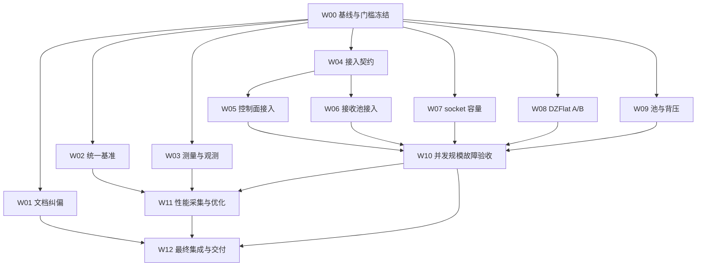

# 团队改造方案：性能证据闭环与 SHM 规模化

> 交付对象：cppipc_team 的 Team 队长及各任务负责人。
> 编制日期：2026-09-28。
> 状态：可用于派单的实施方案；尚未执行本方案中的代码改造和验收。
> 人员：不限制成员数量，按工作包扩展；人数不改变依赖顺序和评审门槛。
> 本方案依据当前源码与已有日志核对结果编制。队长开工时须重新固定代码版本，确认期间变更，避免重做已完成能力。

## 1. 队长首先需要知道的结论

本轮目标是把“线程规模受控”和“数据面延迟优化”分别做成可验证、可回滚的工程能力，再用统一基准评估与 CycloneDDS + iceoryx 的差距。

现有材料支持继续推进事件驱动接收池与 DZFlat，但不支持直接承诺“千订阅工程可用”“B 级零拷贝提升 14.3 倍”或“已经反超 iceoryx”。这些表述必须先修正：

| 原有判断 | 核对结果 | 对实施方案的影响 |
|---|---|---|
| `ipc_benchmark --compare` 的 DZFlat 是 B 级 loan-and-build | 当前基准传入已有 `TestMsg`，调用 `publish_blocking()`；内部 `loan → dzflat_write → publish_loan`，仍有容器到 chunk 的拷贝，属于 A 路径 | 为 A、B 分设测试项；不能将内部使用 loan 等同于应用就地构造 |
| 33.6 µs 可直接与 CycloneDDS 的 157.7 µs 比较 | 前者是同进程发布/订阅、消费侧忙等；后者是跨进程对照 | 先统一进程模型、等待方式、计时范围和消费工作 |
| 1000 订阅、33 线程证明规模已可用 | socket 探针使用同一 topic，日志存在注册失败，且 `sent=0`、`received_sub0=0` | 增加千个独立话题、全部注册成功及实际收发验收 |
| 两秒仅 10 次上下文切换 | 探针读 `/proc/self/status`，不是全体工作线程累计值 | 改为覆盖整个测量窗口的进程/线程组统计，明确退出线程处理 |
| SHM 已实现固定线程接收 | `shm_pub_sub_ipc` 当前仍创建握手线程和订阅线程 | 接收池与控制面调度器接入必须共同完成 |
| 延迟差距由拷贝决定，p99 都是环境噪声 | 现有结果没有隔离编解码、分配、等待、调度和排队成本 | 做分层测量和受控实验，不提前排除线程模型影响 |

参考证据：

- `test/ipc_benchmark.cpp`：`bench_shm()`、订阅消费循环及发送入口。
- `src/dzIPC/shm_pub_sub_ipc.cc`：`try_publish_dzflat()`、订阅线程创建点。
- `include/dzIPC/common/loaned_message.h`：A/B 路径契约。
- `include/ipc_msg/test_msg2/test_msg.hpp`：`dzflat_write()` 及字段复制。
- `test/perf/out/20260927_t6_probes/t6scale.cpp`、`test/perf/out/20260927_t6_scale/worker_1000.log`。
- `tmp/perf_match_64/`、`tmp/perf_match_1m/`、`tmp/iox_probe/`。

## 2. 目标、边界与完成条件

### 2.1 必须交付的目标

1. **证据可信**：同一套跨进程基准能区分 TLV、DZFlat A、DZFlat B、CycloneDDS 配置组合；报告保留原始样本、有效配置、代码版本和传输路径证据。
2. **SHM 规模闭环**：支持目标环境下 1000 个有效 SHM 订阅和独立话题场景；控制线程为进程级固定数量，接收线程按配置固定，而非每 route 扩张。
3. **语义保持**：消息顺序、分片重组、队列、adopt/chunk 生命周期、关闭、重建与 nodelet 快路径保持既有契约。
4. **大消息路径可用**：分别验证 A、B 的收益、限制、回退与背压；具备支持按场景选择路径的证据。
5. **容量边界可见**：注册失败、wait-set 溢出、池耗尽及兼容回退均可观测，不以静默失败或新增线程掩盖超限。
6. **可维护交付**：每阶段有可复现验收、独立评审和明确回滚操作。

### 2.2 范围划分

- 主线：SHM pub/sub 控制面与接收池接入、数据路径观测、统一基准和 DZFlat 优化。
- 配套线：socket 注册容量与高 fd 边界修复。它是本方案新增的独立工作线，不表示原《事件驱动线程池需求》的首批范围自动扩展。
- 保护性回归：已接入的 SHM ser/cli、socket ser/cli、socket pub/sub 及 nodelet；共享组件修改不得破坏它们。
- 可选线：裸 iceoryx/iceoryx2 本机基准、复杂调度、慢处理池。不能阻塞核心交付，也不能拿未运行的官方数据替代本机验收。
- 不在本轮范围：跨机传输重构、强制所有消息改为定容 POD、默认启用实时调度、无证据的大范围公共 API 改造。

### 2.3 必须继承的约束

遵循《事件驱动线程池需求》中的 API、队列、RouteSession、固定 route 归属和回退协议。重点包括：

- 不把用户 `get*` 或用户回调搬到接收 worker。
- 同一 route 保持单消费者和固定 worker，不能采用跨 worker 的 work-stealing；必须保护 `thread_local` 分片缓存。
- `recv` 与 `release/reset` 不并发；重建先禁止新 lease、唤醒旧 route、等待静默，再替换 generation。
- 注销后无悬挂 token、回调或队列投递；阻塞等待可以被关闭唤醒。
- 控制面 heartbeat 和死连接判定保持现有时间语义；不通过降低心跳频率制造空闲性能收益。
- 保留 TLV 兼容；A 是对象到共享段的一次复制，B 要求应用直接在借用内存中构造，两者不能混称。
- 容量/后端不可用时沿用显式兼容回退契约。目标规模的成功验收必须同时证明没有靠 per-route 回退线程完成。
- 若共享内存布局或 ABI 必须变化，单独提交版本与混合进程兼容设计；不得直接改变容量常量后假定旧进程可互通。
- 共享接收层以冻结接口契约及其勘误为接入依据：`ipc-transport-phase5-shared-wait-layer-contract-99ff82a0f9af.md` 和 `ipc-transport-phase5-shared-wait-layer-contract-errata-d8f45cfa45bb.md`。与早期方案的简化描述冲突时先按勘误解释，仍无法消解的冲突由共享层负责人和队长形成书面裁决。

## 3. 团队组织与协作方式

队长负责接口裁决、派单、依赖解除、集成与最终验收；每个工作包指定一位负责人及一位独立评审者。可配置多人实现或测试，但必须保持单一负责接口。

建议角色：架构负责人、基准负责人、测量统计负责人、SHM 生命周期负责人、控制面负责人、接收池负责人、DZFlat 负责人、容量与背压负责人、socket 负责人、并发测试负责人、性能测试负责人、集成负责人和文档负责人。成员可以兼任，自己的实现不得由自己作为唯一验收者。

共享目录协作规则：

1. 开工先读取共享上下文；未知既有决策先向队长询问，不重复建立互相冲突的协议。
2. 成员通过 `member_send_message` 提交接口需求、阻塞和范围冲突；完成后的第一个动作是 `member_report_result`，回报后按团队约定执行 `/compact`。
3. 同一文件同一时段只设一个写入负责人，尤其是 `shm_pub_sub_ipc.cc`、共享池头文件及构建配置；其他成员提交接口说明或独立补丁供其集成。
4. 基准开发可以并行；正式性能采集必须由一个调度负责人独占测试窗口，禁止多成员同时压测。
5. 合并必须引用工作包编号、基线提交、依赖版本、原始结果目录和评审结论；不能只报告“本地通过”。
6. 工具不可用时记录具体缺失能力和未执行动作，向队长交付可读结果，不伪报回报或压缩已完成。

## 4. 工作包与交付标准

### W00：基线与决策冻结（P0，队长/架构/集成）

- 固定起始提交、工作区差异、构建参数、工具链、依赖版本和实际加载库路径。
- 逐项确认当前组件是“已有实现”“模块已接入”还是“集成验收通过”，以调用路径与运行证据为准。
- 确定性能测试机、CPU 拓扑、资源限额、主测试配置和目标规模。
- 冻结指标定义、非回归门槛及容量失败语义；尚未定稿的指标允许采基线，不允许宣称最终验收通过。
- 交付：基线清单、接口责任表、指标门槛表、依赖图。验收：实现和测试负责人共同签认同一基线。

### W01：性能文档纠偏与证据归档（P0，文档/独立审核）

- 修正 A/B 标注、同进程与跨进程比较、千订阅可用性、上下文切换口径和过度归因。
- 摘要使用配对轮次数据，区分观测值、推测和待验证项；不再混合不同速率和轮次生成“胜负”。
- 修正 epoll 的 512：它是单次返回事件数，不是注册对象总容量；核验 iceoryx/iceoryx2 Listener 线程归属等机制描述。
- 外部结论固定版本或提交及来源；本机启用配置、实际 SHM 传输、零拷贝分别举证。
- 将临时日志的必要证据纳入持久归档；保留历史报告及纠正说明，不覆盖原始样本。
- 交付：修订报告、证据索引、未决事实列表。验收：每个数值能回溯到原始结果，每个机制判断有代码或版本化来源。

### W02：统一跨进程基准（P0，基准/数据适配）

- 统一父进程编排与独立发布/订阅进程、启动握手、预热、定速/满速运行和正常退出。
- 适配 TLV、DZFlat A、DZFlat B、CycloneDDS + iceoryx 配置组合；默认使用同一逻辑载荷，记录实际应用字节与传输字节。
- 为传输完成、应用获得对象/视图、完整载荷消费设独立指标，不混用结束点。
- 只读时间戳、全量读校验、原地构造是不同工作负载；每组比较必须执行等价的生产/消费工作。
- 阻塞事件驱动为主对照；忙等单独列组并报告 CPU，不跨组宣称胜负。内部等待策略无法对齐时明确标签。
- 输出逐样本延迟、收发序号、失败/丢失/重复/乱序、实际发送速率、队列策略、路径计数和运行元数据。
- 定速使用独立于接收完成的发送计划；记录迟发、积压和 publish 阻塞，防止系统越慢、负载反而越低而改善统计。
- 交付：可维护基准源代码、启动脚本、结果格式说明、小规模正确性用例。验收：跨进程身份可核验、计时边界一致、异常消息和发送失败不被静默排除。

### W03：测量口径与路径观测（P0，测量/平台）

- 单机跨进程采用一致的单调时钟；明确时间戳写入位置和计时本身的成本。
- CPU 统计注明发布进程、订阅进程、守护进程及总量；CycloneDDS/RouDi 的服务成本不能无说明地遗漏。
- 上下文切换优先使用能覆盖线程组整个生命周期的工具；若只能逐 TID 采样，必须处理新生/退出线程或将结果标为不完整，不能把 `/proc/self/status` 当全进程合计。
- 空闲观测覆盖周期任务，稳定窗口建议至少 60 秒；线程启动峰值、稳定活动线程、空闲回落分别统计。
- 为 DZFlat A/B、TLV、回退原因、注册失败、wait-set 满、chunk 申请失败和队列淘汰定义低开销计数。
- CycloneDDS 按固定版本检查类型、QoS、传输配置、实际路径。组合包加载和 RouDi 存在只证明依赖，不证明每条消息零拷贝。
- 交付：采集器、字段定义、路径证据、观测开销对照。验收：已知线程活动可被正确计入，路径证据不足的实验明确标注“未确认”。

### W04：SHM 接入契约复审（P0，生命周期/并发评审）

- 复用已有 RouteSession、wait-set、worker 和收包分流组件，先审查接口与现有模块调用，不重新设计同功能体系。
- 固定注册、注销、关闭、generation 切换、控制 tick 与接收 lease 的完整状态转换及锁顺序。
- 明确无数据、断开、部分分片、预算耗尽、空闲退出及重新激活时的行为。
- 审核固定哈希下每 worker 的容量偏斜；总容量充足不等于每个分片都不会满。
- 交付：状态/所有权说明、接入接口、竞态测试清单。验收：生命周期与等待层独立评审通过，解除 W05/W06 的共同前置依赖。

### W05：控制面调度器接入（P0，控制面）

- SHM pub/sub 发布端与订阅端接入进程级 `ShmControlScheduler`，替换对应 per-route 控制线程。
- 保持 subscriber heartbeat、publisher owner heartbeat、stale 检查与 generation 重建语义。
- 使用有生命周期保障的状态对象与同步注销，不保存可能析构的裸对象指针。
- 单个慢 tick 不能无界阻塞所有 route；记录 tick 延迟和扫描耗时，评估千路状态下是否按期服务。
- 交付：模块接入、特性开关/回滚说明、控制面回归。验收：千个发布/订阅组合下线程数固定，重连、死亡检测、注销无回调泄漏。

### W06：SHM pub/sub 接收池接入（P0，接收池）

- 将兼容订阅线程的数据处理接入固定 worker，保持同 route 单消费者、分片缓存亲和与已有分流函数。
- 配置消息数、字节数、处理时间预算；预算耗尽后必须保留或重新发现仍就绪的 route，不能依赖下一次新消息才继续排空。
- 验证动态 add/remove、消息与断开唤醒、旧 generation token 失效，以及 idle worker 退出后的安全重新激活。
- 容量满或后端不可用显式报告兼容回退。验收模式必须能检测回退，不能用回退线程掩盖固定线程目标失败。
- 不在未完成 lease/静默协议前移除外层同步。
- 交付：接收池接入、预算配置、回退观测和竞态回归。验收：W05+W06 集成后千路收发与固定线程目标同时满足。

### W07：socket 容量与高 fd 修复（P0，socket/注册控制面）

- 分开定位注册表容量与 fd 越界，不以线程数下降替代有效注册验证。
- 梳理仍使用 `select/FD_SET` 的数据和控制路径；迁移至能处理目标 fd 的机制，评估 `poll` 或现有事件后端。
- 容量调整同时检查共享布局、版本兼容和资源预算；注册失败必须可识别、可恢复或明确拒绝。
- 测试主动预占 fd、高于 `FD_SETSIZE` 的实际收发、容量边界和恢复。
- 交付：独立补丁、注册结果观测、边界回归。验收：千路有效注册并收发，高 fd 不崩溃，原 socket 模块回归通过。

### W08：DZFlat A 推广与 B 专项验证（P1，DZFlat/应用适配）

- A：验证支持类型和 schema 下直接写 chunk、接收借样的正确性与收益；保留旧对象接口及 TLV 回退。
- B：新增显式 `loan → 应用原地构造 → publish_loaned` 的跨进程测试，不用内部 `loan()` 调用代替 B 路径证据。
- 分别记录对象预先构造、每消息新构造、完整载荷消费成本；B 可以避免复制，但应用填充/读取大载荷仍需时间。
- 不预设“≥64 KiB 自动使用 B”；B 迁移需要生产者改变构造方式。A 的默认启用范围由类型兼容与负载扫描决定。
- 验证贷款失败、超预算、发布失败、持样跨生命周期以及回退清理；明确 B 失败时应用的处理契约。
- 交付：A 启用策略、B 适配示例、正确性回归和路径对照。验收：A/B 标记与实际拷贝路径一致，收益可复现且不破坏兼容消费。

### W09：chunk 容量、队列与背压联动（P1，内存/容量）

- 确认尺寸档位实际共享范围、可用块数、各队列持样上限和 chunk 归还点。
- 按同时在途的不同 chunk 数预算容量：发布者未提交贷款 + 队列/应用持有的不同 chunk + 并发余量；广播共享 chunk 不能简单按订阅者重复计数，但慢消费者会延长保留时间。
- 覆盖多发布者、慢消费者、队列淘汰、adopt 上限和尺寸档竞争；给出目标负载的配置说明。
- 池耗尽的策略必须明确：沿用回退、有限等待、拒绝或丢弃分别何时适用；改变既有默认语义需单独评审。
- 区分 A/TLV 发送回退与 B 贷款失败，不假定所有失败都能自动转为 64 B 分片。
- 交付：容量模型、配置及兼容设计、计数、压力测试。验收：目标负载无非预期回退，超载时内存有界、计数准确、chunk 最终归还。

### W10：并发、规模与故障验收（P0，独立测试）

- 按第 6 节矩阵执行模块和端到端测试，覆盖千路注册、收发、关闭、重建及长期运行。
- 针对丢唤醒、旧 token、分片线程迁移、注销回调、热路饥饿和池耗尽编写有明确失败判定的用例。
- 共享内存多进程竞态不能只依赖线程 sanitizer 判断；结合状态断言、故障注入、超时保护和进程级行为证据。
- 交付：机器可读结果、失败复现脚本、独立评审。验收：无未解释失败、死锁、悬挂引用和资源泄漏。

### W11：性能优化与对照报告（P1/P2，性能/统计）

- 在 W02/W03 通过且待测版本正确性通过后，串行采集配对实验。
- 先做 TLV/A/B 数据路径扫描，再做 worker 数量、消息/字节/时间预算扫描；一次实验只改变预注册的变量。
- 小消息关注唤醒和排队，大消息关注编码、分配、复制和完整消费；不拿空闲 CPU 结果推断活跃延迟最优。
- `SCHED_FIFO`、绑核、忙等和 NUMA 放置作为独立实验变量，不能只给一方特殊待遇。
- 交付：可复现优化配置、置信区间/轮间离散度、吞吐与延迟及 CPU 权衡报告。验收：全部性能表来自可比配置；未测项保留明确空白。

### W12：集成、回滚与队长交付（P0，集成/文档）

- 分阶段合并，确保控制面、接收池、DZFlat 策略和容量变更能分别定位与回退。
- 遵守冻结契约禁止运行中切换接收后端的约束，按启动配置选择和重启回滚。动态热切换不属于本轮任务；若未来确需支持，须先变更冻结契约并另立设计与验收工作包。
- 公共 API/ABI、共享内存布局与混合版本行为形成独立检查记录。
- 交付最终方案实现映射、运行手册、性能报告、已知限制、问题归属和回滚演练结果。
- 验收：队长及独立测试/评审共同签认，不以单个性能提升数值替代整体验收。

## 5. 依赖与集成顺序



- 第一批可并行派单：W01、W02、W03、W04、W07、W08、W09；W00 先冻结各自必须依赖的基线与字段。
- W05/W06 可在接口冻结后并行开发，但共享文件由单一集成负责人写入；按原需求阶段先完成控制面独立验证，再启用接收池组合。
- W10 测试开发从第一批开始，图中依赖表示正式验收时点，不要求测试人员等待全部实现结束。
- W11 可提前采旧版本基线；新版本正式成绩必须绑定已经通过正确性验收的提交。
- W08/W09 共同决定 DZFlat 默认策略，不能先默认启用后补容量说明。
- 不承诺固定日历工期。队长在基线和接口评审后根据实际缺口估时，使用门槛解除而非人手数量推进关键依赖。

## 6. 验收矩阵与判定规则

### 6.1 功能与规模

| 维度 | 必测条件 | 通过条件 |
|---|---|---|
| 有效规模 | 1/100/1000 个独立话题；同话题多订阅另测 | 每个预期端点注册成功，每条 route 实际收发；记录失败及回退数 |
| 控制面规模 | 1000 个发布者/订阅者组合；有 peer/无 peer | heartbeat、死亡检测语义保持，线程数为进程级固定规模 |
| 接收规模 | 固定 worker 配置；稳定活跃与静默状态分别测 | 无 per-route 接收线程增长；目标配置中无容量回退 |
| 有序交付 | 唯一序号、完整负载校验、小消息及多片大消息 | 在无预期淘汰/超载的可靠测试中无丢失、重复、乱序或损坏 |
| 过载语义 | 队列满、慢消费者、池耗尽、发送超时 | 行为符合既有/批准的策略，全部失败和淘汰可核算，内存有界 |
| 公平性 | 1 热+999 冷、多热路、哈希偏斜 | 冷路持续获得服务；延迟满足冻结门槛；预算耗尽不会丢就绪状态 |
| 生命周期 | 并发注销/收包、重建、发布者重启、异常退出 | 无死锁、悬挂回调、旧 generation 投递；受控时间内关闭与恢复 |
| 池生命周期 | 借样持有、adopt 超额、淘汰、失败退出 | 配额一致，正常释放后占用回到可解释基线 |
| 能力边界 | wait-set 不支持/容量满、注册满、高 fd | 显式失败或兼容回退，诊断明确，无静默忙等或越界崩溃 |
| 兼容性 | TLV/DZFlat 混合、schema 不匹配、nodelet、既有 ser/cli | 原 API 和队列契约保持，不引入旧路径回归 |

“1000 订阅通过”必须同时满足注册、收发、资源、生命周期四项，不能只有构造对象或线程统计。长时间测试中允许的丢弃必须对应已批准策略和计数，不能把丢消息全部归为性能现象。

### 6.2 性能实验协议

- 消息尺寸至少覆盖 64 B、1 KiB、64 KiB、1 MiB；更大尺寸根据业务与可配置容量单独列组。
- 负载至少覆盖 1000 Hz 小消息、500 Hz 大消息、吞吐饱和扫描及静默状态；记录实际发送率，不能仅列命令行目标值。
- 普通系统环境和受控性能环境分开。受控组记录 governor、P/E 核类型、SMT、亲和性、NUMA、系统负载及温度/频率条件；14900KF 不能仅用“同 CPU”代表同核能力。
- 每个主要对照建议至少 5 轮，交替或随机执行双方顺序；保留每轮结果，不只挑最好一轮。
- p99.9 主要验收组建议累计至少 100 万个有效样本并保留逐轮统计；样本不足时不发布稳定尾延迟结论。max 作为观测值，不当作最坏延迟保证。
- 空闲窗口建议至少 60 秒，稳态主场景至少 30 分钟；高风险关闭/重建循环建议不少于 1000 次。具体采样预算可按业务调整，但需在正式采集前冻结并说明理由。
- 输出 p50/p99/p99.9、吞吐、CPU、线程、上下文切换、fd、内存/池占用、队列深度、丢失/失败与回退；吞吐报告注明接收吞吐还是发送尝试量。
- 官方 iceoryx 数字只作背景，不能参与本机胜负判定。路径未知的 CycloneDDS 结果只能称为对应配置组合结果。

### 6.3 数值门槛冻结

以下表格是队长在 W00/G0 填写并签认的交付门槛。不得在看到优化结果后调整门槛来制造通过。

| 指标 | 冻结方式 |
|---|---|
| SHM 接收线程 | 固定 `N_worker`；总线程分别列控制、主线程、基准和其他服务线程，不硬编码为 33 |
| 千路容量 | 目标主机、资源预算与固定 worker 数下全部注册成功，兼容回退为 0；超出边界另测 |
| 空闲 CPU/切换 | 指定统计范围与绝对预算，基于修正后的旧版本基线设改善目标；不沿用未确认的 225 倍 |
| 延迟/吞吐非回归 | 优先采用产品 SLA；无 SLA 时先采基线并登记允许变化和噪声处理规则，再冻结 |
| 关闭/恢复 | 指定关闭和重建的超时上限、失败条件及重试策略；保持既有心跳/死亡判定语义 |
| 内存/fd | 按规模给出最大可接受值和增长模型；线程 O(1) 不代表 route 状态、队列、fd 或扫描成本 O(1) |
| DZFlat 默认策略 | 符合类型兼容、目标负载无非预期回退且收益稳定；不以任意消息大小作为 B 自动切换依据 |

指标未冻结、样本不足或路径未确认的项目标记“待验收”，不能计入全部完成。

## 7. 阶段门槛与回滚

| 门槛 | 必须完成 | 不通过时的处理 |
|---|---|---|
| G0：可测量 | 基线、接口责任、指标定义、数值门槛及测量工具验证 | 继续补基线/修测量，不发布性能结论 |
| G1：可安全接入 | RouteSession、token、注销和重建协议评审及竞态测试 | 保留兼容路径，不移除旧同步 |
| G2：SHM 规模闭环 | 控制面+接收池共同通过千路有效收发与故障矩阵 | 回滚未通过组件，禁止标记 SHM 规模完成 |
| G3：数据面策略成立 | A/B 分测、容量和背压验证、受控性能证据 | 保持显式启用，暂不修改默认策略 |
| G4：完整交付 | socket 独立线、保护性回归、长期测试、报告及回滚演练 | 按工作线标记完成/未完成，不用其他收益抵销失败 |

回滚须记录开关/配置、适用提交及重启要求；共享内存布局变化需说明旧段处理和混合版本行为。禁止用全局删除共享内存、终止无关进程等方式获得“干净测试”；只清理本次运行拥有的对象。

## 8. 交付物与成员回报模板

建议在本目录建立 `团队改造交付/`，由集成负责人统一管理文档；性能工装进入可维护的测试目录，不能长期依赖仅在 `tmp/` 中存在的探针。

最终交付至少包括：

1. `基线与门槛.md`：版本、环境、范围、冻结指标及签认记录。
2. `接口与生命周期.md`：所有权、状态转换、锁顺序、容量及兼容协议。
3. `任务看板.md`：W00—W12 的负责人、评审者、依赖、状态及产物链接。
4. `验收报告.md`：功能、规模、故障、长期运行及保护性回归结果。
5. `性能对照报告.md`：可比配置、原始样本索引、逐轮结果、限制及优化依据。
6. `运行与回滚.md`：启用配置、容量预算、异常诊断、兼容回退与回滚步骤。
7. 原始结果目录：运行清单、命令参数、有效配置、代码/二进制标识、CSV/JSON、stdout/stderr 和失败复现记录；过大文件可以外部归档，但需校验和及访问路径。

成员回报统一包含：

```text
工作包：Wxx
状态：完成 / 进行中 / 阻塞 / 待验收
基线与提交：
变更范围：
依赖及接口变化：
验证命令与结果目录：
通过的验收项：
失败、未测和残余风险：
评审者与评审结果：
回滚方法：
需要队长裁决的事项：
```

## 9. 可直接用于首次派单的队长指令

以本方案为实施边界，先执行 W00 固定基线、指标和文件责任；并行启动文档纠偏、统一跨进程基准、测量观测、SHM 接入契约、socket 容量、DZFlat A/B 及池背压工作包。测试成员同步开发验收工装。

已有基础组件优先复用，接入不等于验收完成。SHM 接收池和控制面调度器共同通过千路实际收发后，才能报告规模闭环。所有性能结论绑定同一口径与原始结果，不承诺沿用 14.3 倍、225 倍或固定 33 总线程数。

队长按 G0—G4 解除依赖并组织独立评审；正式性能运行串行调度。最终交付实现、验证、运行回滚资料及明确的未完成项，供后续产品启用决策使用。

## 10. 深化审查：实现前必须补齐的约束

本节来自对冻结契约和当前共享层源码的进一步核对，属于各工作包的验收补充，不是可忽略的优化建议。发现实现与注释不一致时，以可复现行为和队长裁决收敛，不能仅凭注释认定通过。

### 10.1 区分三种“空闲”（W03/W06/W10）

当前 `RecvWorker::Impl::loop()` 只有持锁确认 `routes.empty()` 且无 deferred 项时才允许线程退出。有效 route 仍在册但没有消息时，worker 继续承担等待职责。

必须分别测试：

| 状态 | 预期行为 | 必须记录 |
|---|---|---|
| 没有注册 route | keep-alive 到期后可退出，下次注册可重新拉起 | 在册 route 数、线程退出/拉起计数 |
| 已注册但无发布者或尚未连接 | 按模块生命周期契约决定是否已加入等待层 | 应用对象数、控制项数、worker route 数，不能只数对象 |
| 已连接、有效订阅但停止发布 | 保留接收能力；后续恢复发布不依赖重新注册 | 静默前后 route 数、恢复后首包延迟、是否丢包 |

增加“连接成功 → 收到确认消息 → 静默超过 keep-alive → 原发布者恢复发送”的强制用例。不能把未接入等待层时的少线程/低 CPU 用作千个有效订阅的空闲成绩。上述源码证据针对 SHM worker；socket 的对应行为应独立核验。

### 10.2 固定线程并不意味着常数处理成本（W03/W06/W11）

当前 `collect_pending()` 遍历 worker 的在册 route，读取 sequence 并建立 deferred 队列；`consume_ready()` 的结果并非唯一事实来源。该设计用于避免漏就绪，不能在没有替代正确性证明前删除扫描。

测量必须增加：每轮扫描 route 数、扫描耗时、等待超时次数、有效就绪比例、deferred 深度，以及这些指标随 route 数量的变化。低开销常驻计数与详细诊断采样分开，性能报告注明诊断是否开启。

先验证“事件后/超时后的有界重检”是否成为瓶颈，再评估减少冗余扫描或延长等待。延长等待必须证明消息、断开和注销均有可靠唤醒。禁止把它误改为持续全量 `try_recv()` 轮询，也禁止仅为降低 CPU 而牺牲恢复延迟。

### 10.3 时间预算不能抢占一次耗时收包（W04/W06/W10/W11）

冻结契约的预算在完整 `recv_once()` 返回后检查。若一次分片组装或解码耗时超过 200 µs，配置 200 µs 预算并不能保证 worker 在 200 µs 内让出。

- 单独记录 `recv_once` 耗时和预算超额，测“大消息热路 + 小消息冷路”落在同一 worker 的情况。
- 部分分片到达后暂停发送，验证该 worker 上其他 route 的服务延迟，不能只测空队列无数据时的快速返回。
- socket 的 `readable()` 只能避免第一次空读；它不能自动保证整条分片消息后续数据立即到齐。
- 若一次调用造成不可接受的队头阻塞，先上报底层接口限制。非阻塞增量重组、独立接收通道或有界慢处理池都属于需单独评审的选择，不能在模块适配器里隐式改变缓存与顺序契约。

### 10.4 共享池配置只初始化一次（W00/W04/W05/W06）

SHM pub/sub 与已有 SHM ser/cli 使用进程级共享池时，必须明确哪一处负责首次初始化、worker 数和预算读取。不能让模块加载顺序决定最终配置，也不能由单个模块析构调用进程级 `stop()`。

- 共享池负责人定义配置来源和重复 `start()` 参数不一致的处理方式；沿用冻结 API 或追加兼容接口，不静默重分片。
- 混合进程测试同时创建 SHM pub/sub、SHM ser/cli 与 socket 模块，核对进程内实际池实例和线程数。
- 逐个销毁模块，其他模块继续收发；最后进程退出时不得因析构顺序引用已销毁的池。
- “固定 N”必须注明每个后端池及其总量，不能把同时存在的 SHM 与 socket 两组池统计为一组。

### 10.5 容量边界与配置兼容不可后补（W04/W07/W09）

SHM 等待层当前每 worker 最多 127 个 token；`127 × worker_count` 仅是容量上界，不是固定哈希分布下任意 route 集合都可接入的保证。

- 增加同一 worker 上第 126/127/128 个 route 的边界测试，以及确定构造的哈希偏斜测试。
- 不通过运行中增大 worker 数改变取模归属；若默认配置需增加容量，作为启动配置验证并报告内存/线程成本。
- 同话题多订阅若共享 hash key，会集中到同一 worker；与独立话题规模分别给结果。
- 共享内存池的容量配置必须跨进程一致或具备可验证的协商/版本拒绝机制。仅将编译期常量改成各进程环境变量可能产生不兼容段或不同池，不能视为配置化完成。
- 控制项、route、等待 token、fd 和 chunk 的容量分别列账；其中一项满时要能定位首个失败资源。

### 10.6 构建与路径“假通过”防线（W00/W02/W10/W12）

冻结契约已要求正式验收先重新运行 CMake 配置再编译。原因是构建文件存在配置期收集源文件，陈旧 build 可能保留已删除实现或漏掉新增文件。

- 正式运行记录重新配置/编译命令、源码提交及未提交差异、可执行文件和动态库标识；必要时使用独立构建目录。
- 记录运行进程实际加载的库，不能只检查构建目录中文件存在；检查关键新适配器是否进入目标库。
- 清理继承的强制兼容/worker 数环境变量后，按测试清单显式设置本组值；保留有效配置。
- 开启 worker 组必须有 route 成功归属、实际 worker 收包及回退为零的证据；没有错误日志不等于 worker 已启用。
- 实验端点使用独立 topic/domain/运行编号，防止历史进程或 nodelet 快路径混入 SHM 对照。

### 10.7 消费语义与零拷贝实验必须对齐（W02/W08/W11）

为防止“只读一个时间戳的视图”与“完整对象解码/克隆”的不对称比较，设置三个独立实验组：

| 实验组 | 计时内容 | 可回答的问题 |
|---|---|---|
| 传输机制 | 获得可用载荷视图/对象至最小头部确认；列明各实现不可避免的处理 | 通知与交付路径开销是多少 |
| 完整读取 | 从发送计时点到消费端遍历并校验全部载荷 | 业务实际读取大消息时能节省多少 |
| 生产到消费 | 从每条消息的新数据生成/填充开始，到完整消费结束 | A/B 构造接口变化的端到端收益是多少 |

不能将第一组称为完整应用端到端延迟。每条消息使用可校验的数据模式或序号相关校验，避免重复使用固定载荷掩盖旧帧和内容损坏。

DZFlat 视图队列和对象队列的 `get*` 接口要各测其原有契约。性能脚本不得静默改变消费者接口而在报告中标为完全相同工作量。

### 10.8 性能准入与优化优先级应分开（W00/W11/W12）

P0/P1 表示执行优先级，不代表所有优化都必须成为默认配置。正确性与兼容问题必须修复；性能优化若收益不稳定，可以保留显式配置或拒绝合入，并记录理由。

非回归门槛需同时写明绝对变化、相对变化、轮间噪声处理和重复验证规则。例如，低微秒基线不能仅用百分比判定，也不能无限重跑直到偶然通过。产品没有既定 SLA 时，由队长依据 W00 基线冻结具体数字；报告不得保留空门槛却宣称最终验收完成。

任何优化都不得用减少实际成功接收量、延后计时起点、忽略慢样本或放宽消费者工作来制造收益。出现不一致时先调查测量和路径，再讨论调参。

### 10.9 对派单方式的补充要求

人数不限，但不建议多人直接同时修改同一个大源文件。W05、W06、W08 在 `shm_pub_sub_ipc.cc` 的交集由一个模块集成负责人串行落地；各工作包可以并行提交状态机、适配器接口、测试、基准和分离模块补丁。

独立评审者重点反证四件事：有效订阅是否真的存在、预期路径是否真的执行、故障场景是否真的触发、统计是否真的覆盖整个系统。最终报告必须区分“功能已实现”“模块已接入”“独立验收通过”“默认配置已启用”四种状态。

## 11. 实施状态分级与证据准入

工作包状态按下面的等级记录。等级只能逐级提升，不能用更高等级的描述覆盖缺失的前置证据。

| 等级 | 名称 | 最低证据 | 允许使用的表述 |
|---|---|---|---|
| S0 | 未核对 | 只有设计或口头结论 | “计划要求” |
| S1 | 源码存在 | 具体文件、符号、配置入口和代码版本 | “已有实现” |
| S2 | 模块已接入 | 真实调用点、运行日志中的路径标识、构建产物指纹 | “已接入模块” |
| S3 | 单项验证通过 | 可复现命令、通过条件、原始日志和失败计数 | “该用例通过” |
| S4 | 独立验收通过 | 非实现者复核、完整矩阵、基线对照和未决项清单 | “通过独立验收” |
| S5 | 默认启用 | S4 通过、回滚演练、兼容矩阵和发布配置签认 | “默认配置已启用” |

以下事实必须分别登记，不能从一项事实推导另一项事实：

- 构建目标包含新源文件，不等于运行进程加载了该库；
- 日志出现 worker 编号，不等于所有预期 route 都成功注册；
- 注册成功，不等于 route 收到并交付了有效序号；
- 使用 `loan`，不等于应用完成了 B 路径的原地构造；
- 单次 `ctest` 全绿，不等于规模、长期运行和关闭重建通过；
- 兼容回退可用，不等于固定线程目标满足。

每个工作包的看板至少增加以下字段：`当前等级`、`证据索引`、`独立评审者`、`阻断项`、`回滚提交/配置`、`下一等级缺口`。缺少证据索引时只能记为 S0 或 S1。

## 12. 证据目录、指纹与机器可读清单

正式运行采用一次运行一个目录的方式，目录名包含日期、运行编号和工作包，例如：

```text
artifacts/perf/20260928-r01-W02/
├── manifest.json
├── command.txt
├── source-status.txt
├── build-config.txt
├── binary-fingerprint.txt
├── environment.txt
├── topology.json
├── samples.csv
├── counters.json
├── stdout/
├── stderr/
└── verdict.md
```

`manifest.json` 至少包含以下字段。字段为空时写 `null` 并在 `verdict.md` 说明原因，不允许省略后假定未知项已满足。

```json
{
  "run_id": "20260928-r01-W02",
  "work_package": "W02",
  "source_revision": "<git commit>",
  "working_tree_clean": false,
  "build_dir": "<absolute path>",
  "binary_sha256": {"publisher": "<sha256>", "subscriber": "<sha256>", "library": "<sha256>"},
  "loaded_library_paths": ["<absolute path>"],
  "transport": "shm|tlv|dzflat-a|dzflat-b|cyclonedds-iox",
  "process_model": "cross-process",
  "topic_count": 1000,
  "unique_topic_count": 1000,
  "worker_count": 32,
  "fallback_count": 0,
  "registered_count": 1000,
  "valid_rx_count": 1000,
  "sample_count": 1000000,
  "config_hash": "<sha256 of effective config>",
  "result_files": ["samples.csv", "counters.json"]
}
```

运行前必须保存 `git status --short`、重新配置和编译命令、实际环境变量、CPU 拓扑、加载库路径及配置哈希。结果目录采用只追加策略；重跑生成新目录，不能覆盖旧日志或只替换汇总表。若代码、编译器、共享库、配置、topic/domain 或测试脚本发生变化，必须新建 `run_id`。

建议把每条消息的样本字段固定为：运行编号、生产序号、发送时间戳、传输完成时间戳、应用获得时间戳、完整消费时间戳、route 标识、generation、路径（TLV/A/B）、载荷校验、重试/淘汰标记。汇总表同时给出有效样本数、丢失、重复、乱序、损坏、迟发和 publish 阻塞数。任何过滤都记录过滤原因和过滤前计数。

“通过”由机器判定文件和人工复核共同组成。`verdict.md` 必须逐项引用原始文件及行号/JSON 字段；只写“日志正常”“没有报错”不能作为路径或规模证据。

## 13. 千路 SHM 测试编排

### 13.1 拓扑和阶段

每次运行只选择一个拓扑，禁止把不同拓扑的结果合并成一个规模数字：

| 拓扑 | 用途 | 必须证明 |
|---|---|---|
| 1 个独立话题 | 正确性基线 | 序号、负载、关闭和重建正确 |
| 100 个独立话题 | 中等规模 | 注册、固定归属、无回退 |
| 1000 个独立话题 | 目标规模 | 每个端点有效收发、资源和生命周期均通过 |
| 1 话题多订阅者 | 广播保留语义 | 共享 chunk、慢消费者和队列策略 |
| 1 热 + 999 冷 | 公平性 | 冷 route 不因热 route 预算耗尽而长期饥饿 |

每个拓扑按以下阶段执行并分别记录计数：准备（清理本运行拥有的对象并核验无历史端点）、注册、握手确认、预热、定速测量、静默、恢复发送、并发关闭/重建、资源回收。只有收到每个 route 的明确确认并完成首条有效序号校验后，route 才计入“有效订阅”。

发送计划独立于接收结果。记录计划发送数、实际尝试数、publish 阻塞数、成功交付数和接收完成数；接收变慢导致发送量下降时，该轮标记为负载未达标，不能当作低延迟成绩。

### 13.2 规模通过条件

千路运行必须同时满足：

1. `registered_count == expected_count`，并逐 route 记录注册结果；
2. `valid_rx_count == expected_count`，每个 route 至少收到规定数量的序号并完成载荷校验；
3. `fallback_count == 0`，且 wait-set 满、token 无效、chunk 耗尽和队列淘汰均有独立计数；
4. worker、控制调度器和测试编排线程数量符合冻结配置，不能通过额外 per-route 线程补齐；
5. 关闭和恢复在冻结超时内完成，旧 generation 没有投递到新对象；
6. 测试结束后 route、token、fd、队列和 chunk 占用回到可解释基线。

任一条件不满足，该轮只能标为“规模试验失败”，仍可保留用于定位，但不能写入“1000 订阅可用”或性能胜负表。

### 13.3 容量与失败归因

在运行前根据实际配置计算并保存容量表：控制项、route、worker token、fd、各尺寸档 chunk、每个队列的样本/字节上限及并发余量分别列出。对固定哈希归属，额外报告每个 worker 的 route 数、token 数和最大偏斜；总容量满足 `127 × worker_count` 不能替代分片边界测试。

失败日志统一归为以下类别，并在 `counters.json` 中保留首个失败资源：`registration_rejected`、`wait_token_invalid`、`wait_set_full`、`fd_limit`、`chunk_exhausted`、`queue_backpressure`、`generation_mismatch`、`fallback_activated`、`publish_blocked`、`rx_timeout`。同一失败既计入具体类别，也计入该轮未通过判定，不能只保留总失败数。

### 13.4 最小复现和回滚

规模失败后先用相同 source revision 和配置缩小到 1/100 路复现，再改变一个变量：worker 数、topic 归属、消息尺寸、消费者速度或池容量。每次变更生成新的运行目录并保留配置哈希。确认是容量或后端能力问题时，按 W05/W06/W07/W09 的回退协议回到启动时选择的兼容路径；不得在运行中偷偷增 worker、切后端或删除共享内存来获得通过。

## 14. 正式运行清单与交付前签认

### 14.1 运行前

- [ ] W00 基线、代码版本、工作区差异、工具链和依赖已签认。
- [ ] 采样窗口、消息尺寸、速率、消费者工作量、worker/预算配置已冻结。
- [ ] 运行目录、topic/domain/run_id 已隔离；清理范围仅覆盖本运行拥有的对象。
- [ ] 已重新执行 CMake 配置并记录实际加载库；继承的兼容环境变量已显式清理或登记。
- [ ] 已确认独立话题数量、预期 route 数和注册确认协议。

### 14.2 运行后

- [ ] 原始 stdout/stderr、逐样本数据、计数、配置和指纹齐全。
- [ ] 发送尝试量、有效接收量、丢失/重复/乱序/损坏和回退数可互相核算。
- [ ] 结果按拓扑和实验组分开；未达负载或路径未确认的轮次未进入汇总。
- [ ] 至少一位非实现者复核了路径证据、容量失败和关闭/重建日志。
- [ ] 失败项有复现命令、归属工作包、临时回滚配置和下一步责任人。

### 14.3 队长最终签认

队长在报告首页填写以下四行，缺一行则交付状态为“待验收”：

```text
功能与规模等级：S0/S1/S2/S3/S4/S5
性能结论覆盖的 run_id：
未决事实与已知限制：
批准默认启用的提交/配置及回滚入口：
```

性能数字只能引用列出的 `run_id`；外部报告、历史日志和官方 iceoryx 数字放在背景区，不得混入本机通过判定。实现、接入、验收和默认启用的状态若不一致，按最低等级对外报告。

#### 14.3.1 签认（2026-09-30，队长填；**append-only，原模板四行逐字保留在上**）

> 依据：`团队改造交付/W12/最终交付报告.md`（队长出具）。⛔ 本签认**不重开** `t11`（`failed`）与 `t14`（`needs_revision`）的历史终态；二者未闭合项经 R0–R7 与 t40–t56 以**增量结案**方式逐项收口或如实保留。

```text
功能与规模等级：S3
  依据：实现与接入均已完成（W05/W06/W07/W08/W09 全部入库）；W01/W02/W04/W06 经 R1 独立复核
        PASS（W02 由 t48 增量 verdict 闭合）。
  ⛔ 按最低等级对外报告：W04/W05/W06/W07/W08/W09/W11 的 S4 独立验收【未做】；
     W10 规模结论为「实质能力成立、§13.2 六条【未闭合】」；G2/G4【未关闭】。
  ⛔ 不得声称 S4/S5。

性能结论覆盖的 run_id：
  W02（基准正确性）        = 20260928-r34-W02          （current_citable；r19/r20/r23/r30 已列非现行+原因）
  W10 SHM 千路             = 20260929-r25-W10          （经 t31 分部复核 + t39 独立结案；3 s 静默窗）
  W10 socket 千路          = 20260929-r27-W10-socket   （final-1/2/3 三轮一致 1000/1000）
  W10 §10.2 与三态空闲      = 20260930-r40-W10-R5       （定版 80 run；诊断默认 false）
  W10 计数闭环（#3 复验）   = 20260930-r46-W10-R4b      （六臂分腿；first_failed_resource 可定位）
  W10 CPU 分歧仲裁         = 20260930-r47-W10-R6b      （单工装同库；40 run + bimod 12 次）
  W11 串行配对性能         = 20260930-r49-W11          （63 run 独占窗口）
  W11 DZFlat A/B           = 20260930-r49-W11-dzflat   （4320 样本；⛔ 无倍数声明）
  W06 O-3 结束值接线       = 20260930-r52-W06-O3       （四量 0→非 0；Σ per-worker=6 > gauge=2）
  W08 DZFlat A/B（历史）   = 20260928-r11..r16-W08-*   （r05–r10 已被覆盖，⛔ 不得引用）
  W09 池/背压              = 20260928-r22-W09-orphanreset      （t73 更正：原写 r23 有误，实际目录为 r22）
  ⛔ 逐样本原始流（*.jsonl / samples/*.csv / *.proc.log）未入库 ⇒ 引用其结论时必须同时给重跑命令。

未决事实与已知限制：
  ① 门槛 3 的 CPU 子项【待校准/未达标】：state3/n=1000 十次中 8 次 > 0.20 core，max/0.20 = 1.63x；
     state2/n=1000 双峰【不可稳定测量】（若保留取上界 0.18829 + 以最坏值为准）。
     ⛔ 未因实测超阈值而抬阈值（§6.2 原值逐字未动）。
  ② §13.2 六条未同时满足：#3 部分成立（排除力不完整，20+ 类仍未采集）、
     #6【不可判定】（queue/chunk 无公开读数 API，属产品缺口，已登记需求）。
  ③ 门槛 6 不作达标判定：fd 分母已改 2000 端点；1000 对【未实测】（预测 4068，硬上限 4096，余量仅 28 fd）。
  ④ P-7 跨进程口径【未闭合】：info_pool 为全机共享段；manifest.process_model 指向的「切分说明」
     在 verdict.md 中 0 命中 ⇒ ⛔ 不得据 registered==1000 声称跨进程。
  ⑤ t11 两项待观察缺陷（test_socket_recv_worker abort / test_wakeup_artifact SEGFAULT）：
     ctest -j32 多轮未复现，⛔ 未复现 ≠ 结案。
  ⑥ ctest 存在 D-13 同族偶发：引用「全绿」必须附轮数（架构 5 轮=1x28/29+4x29/29；
     队长 1 轮 29/29；t52 更宽 24 轮另 2 次单例失败）。
  ⑦ W00 附录 C-1…C-7 七项已知限制（现行 run 权威指针 / 两套基准跨包引用 / 失败量阈值口径 /
     B 档 warmup 同形 / state2-n1000 双峰 + 「每 tick 选中项数 7/23」未闭环 / t42 测缝级边界 /
     结构闸 fixture 未跟踪）。
  ⑧ A7 的基线断言为【祖先可达】语义（merge-base --is-ancestor），⛔ 不要求 HEAD 字面等于基线；
     凡涉基线/HEAD/ctest/RUN_SERIAL 读数一律附时点。
  ⑨ 不可外推：跨进程千路、长期稳定、全生命周期、被回退掩盖的通过、attached==n 当规模、
     未接线计数的 0 当「未发生」、B 级提升 N 倍。

批准默认启用的提交/配置及回滚入口：
  ⏸ 【未获批准默认启用】—— 需项目负责人基于上列限制明确批准；⛔ 队长不代签部署授权。
  候选提交：b8289e0（基线 e800ccc 仍为祖先，delta=2；历史未重写）
  已验证回滚入口（五条，均可执行）：
    1) DZFlat 关闭                    —— 回退到整包路径（无需改代码）
    2) DZIPC_SHM_RECV_COMPAT=1        —— 接收池回退到兼容路径（回退线程接住，非静默丢包）
    3) DZIPC_SHM_CONTROL_SCHEDULER=1  —— 控制面回退到 per-route 控制线程（⚠️ 唤醒率即 Sigma 上界）
    4) DZIPC_SOCKET_COMPAT_THREAD=1   —— socket 接收回退（⚠️ 注意与 SHM 的极性相反）
    5) DZIPC_SOCKET_RECV_WORKERS=N    —— 调整 socket 接收 worker 数
  回退纪律：只清本次 run 对象；⛔ 禁止全局删共享内存 / 杀无关进程；
           ⛔ 混合版本组合【未验证】，回退必填字段见 W12 交付 §5.3。
```

**签认状态**：⏳ **条件性签认（S3 / 未批准默认启用）** —— 四行已填，但第 4 行为「未获批准」，故整体交付状态为 **「待项目负责人批准默认启用」**，⛔ 不得表述为「已完成交付」。三项可闭合的收尾（t55/t56 提交一致性、S4 补做、P-7 口径）见 `W12/最终交付报告.md` §9。

#### 14.3.2 签认更新（2026-10-01，S4 补做后；**append-only，§14.3.1 原文逐字保留在上**）

> 依据：用户选择「**先补 S4 与 P-7 再启用**」后完成的 S4 补做（7 个工作包、共 22 轮验收）+ P-7 口径闭合。
> 事故与失败明细见 `W12/任务失败与事故报告.md`（310 行）。⛔ 本更新**不重开** `t11`（`failed`）与 `t14`（`needs_revision`）。

```text
功能与规模等级：S4（组件级）—— 除 W05 最后一轮文档收口外均已通过独立验收
  已通过 S4：W04（3 轮）/ W06（1 轮）/ W07（2 轮）/ W08（2 轮）/ W09（2 轮）/ W11（4 轮）
  另有 W01 / W02 / W04 / W06 经 R1 独立复核 PASS（W02 由 t48 增量 verdict 闭合）。
  ⏳ W05：生产逻辑的 N1（high）**已由 (B) 路线关闭**（判据收敛为唯一自由函数
     `public_control_tick`，两臂 3/3 × 400/400，独立复现 + 承重消融成立、③d 布局零变化）；
     第 4 轮仅剩 **3 项文档/复算链** finding（R4-N1 medium + R4-N2/N3 low）⇒ 复审中。
  ⛔ 对外仍按最低等级报告：**G2/G4【未关闭】**；§13.2 六条未同时满足（#3 部分、#6 不可判定）。
  ⛔ 不得声称 S5。

性能结论覆盖的 run_id（**S4 阶段新增以 ★ 标出**）：
  W02（基准正确性）        = 20260928-r34-W02      ★（current_citable；r19/r20/r23/r30 列非现行+原因）
  W10 SHM 千路             = 20260929-r25-W10      （经 t31 分部复核 + t39 独立结案；3 s 静默窗）
  W10 socket 千路          = 20260929-r27-W10-socket（final-1/2/3 三轮一致 1000/1000）
  W10 §10.2 与三态空闲      = 20260930-r40-W10-R5   ★（定版 80 run；诊断默认 false）
  W10 计数闭环（#3 复验）   = 20260930-r46-W10-R4b  ★（六臂分腿；first_failed_resource 可定位）
  W10 CPU 分歧仲裁         = 20260930-r47-W10-R6b  ★（单工装同库；40 run + bimod 12 次）
  W11 串行配对性能         = 20260930-r49-W11      ★（63 run 独占窗口）
  W11 DZFlat 独占新批       = 20260930-r69-W11-dzflat-exclusive ★（库 f0ebc3ef；4320 样本）
  W06 O-3 结束值接线       = 20260930-r52-W06-O3   ★（四量 0→非 0；Σ per-worker=6 > gauge=2）
  W09 池段修复（T73）       = 20261001-t73-W09-F1    ★（同二进制换库：FIX 0 / NEG 1）
  W05 F1 双臂修复（T84）    = 20261001-t84-W05-F1    ★（默认臂 + L1 回退臂均 400/400）
  S4 各轮验收证据           = 20261001-r{58,76,78,84}-W05-S4*、20261001-t74-W09-S4、
                             20260930-r46-W10-R7、S4_W07_W08_r64、S4验收_W11_round4
  W08 DZFlat A/B（历史）   = 20260928-r11..r16-W08-*（r05–r10 已被覆盖，⛔ 不得引用）
  W09 池/背压              = 20260928-r23-W09-orphanreset
  ⛔ 逐样本原始流（*.jsonl / samples/*.csv / *.proc.log）未入库 ⇒ 引用须同时给重跑命令。
  ⛔ **库绑定只认 run 目录的 `fingerprint.txt`**（⛔ 不以 `manifest.json` 的 `binary_sha256` 作采集时指纹）。

未决事实与已知限制（**S4 阶段新增以 ★ 标出**；①–⑨ 沿用 §14.3.1）
  ★ ⑩ W05-S4-F1 根因已修但**须按臂理解**：`has_peers()` 门控曾使 stale 槽位回收整条跳过 ⇒
       `peer_count()==0` + 陈旧 `in_use` 槽位场景 **0/400**（**比基线更差**，且 L1 是文档记载的回滚入口）。
       现判据收敛为唯一自由函数、两臂均 400/400；⛔ **仍不得声称「回退不改变任何行为」**（已证伪）。
  ★ ⑪ W09-S4-F1 已修：`reclaim_orphan_segment` 快照曾在 `handles_` 锁外 ⇒ 同一 chunk 可被两块借样
       同时持有（内存别名，FIX 10/60 vs BASELINE 0/60 ⇒ **v2 新引入**）。已移入锁内；
       **ABA 窄窗口仍未封死**（FIX 0 / V2NEG 3 / NEG 6）⇒ 登记为开放项。
  ★ ⑫ **单工作树并发构建使指纹核验天然不稳定**（本轮库换代 ≥6 代）；承重读数应在**冻结窗口**采集；
       反事实证据宜用「**同二进制 + 换库**」双库对照并**归档库副本**（第三方可离线重放）。
  ★ ⑬ **2026-10-01 09:56 工作区事故**：4 个产品文件（`shm_pub_sub_ipc.{h,cc}`、`nodelet_config.{h,cc}`）
       被批量写回 `e800ccc` 且**已 staged**（272 ins / 1757 del）⇒ `ctest` 26/29。
       已用 `git restore --staged --worktree` 从完好 HEAD 恢复（sha == HEAD、ctest 29/29）。
       ⛔ **教训：提交前须逐文件 sha 对照 HEAD；「工作区干净」≠「工作区正确」。**
  ★ ⑭ **S4 新暴露的三条文档/证据卫生项**（W05 R4-N1/N2/N3）：快照变体树被就地覆写致复算链失效且零披露；
       §10.5 同节自相矛盾（已标作废却仍写「仍然适用」且物理内联可照抄的坑）；承重臂用例未进 ctest。

批准默认启用的提交/配置及回滚入口：
  ⏸ 【未获批准默认启用】—— 需项目负责人基于上列限制明确批准；⛔ 队长不代签部署授权。
  ⚠️ **S4 阶段新增的启用前置**：W05 的 R4-N1/N2/N3（三项文档收口）复审通过后，W05 方可记 S4。
  ⚠️ **回滚入口须按臂理解**：`DZIPC_SHM_CONTROL_SCHEDULER=1`（L1 回退）在 F1 修复前**比基线更差（0/400）**；
     修复后两臂均 400/400 ⇒ **回滚演练应以修复后版本为准**。
  ⚠️ **极性更正**：`DZIPC_SOCKET_COMPAT_THREAD` 与 SHM 侧**取值语义相同**（⛔ 非「相反」；
     §14.3.1 第 4 条的「极性相反」已被 t75/t76/t78 实测证伪）。
  候选提交：`dcaa0d9` 及其后的 S4 修复（基线 `e800ccc` 仍为祖先，历史未重写）
  已验证回滚入口（五条）：
    1) DZFlat 关闭                    —— 回退到整包路径（无需改代码）
    2) DZIPC_SHM_RECV_COMPAT=1        —— 接收池回退到兼容路径
    3) DZIPC_SHM_CONTROL_SCHEDULER=1  —— 控制面回退到 per-route 控制线程（⚠️ 见上「按臂理解」）
    4) DZIPC_SOCKET_COMPAT_THREAD=1   —— socket 接收回退（⚠️ 与 SHM 极性**相同**）
    5) DZIPC_SOCKET_RECV_WORKERS=N    —— 调整 socket 接收 worker 数
  回退纪律：只清本次 run 对象；⛔ 禁止全局删共享内存 / 杀无关进程；⛔ 混合版本组合【未验证】。
```

**§14.3.2 签认状态**：⏳ **条件性签认（S4 组件级 / 未批准默认启用）**
- 四行已按 **S4** 填写（较 §14.3.1 的 S3 提升），依据 = 7 个 WP 的 S4 独立验收（22 轮）。
- ⏳ **唯一未终结项**：W05 的 **3 项文档/复算链收口**（R4-N1/N2/N3）；其**生产逻辑缺陷已关闭**。
- ⛔ 第 4 行仍为「**未获批准**」⇒ 整体交付状态 = **「待项目负责人批准默认启用」**，⛔ 不得表述为「已完成交付」。
- ⛔ 并且：**G2/G4 未关闭**、§13.2 六条未同时满足 ⇒ 即使获批，也⛔ **不得声明「千订阅工程可用」**。

