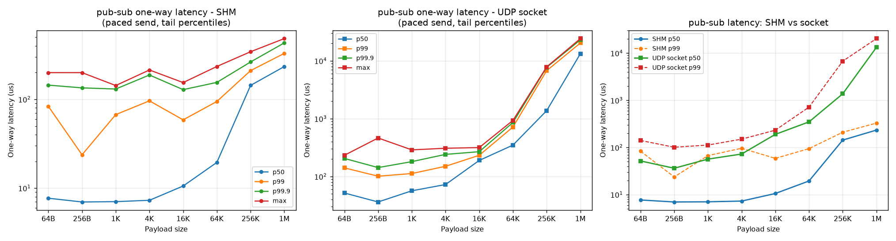
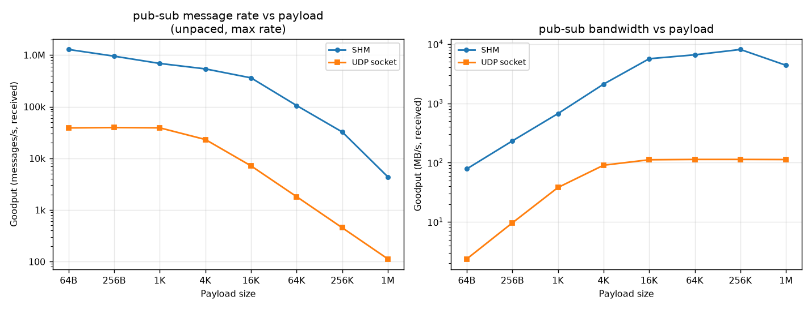
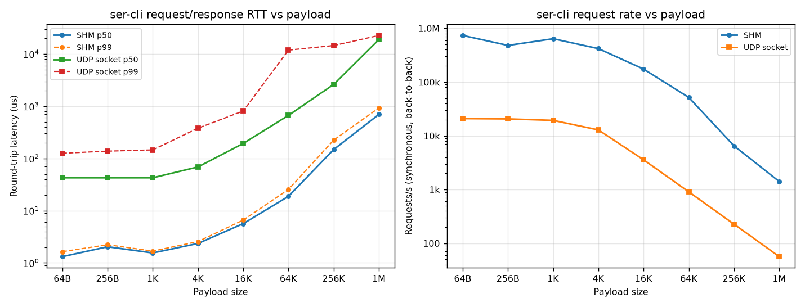
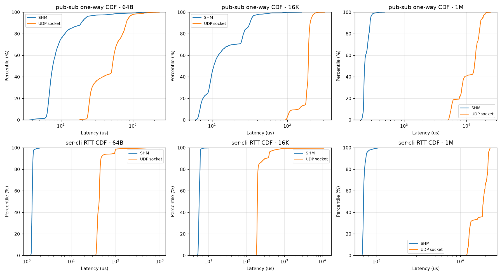
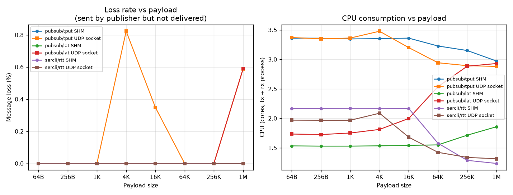
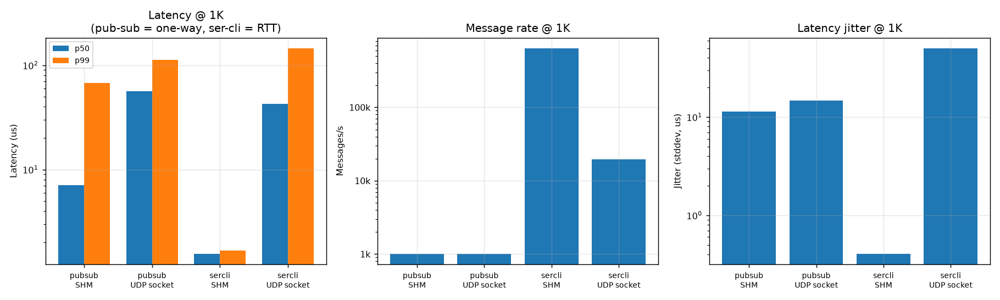

# dzIPC 通信性能测试报告

测试对象: dzIPC 的 **pub-sub** 与 **ser-cli** 两种通信模式, 分别跑在 **SHM(共享内存)** 和 **SOCKET(UDP)** 两种传输之上, 共 4 种组合。

## 1. 测试环境

| 项目 | 值 |
| --- | --- |
| 测试时间 | 2026-08-05 23:57:36+0800 |
| 主机名 |  |
| 操作系统 | Linux |
| 内核版本 | 6.8.0-124-generic |
| 架构 | x86_64 |
| 发行版 | Ubuntu 22.04.5 LTS |
| CPU 型号 | Intel(R) Core(TM) i9-14900KF |
| CPU 厂商 | GenuineIntel |
| 逻辑核心数 | 32 |
| 物理核心数 | 24 |
| 当前主频 (MHz) | 800.000 |
| 最大主频 (MHz) | 5700 |
| 调频策略 | powersave |
| CPU 缓存 | L1d=48K, L1i=32K, L2=2048K, L3=36864K |
| 相关指令集 | sse4_2,avx,avx2,constant_tsc,nonstop_tsc,rdtscp |
| 内存总量 | 65647720 kB |
| 可用内存 | 32864604 kB |
| 透明大页 | always [madvise] never |
| /dev/shm 容量 | 31.30 GiB |
| net.core.rmem_max | 8388608 |
| net.core.wmem_max | 8388608 |
| net.core.rmem_default | 212992 |
| netdev_max_backlog | 1000 |
| 内核启动参数 | BOOT_IMAGE=/boot/vmlinuz-6.8.0-124-generic root=UUID=06a01074-4e9b-4948-b55f-68067b4f7827 ro quiet splash vt.handoff=7 |
| CPU 隔离 | no |
| 起始 1 分钟负载 | 1.47 |
| 编译器 | 11.4.0 |
| 构建类型 | release (NDEBUG, -O2) |
| C++ 标准 | 201703 |
| Nodelet 快速路径 | disabled |
| 进程模型 | multi-process (fork+exec), 收发分属不同进程 |

## 2. 测试参数

| 参数 | 值 |
| --- | --- |
| 每用例测量时长 (s) | 3.0 |
| 每用例预热时长 (s) | 0.5 |
| 时延用例发送速率 (Hz) | 1000.0 |
| 订阅端队列深度 | 1024 |
| domain id | 1 |
| 发送语义 | SHM: publish_blocking / SOCKET: publish() best-effort |
| publish_blocking 超时 (ms, 仅 SHM) | 100 |
| 发送端绑核 | -1 |
| 接收端绑核 | -1 |
| rate_limit_bps | 0 |
| fragment_stats | False |

## 3. 测试方法

- **进程模型**: 每个用例 `fork()` 出独立的对端进程, 收发分属两个进程, 测的是真实跨进程 IPC; `Nodelet` 同进程快速路径已显式关闭。
- **pub-sub 时延**: 发布端把 `steady_clock` 时间戳打进消息, 订阅端收到后与本地时钟作差, 得到**单向时延**。两个进程共用同一个 `CLOCK_MONOTONIC`, 因此可直接比较。
- **ser-cli 时延**: 由客户端本地测量一次 `send_request()` 的**往返时延 (RTT)**, 不依赖时钟同步。
- **两类 pub-sub 用例**:
  - `lat`: 按固定速率发送, 队列不堆积, 反映链路本身的时延分布。
  - `tput`: 不限速全速发送, 反映吞吐上限; 此时时延包含排队, 不代表链路时延。
- **ser-cli** 是同步请求-响应, 背靠背发送, 单次运行同时给出 RTT 分布和 req/s。
- 每个用例先 warmup 再测量; 预热消息时间戳置 0, 接收端直接丢弃, 不进入统计。
- **吞吐** 按接收端实际收到的消息数计算 (goodput), 不是发送端的调用次数。
- **丢包率** = (发送数 - 接收数) / 发送数; pub-sub 默认走 best-effort 语义, 队列满时会丢。
- **CPU** 为发送端进程与接收端进程 user+sys 时间之和除以墙钟时间, 单位是「核」。
- `bytes_per_op`: pub-sub 为 payload 大小; ser-cli 为 2×payload(请求与响应各搬运一次)。

## 4. 性能曲线

### pub-sub 单向时延 vs payload(含 p50/p99/p99.9/max 尾时延)

### pub-sub 吞吐 vs payload(消息速率与带宽)

### ser-cli 往返时延与请求速率 vs payload

### 时延累积分布 (CDF): SHM vs SOCKET

### 丢包率与 CPU 占用 vs payload

### 传输方式横向对比

## 5. 完整测试数据

### 5.1 pub-sub / SHM - 定速时延

| payload | 发送 | 接收 | 丢包率 | 吞吐 (msg/s) | 吞吐 (MB/s) | 单向时延(us) min | p50 | p90 | p99 | p99.9 | max | 抖动σ | CPU(核) |
| ---: | ---: | ---: | ---: | ---: | ---: | ---: | ---: | ---: | ---: | ---: | ---: | ---: | ---: |
| 64B | 3001 | 3001 | 0.00% | 1k | 0.1 | 3.70 | 7.70 | 19.20 | 83.48 | 144.51 | 199.72 | 13.46 | 1.53 |
| 256B | 3001 | 3001 | 0.00% | 1k | 0.2 | 4.88 | 6.98 | 18.80 | 23.75 | 134.53 | 199.76 | 8.49 | 1.53 |
| 1K | 3001 | 3001 | 0.00% | 1k | 1.0 | 3.25 | 7.04 | 15.35 | 67.21 | 130.59 | 142.93 | 11.40 | 1.53 |
| 4K | 3001 | 3001 | 0.00% | 1k | 3.9 | 3.87 | 7.30 | 22.04 | 96.10 | 187.83 | 213.97 | 15.32 | 1.53 |
| 16K | 3001 | 3001 | 0.00% | 1k | 15.6 | 6.04 | 10.56 | 31.91 | 58.71 | 128.52 | 154.32 | 12.63 | 1.54 |
| 64K | 3001 | 3001 | 0.00% | 1k | 62.5 | 11.70 | 19.48 | 61.62 | 94.55 | 155.02 | 234.32 | 21.96 | 1.55 |
| 256K | 3001 | 3001 | 0.00% | 1k | 250.1 | 102.59 | 143.42 | 173.47 | 210.42 | 263.36 | 343.39 | 24.32 | 1.71 |
| 1M | 3001 | 3001 | 0.00% | 1k | 1000.3 | 206.26 | 233.74 | 285.01 | 328.89 | 431.81 | 482.69 | 28.61 | 1.86 |

### 5.2 pub-sub / SOCKET - 定速时延

| payload | 发送 | 接收 | 丢包率 | 吞吐 (msg/s) | 吞吐 (MB/s) | 单向时延(us) min | p50 | p90 | p99 | p99.9 | max | 抖动σ | CPU(核) |
| ---: | ---: | ---: | ---: | ---: | ---: | ---: | ---: | ---: | ---: | ---: | ---: | ---: | ---: |
| 64B | 3001 | 3001 | 0.00% | 1k | 0.1 | 18.12 | 51.82 | 80.89 | 140.89 | 205.28 | 232.69 | 25.62 | 1.73 |
| 256B | 3001 | 3001 | 0.00% | 1k | 0.2 | 18.05 | 36.25 | 79.03 | 101.13 | 142.56 | 463.61 | 23.35 | 1.73 |
| 1K | 3001 | 3001 | 0.00% | 1k | 1.0 | 19.48 | 56.59 | 72.39 | 112.53 | 180.71 | 288.70 | 14.76 | 1.75 |
| 4K | 3001 | 3001 | 0.00% | 1k | 3.9 | 31.77 | 72.59 | 91.38 | 150.11 | 241.33 | 308.09 | 21.70 | 1.81 |
| 16K | 3001 | 3001 | 0.00% | 1k | 15.6 | 93.73 | 189.56 | 201.53 | 232.66 | 268.54 | 316.16 | 28.84 | 2.00 |
| 64K | 3001 | 3001 | 0.00% | 1k | 62.5 | 320.34 | 349.01 | 533.83 | 717.66 | 859.19 | 933.71 | 93.38 | 2.54 |
| 256K | 1359 | 1359 | 0.00% | 453 | 113.2 | 1229.91 | 1374.97 | 6261.07 | 6762.98 | 7728.10 | 7857.61 | 1721.00 | 2.88 |
| 1M | 339 | 337 | 0.59% | 112 | 112.2 | 5131.37 | 13291.82 | 16718.81 | 20361.50 | 23102.68 | 24266.61 | 4329.52 | 2.93 |

### 5.3 pub-sub / SHM - 全速吞吐

| payload | 发送 | 接收 | 丢包率 | 吞吐 (msg/s) | 吞吐 (MB/s) | 带排队时延(us) min | p50 | p90 | p99 | p99.9 | max | 抖动σ | CPU(核) |
| ---: | ---: | ---: | ---: | ---: | ---: | ---: | ---: | ---: | ---: | ---: | ---: | ---: | ---: |
| 64B | 3846403 | 3846403 | 0.00% | 1.3M | 78.3 | 1.32 | 100.65 | 103.32 | 109.14 | 144.82 | 362.21 | 4.47 | 3.36 |
| 256B | 2853408 | 2853408 | 0.00% | 951k | 232.2 | 1.40 | 55.21 | 57.40 | 73.84 | 76.37 | 830.22 | 6.70 | 3.36 |
| 1K | 2062654 | 2062654 | 0.00% | 688k | 671.4 | 2.05 | 59.20 | 68.43 | 73.76 | 90.71 | 1629.97 | 8.87 | 3.35 |
| 4K | 1618830 | 1618830 | 0.00% | 540k | 2107.9 | 2.55 | 54.91 | 63.17 | 72.77 | 87.11 | 935.09 | 10.19 | 3.35 |
| 16K | 1084906 | 1084906 | 0.00% | 362k | 5650.4 | 12.55 | 49.92 | 70.08 | 93.16 | 99.94 | 446.93 | 16.04 | 3.36 |
| 64K | 315780 | 315780 | 0.00% | 105k | 6578.3 | 19.54 | 142.29 | 231.69 | 372.63 | 383.73 | 1291.11 | 65.78 | 3.23 |
| 256K | 97082 | 97082 | 0.00% | 32k | 8090.1 | 54.28 | 485.78 | 747.89 | 1250.16 | 1503.32 | 3568.93 | 205.43 | 3.15 |
| 1M | 13139 | 13139 | 0.00% | 4k | 4372.3 | 516.95 | 3491.52 | 5561.75 | 7829.88 | 8658.42 | 10946.08 | 1610.21 | 2.97 |

### 5.4 pub-sub / SOCKET - 全速吞吐

| payload | 发送 | 接收 | 丢包率 | 吞吐 (msg/s) | 吞吐 (MB/s) | 带排队时延(us) min | p50 | p90 | p99 | p99.9 | max | 抖动σ | CPU(核) |
| ---: | ---: | ---: | ---: | ---: | ---: | ---: | ---: | ---: | ---: | ---: | ---: | ---: | ---: |
| 64B | 116502 | 116502 | 0.00% | 39k | 2.4 | 15.90 | 25.33 | 1562.61 | 6534.02 | 7758.58 | 7950.05 | 1282.86 | 3.37 |
| 256B | 118431 | 118431 | 0.00% | 39k | 9.6 | 16.03 | 24.18 | 294.11 | 4465.57 | 6813.08 | 7351.13 | 741.70 | 3.35 |
| 1K | 116870 | 116870 | 0.00% | 39k | 38.0 | 16.39 | 25.45 | 996.70 | 6407.51 | 7944.47 | 8240.36 | 1185.31 | 3.36 |
| 4K | 69988 | 69412 | 0.82% | 23k | 90.4 | 30.33 | 5547.79 | 8975.52 | 9828.42 | 10253.00 | 10667.67 | 3752.97 | 3.48 |
| 16K | 21521 | 21446 | 0.35% | 7k | 111.7 | 85.93 | 103.15 | 4945.18 | 8998.21 | 10911.25 | 12046.37 | 2193.06 | 3.20 |
| 64K | 5435 | 5435 | 0.00% | 2k | 113.0 | 316.35 | 342.38 | 2041.09 | 6097.38 | 8921.48 | 9636.99 | 1316.56 | 2.94 |
| 256K | 1360 | 1360 | 0.00% | 452 | 113.1 | 1249.44 | 1361.64 | 6250.59 | 6636.23 | 7436.95 | 7577.84 | 1674.59 | 2.89 |
| 1M | 340 | 338 | 0.59% | 113 | 112.6 | 5158.73 | 13551.06 | 16469.49 | 19016.70 | 23852.64 | 25527.75 | 4186.95 | 2.88 |

### 5.5 ser-cli / SHM - 请求响应

| payload | 发送 | 接收 | 丢包率 | 吞吐 (msg/s) | 吞吐 (MB/s) | RTT(us) min | p50 | p90 | p99 | p99.9 | max | 抖动σ | CPU(核) |
| ---: | ---: | ---: | ---: | ---: | ---: | ---: | ---: | ---: | ---: | ---: | ---: | ---: | ---: |
| 64B | 2215179 | 2215179 | 0.00% | 738k | 90.1 | 1.17 | 1.32 | 1.38 | 1.64 | 2.86 | 365.11 | 0.56 | 2.17 |
| 256B | 1444975 | 1444975 | 0.00% | 482k | 235.2 | 1.80 | 2.04 | 2.12 | 2.23 | 3.70 | 571.03 | 0.76 | 2.17 |
| 1K | 1923587 | 1923587 | 0.00% | 641k | 1252.3 | 1.33 | 1.55 | 1.60 | 1.68 | 3.05 | 278.10 | 0.40 | 2.17 |
| 4K | 1259271 | 1259271 | 0.00% | 420k | 3279.3 | 2.07 | 2.35 | 2.43 | 2.56 | 4.04 | 218.41 | 0.47 | 2.17 |
| 16K | 523750 | 523750 | 0.00% | 175k | 5455.7 | 4.54 | 5.64 | 6.01 | 6.61 | 11.09 | 230.35 | 1.06 | 2.17 |
| 64K | 155324 | 155324 | 0.00% | 52k | 6471.8 | 12.88 | 18.78 | 20.09 | 25.46 | 36.63 | 2478.96 | 13.25 | 1.58 |
| 256K | 19473 | 19473 | 0.00% | 6k | 3245.5 | 136.85 | 148.26 | 168.03 | 224.62 | 307.31 | 372.18 | 17.11 | 1.29 |
| 1M | 4227 | 4227 | 0.00% | 1k | 2818.0 | 656.74 | 698.46 | 745.03 | 929.98 | 1122.23 | 1345.92 | 45.98 | 1.24 |

### 5.6 ser-cli / SOCKET - 请求响应

| payload | 发送 | 接收 | 丢包率 | 吞吐 (msg/s) | 吞吐 (MB/s) | RTT(us) min | p50 | p90 | p99 | p99.9 | max | 抖动σ | CPU(核) |
| ---: | ---: | ---: | ---: | ---: | ---: | ---: | ---: | ---: | ---: | ---: | ---: | ---: | ---: |
| 64B | 62823 | 62823 | 0.00% | 21k | 2.6 | 34.73 | 42.59 | 47.01 | 125.76 | 651.34 | 2271.81 | 41.12 | 1.97 |
| 256B | 61981 | 61981 | 0.00% | 21k | 10.1 | 32.85 | 42.58 | 48.33 | 137.93 | 732.70 | 1671.75 | 46.25 | 1.97 |
| 1K | 58194 | 58194 | 0.00% | 19k | 37.9 | 35.24 | 42.60 | 56.03 | 145.77 | 776.48 | 1409.34 | 50.30 | 1.97 |
| 4K | 38695 | 38695 | 0.00% | 13k | 100.8 | 59.14 | 68.76 | 74.61 | 380.01 | 747.81 | 1044.06 | 57.15 | 2.09 |
| 16K | 10733 | 10733 | 0.00% | 4k | 111.8 | 177.46 | 193.74 | 319.74 | 810.34 | 11298.20 | 11800.47 | 794.65 | 1.68 |
| 64K | 2719 | 2719 | 0.00% | 905 | 113.1 | 625.09 | 667.91 | 1126.60 | 11865.97 | 12497.55 | 13252.79 | 1984.48 | 1.42 |
| 256K | 680 | 680 | 0.00% | 227 | 113.3 | 2468.34 | 2616.53 | 13791.01 | 14519.51 | 14605.87 | 14606.08 | 4004.65 | 1.34 |
| 1M | 170 | 170 | 0.00% | 56 | 112.9 | 11954.74 | 18889.50 | 21641.34 | 22653.38 | 23042.08 | 23106.33 | 3683.56 | 1.31 |

