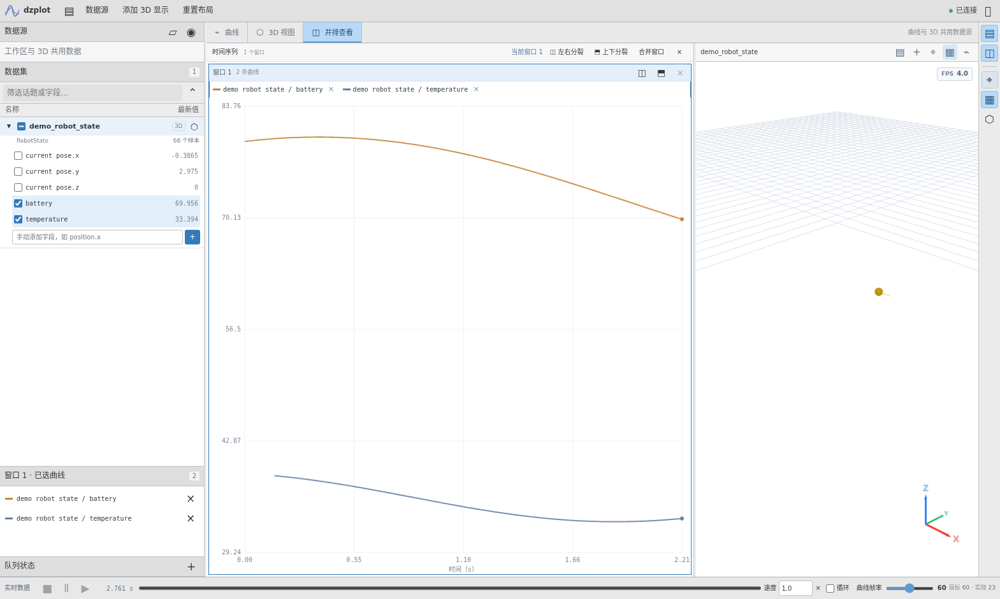
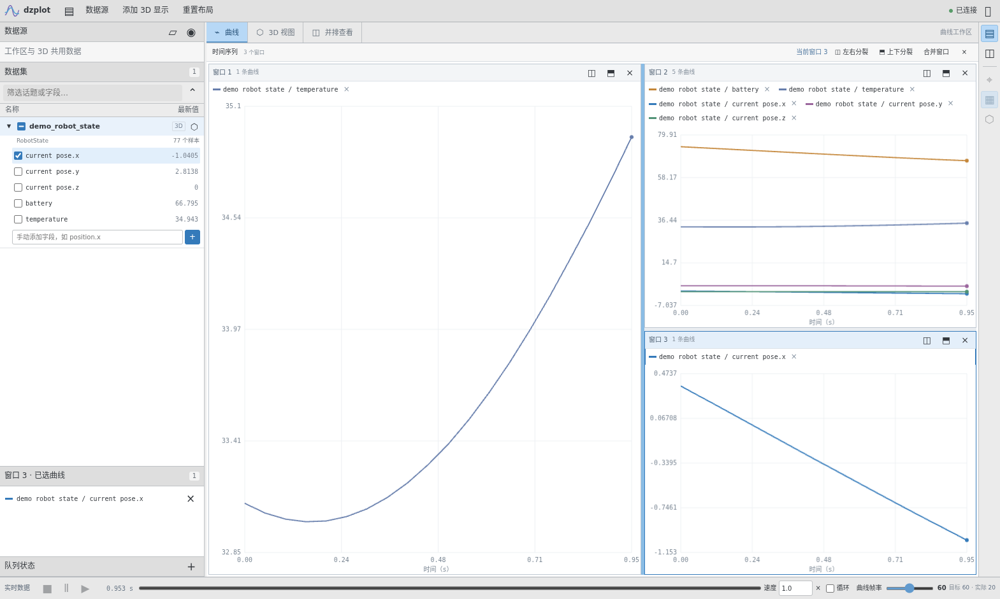

# dzplot — 曲线与 3D 可视化工作区

一个进程、一个端口同时提供 dzIPC 曲线与 3D 显示。默认打开曲线主页面；3D 标签加载内置子页面，也可将曲线和 3D 放在同一个分栏工作区中。后端、网页、依赖资源和示例均位于本目录。

界面参考仓库根目录的 `ref_ui.jpg`：浅色紧凑工具栏、左侧数据集、中央标签工作区、右侧视图工具和底部播放条。曲线采用 PlotJuggler 式窗口：默认一个窗口铺满绘图区，多条曲线共用坐标轴；窗口可左右、上下分裂。数据栏、窗口布局和曲线分配保存在浏览器中。



## 快速开始

```bash
# 演示模式，不需要 dzIPC Python 绑定
python3 tools/dzplot/main.py --demo

# 回放 dzipc_log 录制的 .bag
python3.10 tools/dzplot/main.py --bag /path/to/events.bag

# 实时嗅探，并将数据用于曲线与 3D
python3.10 tools/dzplot/main.py --sniff --topic /test:StdPose --transport shm

# 加载机器人示例配置
python3.10 tools/dzplot/main.py \
  --config tools/dzplot/demo/robot_state_config.json --load-config
```

浏览器打开 `http://127.0.0.1:8766/`。直接访问 `/#viz` 打开工作区内的 3D 标签，`/#split` 打开分栏，`/viz/` 打开带返回导航的 3D 子页面。

实时订阅和录包消息解码需要与本机 dzIPC 绑定 ABI 匹配的解释器；本仓现有绑定为 CPython 3.10。无绑定时仍可启动空工作区和演示模式。

启动入口统一为 `tools/dzplot/main.py`（也可使用 `python3 -m tools.dzplot.main`），默认端口 8766。原 dzviz 目录和旧启动入口已删除；原 JSON 配置格式继续支持，自定义配置中指向原示例目录的文件路径需改为本目录下的 `demo/`。

## 目录

```text
tools/dzplot/
├── main.py             # 统一 HTTP / WebSocket 服务、曲线回放与嗅探
├── workspace.py        # 曲线与 3D 数据共享
├── visualizer.py       # 3D 后端、配置及消息编码
├── config.json         # 合并后的默认配置
├── component/          # 机器人、运动学、点云、TF、订阅与速率控制
├── transport/          # 有界队列、背压与客户端管理
├── demo/               # 图像 / 点云 / 机器人发布端、URDF 与网格资源
├── test/               # 曲线、3D、工作区、传输及实际绑定测试
└── web/
    ├── index.html      # 曲线工作区
    └── viz/            # 3D 子页面及 vendor/three 离线依赖
```

## 界面操作

| 区域 | 操作 |
|---|---|
| 顶部「数据源」 | 加载服务端 .bag 路径，或指定实时话题、类型、传输与域编号 |
| 左侧数据集 | 自动发现数值字段；搜索话题或字段；勾选话题 / 字段添加到当前窗口，或拖到指定窗口；可手动输入 `position.x` 等路径 |
| 绘图窗口 | 点击选中，蓝框表示当前窗口；多条曲线共享时间轴和值域；窗口头或顶部工具栏支持左右 / 上下分裂，新窗口为空并自动选中 |
| 已选曲线与图例 | 显示当前窗口的曲线和颜色；点击 × 仅从该窗口移除；图例也可拖到其它窗口，同一字段可在多个窗口显示 |
| 窗口整理 | 清空仅作用于当前窗口；关闭后相邻窗口填满空位；合并窗口保留全部曲线并去重，始终保留至少一个窗口 |
| 话题右侧立方体 | 将已有话题送入 3D；回放和嗅探复用现有数据源，不新增订阅 |
| 曲线 / 3D / 并排查看 | 切换时保留曲线数据、相机与显示状态；隐藏的视图暂停绘制 |
| 分隔条 | 鼠标拖动或方向键调整数据栏宽度、绘图窗口比例、曲线与 3D 比例；绘图窗口支持嵌套分裂 |
| 右侧工具 | 显示数据栏、分栏、复位相机、切换 3D 网格与显示列表 |
| 3D 内部工具 | 添加显示、展开显示列表、复位相机、切换网格、返回当前话题曲线 |
| 底部播放条 | 录包暂停 / 继续 / 停止，进度、当前时间、速度、循环和曲线帧率 |

先点击目标窗口，再勾选左侧话题或字段；话题复选框和话题拖拽会添加该话题当前已发现的全部数值字段。切换窗口时，左侧勾选状态和已选曲线列表同步显示该窗口的选择。同一字段在多个窗口中共用数据缓冲，移除一个窗口中的曲线不会影响其它窗口。



手机宽度下数据栏改为可收起面板；较窄窗口的曲线 / 3D 并排模式自动改为上下分栏，绘图窗口保留所选的分裂方向。刷新后恢复窗口布局、曲线归属和当前窗口。

## 3D 数据来源

添加显示时可选择「实时订阅」或「工作区数据（回放 / 嗅探）」。3D 实时订阅的数值字段也会出现在曲线数据集中；完整图像与点云通过原有 3D 编码通路发送，曲线只发送有界字段预览。

3D 显示支持 Pose、Path、PointCloud、Marker、Image、TF、Robot（URDF）、RobotState 与 RawMessage。先添加机器人模型，再为 RobotState 选择关联机器人。OBJ/STL 网格仍通过同一服务的 `/robot_assets/` 加载。Three.js 0.168.0 已随工具保存，浏览器无需外部 CDN。

发布端命令、显示类型与配置说明见 [3D 使用说明](3D.md)，离线库版本与许可证见 [Three.js 依赖说明](web/viz/vendor/README.md)。

原 dzviz 配置兼容。工作区来源的话题额外保存 `"source": "workspace"`；普通话题按原方式订阅。3D 配置面板的保存 / 加载使用服务所在机器的文件路径，布局则保存在浏览器本地。

## 启动参数

| 参数 | 默认 | 说明 |
|---|---|---|
| `--host` / `--port` | `127.0.0.1` / `8766` | 统一服务地址 |
| `--bag` | 无 | 录包路径 |
| `--bag-speed` / `--bag-loop` | `1.0` / 关闭 | 初始回放速度与循环 |
| `--sniff` | 关闭 | 将 `--topic` 用作曲线嗅探数据源 |
| `--topic` | 无 | 可重复的 `话题:消息类型`；未指定 `--sniff` 时作为 3D 实时订阅 |
| `--transport` / `--domain` | 配置；未配置时 `shm` / `0` | 传输与域编号 |
| `--fps` | `60`，范围 1–120 | 曲线广播 / 绘制帧率；3D 保留原有按需绘制限速 |
| `--config` / `--load-config` | dzplot/config.json / 关闭 | 3D 配置；启动时加载订阅 |
| `--queue` / `--poll` / `--extra` | 配置中的值 | 3D 订阅选项 |
| `--dzflat` / `--no-dzflat` | 开启 | SHM DZFlat 借样设置 |
| `--demo` / `--demo-period` | 关闭 / `0.05` 秒 | 曲线和 3D 共用的有界演示轨迹 |

## 验证

```bash
python3 tools/dzplot/test/test_dzplot.py
python3 tools/dzplot/test/test_workspace.py
python3 tools/dzplot/test/test_workspace.py --browser --artifacts /tmp/dzplot-workspace
python3.10 tools/dzplot/test/test_workspace.py --binding
python3 tools/dzplot/test/test_visualizer_components.py --integration --browser
python3 -m pytest tools/dzplot/test/test_transport.py tools/dzplot/test/test_rate_controller.py tools/dzplot/test/test_kinematics.py -q
```

浏览器测试需要 Playwright 和 Chrome / Chromium；可通过 `DZPLOT_BROWSER=/path/to/chromium` 指定浏览器。工作区验收覆盖同端口 HTTP / WebSocket、离线资源、双向样本共享、图像 / 点云二进制通路、配置保存加载、避免重复订阅、曲线和 3D 切换、字段筛选、帧率与窄屏布局。绘图验收检查单窗口的多条曲线实际像素、左右 / 上下嵌套分裂、窗口选择、话题与字段拖拽、共享缓冲、清空 / 关闭 / 合并、比例调整，以及刷新和重连后的选择恢复。

`--binding` 使用实际绑定生成 TLV / DZFlat 原始字节，确认完整图像、点云与有界曲线预览；绑定缺失会直接失败。验收结果与截图见 [工作区验收记录](../../docs/dzplot_workspace/README.md)。

原真实 SHM 验证仍使用 CPython 3.10，三条不能并行：

```bash
python3.10 tools/dzplot/test/verify_segment_naming.py
python3.10 tools/dzplot/test/verify_runtime_no_garbage.py
python3.10 tools/dzplot/test/integration_pub_restart.py
```

退出码 `2` 表示绑定缺失，CI 必须按失败处理。详见 [CI 说明](../../docs/ci.md)。

## 传输与资源控制

曲线继续使用 `BoundedPubQueue`、`RateController` 和 `BackpressureController`：输入上限 1000 Hz、批量 WebSocket 帧、50% 以上水位渐进背压与滞回恢复，慢客户端独立发送。每条曲线最多保存 600 个点，数值数组字段预览最多 100 个元素。图像 / 点云的完整 3D 显示走专用编码，不受曲线字段预览限制。

DZFlat 与 TLV 均自动识别。借样消息通过生成的 schema 解码，样本的 `wire` 与 `dzflat_borrowed` 字段可确认通路。schema 不在本进程时降级为 base64 并告警；重新生成消息 schema 后再启动工具。
